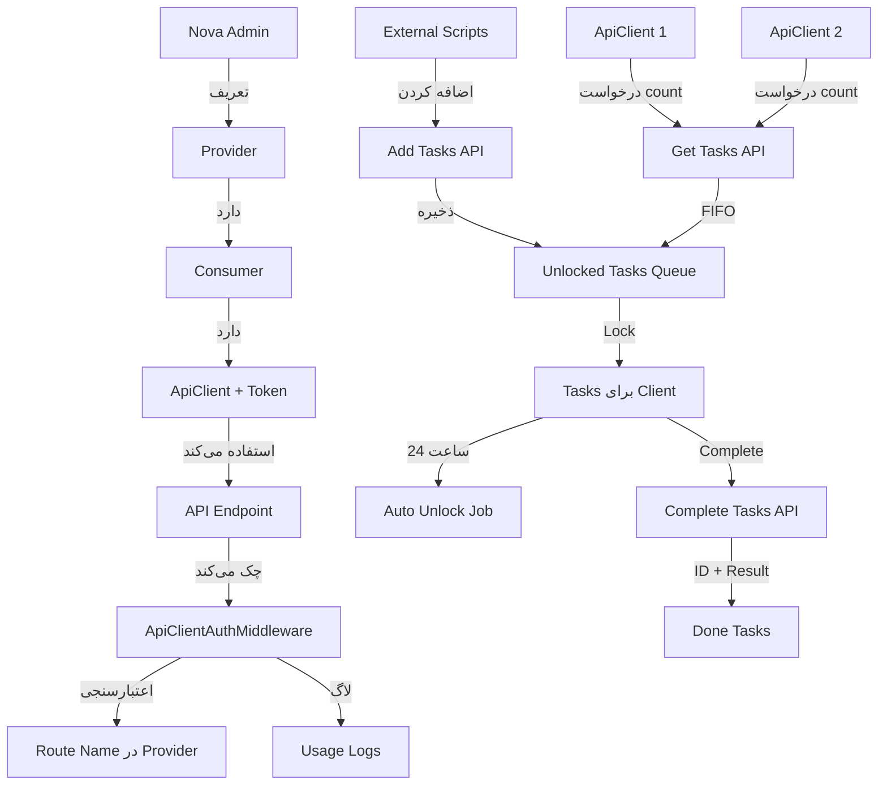

# سیستم

API Provider/Consumer/Client و مدیریت Task

## خلاصه

این فیچر شامل دو بخش اصلی است:

1. **سیستم Provider/Consumer/Client**: مدیریت دسترسی به API endpoints از طریق Nova با توکن
2. **سیستم مدیریت Task**: مدیریت task های Crawler با lock/unlock خودکار و توزیع FIFO (اولین task به اولین کلاینت)

### Flow کلی

- **تولید Task**: اسکریپت‌های خارجی (Node/Python/Golang) از طریق API هزاران task روزانه اضافه می‌کنند
- **درخواست Task**: کلاینت با توکن می‌آید و تعداد task های مورد نیاز را می‌گوید
- **توزیع FIFO**: سیستم به صورت FIFO (اولین task به اولین کلاینت) task های unlocked را lock می‌کند
- **انجام Task**: کلاینت بعداً با ارسال ID + نتیجه می‌گوید که task ها را انجام داده است

## ساختار دیتابیس

### جداول

1. **api_providers**: تعریف Provider ها (مجموعه endpoint ها)

- `id`, `name`, `description`, `route_names` (JSON array), `is_active`, `timestamps`

2. **api_consumers**: تعریف Consumer ها (برای هر Provider)

- `id`, `provider_id`, `name`, `description`, `is_active`, `timestamps`

3. **api_clients**: تعریف Client ها (برای هر Consumer) با توکن

- `id`, `consumer_id`, `name`, `token` (hashed), `plain_token` (encrypted), `is_active`, `last_used_at`, `timestamps`

4. **crawler_tasks**: Task های Crawler

- `id`, `uuid` (unique, برای استفاده کلاینت), `url` (unique), `status` (enum: unlocked, locked, done), `locked_by_client_id`, `locked_at`, `completed_at`, `result_data` (JSON, برای ذخیره نتیجه), `timestamps`

5. **api_client_usage_logs**: لاگ استفاده از API

- `id`, `client_id`, `provider_id`, `consumer_id`, `route_name`, `ip_address`, `created_at`

## معماری



## فایل‌های مورد نیاز

### 1. Migrations

- `database/migrations/YYYY_MM_DD_create_api_providers_table.php`
- `database/migrations/YYYY_MM_DD_create_api_consumers_table.php`
- `database/migrations/YYYY_MM_DD_create_api_clients_table.php`
- `database/migrations/YYYY_MM_DD_create_crawler_tasks_table.php`
- `database/migrations/YYYY_MM_DD_create_api_client_usage_logs_table.php`

### 2. Models

- `app/Models/ApiProvider.php`
- `app/Models/ApiConsumer.php`
- `app/Models/ApiClient.php`
- `app/Models/CrawlerTask.php`
- `app/Models/ApiClientUsageLog.php`

### 3. Nova Resources

- `app/Nova/ApiProvider.php` (با BelongsToMany برای route selection یا JSON field)
- `app/Nova/ApiConsumer.php` (با BelongsTo Provider)
- `app/Nova/ApiClient.php` (با BelongsTo Consumer، action برای generate token)
- `app/Nova/CrawlerTask.php` (برای مشاهده و مدیریت task ها)

### 4. Interfaces & Services

- `app/Interfaces/Services/ApiClientService.php`
- `app/Services/ApiClientServiceImpl.php`
- `app/Interfaces/Services/CrawlerTaskService.php`
- `app/Services/CrawlerTaskServiceImpl.php`

### 5. Middleware

- `app/Http/Middleware/ApiClientAuthMiddleware.php` (چک کردن token و authorization برای route name)

### 6. Controllers

- `app/Http/Controllers/Api/ApiClientController.php` (مدیریت clients از طریق Nova actions)
- `app/Http/Controllers/Api/CrawlerTaskController.php` (API endpoints برای task management)

### 7. API Routes

- `POST /api/v1/tasks/request` - درخواست task ها (با count) - نیاز به token
- `POST /api/v1/tasks/add` - اضافه کردن task های جدید (لیست URL ها) - نیاز به token
- `POST /api/v1/tasks/complete` - گزارش انجام task ها (با لیست task ها شامل uuid + result) - نیاز به token
- `GET /api/v1/tasks/my-tasks` - مشاهده task های lock شده توسط کلاینت - نیاز به token

### 8. Commands & Jobs

- `app/Console/Commands/UnlockExpiredTasksCommand.php` (unlock task های lock شده بیش از 24 ساعت)
- اضافه کردن به `app/Console/Kernel.php` برای اجرای هر ساعت

### 9. Tests

- `tests/Feature/ApiClientAuthTest.php`
- `tests/Feature/CrawlerTaskTest.php`
- `tests/Unit/ApiClientServiceTest.php`
- `tests/Unit/CrawlerTaskServiceTest.php`

### 10. Documentation

- `docs/features/API_PROVIDER_CONSUMER_CLIENT_SYSTEM.md`

## جزئیات پیاده‌سازی

### Provider/Consumer/Client Flow

1. **تعریف Provider در Nova**: نام، توضیحات، لیست route name ها (JSON array)
2. **تعریف Consumer در Nova**: انتخاب Provider، نام، توضیحات
3. **تعریف Client در Nova**: انتخاب Consumer، نام - Token به صورت خودکار generate می‌شود
4. **استفاده از Client**: Client با token به endpoint دسترسی پیدا می‌کند
5. **Middleware Check**: 

- Token validation
- Route name چک می‌شود که در لیست route_names Provider باشد
- Client باید مربوط به Consumer باشد که Provider را دارد
- لاگ استفاده ذخیره می‌شود

### Task Management Flow

1. **تولید و اضافه کردن Task**: 

   - اسکریپت‌های خارجی (Node/Python/Golang) از طریق `POST /api/v1/tasks/add` هزاران task روزانه اضافه می‌کنند
   - فرمت: `{"urls": ["url1", "url2", ...]}` 
   - هر URL به یک task تبدیل می‌شود با UUID منحصر به فرد
   - Status اولیه: `unlocked`

2. **درخواست Task**: 

   - Client با توکن می‌آید و `count` (تعداد task های مورد نیاز) را ارسال می‌کند
   - فرمت: `{"count": 10}`

3. **توزیع FIFO**: 

   - سیستم به ترتیب FIFO (اولین task به اولین کلاینت) task های unlocked را lock می‌کند
   - اگر کلاینت 1 می‌آید و 10 task می‌خواهد: task های 1 تا 10
   - اگر کلاینت 2 می‌آید و 10 task می‌خواهد: task های 11 تا 20
   - Query: `SELECT * FROM crawler_tasks WHERE status = 'unlocked' ORDER BY id ASC LIMIT {count}`

4. **Lock**: 

   - Task برای 24 ساعت lock می‌شود
   - `status = locked`, `locked_by_client_id`, `locked_at = now()`

5. **Auto Unlock**: 

   - هر ساعت Job اجرا می‌شود و task های lock شده بیش از 24 ساعت را unlock می‌کند
   - `status = unlocked`, `locked_by_client_id = null`, `locked_at = null`

6. **Complete**: 

   - Client لیست task های انجام شده را با UUID + result ارسال می‌کند
   - فرمت: `{"tasks": [{"uuid": "xxx", "result": {...}}, {"uuid": "yyy", "result": {...}}]}`
   - `status = done`, `completed_at = now()`, `result_data = JSON encode of result`

### نکات مهم

- Token generation مشابه `ApiToken` model موجود
- Middleware باید reusable باشد و بتواند با route name چک کند
- Task ها باید unique باشند (URL unique constraint)
- هر task باید UUID داشته باشد (برای استفاده کلاینت)
- توزیع FIFO: به ترتیب id (قدیمی‌ترین task اول)
- Lock باید atomic باشد (برای جلوگیری از race condition)
- لاگ‌ها برای audit trail ضروری هستند
- `result_data` در JSON format ذخیره می‌شود (برای انعطاف‌پذیری)

## تست‌ها

### Feature Tests

1. **ApiClientAuthTest**: تست authentication و authorization
2. **CrawlerTaskTest**: تست درخواست task، lock، unlock، complete

### Unit Tests

1. **ApiClientServiceTest**: تست generate token، validate token
2. **CrawlerTaskServiceTest**: تست FIFO allocation، lock/unlock logic، complete task با result

### External Script Examples

```javascript
// Node.js example - Add tasks
const axios = require('axios');

async function addTasks() {
  const urls = ['url1', 'url2', 'url3']; // هزاران URL
  const response = await axios.post('http://localhost/api/v1/tasks/add', {
    urls: urls
  }, {
    headers: {
      'Authorization': `Bearer ${TOKEN}`,
      'Content-Type': 'application/json'
    }
  });
  console.log(response.data);
}
```
```python
# Python example - Add tasks
import requests

def add_tasks():
    urls = ['url1', 'url2', 'url3']  # هزاران URL
    response = requests.post(
        'http://localhost/api/v1/tasks/add',
        json={'urls': urls},
        headers={
            'Authorization': f'Bearer {TOKEN}',
            'Content-Type': 'application/json'
        }
    )
    print(response.json())
```
```go
// Go example - Add tasks
package main

import (
    "bytes"
    "encoding/json"
    "net/http"
)

func addTasks() {
    urls := []string{"url1", "url2", "url3"} // هزاران URL
    data, _ := json.Marshal(map[string][]string{"urls": urls})
    
    req, _ := http.NewRequest("POST", "http://localhost/api/v1/tasks/add", bytes.NewBuffer(data))
    req.Header.Set("Authorization", "Bearer "+TOKEN)
    req.Header.Set("Content-Type", "application/json")
    
    client := &http.Client{}
    resp, _ := client.Do(req)
    // handle response
}
```

### cURL Examples

```bash
# Request tasks
curl -X POST http://localhost/api/v1/tasks/request \
  -H "Authorization: Bearer {TOKEN}" \
  -H "Content-Type: application/json" \
  -d '{"count": 10}'

# Add tasks
curl -X POST http://localhost/api/v1/tasks/add \
  -H "Authorization: Bearer {TOKEN}" \
  -H "Content-Type: application/json" \
  -d '{"urls": ["url1", "url2", "url3"]}'

# Complete tasks
curl -X POST http://localhost/api/v1/tasks/complete \
  -H "Authorization: Bearer {TOKEN}" \
  -H "Content-Type: application/json" \
  -d '{
    "tasks": [
      {"uuid": "uuid1", "result": {"status": "success", "data": "..."}},
      {"uuid": "uuid2", "result": {"status": "success", "data": "..."}}
    ]
  }'
```

## وابستگی‌ها

- استفاده از `ApiToken` pattern موجود برای token generation
- استفاده از Nova Resources pattern موجود