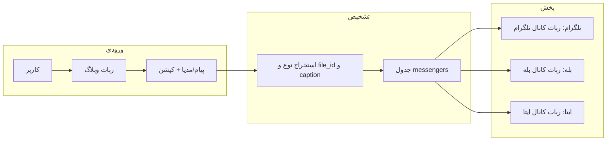

# پلن: ارسال همه انواع مدیا + کپشن در همه کانال‌ها با ربات همان پیام‌رسان

## هدف

هر فایل/عکس/ویدیو (یا هر مدیای قابل ارسال) به‌همراه **کپشنش** در **همه کانال‌ها** (تلگرام، بله، ایتا) با **همان ربات همان پیام‌رسان** ارسال شود؛ یعنی در تلگرام با `telegram_bot_token` به `telegram_channel_chat_id`، در بله با `bale_bot_token` به `bale_channel_chat_id` و در ایتا با `eitaa_bot_token` به `eitaa_channel_chat_id`.

---

## وضعیت فعلی

- **[BlogController](app/Http/Controllers/BlogController.php):** استخراج مدیا فقط برای `photo`, `video`, `voice`, `audio`, `document` و `caption` از `message['caption']`. انواع دیگر (مثل `video_note`, `animation`) در نظر گرفته نشده‌اند.
- **[BlogMessengerBroadcastService](app/Services/BlogMessengerBroadcastService.php):**
  - تلگرام و بله: ارسال مدیا با `sendMediaByType` برای همان پنج نوع؛ کپشن داخل `content` به `caption` پاس داده می‌شود.
  - ایتا: `sendAnyFileMessageEitaa` از [BotHelper](app/Helpers/BotHelper.php) استفاده می‌کند که داخلش `call_eitaa_api` با `downloadImage` فقط برای فایل تصویری/URL طراحی شده؛ برای ویدیو یا داکیومنت رفتار ایتا مشخص نیست و احتمالاً فقط متن/کپشن ارسال شود یا خطا دهد.

---

## ۱. یکپارچه‌سازی کپشن با مدیا

- **قانون:** در هر پلتفرم، وقتی مدیا ارسال می‌شود، **همیشه** همان کپشن (متن همراه پیام) به عنوان `caption` به API ارسال شود؛ اگر کپشن خالی بود، رشته خالی ارسال شود.
- در **BlogMessengerBroadcastService** اطمینان حاصل شود که در هیچ مسیری مدیا بدون پارامتر caption ارسال نمی‌شود (الان در `sendMediaByType` caption پاس داده می‌شود؛ فقط مقدار پیش‌فرض و استفاده در Eitaa را صریح کنیم).

---

## ۲. پشتیبانی از انواع مدیای بیشتر در ورودی

در **[BlogController::extractMediaFromMessage](app/Http/Controllers/BlogController.php)** (و در صورت نیاز در سرویس) این انواع به منطق فعلی اضافه شوند:

| نوع در payload | نوع مدیا برای سرویس | توضیح                      |
| -------------- | ------------------- | -------------------------- |
| `photo`        | photo               | الان هست                   |
| `video`        | video               | الان هست                   |
| `voice`        | voice               | الان هست                   |
| `audio`        | audio               | الان هست                   |
| `document`     | document            | الان هست                   |
| `video_note`   | video_note          | ویدیوی دایره‌ای تلگرام/بله |
| `animation`    | animation           | گیف / انیمیشن              |

برای هر کدام از `message` فیلد مربوطه (مثلاً `message['video_note']['file_id']`) خوانده شود و به سرویس به همان شکل فعلی (mediaType + fileId + caption) پاس داده شود.

---

## ۳. ارسال هر نوع مدیا در تلگرام و بله

در **[BlogMessengerBroadcastService::sendMediaByType](app/Services/BlogMessengerBroadcastService.php)** برای تلگرام و بله:

- اگر `mediaType === 'video_note'`: از متد معادل ارسال ویدیونوت (مثلاً `sendVideoNote`) با همان `chat_id` و `caption` استفاده شود.
- اگر `mediaType === 'animation'`: از متد معادل ارسال انیمیشن/گیف (مثلاً `sendAnimation`) با همان `chat_id` و `caption` استفاده شود.

کلاس `Telegram` (پکیج تلگرام/بله) باید این متدها را داشته باشد؛ در غیر این صورت با نام متد واقعی در همان کلاس تطبیق داده شود.

نتیجه: در هر کانال تلگرام و بله، **همان ربات همان پیام‌رسان** (توکن و chat_id از رکورد messengers) استفاده می‌شود و مدیا همیشه با کپشن ارسال می‌شود.

---

## ۴. رفتار ایتا برای انواع مدیا

- **وضعیت فعلی:** [BotHelper::call_eitaa_api](app/Helpers/BotHelper.php) با `sendFile` و `downloadImage` در عمل برای فایل تصویری (و احتمالاً یک نوع فایل) استفاده می‌شود.
- **پیشنهاد در پلن:**
  - اگر API ایتا فقط **یک نوع فایل** (مثلاً عکس) را پشتیبانی می‌کند: برای مدیاهای دیگر (video, voice, audio, document, video_note, animation) **فقط کپشن** به ایتا ارسال شود (مثلاً با `sendMessage`)، تا در همه کانال‌ها حداقل متن یکسان باشد.
  - اگر ایتا چند نوع فایل را پشتیبانی می‌کند: در سرویس، بر اساس `mediaType` تصمیم بگیریم که برای ایتا فایل ارسال کنیم یا فقط متن؛ و در هر صورت **کپشن حتماً** ارسال شود (در sendFile به عنوان متن یا در sendMessage).

بدون تغییر در خود BotHelper (در این پلن)، فقط در **BlogMessengerBroadcastService::sendToEitaa** منطق را صریح کنیم: برای مدیاهایی که ایتا پشتیبانی نمی‌کند، فقط کپشن (یا متن) با همان ربات ایتا به همان کانال ارسال شود.

---

## ۵. خلاصه تغییرات فایل‌ها

| فایل                                                                                | تغییر                                                                                                                                                                                                       |
| ----------------------------------------------------------------------------------- | ----------------------------------------------------------------------------------------------------------------------------------------------------------------------------------------------------------- |
| [BlogController.php](app/Http/Controllers/BlogController.php)                       | در `extractMediaFromMessage` اضافه کردن استخراج `video_note` و `animation` از `message` و برگرداندن mediaType و fileId مناسب.                                                                               |
| [BlogMessengerBroadcastService.php](app/Services/BlogMessengerBroadcastService.php) | در `sendMediaByType` اضافه کردن دو case برای `video_note` و `animation` با متدهای مربوطه و همان caption؛ در `sendToEitaa` برای مدیاهای غیرپشتیبانی‌شده فقط ارسال کپشن به عنوان پیام متنی با همان ربات ایتا. |

---

## ۶. تست و مستندسازی

- پس از پیاده‌سازی، برای هر نوع مدیا (حداقل photo, video, document, video_note در صورت دسترس) یک بار ارسال به ربات وبلاگ و بررسی نمایش در هر سه پلتفرم با کپشن.
- به‌روزرسانی [BLOG_BOT_MESSENGER_BROADCAST.md](docs/features/BLOG_BOT_MESSENGER_BROADCAST.md) با ذکر انواع مدیای پشتیبانی‌شده و اینکه در هر کانال با همان ربات همان پیام‌رسان و با کپشن ارسال می‌شود.

