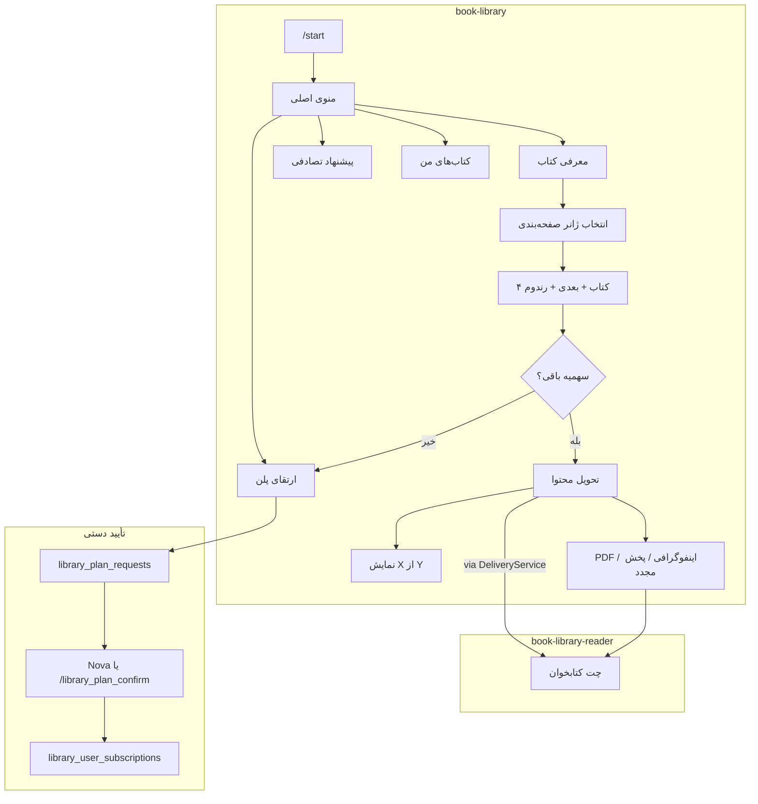

# طرح فاز ۱: ربات کتابخانه هوشمند (Book Library)

## هدف فاز ۱

ربات اصلی (`book-library`) تجربه «مربی کتابخوان» را پیاده کند: انتخاب ژانر → لیست کتاب → ارسال خلاصه صوتی → نمایش پیشرفت سهمیه → درخواست PDF/اینفوگرافی (در صورت وجود محتوا) → ارتقای پلن با تأیید دستی ادمین.

ربات دوم (`book-library-reader`) فقط برای **تحویل محتوا** در چت جداگانه است؛ ربات اصلی منو و منطق کسب‌وکار را نگه می‌دارد.



---

## خارج از محدوده فاز ۱

- بخش یادگیری / کویز
- لایک و دیس‌لایک + بازخورد صوتی
- ربات ادمین تلگرامی
- پنل وب تحلیلی
- گیمیفیکیشن (استریک، مدال)
- تنظیمات پیشرفته (اعلان، ایمیل، حالت شب)
- درگاه پرداخت آنلاین / کیف پول (بعداً؛ فعلاً الگوی Pro دستی)

---

## ثبت نوع ربات در Bot Mother

طبق الگوی موجود ([`docs/BOT_CREATION_GUIDE.md`](docs/BOT_CREATION_GUIDE.md)):

| endpoint_id | route | نقش |
|-------------|-------|-----|
| `book-library` | `api/webhook-book-library` | ربات اصلی کاربر |
| `book-library-reader` | `api/webhook-book-library-reader` | ربات تحویل محتوا |

هر دو: `requires_token=true`, `requires_bot_mother_id=true`, `supports_multiple_languages=true`.

**لینک دو ربات:** جدول پیکربندی per-instance (نه reuse مدل [`Book`](app/Models/Book.php) مربوط به Book Pixel):

```php
// library_bot_configs
bot_id              // instance اصلی book-library
reader_bot_id       // instance ربات book-library-reader (nullable)
```

رابطه endpoint در [`webhook_endpoint_related_bots`](database/migrations/2026_01_28_161108_create_webhook_endpoint_related_bots_table.php) هم در seeder ثبت شود (مثل [`BotDetailsSeeder`](database/seeders/BotDetailsSeeder.php)).

**ویزارد Bot Mother (حداقلی):** پس از ثبت `book-library`، از ادمین توکن ربات reader خواسته شود و `reader_bot_id` ذخیره گردد. الگو: شاخه‌های ویژه در [`BotMotherController`](app/Http/Controllers/BotMotherController.php) برای `content-submission` و `presenter-bot`.

---

## معماری فایل‌ها

```
app/Http/Controllers/
  BookLibraryController.php          # UX اصلی
  BookLibraryReaderController.php    # /start + callbackهای محتوا

app/Interfaces/Services/
  BookLibraryService.php
  BookLibraryDeliveryService.php
  BookLibraryPlanService.php

app/Services/
  BookLibraryServiceImpl.php
  BookLibraryDeliveryServiceImpl.php
  BookLibraryPlanServiceImpl.php

app/Repositories/ + Interfaces/      # ژانر، کتاب، تحویل، اشتراک

app/Models/
  LibraryBotConfig.php
  LibraryGenre.php
  LibraryBook.php
  LibraryBookMedia.php
  LibraryUserSubscription.php
  LibraryUserBook.php
  LibraryPlanRequest.php

config/book_library.php              # پلن‌ها، قیمت نمایشی، سایز صفحه ژانر/کتاب

database/seeders/
  BookLibraryWebhookEndpointSeeder.php
  BookLibraryGenreSeeder.php         # ~۱۵ ژانر در ۳ صفحه

docs/features/BOOK_LIBRARY_BOT.md
lang/*/bot.php                       # کلیدهای book_library.* برای ۱۵ زبان
```

الگوی Controller: [`PrayerBotController`](app/Http/Controllers/PrayerBotController.php) (webhook → callback → text، `createBotInstance` از DB، `Log::info` نه `LogHelper`).

الگوی state: `BotUsers::settings()` مثل [`BookPixelController`](app/Http/Controllers/BookPixelController.php) برای `current_genre_page`, `current_book_page`, `selected_genre_id`, `pending_book_id`.

---

## طرح دیتابیس

**جدول `library_genres`**
- `bot_id`, `name`, `sort_order`, `page` (1/2/3)
- Seeder اولیه: روانشناسی، کسب‌وکار، موفقیت، فلسفه، تاریخ، رمان، معرفت‌نفس، اقتصاد / جامعه‌شناسی، مدیریت، تربیت فرزند، روابط، بازاریابی، زندگینامه، علم

**جدول `library_books`**
- `bot_id`, `title`, `description`, `is_active`, `random_eligible`
- جدا از `books` مربوط به Book Pixel

**جدول `library_book_genre`** (many-to-many)

**جدول `library_book_media`**
- `book_id`, `type` (`audio`|`pdf`|`infographic`)
- `content_url`, `telegram_file_id`, `bale_file_id` (cache)
- ارسال فایل: [`FileUploadHelper::getOrUploadFile`](app/Helpers/FileUploadHelper.php)

**جدول `library_user_subscriptions`**
- `bot_user_id`, `bot_id`, `plan` (`free`|`plan_100`|`plan_300`|`plan_1000`)
- `books_used`, `books_limit`, `status`, `expires_at` (nullable)

**جدول `library_user_books`** (تاریخچه تحویل)
- `bot_user_id`, `book_id`, `delivered_via` (`main`|`reader`), `status`, `revealed_title` (برای رندوم: false تا پایان صوت)

**جدول `library_plan_requests`**
- الگوی [`ProPurchaseRequest`](app/Models/ProPurchaseRequest.php): `plan`, `status`, `payment_info`, تأیید ادمین

**config/book_library.php**
```php
'plans' => [
    'free'      => ['limit' => 3,   'price' => 0],
    'plan_100'  => ['limit' => 100, 'price' => ...],
    'plan_300'  => ['limit' => 300, 'price' => ...],
    'plan_1000' => ['limit' => 1000,'price' => ...],
],
'genres_per_page' => 5,
'books_per_page'  => 4,
```

---

## جریان UX (فاز ۱)

### منوی اصلی (Reply Keyboard)
- معرفی کتاب
- پیشنهاد تصادفی (رندوم سراسری بدون انتخاب ژانر)
- کتاب‌های من (لیست ساده آخرین دریافت‌ها)
- ارتقای پلن

### معرفی کتاب
1. صفحه ژانرها (۵ مورد + «ادامه») — callback `library_genre_page_{n}`
2. پس از انتخاب ژانر → ۴ کتاب + «کتاب‌های بیشتر» + «انتخاب تصادفی»
3. **رندوم:** پیام «در حال آماده‌سازی...» → صوت **بدون** نام کتاب در ابتدا → پس از ارسال نام کتاب
4. **انتخاب از لیست:** صوت **با** نام کتاب
5. پیشرفت: `█░░ 1 از 3` (رایگان) یا `24 از 100` (پولی) — نوار متنی ساده در فاز ۱
6. Quick Actions (inline، روی همان ربات تحویل): PDF / اینفوگرافی / پخش مجدد — فقط اگر media موجود باشد

### سهمیه
- قبل از هر تحویل: `BookLibraryPlanService::canDeliver()`
- پایان سهمیه → پیام + دکمه ارتقای پلن
- هر تحویل صوتی: `books_used++` و رکورد در `library_user_books`

### ارتقای پلن (دستی مثل Pro)
1. نمایش پلن فعلی + ۳ پلن پولی با قیمت از config
2. دکمه «درخواست خرید» → `library_plan_requests`
3. اعلان ادمین (reuse الگوی [`ProPurchaseNotificationService`](app/Services/ProPurchaseNotificationService.php))
4. تأیید: Nova Action یا دستور `/library_plan_confirm {id}` در Bot Mother
5. به‌روزرسانی `library_user_subscriptions`

### ربات Reader
- `/start`: خوش‌آمد + توضیح که محتوا اینجا می‌آید
- بدون منوی پیچیده
- [`BookLibraryDeliveryService`](app/Services/BookLibraryDeliveryServiceImpl.php): ساخت `Telegram` با توکن reader + `BotHelper::sendMessageByChatId` / `sendAudio`
- کاربر باید حداقل یک‌بار `/start` در reader زده باشد (همان `chat_id`)

---

## مدیریت محتوا (فاز ۱)

بدون ربات ادمین: **Nova Resources** برای `LibraryGenre`, `LibraryBook`, `LibraryBookMedia` scoped به `bot_id` — سریع‌ترین راه برای بارگذاری کتاب‌های اولیه.

Seeder نمونه: ۲–۳ کتاب تست با URL صوتی برای توسعه.

---

## Route و Seeder

[`routes/api.php`](routes/api.php):
```php
Route::post('/webhook-book-library', [BookLibraryController::class, 'webhook']);
Route::post('/webhook-book-library-reader', [BookLibraryReaderController::class, 'webhook']);
```

Seederها اجرا + `php artisan cache:clear`.

---

## ترجمه

کلیدهای پیشنهادی در `lang/*/bot.php`:
`book_library.welcome`, `book_library.menu.*`, `book_library.genre.*`, `book_library.progress`, `book_library.quota_exceeded`, `book_library.plan.*`, `book_library.preparing`, `book_library.reader_welcome`

همه ۱۵ زبان: fa, en, ar-IQ, az, bs, de-DE, es, fr, he, pt-BR, pt-PT, ru, tr, ur, zh-CN.

---

## ترتیب پیاده‌سازی پیشنهادی

1. Migrationها + Models + `config/book_library.php`
2. Seeders (endpoints + genres)
3. Repository/Service لایه داده
4. `BookLibraryDeliveryService` (ارسال صوت/PDF با FileUploadHelper)
5. `BookLibraryController` — منو، ژانر، کتاب، رندوم، سهمیه
6. `BookLibraryReaderController` — minimal
7. `BookLibraryPlanService` + درخواست/تأیید پلن
8. ویزارد لینک reader در Bot Mother
9. Nova resources + seeder کتاب نمونه
10. ترجمه ۱۵ زبان + [`docs/features/BOOK_LIBRARY_BOT.md`](docs/features/BOOK_LIBRARY_BOT.md)

---

## ریسک‌ها و تصمیم‌های فنی

| موضوع | تصمیم |
|-------|--------|
| تداخل با Book Pixel | جداول `library_*` و مدل `LibraryBook` |
| پرداخت | دستی مثل Pro؛ بدون کیف پول در فاز ۱ |
| Reader بدون /start | قبل از تحویل، پیام در ربات اصلی: «ابتدا ربات کتابخوان را استارت کنید» + deep link |
| PDF/اینفوگرافی اختیاری | دکمه فقط وقتی رکورد media وجود دارد |
| فایل‌های حجیم | cache `file_id` در `library_book_media` و `bot_uploaded_files` |

---

## تست دستی پیش از تحویل

- ثبت هر دو endpoint از Bot Mother
- لینک reader به main
- جریان: ژانر → کتاب → صوت → پیشرفت 1/3
- رندوم بدون نام اولیه
- اتمام سهمیه رایگان → پیام ارتقا
- درخواست پلن ۱۰۰ → تأیید ادمین → تحویل کتاب چهارم
- PDF از reader bot (در صورت media)
- `/start` در reader قبل از تحویل
