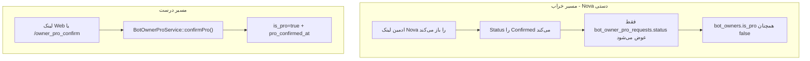
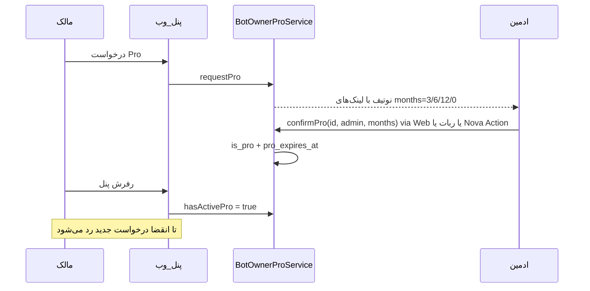

# رفع درخواست تکراری Pro و تایید با مدت اعتبار

## تشخیص ریشه مشکل

دو باگ جدا اما مرتبط وجود دارد:



- **چرا پنل هنوز «در حال بررسی» نشان می‌دهد:** [`dashboard.blade.php`](resources/views/bot-owner/dashboard.blade.php) از `$stats['is_pro']` و `$stats['has_pending_pro']` استفاده می‌کند. اگر ادمین در Nova فقط فیلد Status را عوض کند، [`confirmPro()`](app/Modules/BotOwner/Services/BotOwnerProService.php) اجرا نمی‌شود → `is_pro` false می‌ماند و درخواست pending بعدی همچنان نمایش داده می‌شود.
- **چرا درخواست تکراری ثبت می‌شود:** [`requestPro()`](app/Modules/BotOwner/Services/BotOwnerProService.php) فقط `pending` را چک می‌کند؛ اگر درخواست قبلی confirmed شده ولی `is_pro` ست نشده باشد، درخواست جدید مجاز است.

شواهد Nova شما (approved_at قبل از created_at در رکورد ۱) نشان می‌دهد تایید دستی فیلدها انجام شده، نه اکشن/لینک.

---

## راه‌حل پیشنهادی

### ۱. مدت اعتبار Pro روی `bot_owners`

Migration جدید: ستون `pro_expires_at` (nullable timestamp) در [`bot_owners`](database/migrations/2026_06_13_100001_create_bot_owners_table.php).

متد جدید در [`BotOwner`](app/Modules/BotOwner/Models/BotOwner.php):

```php
public function hasActivePro(): bool
{
    if (!$this->is_pro) return false;
    if ($this->pro_expires_at === null) return true; // legacy / unlimited
    if ($this->pro_expires_at->isPast()) {
        $this->update(['is_pro' => false]);
        return false;
    }
    return true;
}
```

نگاشت مدت‌ها (طبق درخواست شما):

| گزینه | مقدار | `pro_expires_at` |
|-------|-------|------------------|
| ۳ ماهه | `3` | `now()->addMonths(3)` |
| ۶ ماهه | `6` | `now()->addMonths(6)` |
| ۱۲ ماهه | `12` | `now()->addMonths(12)` |
| نامحدود | `0` | `now()->addYears(100)` (عملی) |

---

### ۲. تقویت `BotOwnerProService`

در [`BotOwnerProService`](app/Modules/BotOwner/Services/BotOwnerProService.php):

**`requestPro`:**
- اگر `$owner->hasActivePro()` → `already_pro`
- اگر pending وجود دارد → `pro_request_pending` (همان رفتار فعلی)
- در غیر این صورت ایجاد درخواست

**`confirmPro(int $requestId, ?int $adminId, int $months = 3)`:**
- امضای interface در [`BotOwnerProServiceInterface`](app/Modules/BotOwner/Contracts/BotOwnerProServiceInterface.php) به‌روز شود
- `is_pro = true`, `pro_confirmed_at = now()`, `pro_expires_at` بر اساس `$months`
- request → `confirmed` + `approved_at`

---

### ۳. لینک وب با query string (مسیر اصلی — همان که الان کار می‌کند)

در [`BotOwnerProController::approve`](app/Http/Controllers/Admin/BotOwnerProController.php):

```
GET /admin/bot-owner-pro/{id}/approve?months=3|6|12|0
```

- پیش‌فرض: `months=3` اگر پارامتر نباشد
- اعتبارسنجی: فقط `3`, `6`, `12`, `0` مجاز

---

### ۴. کامند ربات مادر

در [`BotMotherController::handleOwnerProConfirm`](app/Http/Controllers/BotMotherController.php):

```
/owner_pro_confirm {requestId} {months}
```

- `months` اختیاری، پیش‌فرض `3`
- همان `confirmPro()` را صدا بزند

---

### ۵. Nova: فقط اکشن، نه ویرایش دستی

در [`BotOwnerProRequest` Nova resource](app/Nova/BotOwnerProRequest.php):

- فیلد `Status` → `readonly()` روی فرم ویرایش
- فیلد `Approved At` → `readonly()`
- `authorizedToCreate` → `false` (جلوگیری از Create دستی)
- جایگزینی [`ApproveBotOwnerPro`](app/Nova/Actions/ApproveBotOwnerPro.php) با **یک اکشن** دارای `Select` مدت:
  - `3 months` / `6 months` / `12 months` / `Unlimited`
  - در `handle` → `confirmPro($id, auth()->id(), $months)`

لینک Nova در نوتیفیکیشن می‌تواند بماند **فقط برای مشاهده**؛ تایید از اکشن یا لینک Web.

---

### ۶. به‌روزرسانی پیام اعلان به ادمین

در [`BotOwnerProNotificationService`](app/Modules/BotOwner/Services/BotOwnerProNotificationService.php):

```
تایید ۳ ماهه: /owner_pro_confirm {id} 3
تایید ۶ ماهه: /owner_pro_confirm {id} 6
...
Web ۳ ماهه: .../approve?months=3
Web ۶ ماهه: .../approve?months=6
...
Nova: مشاهده + اکشن Approve Pro
```

لینک Nova دیگر به‌عنوان مسیر تایید پیشنهاد نمی‌شود.

---

### ۷. پنل مالک

در [`BotOwnerDashboardService`](app/Modules/BotOwner/Services/BotOwnerDashboardService.php):
- `is_pro` → `$owner->hasActivePro()`
- افزودن `pro_expires_at` به stats (اختیاری برای نمایش تاریخ انقضا)

در [`dashboard.blade.php`](resources/views/bot-owner/dashboard.blade.php):
- اگر Pro فعال: نمایش تاریخ انقضا (یا «نامحدود»)
- بنر درخواست فقط وقتی `!hasActivePro` و `!has_pending_pro`

---

### ۸. تست‌ها

به‌روزرسانی [`BotOwnerProServiceTest`](tests/Unit/Modules/BotOwner/BotOwnerProServiceTest.php):
- تایید با `months=3` → `pro_expires_at` درست
- `requestPro` بعد از تایید → `already_pro`
- `requestPro` بعد از انقضا (با `Carbon::setTestNow`) → مجاز
- `requestPro` با pending موجود → رد

تست feature برای `?months=6` در web approve (اختیاری).

---

### ۹. تعمیر داده موجود (یک‌بار)

Artisan command کوچک (مثلاً `bot-owner:sync-pro-status`):
- هر `bot_owner_pro_request` با `status=confirmed` که owner آن `is_pro=false` دارد → `confirmPro` مجدد با `months=3` (یا بر اساس `approved_at`)
- برای مالک `989196070718` که الان گیر کرده

---

### ۱۰. صفحه معرفی `/bots` — مخفی کردن دکمه ورود

**مشکل:** در [`intro.blade.php`](resources/views/bot-owner/intro.blade.php) دکمه «ورود / ثبت‌نام» همیشه نمایش داده می‌شود، حتی وقتی session مالک فعال است (مثلاً بعد از OTP در [bots.pardisania.ir/bots](https://bots.pardisania.ir/bots)).

**علت:** [`IntroController`](app/Modules/BotOwner/Http/Controllers/IntroController.php) وضعیت لاگین را به view پاس نمی‌دهد.

**تغییرات:**

1. در `IntroController::index` تزریق `BotOwnerAuthServiceInterface` و پاس `$owner = $authService->currentOwner()` به view.
2. در `intro.blade.php`:
   - `@if(!$owner)` → دکمه «ورود / ثبت‌نام»
   - `@else` → دکمه «پنل مدیریت» (`route('bot-owner.dashboard')`) به‌جای دکمه ورود
   - دکمه «مشاهده ربات‌ها» بدون تغییر بماند
3. کلید ترجمه جدید در `lang/fa/bot-owner.php` و `lang/en/bot-owner.php`: مثلاً `go_to_dashboard` = «پنل مدیریت»
4. تست feature در [`OtpLoginFlowTest`](tests/Feature/Modules/BotOwner/OtpLoginFlowTest.php):
   - مهمان: `assertSee('ورود / ثبت‌نام')`
   - با session مالک: `assertDontSee('ورود / ثبت‌نام')` و `assertSee('پنل مدیریت')`

**خارج از scope این بخش:** ریدایرکت خودکار از `/bots/login` به dashboard اگر قبلاً لاگین شده (اختیاری، فقط اگر بخواهید).

---

## جریان نهایی



---

## فایل‌های اصلی تغییر

| فایل | تغییر |
|------|-------|
| migration جدید | `pro_expires_at` |
| [`BotOwner.php`](app/Modules/BotOwner/Models/BotOwner.php) | `hasActivePro()` |
| [`BotOwnerProService.php`](app/Modules/BotOwner/Services/BotOwnerProService.php) | منطق انقضا + confirm با months |
| [`BotOwnerProController.php`](app/Http/Controllers/Admin/BotOwnerProController.php) | query `months` |
| [`BotMotherController.php`](app/Http/Controllers/BotMotherController.php) | پارامتر months |
| [`BotOwnerProRequest.php` Nova](app/Nova/BotOwnerProRequest.php) | readonly + no create |
| [`ApproveBotOwnerPro.php`](app/Nova/Actions/ApproveBotOwnerPro.php) | Select مدت |
| [`BotOwnerProNotificationService.php`](app/Modules/BotOwner/Services/BotOwnerProNotificationService.php) | لینک‌های چندمدته |
| [`BotOwnerDashboardService.php`](app/Modules/BotOwner/Services/BotOwnerDashboardService.php) | `hasActivePro` |
| [`lang/fa/bot-owner.php`](lang/fa/bot-owner.php) + en | پیام‌های انقضا / already_pro |
| [`IntroController.php`](app/Modules/BotOwner/Http/Controllers/IntroController.php) | پاس `$owner` به view |
| [`intro.blade.php`](resources/views/bot-owner/intro.blade.php) | شرطی کردن دکمه ورود / پنل |

---

## خارج از scope

- تغییر سیستم Pro هواشناسی (`pro_users`) — الگو از آنجا گرفته می‌شود ولی جدا می‌ماند
- ترجمه ۱۵ زبان برای کلیدهای جدید: فقط `fa` و `en` در این PR (طبق convention پروژه برای کلیدهای جدید)
