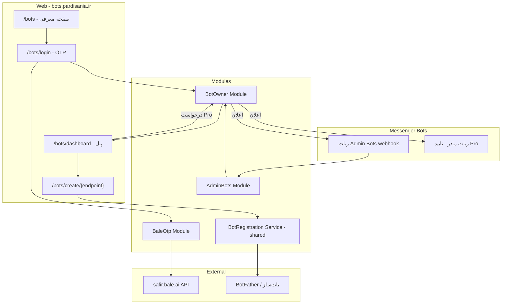
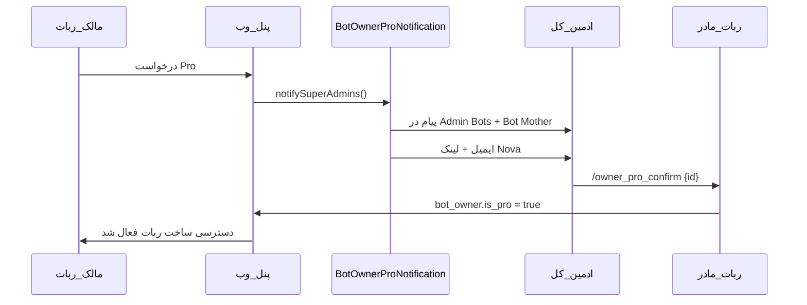

# پلن: ثبت‌نام خودکار مالک ربات + پنل ادمین باتس

## وضعیت فعلی

پروژه Laravel 10 مونولیت است ([`app/Http/Controllers/BotMotherController.php`](app/Http/Controllers/BotMotherController.php)) با الگوی Service/Repository. موارد موجود که **بازاستفاده** می‌شوند:

- ساخت ربات با توکن: [`BotHelper::defineBotInDbThenSetWebHook()`](app/Helpers/BotHelper.php) و wizard در [`BotMotherController`](app/Http/Controllers/BotMotherController.php)
- جریان Pro: [`ProServiceImpl`](app/Services/ProServiceImpl.php) + [`ProPurchaseNotificationService`](app/Services/ProPurchaseNotificationService.php) + `/pro_confirm` در Bot Mother
- صفحه کاتالوگ: [`WelcomeController`](app/Http/Controllers/WelcomeController.php) + [`welcome.blade.php`](resources/views/welcome.blade.php)
- احراز هویت ادمین: [`AdminHelper::isAdmin()`](app/Helpers/AdminHelper.php) (env chat IDs)

**وجود ندارد:** OTP بله/Safir، جدول مالک ربات وب، `/bots` یا `/admin-bots`، پنل وب مدیریت ربات.

---

## معماری پیشنهادی (ماژولار)

ساختار جدید زیر `app/Modules/` — هر ماژول Service Provider، Interface، Impl، و تست مستقل خودش را دارد. الگوی binding مشابه [`AppServiceProvider`](app/Providers/AppServiceProvider.php).



### ماژول ۱: `BaleOtp` — قابل استفاده در کل پروژه

مسیر: `app/Modules/BaleOtp/`

| فایل | مسئولیت |
|------|---------|
| `Contracts/BaleOtpServiceInterface.php` | قرارداد ارسال OTP و مدیریت توکن |
| `Services/BaleOtpAuthService.php` | `POST /auth/token` — کش JWT با `expires_in` |
| `Services/BaleOtpSendService.php` | `POST /send_otp` با Bearer token |
| `Support/PhoneNormalizer.php` | تبدیل `0912...` → `98912...` (طبق مستندات Safir) |
| `Exceptions/BaleOtpException.php` | خطاهای rate limit، موجودی، شماره نامعتبر |
| `config/bale-otp.php` | `client_id`, `client_secret`, `base_url`, `otp_ttl`, `max_attempts` |

**جریان OTP (طبق مستندات Safir):**
1. ما OTP ۶ رقمی تولید می‌کنیم و در `bot_owner_otp_sessions` ذخیره می‌کنیم
2. با Safir `send_otp` همان OTP به شماره در بله ارسال می‌شود
3. کاربر OTP را در وب وارد می‌کند → مقایسه با hash ذخیره‌شده
4. Rate limit: حداکثر ۳۰ درخواست/ساعت per phone (طبق Safir) + throttle Laravel

**تست‌ها:** `tests/Unit/Modules/BaleOtp/PhoneNormalizerTest.php`, `BaleOtpAuthServiceTest.php` (HTTP mock), `BaleOtpSendServiceTest.php`

---

### ماژول ۲: `BotOwner` — احراز هویت و پنل وب

مسیر: `app/Modules/BotOwner/`

#### جداول جدید (migrations)

```sql
bot_owners: id, phone (unique, 989...), name, bale_chat_id (nullable),
            is_pro (bool), pro_confirmed_at, status (active/suspended),
            last_login_at, timestamps

bot_owner_otp_sessions: id, phone, otp_hash, expires_at, attempts, ip

bot_owner_pro_requests: id, bot_owner_id, status (pending/confirmed/rejected),
                        approved_by, approved_at, notes, timestamps
```

**تغییر جدول موجود:** افزودن `bot_owner_id` (nullable FK) به [`bots`](app/Models/Bot.php) برای مالکیت ربات.

#### سرویس‌ها

| سرویس | کار |
|--------|-----|
| `BotOwnerAuthService` | ثبت‌نام/ورود با OTP، session Laravel |
| `BotOwnerProService` | درخواست Pro، تایید/رد (الگوی [`ProServiceImpl`](app/Services/ProServiceImpl.php)) |
| `BotOwnerDashboardService` | لیست ربات‌های مالک، آمار، وضعیت Pro |
| `BotRegistrationService` | **استخراج** منطق token از Bot Mother → endpoint انتخاب، platform، زبان، `defineBotInDbThenSetWebHook` |

#### وب (Blade + `layouts/web.blade.php`)

| Route | صفحه |
|-------|------|
| `GET /bots` | صفحه معرفی — ورود ناشناس، لینک به [`pardisania.ir`](https://pardisania.ir) و کاتالوگ `/` |
| `GET /bots/login` | فرم شماره موبایل |
| `POST /bots/otp/send` | ارسال OTP |
| `POST /bots/otp/verify` | تایید → redirect به dashboard |
| `GET /bots/dashboard` | پنل مالک (middleware `bot-owner`) |
| `GET /bots/create/{endpointId}` | ویزارد ساخت ربات (فقط Pro) |
| `POST /bots/create/{endpointId}` | ثبت توکن |
| `POST /bots/pro/request` | درخواست ارتقا به Pro |
| `POST /bots/logout` | خروج |

**Middleware:** `EnsureBotOwnerAuthenticated`, `EnsureBotOwnerIsPro` (برای ساخت ربات)

#### تغییرات UI موجود

- [`welcome.blade.php`](resources/views/welcome.blade.php): بنر CTA «ساخت ربات خودتان» → `/bots`؛ دکمه «+ ساختن» روی کارت‌های `mission-bot` و `personnel-registration` (و سایر endpointهای قابل ساخت)
- [`bot/show.blade.php`](resources/views/bot/show.blade.php): دکمه «ساختن این ربات» → `/bots/create/{endpointId}` (با redirect به login اگر لاگین نیست)
- لینک بازگشت از `/bots` به `/` (کاتالوگ bots.pardisania.ir)

**مستندات برای تیم pardisania.ir:** فایل `docs/features/BOT_OWNER_PARDISANIA_LINK.md` با URL و متن پیشنهادی دکمه برای صفحه اصلی سایت.

**تست‌ها:** `tests/Unit/Modules/BotOwner/BotOwnerAuthServiceTest.php`, `BotOwnerProServiceTest.php`, `tests/Feature/Modules/BotOwner/OtpLoginFlowTest.php`, `BotOwnerDashboardTest.php`

---

### ماژول ۳: `AdminBots` — ربات پیام‌رسان مدیریت

مسیر: `app/Modules/AdminBots/`

#### Webhook جدید

- Route: `POST /api/webhook-admin-bots` (طبق قانون `/api/`)
- Seeder: `AdminBotsWebhookEndpointSeeder` — `endpoint_id: admin-bots`, `requires_token: true`
- Controller: `AdminBotsController`

#### دستورات

| دستور | عملکرد |
|-------|--------|
| `/start` | معرفی + لینک پنل وب `/bots` |
| `/bots` | لیست ربات‌های مالک (نیاز به اتصال chat_id به bot_owner) |
| `/admin-bots` | منوی مدیریت: ساخت ربات، درخواست Pro، راهنما |
| `/link {phone}` | اتصال chat_id بله به حساب وب (پس از OTP) |
| `/create` | شروع ویزارد ساخت (مشابه Bot Mother، فقط Pro) |
| `/pro_request` | درخواست Pro از داخل ربات |

**اتصال حساب وب ↔ ربات:** پس از OTP موفق در وب، کاربر در ربات Admin Bots دستور `/link` می‌زند یا شماره را ارسال می‌کند تا `bale_chat_id` در `bot_owners` ذخیره شود.

**تست‌ها:** `tests/Feature/Modules/AdminBots/AdminBotsWebhookTest.php` با `WebhookMockHelper`

---

### جریان Pro (تایید ادمین کل)

بازاستفاده از الگوی موجود Weather Pro:



- دستور جدید در [`BotMotherController`](app/Http/Controllers/BotMotherController.php): `/owner_pro_confirm {requestId}` (جدا از `/pro_confirm` موجود که برای `bot_users` است)
- Nova Resource: `BotOwnerProRequest` در `app/Nova/`
- Web approve: `GET /admin/bot-owner-pro/{id}/approve` (مشابه [`ProPurchaseController`](app/Http/Controllers/Admin/ProPurchaseController.php))

---

### ویزارد ساخت ربات (Pro users)

منطق از Bot Mother **استخراج** می‌شود به `BotRegistrationService` (shared):

1. انتخاب endpoint از `webhook_endpoints` (فیلتر بر اساس endpoint انتخاب‌شده از صفحه کاتالوگ)
2. انتخاب platform: telegram / bale (بر اساس `requires_token` و قابلیت‌های endpoint)
3. انتخاب زبان (اگر `requires_language`)
4. راهنمای BotFather/بات‌ساز (متن از `usage_instructions` در webhook_endpoint)
5. دریافت توکن → [`TokenHelper::isToken()`](app/Helpers/TokenHelper.php) → [`BotHelper::defineBotInDbThenSetWebHook()`](app/Helpers/BotHelper.php)
6. ذخیره `bot_owner_id` روی رکورد `bots`

**محدودیت:** کاربر غیر-Pro فقط پنل و درخواست Pro می‌بیند؛ ساخت ربات فقط پس از تایید.

---

## Env جدید

```env
BALE_SAFIR_CLIENT_ID=
BALE_SAFIR_CLIENT_SECRET=
BALE_SAFIR_BASE_URL=https://safir.bale.ai/api/v2
ADMIN_BOTS_TOKEN_BALE=
ADMIN_BOTS_TOKEN_TELEGRAM=
BOT_OWNER_OTP_TTL=300
BOT_OWNER_OTP_MAX_ATTEMPTS=5
```

---

## ترجمه‌ها

کلیدهای جدید در `lang/*/bot-owner.php` برای **همه ۱۵ زبان** (طبق `.cursorrules`).

---

## فازبندی پیاده‌سازی

### فاز ۱ — زیرساخت OTP (قابل استفاده مجدد)
- ماژول `BaleOtp` کامل + تست‌های unit
- migrations + models پایه `BotOwner`

### فاز ۲ — وب ثبت‌نام و پنل
- صفحات `/bots`, login, dashboard
- تغییرات `welcome.blade.php` و `bot/show.blade.php`
- middleware و session auth

### فاز ۳ — Pro و اعلان‌ها
- `BotOwnerProService` + Nova + `/owner_pro_confirm`
- notification به Bot Mother و Admin Bots

### فاز ۴ — ساخت ربات
- `BotRegistrationService` (استخراج از Bot Mother)
- ویزارد وب + دستورات `/create` در Admin Bots

### فاز ۵ — ربات Admin Bots
- webhook + seeder + دستورات `/bots`, `/admin-bots`, `/link`
- feature tests

---

## فایل‌های کلیدی که تغییر می‌کنند

| فایل | تغییر |
|------|-------|
| [`routes/web.php`](routes/web.php) | routes پنل BotOwner |
| [`routes/api.php`](routes/api.php) | webhook admin-bots |
| [`app/Providers/AppServiceProvider.php`](app/Providers/AppServiceProvider.php) | register module providers |
| [`resources/views/welcome.blade.php`](resources/views/welcome.blade.php) | CTA + دکمه ساختن |
| [`resources/views/bot/show.blade.php`](resources/views/bot/show.blade.php) | دکمه ساختن |
| [`app/Http/Controllers/BotMotherController.php`](app/Http/Controllers/BotMotherController.php) | `/owner_pro_confirm` + refactor به shared service |
| [`config/bot.php`](config/bot.php) | لینک Admin Bots |

## فایل‌های جدید (خلاصه)

```
app/Modules/BaleOtp/...
app/Modules/BotOwner/...
app/Modules/AdminBots/...
app/Modules/BotRegistration/...
database/migrations/*_create_bot_owners_table.php
database/migrations/*_add_bot_owner_id_to_bots_table.php
database/seeders/AdminBotsWebhookEndpointSeeder.php
resources/views/bot-owner/...
tests/Unit/Modules/...
tests/Feature/Modules/...
docs/features/BOT_OWNER_SELF_SERVICE.md
docs/features/BOT_OWNER_PARDISANIA_LINK.md
```

---

## ریسک‌ها و نکات

- **Safir:** کاربر باید اکانت بله با همان شماره داشته باشد؛ خطای `404 this phone does not have an account in Bale` باید در UI نمایش داده شود
- **Rate limit Safir:** ۳۰ OTP/ساعت per phone — throttle سمت سرور الزامی
- **Bot Mother refactor:** استخراج `BotRegistrationService` باید بدون شکستن wizard موجود Bot Mother انجام شود (تست regression روی webhook موجود)
- **pardisania.ir:** خارج از این ریپو — فقط مستندات لینک‌دهی
