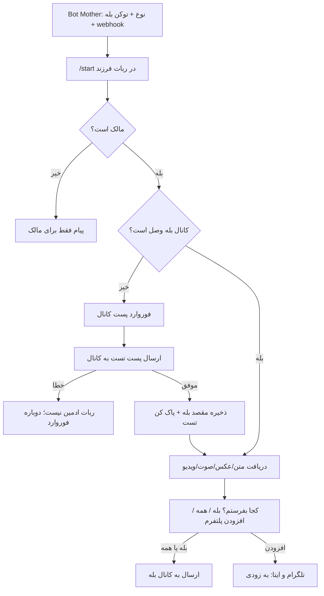

# ربات ارسال به کانال‌ها (فاز بله)

نوع ربات جدید است؛ [`admin-daily-channel`](app/Services/WebhookEndpointDefaultImporter.php)، صف رسانه، و [`content-submission`](app/Http/Controllers/ContentSubmissionController.php) تغییر نمی‌کنند.

مکالمه راه‌اندازی و ارسال **داخل ربات ساخته‌شده** است (الگوی [MpContact](app/Http/Controllers/MpContactBotController.php))، نه ویزارد طولانی در Bot Mother. Bot Mother فقط توکن بله را می‌گیرد، webhook را ست می‌کند، و می‌گوید برو `/start` بزن.

## رفتار فاز ۱ (بله)

1. مالک ربات را در بله `/start` می‌زند.
2. اگر کانال وصل نیست: «یک پست از کانالت را در خصوصی فوروارد کن» (قبلش ربات باید ادمین کانال باشد).
3. از `message.forward_from_chat.id` شناسه کانال گرفته می‌شود؛ `type` باید `channel` باشد (سخت‌گیرانه‌تر از [MultiPlatformChannelWizardHelper](app/Helpers/MultiPlatformChannelWizardHelper.php)).
4. ربات با توکن خودش یک پیام تست می‌فرستد: «تست - این پیام را پاک کنید.» الگوی تست همان [Content Submission](app/Http/Controllers/BotMotherController.php) است (`sendMessage`؛ اگر exception خورد یعنی ادمین نیست).
5. بعد از وصل شدن: هر مطلب خصوصی (متن، عکس، صوت/`voice`/`audio`، ویدیو) ذخیره موقت در `bot_user_states` می‌شود و کیبورد می‌پرسد: **بله** / **همه** / **افزودن پلتفرم**.
6. «بله» و «همه» در این فاز هر دو فقط به کانال بله می‌روند. «افزودن پلتفرم» متن «به‌زودی تلگرام و ایتا» نشان می‌دهد تا بعداً بدون بازنویسی جدول اضافه شوند.
7. غیرمالک فقط پیام راهنما می‌گیرد. مالک = `bots.bale_owner_chat_id` (مثل [`MpContactBotServiceImpl::ensurePrimaryAdmin`](app/Services/MpContactBotServiceImpl.php)).

ارسال مدیا با `file_id` همان پلتفرم (بله→بله) مثل [`ContentSubmissionServiceImpl`](app/Services/ContentSubmissionServiceImpl.php) و سوئیچ [`RatingBotController`](app/Http/Controllers/RatingBotController.php) برای `sendPhoto` / `sendVideo` / `sendAudio` / `sendVoice`.

## فایل‌ها

الگو: MpContact (کنترلر + سرویس، بدون Repository) + Content Submission (فوروارد و publish).

- [`app/Http/Controllers/ChannelPosterBotController.php`](app/Http/Controllers/ChannelPosterBotController.php) — webhook، توکن از query سپس DB، `Log::info` نه `LogHelper` با `Request`
- [`app/Interfaces/Services/ChannelPosterBotService.php`](app/Interfaces/Services/ChannelPosterBotService.php) + [`app/Services/ChannelPosterBotServiceImpl.php`](app/Services/ChannelPosterBotServiceImpl.php)
- [`app/Models/ChannelPosterDestination.php`](app/Models/ChannelPosterDestination.php)
- migration بدون FK به `bots` (فقط `unsignedBigInteger` + index) مطابق [قوانین migration](.cursor/rules/database-migrations.mdc)
- [`database/seeders/ChannelPosterWebhookEndpointSeeder.php`](database/seeders/ChannelPosterWebhookEndpointSeeder.php)
- روت در [`routes/api.php`](routes/api.php): `Route::post('/webhook-channel-poster', ...)` → `/api/webhook-channel-poster`
- bind در [`app/Providers/AppServiceProvider.php`](app/Providers/AppServiceProvider.php)
- ثبت در [`WebhookEndpointDefaultImporter`](app/Services/WebhookEndpointDefaultImporter.php)
- پیام راهنما بعد از ساخت در [`BotMotherController::handleTokenInput`](app/Http/Controllers/BotMotherController.php) (مثل `webhook-list-bot`)
- ترجمه‌های `channel_poster_*` در هر ۱۵ `lang/*/bot.php`
- [`docs/features/CHANNEL_POSTER_BOT.md`](docs/features/CHANNEL_POSTER_BOT.md)

شناسه نوع ربات:

- `endpoint_id`: `webhook-channel-poster`
- نام فارسی در لیست Bot Mother: **ارسال به کانال‌ها**
- `requires_token`: `true`، `route`: `api/webhook-channel-poster`

Bot Mother ویزارد کانال ندارد؛ فقط webhook ست می‌شود.

## دیتابیس (آماده فازهای بعدی)

یک جدول `channel_poster_destinations`:

- `bot_id` unsignedBigInteger + index (بدون FK)
- `platform` string: `bale` | `telegram` | `eitaa` | `soroush`
- `channel_chat_id` string (ایتا بعداً رشته است)
- `channel_title` nullable
- `bot_token` nullable — برای بله خالی می‌ماند (از `bots.bale_bot_token` استفاده می‌شود)؛ برای تلگرام/ایتا بعداً توکن جدا
- `verified_at` nullable
- `is_active` boolean
- unique `(bot_id, platform)` در فاز ۱ یک کانال بله کافی است

state مکالمه در جدول موجود `bot_user_states` (مثل MpContact):

- `cp_awaiting_bale_forward`
- `cp_awaiting_destination` (محتوای pending در `data`: type, text, file_id)

## کنترلر

- `createBotInstance`: اولویت token کوئری، بعد `bot_id` از DB (`bale_bot_token` وقتی `origin=bale`)
- فقط `chat.type === private` در فاز ۱
- `/start` و `/cancel` state را پاک می‌کنند
- تشخیص مدیا از `$update['message']`: `text` / `photo` (آخرین سایز) / `video` / `voice` / `audio`
- دکمه‌های شیشه‌ای: `cp:to:bale`، `cp:to:all`، `cp:add`

تست ادمین بودن: try/catch روی `sendMessage` به `channel_chat_id`؛ بدون `getChatMember` (در پروژه استفاده نشده).

## تست و مستندات

- Unit: مالک بودن، resolve مقصد (`all` وقتی فقط بله)، رد فوروارد غیرکانال
- Feature سبک روی SQLite in-memory (جدول‌های لازم مثل تست‌های observability): `/start` غیرمالک، فوروارد معتبر state را عوض می‌کند (publisher با اینترفیس جعلی تا API واقعی صدا زده نشود)
- داکیومنت: ساخت از Bot Mother، چک‌لیست بله، rollback (حذف route/seeder/migration)، و بخش «فاز بعدی» برای تلگرام (توکن جدا + دیدن `سلام` در `channel_post`) و ایتا (توکن ایتاییا + شناسه پنل)

بعد از پیاده‌سازی با هم روی بله تست می‌کنیم: ساخت از Bot Mother → ادمین کانال → فوروارد → پست تست → ارسال متن و عکس.
