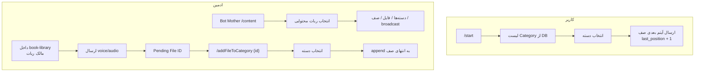

# بازطراحی ربات کتابخانه: Content + صف ترتیبی + مدیریت از Bot Mother

## تشخیص مشکل فعلی

معماری فعلی ([`book-library`](app/Http/Controllers/BookLibraryController.php) + [`book-library-reader`](app/Http/Controllers/BookLibraryReaderController.php)) از زاویه محصول پیچیده است:
- دو ربات باید لینک شوند (`library_bot_configs`)
- مدل `library_books` + `library_book_genre` (many-to-many) با UX «کتاب» طراحی شده، نه «صف محتوا»
- ارسال رندوم و انتخاب از لیست ۴تایی — با نیاز جدید (صف ترتیبی per category) ناسازگار است

**تصمیم محصول (تأیید شما):**
- یک ربات `book-library` برای کاربر و ادمین
- `book-library-reader` **اختیاری** بماند ولی از Bot Mother و UX اصلی حذف شود
- هر آیتم محتوا بعداً چند Asset (audio, pdf, …) دارد؛ **فاز این طرح: فقط audio**



---

## فاز ۱ — دیتابیس جدید (بدون FK به `bots`)

طبق [`.cursor/rules/database-migrations.mdc`](.cursor/rules/database-migrations.mdc): فقط `unsignedBigInteger` + `index`.

### جداول جدید `content_*`

| جدول | نقش |
|------|-----|
| `content_categories` | دسته‌بندی per `bot_id`: title, sort_order, page, is_active |
| `content_items` | آیتم صف: category_id, bot_id, title nullable, queue_order, is_active |
| `content_assets` | فایل‌ها: content_item_id, type (audio/pdf/…), telegram_file_id, bale_file_id, content_url |
| `content_pending_uploads` | فایل دریافت‌شده قبل از دسته: bot_id, file_id, origin, uploaded_by_chat_id |
| `content_user_progress` | bot_user_id, category_id, last_position (unique per user+category) |
| `content_broadcast_jobs` | bot_id, target_filter, payload, status, created_by_chat_id |

**نگاشت از `library_*`:** migration جدید داده‌های `library_genres` / `library_books` / `library_book_media` را در صورت وجود به `content_*` منتقل کند؛ جداول `library_*` در migration بعدی deprecate (بدون drop فوری روی production).

`library_user_subscriptions` و `library_plan_requests` **فعلاً نگه داشته می‌شوند** (پلن و سهمیه).

### Seeder

فایل [`database/seeders/ContentCategorySeeder.php`](database/seeders/ContentCategorySeeder.php) با ۱۶ دسته پیشنهادی شما (Psychology, Business, …) — اجرا با:

```bash
CONTENT_SEED_BOT_ID=<bot_id> php artisan db:seed --class=ContentCategorySeeder
```

همچنین به‌روزرسانی [`BookLibraryGenreSeeder`](database/seeders/BookLibraryGenreSeeder.php) برای فراخوانی همان لیست یا redirect به seeder جدید.

---

## فاز ۲ — UX کاربر (جایگزین منوی فعلی)

تغییر [`BookLibraryController`](app/Http/Controllers/BookLibraryController.php):

**`/start`:**
- خواندن `content_categories` فعال برای `bot_id`
- اگر خالی: پیام «دسته‌بندی هنوز تعریف نشده» + راهنمای ادمین
- نمایش دکمه‌های inline دسته‌ها (صفحه‌بندی مثل الان، بدون hard-code)

**انتخاب دسته:**
- خواندن `last_position` از `content_user_progress`
- ارسال `content_items` با `queue_order = last_position + 1` که asset نوع `audio` دارد
- بعد از ارسال موفق: `last_position++`
- اگر صف تمام شد: پیام «به انتهای این موضوع رسیدید»

**حذف در این فاز:**
- پیشنهاد رندوم
- لیست ۴ کتاب + pagination کتاب
- Quick Actions PDF/infographic (تا وقتی asset اضافه نشود نمایش داده نشود)

**نگه‌داری:**
- `کتاب‌های من` → تاریخچه آخرین دریافت‌ها از `content_user_progress` + log
- `ارتقای پلن` → همان `library_plan_*`
- `/help` به‌روز

---

## فاز ۳ — ادمین داخل ربات (مالک)

تشخیص ادمین: `chat_id` برابر `bots.bale_owner_chat_id` یا `bots.telegram_owner_chat_id` برای همان `bot_id`.

| دستور / رویداد | رفتار |
|----------------|--------|
| ارسال voice/audio/document | ذخیره در `content_pending_uploads` → پاسخ با `File ID: {id}` و دستور `/addFileToCategory {id}` |
| `/addFileToCategory {id}` | inline انتخاب دسته → ساخت `content_item` با `queue_order = max+1` → ساخت `content_asset` audio |
| `/addCategory` | wizard نام دسته → سؤال broadcast بله/خیر |
| `/broadcast` | wizard: متن/فایل → فیلتر گیرنده → تأیید → Job |

سرویس جدید: [`ContentQueueService`](app/Services/ContentQueueService.php) — append، nextForUser، maxOrder.

---

## فاز ۴ — Bot Mother `/content`

در [`BotMotherController`](app/Http/Controllers/BotMotherController.php):

**دستور `/content`** (فقط ادمین پلتفرم — [`AdminHelper::isAdmin`](app/Helpers/AdminHelper.php)):

1. لیست instanceهای `bots` با `endpoint_id` در لیست محتوایی (config: `config/content_bots.php` → ابتدا `book-library`، بعداً quran/hadith/…)
2. انتخاب ربات → منوی مدیریت:
   - دسته‌بندی‌ها (لیست + افزودن)
   - فایل‌های در انتظار (`content_pending_uploads`)
   - صف هر دسته (نمایش ۱..N)
   - پیام همگانی (reuse الگوی [`BotMessageBroadcastService`](app/Services/BotMessageBroadcastService.php) با فیلتر per-bot)
   - آمار (تعداد کاربر، دسته، آیتم صف)

Stateهای جدید در [`BotMotherStateHelper`](app/Helpers/BotMotherStateHelper.php): `STATE_CONTENT_BOT_SELECT`, `STATE_CONTENT_MENU`, …

**ساده‌سازی ثبت ربات:**
- ویزارد دو مرحله‌ای reader در Bot Mother **پیش‌فرض «رد»** + پیام «reader اختیاری است، فعلاً لازم نیست»
- endpoint `book-library-reader` در لیست endpoint با برچسب «اختیاری — فاز بعد»

---

## فاز ۵ — Broadcast و اعلان دسته جدید

**دسته جدید (`/addCategory` + بله):**
- Job: [`NotifyNewCategoryJob`](app/Jobs/NotifyNewCategoryJob.php)
- متن از `lang/*/book_library.php` → `new_category_broadcast`
- ارسال به همه `BotUsers` مرتبط با همان `bot_mother_id` / فیلتر کاربران فعال

**`/broadcast` (در ربات و از Bot Mother):**
- فیلترها: همه، رایگان، ویژه، فعال، per-category
- Job صف‌بندی‌شده [`ContentBroadcastJob`](app/Jobs/ContentBroadcastJob.php) + رکورد در `content_broadcast_jobs`

---

## فاز ۶ — مستندات و ترجمه

- بازنویسی [`docs/features/BOOK_LIBRARY_BOT.md`](docs/features/BOOK_LIBRARY_BOT.md) → `CONTENT_LIBRARY_BOT.md` یا همان فایل با بخش «معماری جدید»
- بخش صریح: **reader اختیاری — فعلاً استفاده نکنید**
- Prompt/راهنمای Seeder برای ادمین
- کلیدهای ترجمه جدید در ۱۵ زبان: `content_*`, دستورات ادمین، پیام صف، broadcast

---

## آنچه عمداً خارج از این طرح است

- PDF / infographic / quiz (ساختار `content_assets` آماده، UI بعداً)
- حذف کامل کد `book-library-reader` (طبق انتخاب شما: نگه‌داری اختیاری)
- درگاه پرداخت آنلاین
- پنل وب جدا (Nova فعلاً برای مشاهده/ویرایش دستی categories/items کافی است)

---

## ترتیب پیاده‌سازی پیشنهادی

1. Migration `content_*` + Seeder دسته‌ها
2. `ContentQueueService` + refactor delivery (فقط audio، یک ربات)
3. UX کاربر: start → categories → sequential send
4. ادمین in-bot: upload + `/addFileToCategory` + `/addCategory`
5. Bot Mother `/content` + ساده‌سازی wizard reader
6. Broadcast jobs + اعلان دسته جدید
7. مستندات + ترجمه + Nova resources برای `ContentCategory` / `ContentItem`

---

## برای شما الان (قبل از کد جدید)

تا پیاده‌سازی نشده:
- فقط **یک** ربات `book-library` بسازید؛ reader را **رد** کنید
- دسته‌ها را از Nova `Library Genre` یا بعد از migrate از `Content Category` پر کنید
- پلن‌ها همچنان در [`config/book_library.php`](config/book_library.php)

بعد از deploy فاز ۱–۲: `CONTENT_SEED_BOT_ID=<id> php artisan db:seed --class=ContentCategorySeeder`
