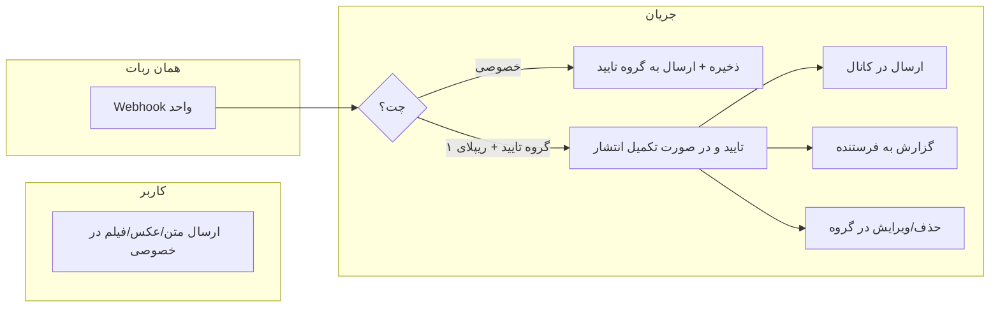

# ربات محتوای متنی / عکس / فیلم با تایید و انتشار

## خلاصه نیازمندی‌ها

- **یک ربات واحد**: دریافت محتوا در خصوصی، ارسال به گروه تایید، تایید با ریپلای «۱» به همان پیام، انتشار در کانال، گزارش به فرستنده.
- **تشخیص گروه/کانال**: از طریق ویزارد ربات مادر با فوروارد یک پیام از کانال و (در صورت نیاز) یک پیام از گروه؛ استفاده از `forward_from_chat.id` برای ذخیره `channel_chat_id` و `group_chat_id`.
- **تایید یک یا دو نفره**: ادمین در ویزارد انتخاب می‌کند؛ در حالت دو نفره با دومین ریپلای «۱» به همان پیام تایید، انتشار در کانال و حذف/ویرایش پیام در گروه.
- **نوع محتوا**: متن، عکس، فیلم (در آینده قابل گسترش).

---

## معماری پیشنهادی

- **یک Webhook** برای هر ربات (مثل Book Pixel که دو وب‌هوک دارد؛ اینجا یکی کافی است): درخواست‌ها با `chat_id` تفکیک می‌شوند (خصوصی = دریافت محتوا، گروه = تایید با ریپلای «۱»).

---

## ۱. دیتابیس

### جدول تنظیمات ربات (کانال / گروه / تعداد تایید)

- **جدول**: `content_submission_bot_configs`
- **ستون‌ها**: `id`, `bot_id` (FK), `channel_chat_id` (bigInteger), `group_chat_id` (nullable, برای وقتی «نیاز به تایید» = بله), `required_approvals` (۱ یا ۲), `origin` (telegram/bale), `timestamps`.
- **نکته**: هر ربات یک رکورد تنظیمات (بعد از اتمام ویزارد ربات مادر).

### جدول آیتم‌های محتوا (مثل BookPageScan)

- **جدول**: `content_submission_items`
- **ستون‌ها**:  
`id`, `bot_id`, `submitter_chat_id`, `content_type` (enum: text, image, video),  
`content_text` (nullable برای متن یا caption), `file_id` (nullable برای عکس/فیلم), `file_unique_id` (nullable),  
`status` (enum: pending_approval, approved, rejected, published),  
`approval_message_id` (پیام در گروه تایید),  
`first_approver_chat_id`, `second_approver_chat_id` (nullable),  
`approved_at`, `published_at`, `channel_message_id` (nullable),  
`rejected_at`, `rejection_reason` (nullable),  
`timestamps`.
- **ایندکس**: `bot_id`, `status`, `approval_message_id` (برای یافتن با ریپلای).

---

## ۲. ربات مادر – ویزارد تنظیم کانال و گروه

- **Endpoint جدید**: یک نوع ربات در `webhook_endpoints` با نام مثلاً «محتوای متنی / عکس / فیلم» و `endpoint_id` مثلاً `content-submission`.
- **بعد از `handleTokenInput`** (مشابه Presenter / Psychology): اگر `endpoint_id === 'content-submission'`، ربات را ذخیره کنید ولی هنوز webhook ست نکنید و به ویزارد تنظیم بروید.

### حالت‌های جدید در `BotMotherStateHelper`

- `STATE_WAITING_CONTENT_BOT_CHANNEL_FORWARD`  
- `STATE_WAITING_CONTENT_BOT_CHANNEL_VERIFY` (اختیاری؛ بعد از فوروارد، ربات یک پیام تست در کانال می‌فرستد و می‌گوید «پاکش شد»)  
- `STATE_WAITING_CONTENT_BOT_NEED_APPROVAL` (بله/خیر: نیاز به تایید داری؟)  
- `STATE_WAITING_CONTENT_BOT_GROUP_FORWARD` (در صورت «بله»: یک پیام از گروه فوروارد کن)  
- `STATE_WAITING_CONTENT_BOT_GROUP_VERIFY` (ربات نقطه در گروه می‌فرستد؛ «پاکش کن»)  
- `STATE_WAITING_CONTENT_BOT_REQUIRED_APPROVALS` (در صورت نیاز به تایید: تایید یک نفر یا دو نفر؟)

### منطق ویزارد در `BotMotherController`

1. **شروع**: پیام «در کانال ادمین هستی؟ عضو هستی؟» → فقط تأیید (بله).
2. **فوروارد از کانال**:
  - حالت: `STATE_WAITING_CONTENT_BOT_CHANNEL_FORWARD`.  
  - اگر پیام فوروارد دارد و `forward_from_chat` موجود است → `channel_chat_id = message.forward_from_chat.id` و `type` (channel/supergroup) را ذخیره در state.  
  - ربات با توکن همان ربات ساخته‌شده یک پیام تست به `channel_chat_id` بفرستد؛ سپس پیام «پاکش شد» (یا «آن را پاک کن») به کاربر.
3. **نیاز به تایید**: «نیاز به تایید داری؟» → بله/خیر (دکمه یا متن). اگر خیر → فقط کانال را ذخیره کنید، `group_chat_id = null`, `required_approvals = 0` (بدون گروه تایید)؛ سپس webhook را ست کنید و تمام.
4. **فوروارد از گروه**:
  - حالت: `STATE_WAITING_CONTENT_BOT_GROUP_FORWARD`.  
  - از `forward_from_chat.id` مقدار `group_chat_id` را بگیرید و در state ذخیره کنید.  
  - ربات یک نقطه (`.`) در آن گروه بفرستد؛ پیام «پاکش کن» به کاربر.
5. **تایید یک یا دو نفره**: «تایید یک نفر کافی است یا دو نفر؟» → مقدار `required_approvals` را ۱ یا ۲ قرار دهید.
6. **پایان ویزارد**:
  - درج/به‌روزرسانی در `content_submission_bot_configs` (یک رکورد به ازای هر ربات).  
  - ساخت URL وب‌هوک و `setWebhook` برای همان ربات.  
  - پاک کردن state و پیام موفقیت.

**تشخیص چت از فوروارد**: در [BotMotherController](app/Http/Controllers/BotMotherController.php) از حدود خط ۵۲۶ از `$messageData['forward_from_chat']` با کلیدهای `id` و `type` استفاده شده؛ همان الگو برای کانال و گروه استفاده شود.

---

## ۳. وب‌هوک و کنترلر ربات محتوا

- **روت**: مثلاً `POST /api/webhook-content-submission` با پارامترهای متداول (`origin`, `bot_id`, `token`, `bot_mother_id` در صورت نیاز).
- **کنترلر**: مثلاً `ContentSubmissionController` با یک متد `webhook(Request)`.

### تقسیم درخواست بر اساس `chat_id`

- **چت خصوصی** (`chat.type === 'private'` یا `chat_id > 0`):  
  - اگر پیام متنی یا عکس یا ویدیو است → پیدا کردن `ContentSubmissionBotConfig` با `bot_id`؛ ذخیره در `content_submission_items` با `status = pending_approval`.  
  - اگر `group_chat_id` تنظیم شده: ارسال محتوا به گروه تایید (متن با `sendMessage`؛ عکس/فیلم با `sendPhoto`/`sendVideo` + caption)، ذخیره `approval_message_id`.  
  - اگر گروه تایید نداشته باشد (`group_chat_id` خالی): مستقیم انتشار در کانال و به‌روزرسانی وضعیت و گزارش به فرستنده.
- **چت گروهی**:  
  - بررسی اینکه `chat_id === config.group_chat_id`.  
  - فقط اگر پیام **ریپلای** به یک پیام باشد و متن پیام «۱» (و فقط ۱) باشد: پیدا کردن `ContentSubmissionItem` با `approval_message_id === reply_to_message.message_id` و `status = pending_approval`.  
  - اگر پیدا شد: ثبت تایید (اول یا دوم با توجه به `first_approver_chat_id` / `second_approver_chat_id` و `required_approvals`).  
  - وقتی تعداد تاییدها کامل شد: ارسال در کانال (مثل Book Pixel به `channel_chat_id`)، به‌روزرسانی `published_at`, `channel_message_id`, `status = published`؛ حذف یا ویرایش پیام در گروه؛ ارسال گزارش به `submitter_chat_id`.

منطق تایید با ریپلای «۱» مشابه [BookPixelApprovalController::handleReplyApproval](app/Http/Controllers/BookPixelApprovalController.php) (جستجو با `approval_message_id`) و [TaskApprovalController](app/Http/Controllers/TaskApprovalController.php) (ریپلای با متن «تایید») است؛ اینجا معیار متن «۱» است.

---

## ۴. سرویس و مدل‌ها

- **Model**: `ContentSubmissionBotConfig` (ارتباط با `Bot`)، `ContentSubmissionItem` (ارتباط با `Bot` و اختیاری با `BotUsers` اگر جدول کاربر دارید).
- **Service (اختیاری ولی توصیه‌شده)**: مثلاً `ContentSubmissionService` با متدهای:  
`submitContent(botId, submitterChatId, contentType, text, fileId?)`,  
`sendToApprovalGroup(ContentSubmissionItem)`,  
`processApprovalReply(chatId, replyToMessageId, approverChatId)`,  
`publishToChannel(ContentSubmissionItem)`,  
`notifySubmitter(ContentSubmissionItem, status)`.
- ارسال به کانال با همان توکن ربات و `channel_chat_id` (مشابه [BookPublishingServiceImpl](app/Services/BookPublishingServiceImpl.php) و ارسال به گروه در [BookPixelServiceImpl::sendToModerationGroup](app/Services/BookPixelServiceImpl.php)).

---

## ۵. ادمین پنل (Nova)

- **Nova Resource**: برای `ContentSubmissionItem` با فیلدهای: bot_id, submitter_chat_id, content_type, content_text (یا پیش‌نمایش)، status, approval_message_id, first_approver_chat_id, second_approver_chat_id, approved_at, published_at, created_at.
- **Nova Resource (اختیاری)**: برای `ContentSubmissionBotConfig` تا در پنل دیتابیس (و بانک/لیست ربات‌ها) تنظیمات کانال/گروه و تعداد تایید قابل مشاهده باشد.

---

## ۶. گزارش به فرستنده

- بعد از تایید/انتشار یا رد: با همان ربات یک پیام به `submitter_chat_id` ارسال شود (مثل [BookPixelApprovalController::notifyUser](app/Http/Controllers/BookPixelApprovalController.php)) با متن مناسب (تایید شد و در کانال منتشر شد / رد شد با دلیل در صورت وجود).

---

## ۷. فایل‌های کلیدی برای تغییر/ایجاد

| کار               | فایل/مسیر                                                                                                     |
| ----------------- | ------------------------------------------------------------------------------------------------------------- |
| Migration تنظیمات | `database/migrations/xxxx_create_content_submission_bot_configs_table.php`                                    |
| Migration آیتم‌ها | `database/migrations/xxxx_create_content_submission_items_table.php`                                          |
| مدل‌ها            | `app/Models/ContentSubmissionBotConfig.php`, `app/Models/ContentSubmissionItem.php`                           |
| سرویس             | `app/Services/ContentSubmissionServiceImpl.php` (+ Interface در صورت استفاده از الگوی پروژه)                  |
| کنترلر وب‌هوک     | `app/Http/Controllers/ContentSubmissionController.php`                                                        |
| روت               | `routes/api.php`                                                                                              |
| ویزارد ربات مادر  | `app/Http/Controllers/BotMotherController.php` + `app/Helpers/BotMotherStateHelper.php` (ثابت‌های state جدید) |
| Seeder اندپوینت   | `database/seeders/ContentSubmissionWebhookEndpointSeeder.php` (ثبت در `webhook_endpoints`)                    |
| Nova              | `app/Nova/ContentSubmissionItem.php`, (اختیاری) `app/Nova/ContentSubmissionBotConfig.php`                     |
| README فیچر       | `docs/features/CONTENT_SUBMISSION_BOT.md`                                                                     |
| README اصلی       | `README.md` (افزودن بند ربات محتوای متنی + لینک به راهنمای فیچر)                                              |

---

## ۸. نکات پیاده‌سازی

- **چت آی دی**: در تمام مسیرها از `chat_id` و در گروه از `message.reply_to_message.message_id` استفاده شود؛ برای تشخیص گروه از تنظیمات از `ContentSubmissionBotConfig.group_chat_id` استفاده شود.
- **تایید با «۱»**: فقط رشتهٔ نرمال‌شدهٔ متن پیام با `trim` و حذف فاصله با «۱» مقایسه شود (و در صورت نیاز با «۱» فارسی).
- **حذف از گروه**: بعد از انتشار، با `deleteMessage` پیام تایید در گروه حذف شود (یا در صورت محدودیت API فقط ویرایش به «منتشر شد»).
- **محتوا بدون گروه تایید**: اگر `group_chat_id` خالی باشد، بعد از ذخیره مستقیم به کانال ارسال و به فرستنده گزارش شود.
- **تایید دو نفره**: با دومین ریپلای «۱» به همان پیام، چک شود `first_approver_chat_id` و `second_approver_chat_id` متفاوت باشند (اختیاری؛ یا طبق نظر شما هر دو بتوانند یکی باشند).

این پلان با الگوی موجود ربات تایید (Task/Book Pixel) و ربات انتشار (Book Pixel) هماهنگ است و گروه و کانال را فقط از طریق ویزارد ربات مادر و فوروارد پیام تشخیص می‌دهد، و در Nova و دیتابیس قابل مشاهده و مدیریت است.

---

## ۹. لاگ‌گذاری (Logging)

در **همه‌ی فانکشن‌ها و کدهای نوشته‌شده** برای این فیچر لاگ بسته شود تا بعداً بتوان جریان را trace کرد.

### قرارداد لاگ

- **کانال**: `Log::channel('single')` یا همان `Log::` پیش‌فرض (مطابق پروژه).
- **سطح**:  
  - `Log::info` برای ورود به متد، تصمیم‌های مهم، موفقیت‌ها.  
  - `Log::warning` برای حالت‌های غیرعادی (مثلاً چت ناشناس، پیام بدون فوروارد).  
  - `Log::error` برای خطاها و exceptionها (هم‌راه با `$e->getMessage()` و در صورت نیاز `$e->getTraceAsString()`).
- **پیشوند**: همهٔ لاگ‌های این فیچر با یک برچسب ثابت شروع شوند تا در فایل لاگ قابل جستجو باشند، مثلاً:  
`[ContentSubmission]` یا `[ContentSubmissionBot]`.
- **کانتکست**: در هر لاگ حداقل این موارد در آرایهٔ دوم ارسال شوند تا trace ممکن شود:  
`bot_id`, `chat_id`, `message_id` (در صورت وجود), `item_id` یا `config_id` (در صورت وجود), `step` یا `action` (مثلاً `wizard_channel_forward`, `approval_reply`, `publish_to_channel`).

### محل‌های اجباری لاگ

- **ویزارد ربات مادر**: شروع هر state جدید، دریافت فوروارد (و استخراج `channel_chat_id` / `group_chat_id`)، پاسخ «نیاز به تایید» / «تایید یک یا دو نفر»، ذخیره config و setWebhook، و هر خطا.
- **ContentSubmissionController**: ورود webhook، تشخیص چت (خصوصی/گروه)، ذخیره آیتم، ارسال به گروه تایید، دریافت ریپلای «۱»، ثبت تایید اول/دوم، انتشار در کانال، حذف پیام از گروه، ارسال گزارش به فرستنده؛ و در بلوک `catch` با `Log::error`.
- **ContentSubmissionService** (یا منطق معادل): ابتدا و انتهای هر متد عمومی با `Log::info` و کانتکست (مثلاً `submitContent`, `sendToApprovalGroup`, `processApprovalReply`, `publishToChannel`, `notifySubmitter`); خطاها با `Log::error`.
- **مدل/دیتابیس**: در صورت نیاز فقط در سرویس یا کنترلر؛ لاگ مستقیم در Model لازم نیست مگر برای رویدادهای خاص (مثلاً observer).

با این قرارداد، جستجوی `[ContentSubmission]` در `storage/logs/laravel.log` مسیر کامل یک درخواست از ویزارد تا انتشار را قابل پیگیری می‌کند.

---

## ۱۰. مستندات و README

### ۱۰.۱ README مخصوص فیچر

یک فایل راهنما فقط برای این فیچر ایجاد شود:

- **مسیر پیشنهادی**: `docs/features/CONTENT_SUBMISSION_BOT.md` (هم‌راستا با [BOOK_PIXEL_BOT_SETUP_GUIDE.md](docs/features/BOOK_PIXEL_BOT_SETUP_GUIDE.md) و سایر فیچرها).
- **محتوای حداقلی**:
  - توضیح کوتاه: ربات «محتوای متنی/عکس/فیلم» چیست و چه کاری انجام می‌دهد.
  - پیش‌نیاز: مایگریشن و seeder اندپوینت.
  - **راهنمای به‌روزرسانی و مایگریشن**: دستورات `php artisan migrate` و `php artisan db:seed --class=ContentSubmissionWebhookEndpointSeeder`؛ ترتیب اجرا؛ نکات (بکاپ دیتابیس قبل از مایگریشن؛ پاک کردن کش در صورت نیاز: `php artisan cache:clear`).
  - **مراحل ساخت ربات در ربات مادر**: گام‌به‌گام ویزارد (انتخاب نوع «محتوای متنی/عکس/فیلم» → انتخاب پلتفرم → توکن → تأیید «در کانال ادمین هستی؟» → فوروارد یک پیام از کانال → تست ارسال در کانال و «پاکش شد» → «نیاز به تایید داری؟» → در صورت بله: فوروارد یک پیام از گروه → نقطه در گروه و «پاکش کن» → انتخاب تایید یک یا دو نفره → اتمام و setWebhook).
  - **چک‌لیست مراحل ساخت ربات و تنظیمات**:  
    - مایگریشن و seeder اجرا شده؛ ربات مادر endpoint را نشان می‌دهد.  
    - ربات در کانال ادمین است و یک بار تست ارسال در ویزارد انجام شده.  
    - در صورت استفاده از تایید: ربات در گروه تایید عضو است و نقطه در گروه ارسال و پاک شده.  
    - در دیتابیس/نوا: یک رکورد در `content_submission_bot_configs` با `channel_chat_id` و در صورت نیاز `group_chat_id` و `required_approvals` درست ذخیره شده.  
    - Webhook ربات روی URL صحیح ست شده (در صورت نیاز از لاگ یا پنل چک شود).
  - **تست نهایی**: سناریوهای تست (ارسال متن در خصوصی → ظاهر شدن در گروه تایید؛ ریپلای «۱» به پیام → تایید و انتشار در کانال و گزارش به فرستنده؛ حالت بدون گروه: ارسال مستقیم به کانال؛ حالت دو تایید: دو ریپلای «۱» از دو کاربر مختلف → انتشار بعد از دومین تایید).
  - **آوردن لاگ‌ها برای رفع مشکل**: توضیح کوتاه که لاگ‌های این فیچر با پیشوند `[ContentSubmission]` هستند؛ دستور نمونه برای دیدن لاگ زنده (مثلاً `tail -f storage/logs/laravel.log | grep ContentSubmission`) و برای جستجو در فایل (مثلاً `grep "ContentSubmission" storage/logs/laravel.log`)؛ اشاره به فیلدهای کلیدی در جداول `content_submission_bot_configs` و `content_submission_items` برای تطبیق با لاگ در صورت خطا.

### ۱۰.۲ به‌روزرسانی README اصلی پروژه

در [README.md](README.md) در بخش «فیچرهای مهم پروژه» (حدود خط ۶۹ به بعد):

- یک بند جدید برای **ربات محتوای متنی / عکس / فیلم (Content Submission Bot)** اضافه شود (مشابه بندهای «ربات قرآن»، «ربات نماز قضا» و غیره).
- در آن بند: خلاصهٔ قابلیت‌ها (دریافت محتوا در خصوصی، تایید در گروه با ریپلای «۱»، انتشار در کانال، گزارش به فرستنده، تایید یک یا دو نفره) و **یک لینک به راهنمای فیچر**:  
`[راهنمای تنظیم و تست ربات محتوای متنی](./docs/features/CONTENT_SUBMISSION_BOT.md)`.

با این کار هم مسیر به‌روزرسانی/مایگریشن و هم چک‌لیست مراحل ساخت ربات و تنظیمات و تست نهایی و روش آوردن لاگ‌ها در یک جای مشخص (همان README فیچر) قرار می‌گیرد و از README اصلی فقط به آن ارجاع داده می‌شود.