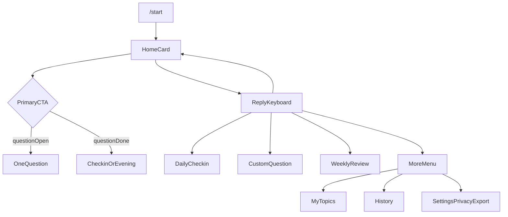

# بازطراحی رابط رشدیار (فقط ربات)

محدودیت واقعی: در تلگرام/بله کارت سفید، progress ring و تایپوگرافی اپ وجود ندارد. حس «دستیار آرام» را با **پیام‌کارت ساخت‌یافته**، **یک CTA اصلی**، و **منوی پایدار ۴–۵ تایی** می‌سازیم. Mini App در این فاز نیست.

وضعیت فعلی در [`GrowthCompanionController.php`](app/Http/Controllers/GrowthCompanionController.php): خانه = تختهٔ ۶ موضوع + افزودن/حذف + تنظیمات با ۱۰+ دکمهٔ هم‌وزن. سؤال امروز دکمهٔ تنظیمات هم دارد. مرور هفته فقط شمارش است.



## اصل هدایت

در هر پیام حداکثر:

- ۱ اقدام اصلی (تمام‌عرض)
- ۲ اقدام ثانویه
- بقیه داخل «بیشتر» یا مرحلهٔ بعد

ناوبری پایدار با Reply Keyboard (الگوی موجود در [`MawkibFinderController`](app/Http/Controllers/MawkibFinderController.php)):

- امروز
- ثبت روزانه
- سؤال از دستیار
- مرور هفته
- بیشتر

Inline فقط برای انتخاب داخل همان مرحله (مقیاس حال، گزینه‌های سؤال، تأیید).

[`GrowthMessenger`](app/Interfaces/Services/GrowthMessenger.php) باید `parse_mode` (HTML) و `reply_keyboard` اختیاری بگیرد تا عنوان‌ها پررنگ شوند.

## دادهٔ شدنی برای کارت امروز

کارت «انرژی ۷/۱۰، خواب ۷ ساعت» امروز در DB نیست. یک ثبت روزانهٔ **۴ ضربه** اضافه می‌شود (migration additive، بدون FK به `bots`):

جدول `growth_daily_checkins`: `growth_profile_id`, `day_key` (تاریخ مرز ۳ صبح), `energy` 1–10, `mood` (کم/متوسط/خوب/عالی), `sleep_hours` nullable, `moved` bool, `focus_slugs` json nullable.

اگر چک‌این نباشد، خانه می‌گوید «هنوز ثبت نشده» و CTA همان ثبت روزانه است — عدد جعلی نشان داده نمی‌شود.

سؤال موضوعی فعلی متن آزاد می‌ماند؛ فقط **ثبت روزانه** و در صورت وجود `choices` روی قالب، سؤال روز چندگزینه‌ای می‌شود. استخراج گلوله‌ای جمع‌بندی هفته بدون LLM: خطوط غیرخالی / جمله‌ها؛ دکمهٔ «متن کامل» با `gc:ft:{id}`.

---

## ۱. خانه / امروز

**سلسله‌مراتب**

1. تاریخ روز (چهارشنبه)
2. وضعیت ثبت‌شده (یا جای خالی صادقانه)
3. پیشرفت هفته در ۳ خط + نوار یونیکد `▰▰▰▱▱▱▱`
4. قدم بعدی (یک جمله)
5. CTA اصلی
6. کیبورد پایدار

**وایر فریم پیام**

```
امروز — چهارشنبه

انرژی ۷/۱۰ · حال خوب
خواب ۷ ساعت · ورزش انجام شد
تمرکز: سلامت، کار

این هفته  ۵ از ۷  ▰▰▰▰▰▱▱

قدم بعدی
پاسخ به سؤال سلامت

[ پاسخ به سؤال امروز ]
```

اگر سؤال روز تمام شده: `✓ سؤال امروز تکمیل شد` و CTA = «ثبت جمع‌بندی شب» (یا اگر چک‌این ناقص است همان «ثبت روزانه»).

Inline روی خانه: فقط CTA اصلی. افزودن/حذف موضوع اینجا نیست.

## ۲. ثبت روزانه

چهار قدم پشت سر هم؛ هر کدام ۱ سؤال + ۴ دکمه، بدون منوی تنظیمات.

1. حال عمومی: خیلی کم / متوسط / خوب / عالی
2. انرژی: ۳ / ۵ / ۷ / ۹ (برچسب نه فرم عددی شلوغ)
3. خواب: کمتر از ۶ / حدود ۷ / ۸ یا بیشتر / رد
4. حرکت: انجام شد / نه / رد

بعد از هر انتخاب: toast یا خط `✓ ثبت شد` و همان پیام ویرایش/ارسال قدم بعد. در پایان → خانهٔ به‌روز.

## ۳. سؤال امروز

یک کارت، یک سؤال، حداکثر ۴ گزینه یا «بنویس».

```
سؤال امروز · سلامت

امروز بدنت چقدر حرکت کرد؟

[ خیلی کم ]
[ متوسط ]
[ خوب ]
[ عالی ]
[ بعداً ]
```

`Settings` از این صفحه حذف شود. بعد از پاسخ: ack کوتاه + خانه یا سؤال بعدی فقط اگر بودجهٔ شدت هنوز جا دارد (همان منطق فاز ۲).

تختهٔ ۶ چک‌باکس به «موضوعات من» در بیشتر منتقل می‌شود؛ خانه دیگر ۶ دکمهٔ هم‌وزن نیست. CTA خانه اولین موضوعِ باز را باز می‌کند.

## ۴. مرور هفته

یک پیام ساخت‌یافته از پاسخ‌ها + چک‌این‌های هفته (زبان محتاط، بدون تشخیص):

- بردها (موضوعات تکمیل‌شده / روزهای ثبت)
- چالش‌ها (موضوعات بازمانده)
- چیزهایی که نوشتم (گلوله‌های کوتاه از متن‌ها)
- تمرکز هفتهٔ بعد (حداکثر ۳ اقدام: موضوعات باقی + یک پیشنهاد عملی از روی شکاف، مثلاً «۳ شب خواب را ثبت کن»)

CTA اصلی: «ثبت جمع‌بندی» (متن آزاد). ثانویه: «خانه». بعد از متن طولانی: کارت گلوله‌ای + «مشاهده متن کامل» نه تکرار کل متن.

## ۵. سؤال از دستیار

همان `gc:cq` فعلی؛ صفحه فقط می‌پرسد «چه سؤالی از خودت بپرسم؟» + بعداً. بدون دکمهٔ حریم/خروجی.

## ۶. موضوعات و اهداف

زیر «بیشتر» → موضوعات من: تختهٔ فعلی ☐/✅ + افزودن/حذف + آهنگ روزانه/هفتگی. اینجا جای مدیریت است نه خانه.

## ۷. تاریخچه

۱۰ مورد اخیر: تاریخ + موضوع + یک خط. ضربه → متن کامل همان پاسخ. بدون JSON خام.

## ۸. بیشتر / تنظیمات

فقط لیست کوتاه:

- موضوعات من
- تاریخچه
- خروجی داده
- حریم خصوصی
- شدت سؤال (کم/متعادل/زیاد)
- توقف / ادامه یادآوری

حالت پیشرفته، روزهای هفته، واریانت AI پشت «پیشرفته» داخل همین منو می‌مانند تا خانه شلوغ نشود.

---

## نگاشت callback (کوتاه بماند)

| اقدام | کد |
|---|---|
| خانه | `gc:home` |
| ثبت روزانه قدم n | `gc:in:m` `gc:in:e` `gc:in:s` `gc:in:v` |
| سؤال بعدی باز | `gc:q` |
| جمع‌بندی شب | `gc:eve` |
| بیشتر | `gc:more` |
| تاریخچه | `gc:hist` |
| متن کامل | `gc:ft:{id}` |

Reply keyboard متن‌ها باید با handler متن (`امروز` و غیره) در [`handlePrivateMessage`](app/Http/Controllers/GrowthCompanionController.php) جور شوند؛ locale از `language_code` ربات.

## تست و مستندات

- SQLite همان [`UsesGrowthCompanionSqlite`](tests/UsesGrowthCompanionSqlite.php)؛ هلپر شمارش سؤال باید با پیشوند `today + \\n\\n` بماند (باگ قبلی «امروز» داخل عنوان تخته).
- فیچر: خانه بدون ۶ دکمهٔ موضوع؛ بعد از سؤال فقط ۱ CTA؛ چک‌این ۴ قدم؛ بیشتر شامل خروجی/حریم؛ `/start` دوم سؤال نمی‌فرستد.
- ۱۵ زبان برای کلیدهای جدید؛ [`docs/features/GROWTH_COMPANION.md`](docs/features/GROWTH_COMPANION.md) به‌روز شود.
- سیدر قالب‌ها دست نخورده می‌ماند.
