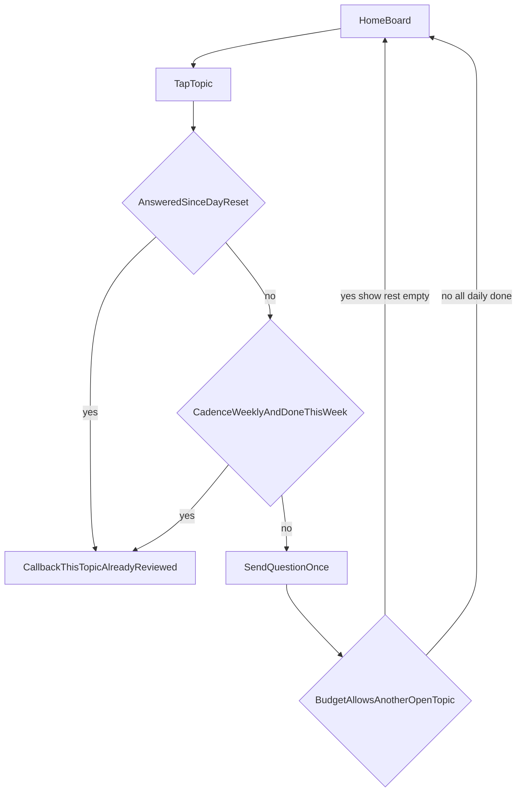

# فاز ۲ رشدیار — تختهٔ روزانه و تکمیل نسخه

## پلن قبلی کجاست

سه لایه از قبل وجود دارد؛ این فایل جدید **ادامهٔ اجرا** است، نه بازنویسی آن‌ها:

- محصول / معماری / شواهد: [.cursor/plans/growth_companion_plan_07fb98d6.plan.md](.cursor/plans/growth_companion_plan_07fb98d6.plan.md)
- فازبندی ۳۱ بخشی: [IMPLEMENTATION_PLAN.md](IMPLEMENTATION_PLAN.md) بخش ۲۶ — فاز ۱ انجام شده؛ فاز ۲ اصلی هنوز پیاده نشده
- رفتار فعلی MVP: [docs/features/GROWTH_COMPANION.md](docs/features/GROWTH_COMPANION.md)

**فاز ۱ (موجود):** آنبوردینگ یک موضوع، یک برنامه، یک سؤال روزانه، پاسخ، توقف/فرکانس/حذف، Simple Mode، `growth:dispatch-due`.

**شکاف واقعی امروز (علت تکرار و بی‌اثر بودن تنظیمات):**

- [`completeOnboarding`](app/Services/GrowthCompanionServiceImpl.php) بقیهٔ برنامه‌ها را `paused` می‌کند و فقط **یک** برنامه می‌سازد؛ انتخاب دوبارهٔ دسته یعنی جایگزینی، نه افزودن.
- [`handleStart`](app/Services/GrowthCompanionServiceImpl.php) اگر کاربر onboard شده باشد دوباره `sendCurrentQuestion()` می‌زند → همان جمله تکرار می‌شود.
- `gc:ask` همیشه واریانت جدید می‌فرستد، حتی اگر همان موضوع همان روز پاسخ داده شده باشد.
- شدت (`minimal` / `balanced` / `active`) فقط روی `frequency` و `interaction_budget` برنامه نوشته می‌شود؛ دیسپچر بودجه را برای **رد ارسال زمان‌بندی** چک می‌کند، نه برای صفحهٔ چت. در چت `/start` و دکمهٔ شیشه‌ای همیشه یک سؤال را دوباره صادر می‌کنند → «کم سؤال / زیاد سؤال» از نظر کاربر فرقی ندارد.
- کیبورد فوکوس ثابت است (`FOCUSES`)؛ افزودن/حذف دسته وجود ندارد.

---

## فاز 2A — تختهٔ روزانه (اول اجرا شود)

هدف UX: هر روز حدود شش دکمهٔ شیشه‌ای؛ تیک‌نخورده در برابر تیک سبز؛ بعد از دیدن/پاسخ آن موضوع، **همان سؤال همان روز دوباره صادر نشود**.

### مدل داده (بدون FK به `bots` / `bot_users`)

Migration جدید nullable/additive:

- [`growth_profiles`](database/migrations/2026_08_17_200000_create_growth_companion_tables.php): `day_reset_hour` (tinyint، پیش‌فرض `3`)، اختیاری `board_style` فقط اگر لازم شد.
- جدول `growth_profile_topics` (یا استفاده از چند `growth_programs` فعال): `profile_id`, `template_slug`, `enabled`, `cadence` (`daily`|`weekly`), `sort_order`, `custom_label` nullable.
- «انجام‌شده امروز» از روی [`growth_responses.answered_at`](app/Models/GrowthResponse.php) نسبت به مرز روز محاسبه می‌شود — ستون جدا برای امروز لازم نیست مگر برای کش کیبورد.

**مرز روز:** ساعت `03:00` تقویم `Asia/Tehran` (یا `timezone` پروفایل). بعد از عبور از این ساعت، چک‌باکس‌های روزانه خالی می‌شوند. موضوعات `weekly` با مرز هفته ریست می‌شوند، نه هر روز.

**سیدر قالب‌ها:** [`GrowthCompanionTemplateSeeder`](database/seeders/GrowthCompanionTemplateSeeder.php) دست نخورده می‌ماند (کاتالوگ پیش‌فرض خوب است). تختهٔ پیش‌فرض کاربر: شش اسلاگ اول سیستم (`health`, `family`, `work`, `spirituality`, `study`, `self`)؛ `sport` و `relations` و سفارشی از «افزودن دسته».

### رفتار چت

- بعد از آنبوردینگ و در `/start` اگر onboard شده: **تخته** بفرست، نه تکرار سؤال جاری.
- دکمه‌ها: پیشوند تیک خالی در برابر تیک سبز + برچسب ترجمه (`growth_companion.focus.*`). پیامک تلگرام چک‌باکس بومی ندارد؛ با متن دکمه شبیه‌سازی می‌شود.
- ضربه روی موضوع **انجام‌شده امروز** (یا هفتگی انجام‌شده این هفته): فقط `answerCallbackQuery` با متن «این موضوع امروز بررسی شده» — **بدون** `send` سؤال. کیبورد همان پیام در صورت امکان با `editMessageReplyMarkup` به‌روز شود.
- ضربه روی موضوع باز: یک سؤال (واریانت) بفرست؛ پس از پاسخ، همان دکمه تیک بخورد.
- ردیف مدیریت: افزودن دسته | حذف دسته | تنظیمات.
- افزودن: قالب‌های سیستم که روی تخته نیستند + ورود برچسب سفارشی (سوال از کاتالوگ `custom` یا سؤال کاربر).
- حذف: `enabled=false` / pause برنامه — پاسخ‌های قبلی پاک نشوند.

### مسنجر

[`GrowthMessenger`](app/Interfaces/Services/GrowthMessenger.php) فعلاً فقط `send` و `answerCallback` دارد. اضافه شود: `editReplyMarkup(chatId, messageId, rows)` در [`TelegramGrowthMessenger`](app/Services/TelegramGrowthMessenger.php) و فیک تست. اگر بله `editMessageReplyMarkup` را پشتیبانی نکرد، کیبورد جدید با یک پیام کوتاه تخته دوباره ارسال شود (بدون تکرار متن سؤال).

Callbackها کوتاه بمانند (`gc:`، سقف ۶۴ بایت): مثلاً `gc:b:health` تخته، `gc:add`, `gc:del`, `gc:x:health` حذف.

### دیسپچر

[`GrowthDispatchDueCommand`](app/Console/Commands/GrowthDispatchDueCommand.php): برای هر موضوع due که **امروز پاسخ ندارد** ارسال کند؛ موضوع تیک‌خورده را skip کند. سقف ارسال در روز = بودجهٔ شدت (فاز 2B).

---

## فاز 2B — شدت سؤال واقعاً کار کند

نگاشت فعلی MVP گمراه‌کننده است (`minimal` → فرکانس هفتگی کل برنامه). جدا کردن دو محور:

- **شدت (کم / متعادل / زیاد):** سقف تعداد موضوعِ *باز* در همان روز.
  - کم: `1`
  - متعادل: `1`
  - زیاد: `2` یا `3` (قابل تنظیم روی پروفایل؛ پیش‌فرض `2`)
- **آهنگ هر موضوع:** روزانه در برابر هفتگی روی همان ردیف تخته (`gc:freq` از تنظیمات برنامه به تنظیمات موضوع منتقل شود).

اگر بودجه `1` است: بعد از پاسخ اول، بقیهٔ دکمه‌های روزانه یا قفل‌اند (تیک خالی می‌مانند ولی ضربه = «سهم امروز پر شده») یا فقط نمایش. اگر بودجه بیش از یک است: بقیهٔ تیک‌نخورده‌ها همان روز قابل ضربه‌اند — این همان «روال دیگر وقتی بیش از یک مورد باقی مانده». تنظیمات باید انتخاب فعلی شدت را نشان دهد و ذخیره کند؛ تست فیچر: `gc:i:min` در برابر `gc:i:act` رفتار تخته را عوض کند.

[`GrowthQuestionSelector`](app/Services/GrowthQuestionSelector.php) بدون تغییر قرارداد؛ انتخاب واریانت فقط وقتی موضوع *باز* است.

---

## فاز 2C — بقیهٔ فاز ۲ از IMPLEMENTATION_PLAN

بعد از 2A/2B، بدون دست زدن به هستهٔ تخته:

1. **چند برنامه همزمان** — همان چند `growth_programs` فعال پشت تخته (عملاً با 2A شروع می‌شود).
2. **مرور هفتگی داخل چت** — جمع پاسخ‌های هفته، دکمهٔ ثبت جمع‌بندی؛ جدول `growth_reviews` اگر هنوز خالی است.
3. **آهنگ سفارشی** — علاوه بر روزانه/هفتگی: روزهای هفته روی موضوع (JSON `weekdays` nullable).
4. **واریانت با LLM** — `LlmProvider` HTTP جدا (Guzzle)؛ **نه** `Prompt` / `AiLlm`. خروجی فقط واریانت سؤال؛ بدون تشخیص و موعظه. اگر کلید نبود، همان واریانت‌های سیدر.
5. **خروجی داده** — دستور یا دکمه: JSON/CSV پاسخ‌های همان `bot_user` (حق فراموشی از قبل هست).
6. **حالت پیشرفته** — پرامپت سیستم قالب + زمان چند اسلات؛ Simple پیش‌فرض می‌ماند.

فاز ۳ (فالوآپ تطبیقی، مرور ماهانه، embedding، سازندهٔ برنامه) و فاز ۴ (مارکت‌پلیس) خارج از این اجرا.

---

## قوانین پروژه که تغییر نمی‌کند

- Route: `POST /api/webhook-growth-companion`؛ `requires_token = true`
- کاربر: `chat_id + origin + bot_id` مثل Channel Poster
- وب‌هوک JSON `200`؛ `Log::info` نه `LogHelper`
- ترجمهٔ ۱۵ زبان برای کلیدهای جدید تخته/تیک/افزودن/حذف
- تست فقط SQLite (`UsesGrowthCompanionSqlite`)؛ PHP اگر در PATH نبود مثل قبل skip
- کاتالوگ README را دوباره ۳۸ نکنید مگر endpoint جدید اضافه شود — همین ربات است

مستندات: به‌روزرسانی [docs/features/GROWTH_COMPANION.md](docs/features/GROWTH_COMPANION.md) و یک زیربخش در [IMPLEMENTATION_PLAN.md](IMPLEMENTATION_PLAN.md) که فاز ۲A/2B/2C را تیک بزند. فایل پلن قدیمی `growth_companion_plan_07fb98d6` را بازنویسی نکنید.

---

## تست‌های حداقل 2A/2B

- آنبوردینگ → تخته با چند دکمه، نه ارسال فوری سؤال تکراری در `/start` دوم
- پاسخ موضوع A → دکمهٔ A تیک‌خورده؛ ضربهٔ دوباره → بدون پیام سؤال جدید
- بعد از `Carbon::setTestNow` عبور از 03:00 تهران → تیک‌ها خالی
- افزودن/حذف دسته روی تخته
- `active` اجازهٔ موضوع دوم همان روز؛ `minimal` موضوع دوم را همان روز باز نکند
- موضوع `weekly` بعد از پاسخ تا مرز هفته قفل بماند
