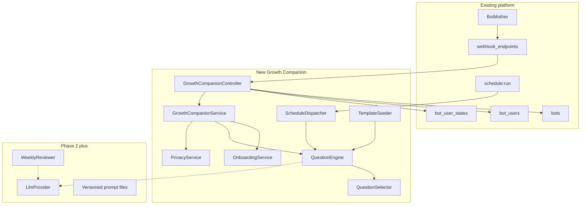
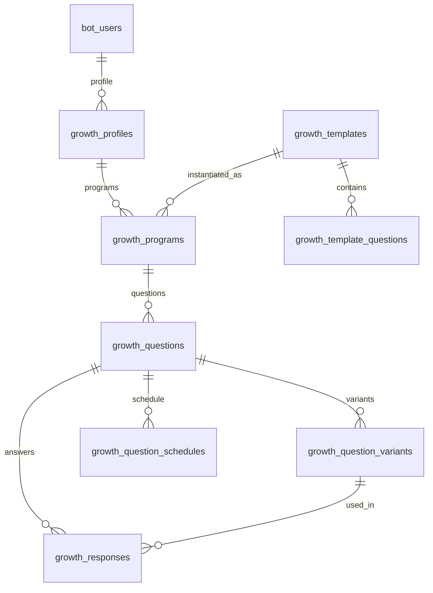

# Personal Growth Engine — Three-Layer Implementation Plan

Deliverable after approval: write [`IMPLEMENTATION_PLAN.md`](IMPLEMENTATION_PLAN.md) at the repo root.

No production code, migrations, routes, catalog edits, dependency installs, or refactors in this step.

The document has **three layers**. Layer 3 is a **gate**. Gap Analysis, architecture lock-in, and file lists are invalid until Layer 3 is completed with call graphs, not filename lists.

1. **Product Plan** — what we want to build
2. **Architecture Plan** — how it should be built (hypotheses until Layer 3 confirms)
3. **Codebase Evidence / Archaeology** — what the current code actually does, and where we must attach

**Planning safety rule:** `READ → TRACE → VERIFY → DOCUMENT → PLAN`

Do not modify production code, migrations, class names, existing bots, dead code, dependencies, or configuration during planning.

**Final planning question the document must answer:**

> Given the code that already exists and actually works in this repository, what is the smallest, safest, most maintainable change required to add Growth Companion?

Do not design as if starting from an empty Laravel project.

---

# Layer 1 — Product Plan

Unchanged product intent. Domain must not be hard-coded as spirituality. Core is a **Personal Growth and Reflection Engine**.

Display name candidate: رشدیار / Growth Companion. Alternatives remain open (مسیر، همراه، خودیار، رشد).

Core loop:

```text
User Goal → Program → Question → Response → Reflection → Pattern → Weekly Review → Adjustment → Next Question
```

UX: Simple by default, powerful when needed. Progressive complexity. Two modes (Simple / Advanced). Programs isolate life domains. Question identity is stable (`question_key`); text varies via variants.

MVP (Phase 1): onboarding, one program, one daily question, variants, response, pause/frequency/delete, Simple Mode.

Phase 2: multiple programs, weekly review, custom questions/frequency, AI variant generation.

Phase 3: adaptive follow-ups, monthly review, embeddings, program builder.

Phase 4 (explicitly later): marketplace, multi-bot product split, heavy analytics, gamification.

Do not build: social network, public chat, streak-as-product, autonomous agent, recommendation engine, extra dashboards.

---

# Layer 2 — Architecture Plan (HYPOTHESIS)

Everything in this layer is a **working hypothesis** from a first-pass repo scan. Layer 3 may confirm, adapt, or overturn it.

If the repository contradicts a hypothesis, **update the plan**. Do not preserve a false assumption.

## 2.1 First-pass platform sketch (unverified until call graphs exist)

Laravel 10 / PHP 8.1 bot generator. New bot types appear to be Bot Mother webhook endpoints.

Candidate reuse stack (must be verified with callers/callees):

- Webhook routes in [`routes/api.php`](routes/api.php) under `api` prefix
- Token resolution from query then [`Bot`](app/Models/Bot.php)
- Users via [`BotUsers`](app/Models/BotUsers.php) (`chat_id` + `origin`; JSON `settings`)
- Conversation via [`BotUserState`](app/Models/BotUserState.php)
- UX via [`BotHelper`](app/Helpers/BotHelper.php)
- i18n via `trans()` and 15 locales
- Scheduler via [`app/Console/Kernel.php`](app/Console/Kernel.php)
- Tests via SQLite trait like [`tests/UsesChannelPosterSqlite.php`](tests/UsesChannelPosterSqlite.php)
- MariaDB: prefer no FK to `bots` / `bot_users`

**Core-component rule (revised):**

Do **not** rewrite existing core components unless the repository audit proves that extension is unsafe or technically impossible. Prefer reuse and extension.

This includes Bot Mother, `Bot`, `BotUsers`, Mission AI catalog, Psychology Test, `Prompt`, `AiLlm`, Prayer Bot, Channel Poster, Weather alerts, and content delivery. If Layer 3 finds an existing abstraction that already fits, use it. If a candidate is dead code, do not build on it.

## 2.2 Proposed attachment (subject to Evidence Report)



Hypotheses to re-check:

- New Bot Mother endpoint `webhook-growth-companion` rather than a first-party-only bot
- New `growth_*` tables rather than stuffing domain into `bot_users.settings`
- New `growth:dispatch-due` **inside** existing `Kernel.php` / `schedule:run`, not a second scheduler
- MVP without live LLM; AI ports stubbed
- Do not overload `prompts` / `ai_llms` / `psychology_test_*` **unless Layer 3 shows they already are the right abstraction**
- Owner does not see end-user reflections
- Callback namespace `gc:` if no collision with existing prefixes

## 2.3 Domain model hypothesis (MVP)



Defer Area / Goal / Habit / Metric / Review / embeddings unless audit finds an existing table that already models them.

## 2.4 UX / schedule / AI / privacy hypotheses

Onboarding via `BotUserState`. Simple Mode: Answer / Later / Settings only.

Dispatcher candidate: `growth:dispatch-due` every 5 minutes, `withoutOverlapping` + `onOneServer`, timezone + quiet hours + interaction budget.

AI candidate: Guzzle `LlmProvider` + `resources/growth_prompts/{name}.v1.md`. Overturn this if Layer 3 finds a real LLM HTTP client.

Privacy MVP: pause / delete program / delete reflections / delete my growth data. No response-text logging.

---

# Layer 3 — Codebase Discovery and Existing Implementation Audit (MANDATORY GATE)

This section runs **before Gap Analysis**. Filename search is not sufficient.

**Objective:** understand which code actually works, which paths are live, what to reuse/extend, what is obsolete, which pattern is the reference implementation, and which Layer 2 assumptions the codebase contradicts.

Do not delete or modify anything based on classification.

## 3.1 Repository map

Map by **runtime role**, following imports, routes, bindings, and references — not folder names:

- Controllers, Services, Models, Repositories, Routes
- Console Commands, Scheduled Jobs, Migrations, Seeders
- Helpers, Middleware, Language files, Configuration, Tests
- Bot implementations, AI-related components

For each important directory: architectural role in one sentence.

## 3.2 Trace at least three closest bots (call graph required)

Preferred targets:

1. Channel Poster
2. Prayer Bot
3. Weather Alert **or** another bot with scheduled per-user delivery (content hourly delivery is a valid fourth if closer)

For each bot, document the **complete execution path with class + method**, not filenames:

```text
Telegram/Bale Update
    ↓
Route (file + route string)
    ↓
Controller::method()
    ↓
Bot resolution (exact method)
    ↓
BotUsers::method()
    ↓
BotUserState::method()  (if used)
    ↓
Service::method()
    ↓
Business logic callees
    ↓
BotHelper / Telegram API method
    ↓
Database tables written/read
```

For every important hop record:

- class
- method
- caller
- callee
- database tables
- state transitions
- external APIs
- scheduler interaction (if any)

Example quality bar (must be filled with **real** names after tracing):

```text
Telegram Update
 ↓
routes/api.php  POST /webhook-channel-poster
 ↓
ChannelPosterBotController::webhook()
 ↓
ChannelPosterBotController::resolveBotAndToken()   (or actual method name)
 ↓
BotUsers::firstOrNew()
 ↓
ChannelPosterBotService::<actual method>
 ↓
BotHelper::<actual method>
 ↓
Telegram API
```

Do not write `Bot::createBotInstance()` unless that method actually exists on `Bot`. Trace the real resolver.

## 3.3 Runtime verification and classification

Verify reachability via: route references, method calls, DI bindings, command registration, scheduler registration, service provider bindings, model relationships, tests, seeders, config.

Classify each discovered component:

- ACTIVE / USED
- PARTIALLY USED
- LEGACY
- UNUSED / DEAD
- UNKNOWN

## 3.4 Real reuse map

For every proposed Growth Companion component, name the closest existing implementation and strategy: Reuse / Adapt / Extend / Refactor / New.

Required rows (expand after tracing):

- Webhook Controller
- Bot resolution / token
- Bot user handling
- Conversation state
- Keyboard UX
- Localization
- Scheduler / per-user dispatch
- Weekly report (if any)
- Settings JSON vs dedicated tables
- Tests
- Endpoint seeder / catalog registration
- Privacy / delete-data (if any)

Principle: **Reuse → Adapt → Extend → Refactor → New code only when necessary.**

In [`IMPLEMENTATION_PLAN.md`](IMPLEMENTATION_PLAN.md) this must appear as a markdown table.

## 3.5 Database audit

Before designing `growth_*`, inspect `bots`, `bot_users`, state tables, scheduling tables, content tables, preference structures, JSON settings.

Document:

- what must be reused
- what must remain isolated
- what should be new
- any proposed field that already exists elsewhere (do not duplicate stable concepts)

## 3.6 Scheduler audit (call graph required)

```text
Kernel.php::schedule()
 ↓
Command or Job (class + signature)
 ↓
Query (model/scope)
 ↓
User / alert / queue selection
 ↓
Message delivery (helper + API)
 ↓
Status / next-run update
```

Record: timezone assumptions, locking, overlap protection, queue driver, retry, failure handling, batch size, logging, throttling.

Then compare with proposed `growth:dispatch-due`. Do **not** invent a second scheduling architecture if `schedule:run` can safely host the new command.

Trace at least:

- [`CheckWeatherAlertsJob`](app/Jobs/CheckWeatherAlertsJob.php)
- [`SendPrayerWeeklyReports`](app/Console/Commands/SendPrayerWeeklyReports.php)
- [`ScheduleContentDelivery`](app/Console/Commands/ScheduleContentDelivery.php)

## 3.7 Telegram / Bale UX audit

Inspect: inline vs reply keyboards, callback data, conversation state, localization, message editing, pagination, commands, error handling.

Record limitations: Telegram callback_data 64-byte limit, existing callback namespaces (`bl:`, `gc:` collision check, `alert_delete_`, Channel Poster prefixes).

## 3.8 AI / LLM audit

Search the whole repo for: OpenAI, Anthropic, Gemini, LLM, AI, prompt, completion, chat completion, embeddings, vector, semantic similarity, HTTP calls to AI providers.

Do not assume missing SDK means missing AI. Check HTTP clients, abstractions, prompt storage, env vars, retries, logging.

If `AiLlm` is only a catalog and `Prompt` is only mission copy-paste text, document that distinction **with evidence** (callers that never hit an LLM API). Overturn the "no LLM" hypothesis if an HTTP LLM client exists.

## 3.9 Test audit

Identify conventions actually used: PHPUnit vs Pest, SQLite traits vs `phpunit.xml` MySQL test DB, factories, RefreshDatabase, webhook tests, command tests, fakes.

Name the closest tests Growth Companion must copy (likely Channel Poster webhook + SQLite trait). Do not invent a new test architecture unless necessary.

## 3.10 Dead code / duplicate logic → TECHNICAL_DEBT

Look for duplicated Telegram handling, keyboards, state, scheduler, user settings, obsolete bots, unused services/models, duplicate prompt systems.

Do not refactor during planning. Record: location, evidence, severity, whether Growth Companion would depend on it.

## 3.11 Do not trust this Cursor plan blindly

The existing implementation plan is a hypothesis. The repository is the source of truth.

Examples:

- If the plan says there is no LLM integration but an HTTP LLM service exists, report the actual implementation.
- If a reusable-looking component is dead, do not base the new architecture on it.
- If `createBotInstance` lives on the controller, not `Bot`, the call graph must say so.

## 3.12 Codebase Evidence Report (required section in IMPLEMENTATION_PLAN.md)

### A. Confirmed Existing Architecture

Only facts verified from code.

### B. Confirmed Reusable Components

Actual classes and methods.

### C. Existing Working Flows

At least three end-to-end call graphs.

### D. Existing Technical Debt

Relevant, not necessarily blocking.

### E. Confirmed Missing Capabilities

Only absences remaining after inspection.

### F. Architecture Conflicts

Where proposed Growth Companion design conflicts with the codebase.

### G. Recommended Reuse Map

Direct mapping existing → proposed.

### H. Confidence Level

For every major conclusion: HIGH (directly verified) / MEDIUM (inferred from tests/references) / LOW (assumption).

---

# Gap Analysis (only after Layer 3)

Replace first-pass absences with **confirmed** missing capabilities from Evidence Report section E.

First-pass candidates to re-verify (do not copy into the final plan if contradicted):

- Habit / journal / reflection / program domain
- Generative LLM API vs catalog-only `AiLlm`
- Embeddings
- Per-user timezone
- Dynamic per-question scheduler with quiet hours
- Privacy export / delete-my-data
- Versioned LLM system prompts

---

# IMPLEMENTATION_PLAN.md required structure

Keep the original 31 sections, but **prefix** them with the three layers:

0. How to read this document (Product / Architecture / Evidence)
1–6. Current Architecture through Gap Analysis — **Evidence-backed**, including full Codebase Evidence Report and call graphs before Gap Analysis
7–31. Proposed architecture through Open Questions — updated if Layer 3 overturned hypotheses

Also include at the end:

- Architecture diagram
- ER diagram
- User flows
- Implementation phases with files, DB, API, Telegram, AI, tests, acceptance criteria
- Risk register
- Prioritized open questions

Phases remain:

- Phase 1 MVP core loop
- Phase 2 flexibility + light AI
- Phase 3 adaptive
- Phase 4 later

Open questions stay (name, Bot Mother vs first-party, LLM vendor, owner aggregates, spiritual template review, default timezone) and may gain new ones from the audit.

## This step only

1. Perform Layer 3 archaeology with real call graphs.
2. Write [`IMPLEMENTATION_PLAN.md`](IMPLEMENTATION_PLAN.md).
3. If code contradicts Layer 2, change Layer 2 in that file. Do not implement the bot.
