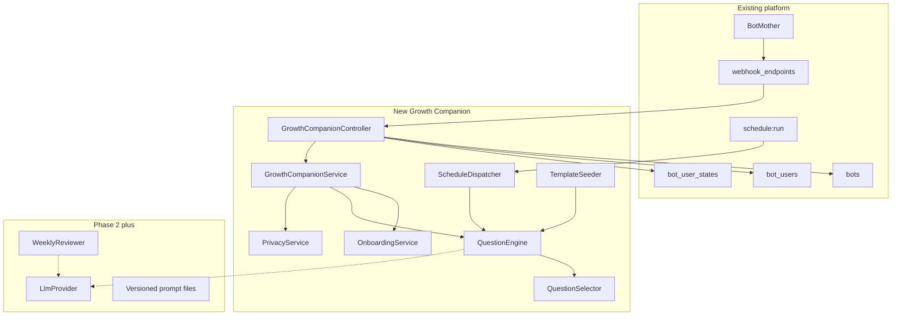
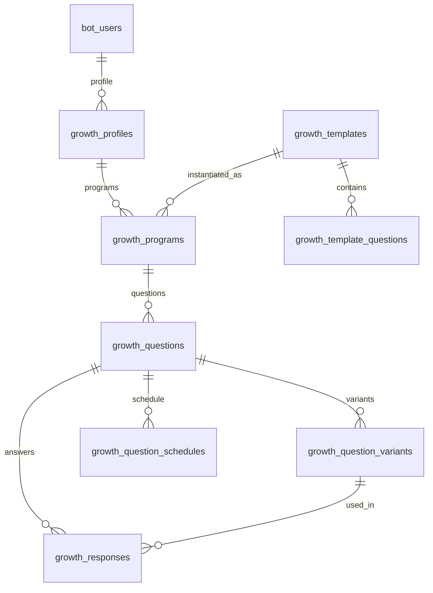

# Personal Growth Engine — Implementation Plan

Deliverable after approval: write [`IMPLEMENTATION_PLAN.md`](IMPLEMENTATION_PLAN.md) at the repo root with all 31 requested sections. No production code, migrations, routes, or catalog edits in this step.

## What the repo already is

Laravel 10 / PHP 8.1 bot generator. New bot types are **Bot Mother webhook endpoints**, not standalone apps.

Reuse this stack (Channel Poster / Prayer Bot pattern):

- Webhook: [`routes/api.php`](routes/api.php) under `api` prefix → effective `/api/webhook-*`
- Token from query, then [`Bot`](app/Models/Bot.php) (`createBotInstance`)
- Users: [`BotUsers`](app/Models/BotUsers.php) (`chat_id` + `origin`; JSON `settings`)
- Conversation: [`BotUserState`](app/Models/BotUserState.php)
- UX: inline + reply keyboards via [`BotHelper`](app/Helpers/BotHelper.php)
- i18n: `trans()` in a dedicated `lang/*/growth_companion.php` (15 locales)
- Scheduler: [`app/Console/Kernel.php`](app/Console/Kernel.php) + `php artisan schedule:run`
- Tests: SQLite `:memory:` trait like [`tests/UsesChannelPosterSqlite.php`](tests/UsesChannelPosterSqlite.php)
- MariaDB: **no FK** to `bots` / `bot_users` ([`.cursor/rules/database-migrations.mdc`](.cursor/rules/database-migrations.mdc))

Do **not** rewrite Bot Mother, `Bot`, `BotUsers`, Mission AI catalog, or Psychology Test.

## Gap analysis (explicit absences)

These do **not** exist today and must be new:

- Habit / journal / reflection / program / growth domain
- Generative LLM API (no OpenAI/Anthropic/Gemini SDK; [`AiLlm`](app/Models/AiLlm.php) is an **external tool catalog**; [`Prompt`](app/Models/Prompt.php) is copy-paste mission text)
- Embeddings / semantic similarity
- Per-user timezone (app default UTC; weather hardcodes `Asia/Tehran`)
- Dynamic per-question scheduler with quiet hours
- Privacy export/delete-my-data
- Prompt versioning for LLM system prompts (`prompts/` directory does not exist)

Closest analogs to **extend conceptually**, not reuse as schema:

- Prayer Bot: daily records + weekly report cadence
- Weather alerts: per-user `time_hour` + `is_active`
- Psychology Test: static questions (scored test — wrong model for reflection)
- Hourly content delivery: batch dispatcher pattern

## Locked product/architecture decisions

- **One Bot Mother type + many Programs per end-user.** Multi-bot later = more Bot Mother instances (already supported). Do not hard-code spirituality.
- **Display name:** رشدیار / Growth Companion. Technical: `endpoint_id = webhook-growth-companion`, tables `growth_*`, locale file `growth_companion.php`.
- **Platforms in MVP:** Telegram + Bale (same `Telegram` class + `origin`). Gap/Eitaa out of scope.
- **MVP has no live LLM.** Question variants are seeded. AI interfaces exist as stubs so Phase 2 does not rewrite the core.
- **Do not overload** `prompts`, `ai_llms`, or `psychology_test_*`.
- **Owner privacy default:** Bot Mother owner does **not** see end-user reflections.
- **Core loop only:** Question → Response → (later) Review → Adjustment. No social, marketplace, streaks-as-product, autonomous agent.

## Proposed architecture

Layers:

- Controller: webhook parse, keyboards, locale, token — same as [`ChannelPosterBotController`](app/Http/Controllers/ChannelPosterBotController.php)
- Domain services: Program, Question, Schedule, Response — **no LLM inside**
- AI ports (stub in MVP): `LlmProvider`, `QuestionGenerator`, `QuestionRewriter`, `FollowUpGenerator`, `ProgramBuilder`, `WeeklyReviewer`

## Domain model (MVP vs later)

MVP (implement later, document now):

- `growth_profiles`: mode (`simple`/`advanced`), tone, timezone, notify_time, quiet_hours, depth (`quick`/`reflective`/`deep`), interaction_budget, onboarding flags. Indexed `bot_user_id` + `bot_id`, **no FK**.
- `growth_programs`: name, status (`active`/`paused`/`deleted`), template_slug, settings JSON, budget.
- `growth_questions`: stable `question_key`, intent, domain, difficulty 1–5, frequency, `paused_at`, source (`template`/`user`/`ai`).
- `growth_question_variants`: text, locale, tone, difficulty; selection prefers unused variants.
- `growth_question_schedules`: cadence (`daily`/`weekly`/`monthly`/`custom`/`paused`), `days_of_week`, `time_local`, `next_due_at`, `last_sent_at`.
- `growth_responses`: text, variant_id, answered_at.
- `growth_templates` + `growth_template_questions`: system templates (spiritual + secular) as **data**, not PHP conditionals.

Defer to Phase 2/3: Area, Goal, Habit, Metric, Review, AIInteraction, UserFeedback, embeddings. MVP stores “reflection” as the response itself.

## Telegram UX (MVP)

**Onboarding (short, conversational, `BotUserState`):**

1. `/start` → one line: what do you want to work on? (health, family, work, spirituality, study, self-knowledge, sport, relationships, custom)
2. How often? (minimal / balanced / active)
3. Optional: time of day (skip = 21:00 in profile timezone; default timezone `Asia/Tehran` until user sets it)
4. Instantiate **one Program** from the matching template + 1 daily question + 3–10 variants
5. Ask the first question immediately

**Simple Mode daily:**

- Message: today’s question
- Buttons: Answer / Later / Settings
- After answer: short ack, no extra questions, no customization nags
- Settings: pause, frequency (daily/weekly), time, switch to Advanced, delete program / delete my data

**Advanced Mode (hidden until chosen):** add/edit/pause question, custom question, tone, extra program — Phase 2 UI, but settings schema ready.

Callback namespace: `gc:` (growth companion), same style as Book Library `bl:`.

## Scheduling

New command `growth:dispatch-due` every 5 minutes in [`Kernel.php`](app/Console/Kernel.php), `withoutOverlapping` + `onOneServer`.

Dispatcher:

1. Find schedules where `next_due_at <= now()` and program/question/profile active
2. Honor quiet hours + interaction budget (Simple Mode: max 1 prompt/day)
3. Select variant (anti-repeat: exclude variants used in last 30 days; no embeddings in MVP)
4. Send; set `last_sent_at`; compute next `next_due_at` in user timezone
5. Reminder tone: human, non-judgmental (`trans` keys). One gentle nudge, not spam.

Do not reuse WeatherAlert schema; it has no timezone and is alert-threshold based.

## AI / prompts (document now, code in Phase 2)

- New `LlmProvider` interface + HTTP adapter (Guzzle already in composer). No new SDK in MVP.
- Prompts as versioned files: `resources/growth_prompts/{name}.v1.md` — **do not** use table `prompts`.
- Guardrails in prompt + post-check: keep intent, no diagnosis, no preacher/judge, no medical claims.
- Pipeline (Phase 2): concept → candidates → exact-repeat check → save. Semantic duplicate = Phase 3 embeddings.

## Privacy / analytics

MVP: `/privacy` or Settings → pause program, delete program, delete all reflections, delete all my growth data. Log only bot_id / event type, not response text.

Phase 2: export JSON to chat/file. AI-data-usage toggle.

Analytics (aggregate, no response bodies): activation, first response, daily/weekly retention, completion rate, notification response rate. Can later hook [`config/observability.php`](config/observability.php) counters — not a Grafana project in MVP.

## Testing / migration / catalog (when implementing, not now)

- Trait `UsesGrowthCompanionSqlite` + webhook feature tests + unit tests for selector/scheduler/budget
- One feature migration creating all `growth_*` tables; internal FKs OK; `bot_id`/`bot_user_id` index only; `down()` required; nullable alters if touching existing tables (prefer **not** altering `bot_users`)
- Register like Channel Poster: controller, service bind in [`AppServiceProvider`](app/Providers/AppServiceProvider.php), route, seeder, [`WebhookEndpointDefaultImporter`](app/Services/WebhookEndpointDefaultImporter.php), catalog 36→37 in README / BOT_TYPES_GUIDE / BOTS_COMPLETE_GUIDE / README_LEGACY / docs/README / `.agents/AGENTS.md`
- Cron row in README Cron Jobs section
- `docs/features/GROWTH_COMPANION.md`

## Phases and acceptance

**Phase 1 MVP — Core Loop**

Goal: start → pick focus → get one daily question → answer → pause/frequency/delete.

Files (when coding): `GrowthCompanionController`, `GrowthCompanionServiceImpl`, models, migration, seeder, `growth:dispatch-due`, `lang/*/growth_companion.php`, tests, catalog docs.

Acceptance: `/start`, onboarding creates one program, receive and answer a question, daily dispatch, change frequency, pause question, add custom question (simple text), delete program, delete my data. Simple Mode shows no advanced buttons. Domain is not hard-coded as religion.

**Phase 2 — Flexibility + light AI**

Multiple programs, weekly review, custom frequency (weekdays / every 2 weeks), AI variant generation with intent lock, user feedback loop, export data, Advanced Mode UI.

**Phase 3 — Adaptive**

Follow-ups (Reflective/Deep), monthly review, semantic anti-repeat, program builder, metrics/habits, progressive difficulty.

**Phase 4 — out of MVP on purpose**

Template marketplace, multi-bot product split, heavy analytics, gamification.

## Risks

- **Technical:** MariaDB FK errno 150; `schedule:run` + `QUEUE_CONNECTION=sync`; timezone math; webhook 64-byte callback_data limit
- **Product:** over-onboarding; AI as preacher/therapist; owner reading private reflections
- **UX:** Telegram is a poor settings panel — keep Simple Mode tiny
- **AI:** intent drift; no provider in repo today
- **Privacy:** reflections are highly sensitive; default minimize logging

## Open questions (priority)

1. Confirm display name رشدیار vs مسیر / همراه / خودیار
2. Confirm Bot Mother catalog type vs a single first-party bot token
3. Phase 2 LLM: OpenAI-compatible HTTP vs a specific vendor
4. May the Bot Mother **owner** ever see anonymized aggregates? Default no.
5. Who reviews spiritual template wording (نماز، قرآن، نهج) so the engine stays non-sectarian in core?
6. Default timezone if user skips: `Asia/Tehran` vs UTC?

## This step only

Write [`IMPLEMENTATION_PLAN.md`](IMPLEMENTATION_PLAN.md) covering the 31 requested sections, with the diagrams and phase checklists above expanded. No feature implementation.