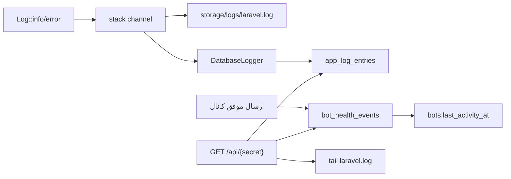

# نمایشگر لاگ سری و جدول سلامت ربات‌ها

این فاز فقط دو قسم انتخاب‌شده را می‌سازد: **نمایشگر لاگ** و **سلامت ربات**. اندپوینت‌های `/health` و `/metrics` (Prometheus/Grafana) و عیب‌یابی علت ده روز قطعی شراب بهشتی در فاز بعد می‌مانند.

## وضعیت فعلی (چرا این فیچر لازم است)

- لاگ فایل: [`config/logging.php`](config/logging.php) کانال `stack` → `single` است؛ همه چیز در `storage/logs/laravel.log` می‌رود و **viewer ندارد**.
- `bot_id` در فایل لاگ فقط گاهی در context بعضی کنترلرها هست؛ فیلتر «فقط بات ۵۳» از روی فایل قابل اعتماد نیست.
- جدول [`bot_logs`](app/Helpers/LogHelper.php) فقط پیام‌های ورودی وب‌هوک است، نه خطای کران/صف/ارسال کانال.
- ستون [`bots.last_activity_at`](database/migrations/2026_07_04_000001_add_last_activity_at_to_bots_table.php) وجود دارد ولی **هیچ کدی آن را به‌روز نمی‌کند**.
- شراب بهشتی دو مسیر ارسال دارد و هیچ‌کدام «اوکی بودن API» را در دیتابیس ذخیره نمی‌کنند:
  - متن روزانه: [`PostDailyVerseToChannels`](app/Console/Commands/PostDailyVerseToChannels.php) پاسخ `sendMessage` را چک نمی‌کند (فقط exception).
  - صوت RSS: [`RssPostItemTranslationToMessengerJob`](app/Jobs/RssPostItemTranslationToMessengerJob.php) لاگ می‌زند ولی صف را حتی در شکست جزئی `sent` می‌گذارد.



## 1) دو جدول جدید (بدون FK به `bots`)

طبق [`.cursor/rules/database-migrations.mdc`](.cursor/rules/database-migrations.mdc): `unsignedBigInteger` + `index`، بدون `foreign()`.

**`app_log_entries`** (آخرین N رکورد لاگ اپ، پیش‌فرض ۵۰۰۰):

- `level`, `message` (text), `bot_id` nullable + index
- `feature_key` nullable (مثلاً `sharabe_beheshti`, `daily-channel`)
- `context` json nullable
- `created_at` (ایندکس برای مرتب‌سازی)

**`bot_health_events`** (رویداد سلامت، نگهداشت حدود ۳۰ روز):

- `bot_id` nullable + index
- `feature_key` (مثلاً `sharabe_beheshti`)
- `platform` (`bale` / `telegram` / `eitaa`)
- `event_type` (`channel_post`)
- `status` (`ok` / `fail`)
- `message` nullable, `meta` json nullable
- `created_at`

اگر `bot_id` مشخص باشد، همان لحظه `bots.last_activity_at` هم به‌روز می‌شود (ستون موجود؛ migration جدید برای این فیلد لازم نیست).

## 2) نوشتن لاگ در دیتابیس بدون دست زدن به فایل فعلی

مسیر production فعلی (`single` → `laravel.log`) دست نمی‌خورد. کانال `stack` یک عضو دوم می‌گیرد:

```php
'stack' => ['channels' => ['single', 'database']],
```

کانال `database` یک Monolog custom handler است ([`app/Logging/DatabaseLogger.php`](app/Logging/DatabaseLogger.php)):

- `bot_id` را از context (`bot_id` / `botId`) می‌خواند؛ اگر نبود null می‌ماند.
- خود handler هرگز `Log::` صدا نمی‌زند (جلوگیری از حلقه).
- اگر جدول هنوز migrate نشده یا دیسک/DB پر است، silent fail.
- بعد از insert، اگر تعداد ردیف از سقف (`APP_LOG_MAX_ROWS`، پیش‌فرض ۵۰۰۰) بیشتر شد، قدیمی‌ها پاک می‌شوند.

فایل لاگ به‌عنوان پشتیبان در viewer با **tail از انتهای فایل** خوانده می‌شود (نه خواندن کل فایل؛ چون روی سرور پر ممکن است چند صد مگ باشد).

## 3) آدرس سری برای دیدن و کپی کردن

- کلید در env: `LOG_VIEWER_SECRET` (رشته خیلی طولانی؛ در `.env.example` فقط placeholder).
- اگر خالی باشد، route اصلاً ثبت نمی‌شود.
- مسیر جدید، جدا از وب‌هوک‌ها:

`GET /api/{LOG_VIEWER_SECRET}`

مثال:

`https://bots.pardisania.ir/api/kharid-naraftan-be-in-safhe-agar-ramz-nadari-a7f3c9e2...`

Query:

- `?bot_id=53` فقط لاگ همان بات
- `?limit=100` (پیش‌فرض ۱۰۰، سقف ۱۰۰۰)
- `?format=text` متن خام برای کپی مستقیم به Cursor
- `?source=db|file` منبع

صفحه Blade ساده (فارسی، بدون Nova):

- فیلتر bot_id بالا
- دکمه «کپی ۱۰۰ رکورد آخر»
- بخش سلامت: هر `feature_key` + `platform` با آخرین `ok`؛ اگر امروز باشد سبز، اگر کهنه باشد قرمز (مثلاً شراب بهشتی / بله / ۱۰ روز پیش).

توکن در کد commit نمی‌شود؛ فقط در `.env` سرور.

## 4) ثبت سلامت وقتی پست واقعاً اوکی شد

هلپر کوچک [`app/Services/BotHealthRecorder.php`](app/Services/BotHealthRecorder.php):

```php
BotHealthRecorder::record([
    'bot_id' => $botId, // nullable
    'feature_key' => 'sharabe_beheshti',
    'platform' => 'bale',
    'event_type' => 'channel_post',
    'status' => 'ok', // یا fail
    'meta' => ['config_id' => $config->id],
]);
```

هوک‌ها (side-by-side؛ منطق ارسال عوض نمی‌شود، فقط پاسخ API چک می‌شود):

- [`PostDailyVerseToChannels`](app/Console/Commands/PostDailyVerseToChannels.php): الان `BotHelper::sendMessageByChatId` را دور می‌اندازد. مقدار برگشتی را می‌گیریم؛ اگر `ok === true` برای `content_type === sharabe_beheshti` (یا sequential که نوبتش شراب است) یک رویداد `ok`، وگرنه `fail`. همین برای آیه/حدیث/نهج با `feature_key` مربوط.
- [`RssPostItemTranslationToMessengerJob`](app/Jobs/RssPostItemTranslationToMessengerJob.php): بعد از `sendAudio` برای `sharabebeheshti.ir`، اگر پاسخ اوکی بود `ok` ثبت شود. `bot_id` در صورت امکان از توکن کانال RSS روی جدول `bots` resolve می‌شود؛ اگر نشد null می‌ماند و فیلتر با `feature_key=sharabe_beheshti` + `platform` کار می‌کند.

`AdminDailyChannelConfig` فیلد `bot_id` ندارد؛ هویت سلامت شراب روزانه = `feature_key` + `platform` + `config_id` در `meta`.

## 5) نگهداری حجم (مربوط به پر شدن سرور)

- سقف ثابت روی `app_log_entries` (۵۰۰۰).
- prune روزانه `bot_health_events` قدیمی‌تر از ۳۰ روز در [`app/Console/Kernel.php`](app/Console/Kernel.php) با `withoutOverlapping`.
- فایل لاگ را در این فاز به `daily` عوض نمی‌کنیم (رفتار production دست نخورد). در مستند ذکر می‌شود که `LOG_CHANNEL=daily` جداگانه دیسک را کم می‌کند.

## 6) تست و مستند

تست‌ها فقط SQLite `:memory:`:

- بدون secret → ۴۰۴
- با secret → آخرین لاگ‌ها؛ `?bot_id=53` فقط همان بات
- `?format=text` متن قابل کپی
- `BotHealthRecorder` ردیف می‌سازد و `last_activity_at` را اگر `bot_id` باشد به‌روز می‌کند

مستند: [`docs/features/LOG_VIEWER_AND_BOT_HEALTH.md`](docs/features/LOG_VIEWER_AND_BOT_HEALTH.md) شامل URL، env، فیلتر، rollback (حذف route + drop جدول).

## خارج از این فاز

- `/health` جیسون و `/metrics` پرومته برای Grafana
- علت‌یابی قطعی فعلی شراب بهشتی (صف، کران `app:add_mp3_to_rss_for_sharabebeheshti`، پر بودن دیسک)

بعد از استقرار این فیچر، با فیلتر `feature_key=sharabe_beheshti` همان لحظه مشخص می‌شود آخرین `ok` کی بوده است.