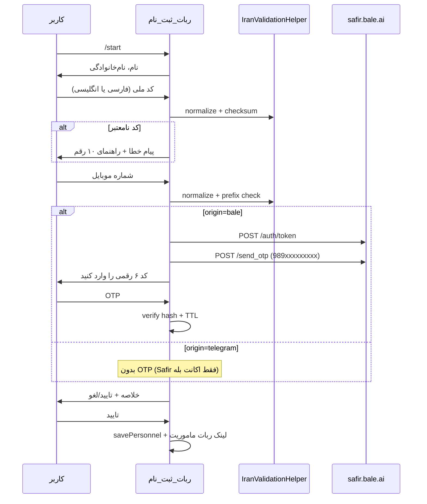

# پلن: ربات ثبت‌نام پرسنل v2 (کد ملی + موبایل + OTP بله)

## وضعیت فعلی

ربات ثبت‌نام در [`app/Http/Controllers/PersonnelRegistrationController.php`](app/Http/Controllers/PersonnelRegistrationController.php) با state machine در `bot_users.settings.registration_step` کار می‌کند:


**محدودیت‌های فعلی:**
- کد ملی: فقط `preg_replace('/[^0-9]/')` — ارقام فارسی/عربی (`۰۱۲۳...`) حذف می‌شوند و طول ≠ 10 می‌شود
- checksum کد ملی پیاده‌سازی نشده (الگوریتم در [`docs/الگوریتم صحت کد ملی.md`](docs/الگوریتم%20صحت%20کد%20ملی.md) مستند است)
- موبایل: فقط `^09[0-9]{9}$` — بدون محدودیت اپراتور و بدون OTP
- ماژول `BaleOtp` وجود ندارد (فقط در [`.cursor/plans/bot_owner_self-service_d60b6404.plan.md`](.cursor/plans/bot_owner_self-service_d60b6404.plan.md) طراحی شده)
- مستندات Safir OTP: [`docs/bale otp سامانه ارسال رمز یک‌بار مصرف (OTP).md`](docs/bale%20otp%20سامانه%20ارسال%20رمز%20یک%E2%80%8Cبار%20مصرف%20(OTP).md)

ربات ماموریت ([`MissionBotController`](app/Http/Controllers/MissionBotController.php)) فقط `personnel_id` از ثبت‌نام می‌گیرد — **تغییری در آن لازم نیست**.

---

## جریان پیشنهادی v2



**پیش‌فرض (کاربر سوالات را رد کرد):**
- OTP **فقط برای `origin=bale`** — Safir فقط به اکانت بله همان شماره OTP می‌فرستد
- تلگرام: اعتبارسنجی شماره + ادامه بدون OTP
- پیش‌شماره‌های مجاز (طبق درخواست شما + رایتل):

| اپراتور | پیش‌شماره‌های مجاز |
|---------|-------------------|
| همراه‌اول | `0912`, `0919` |
| ایرانسل | `0935`, `0936`, `0937`, `0938`, `0939` |
| رایتل | `0920`, `0921`, `0922` |

---

## معماری پیشنهادی

### ۱. Helper اعتبارسنجی ایران — `app/Helpers/IranValidationHelper.php`

کلاس جدید با متدهای static (قابل تست unit):

| متد | کار |
|-----|-----|
| `normalizeDigits(string $text): string` | تبدیل ارقام فارسی/عربی به انگلیسی (الگوی موجود در [`PrayerHelper::normalizePersianDigitsToEnglish`](app/Helpers/PrayerHelper.php) — **کپی منطق**، بدون وابستگی به PrayerHelper) |
| `validateNationalCode(string $input): ValidationResult` | normalize → pad به 10 رقم اگر 8–9 رقم (طبق مستند) → رد `0000000000` و ارقام تکراری → checksum → برگرداندن کد نرمال‌شده |
| `validateMobile(string $input): ValidationResult` | normalize → پذیرش `09...`, `9...`, `989...`, `+989...` → ذخیره به فرم `09xxxxxxxxx` → چک whitelist پیش‌شماره |
| `toSafirPhone(string $local09): string` | `09123456789` → `989123456789` |

**الگوریتم checksum** (از مستند):

```
sum = Σ digit[i] × (10 - i)  for i = 0..8
r = sum % 11
control = r < 2 ? r : 11 - r
valid ⟺ control == digit[9]
```

**پیام‌های خطای فارسی** (در helper یا کلیدهای lang):
- «کد ملی باید ۱۰ رقم باشد. می‌توانید با ارقام فارسی یا انگلیسی وارد کنید.»
- «کد ملی وارد‌شده طبق فرمول اعتبارسنجی صحیح نیست. لطفاً کد ملی معتبر وارد کنید.»
- «شماره موبایل باید متعلق به یکی از اپراتورهای مجاز (همراه‌اول ۰۹۱۲/۰۹۱۹، ایرانسل ۰۹۳۵–۰۹۳۹، رایتل ۰۹۲۰–۰۹۲۲) باشد.»

---

### ۲. ماژول BaleOtp (مشترک) — `app/Modules/BaleOtp/`

ساخت ماژول طبق طراحی [`bot_owner_self-service`](.cursor/plans/bot_owner_self-service_d60b6404.plan.md) — **قابل استفاده مجدد** برای ثبت‌نام پرسنل و بعداً پنل مالک ربات:

```
app/Modules/BaleOtp/
  Contracts/BaleOtpServiceInterface.php
  Services/BaleOtpAuthService.php      # POST /auth/token + cache JWT
  Services/BaleOtpSendService.php      # POST /send_otp
  Support/PhoneNormalizer.php          # → 989...
  Exceptions/BaleOtpException.php      # rate limit, no Bale account, payment
  BaleOtpServiceProvider.php
config/bale-otp.php
```

**Env جدید** (افزودن به [`.env.example`](.env.example)):

```env
BALE_SAFIR_CLIENT_ID=
BALE_SAFIR_CLIENT_SECRET=
BALE_SAFIR_BASE_URL=https://safir.bale.ai/api/v2
PERSONNEL_REGISTRATION_OTP_TTL=300
PERSONNEL_REGISTRATION_OTP_MAX_ATTEMPTS=5
PERSONNEL_REGISTRATION_OTP_RESEND_MAX=3
```

**مدیریت OTP در ثبت‌نام:** بدون migration جدید — ذخیره در `bot_users.settings`:

```json
{
  "otp_hash": "...",
  "otp_expires_at": "2026-06-13T12:00:00",
  "otp_attempts": 0,
  "otp_send_count": 1,
  "phone_verified": true
}
```

- OTP ۶ رقمی تولید سمت سرور → `hash('sha256', $otp)` ذخیره
- Safir همان OTP را به شماره می‌فرستد
- Rate limit: Safir ۳۰/ساعت per phone + throttle داخلی (`otp_send_count`)

**خطاهای Safir → پیام کاربر:**

| پاسخ API | پیام فارسی |
|----------|------------|
| `404` no Bale account | «این شماره در بله ثبت نشده. لطفاً شماره‌ای که با آن در بله فعال هستید وارد کنید.» |
| `402` payment required | «سرویس OTP موقتاً در دسترس نیست. با پشتیبانی تماس بگیرید.» |
| `400` rate limit | «تعداد درخواست OTP بیش از حد مجاز است. یک ساعت دیگر تلاش کنید.» |

---

### ۳. سرویس ثبت‌نام — `app/Services/PersonnelRegistrationService.php`

استخراج منطق validation و OTP از controller برای تست‌پذیری:

- `processNationalCode(BotUsers $user, string $text): StepResult`
- `processPhoneNumber(BotUsers $user, string $text, string $origin): StepResult`
- `sendOtp(BotUsers $user): StepResult`
- `verifyOtp(BotUsers $user, string $text): StepResult`
- `buildConfirmationMessage(array $data): string`

Controller فقط routing step + `BotHelper::sendMessage` باقی می‌ماند.

---

### ۴. تغییرات Controller

[`PersonnelRegistrationController.php`](app/Http/Controllers/PersonnelRegistrationController.php):

**Step جدید:** `waiting_otp` (فقط bale)

**Router در `index()`:**

```php
// بعد از waiting_phone_number
else if ($registrationStep == 'waiting_otp') {
    $this->handleOtpVerification(...);
}
// handlePhoneNumber: اگر bale → sendOtp + step=waiting_otp
//                    اگر telegram → step=confirming
```

**دستورات اضافی در step OTP:**
- `ارسال مجدد` / `/resend` — با محدودیت `otp_send_count`
- `لغو` — بازگشت به `handleStart`

**`savePersonnel()`:** اگر `origin=bale`، فقط در صورت `phone_verified=true` ذخیره کند.

---

### ۵. تست‌ها

| فایل | پوشش |
|------|------|
| `tests/Unit/Helpers/IranValidationHelperTest.php` | ارقام فارسی، checksum معتبر/نامعتبر، پیش‌شماره‌ها، normalize Safir |
| `tests/Unit/Modules/BaleOtp/PhoneNormalizerTest.php` | `0912...` → `98912...` |
| `tests/Unit/Modules/BaleOtp/BaleOtpAuthServiceTest.php` | HTTP mock token |
| `tests/Unit/Modules/BaleOtp/BaleOtpSendServiceTest.php` | HTTP mock send + خطاها |
| `tests/Unit/Services/PersonnelRegistrationServiceTest.php` | flow steps |
| `tests/Feature/PersonnelRegistrationV2Test.php` | webhook mock با `WebhookMockHelper` (اگر موجود) |

**نمونه کدهای تست کد ملی:** کد معتبر از seeder موجود (`1234567890` ممکن است checksum نداشته باشد — باید کد واقعاً valid در تست استفاده شود، مثلاً `0499370899` یا محاسبه در setUp).

---

### ۶. مستندات

به‌روزرسانی [`docs/features/personnel-registration.md`](docs/features/personnel-registration.md):
- flow v2 + diagram
- قوانین validation
- env Safir
- محدودیت OTP فقط بله
- لینک به [`docs/bale otp ...`](docs/bale%20otp%20سامانه%20ارسال%20رمز%20یک%E2%80%8Cبار%20مصرف%20(OTP).md)

---

## فازبندی پیاده‌سازی

### فاز ۱ — اعتبارسنجی (بدون OTP)
- `IranValidationHelper` + unit tests
- refactor `handleNationalCode` و `handlePhoneNumber` در controller/service
- پیام‌های خطای فارسی بهبود‌یافته

### فاز ۲ — ماژول BaleOtp
- config, provider, auth/send services, PhoneNormalizer
- bind در [`AppServiceProvider`](app/Providers/AppServiceProvider.php)
- unit tests با HTTP fake

### فاز ۳ — OTP در flow ثبت‌نام
- `PersonnelRegistrationService`
- step `waiting_otp` + resend + error handling
- env vars

### فاز ۴ — docs + feature test

---

## فایل‌های کلیدی

| فایل | تغییر |
|------|-------|
| [`PersonnelRegistrationController.php`](app/Http/Controllers/PersonnelRegistrationController.php) | steps جدید + delegate به service |
| `app/Helpers/IranValidationHelper.php` | **جدید** |
| `app/Services/PersonnelRegistrationService.php` | **جدید** |
| `app/Modules/BaleOtp/*` | **جدید** |
| [`AppServiceProvider.php`](app/Providers/AppServiceProvider.php) | register BaleOtp |
| [`.env.example`](.env.example) | Safir credentials |
| [`docs/features/personnel-registration.md`](docs/features/personnel-registration.md) | flow v2 |

**بدون تغییر:** [`MissionBotController`](app/Http/Controllers/MissionBotController.php), migration `personnel`, webhook route.

---

## ریسک‌ها

- **Safir credentials:** باید از سامانه درگاه بله (ربات OTP) `client_id` / `client_secret` دریافت شود
- **شماره بدون اکانت بله:** کاربر نمی‌تواند OTP بگیرد — پیام راهنما ضروری است
- **پیش‌شماره محدود:** اگر کاربر با 0910 (همراه‌اول) ثبت‌نام کند رد می‌شود — در صورت نیاز whitelist قابل گسترش است
- **Existing users mid-flow:** کاربرانی که در `waiting_phone_number` هستند بعد از deploy، step قدیمی را ادامه می‌دهند؛ OTP فقط برای session‌های جدید بعد از deploy اعمال می‌شود
