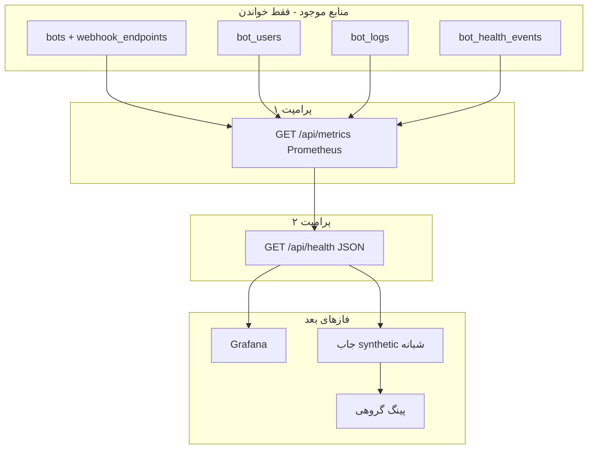

# متریک پرومته و هلث ربات‌ها

فاز قبلی ([نمایشگر لاگ](log_viewer_health_d7a1b855.plan.md)) لاگ و `bot_health_events` را ساخت. این فاز **سیگنال قابل کوئری** می‌سازد تا بفهمیم کدام اینستنس، روی کدام پلتفرم، از کار افتاده است.

Grafana هنوز ساخته نمی‌شود. اول متریک، بعد هلث جیسون، بعد گراف و آلرت.

## سه لایه هویت (لیبل‌ها)

«ربات احادیث» **تایپ** است (`endpoint_id`)، نه یک ردیف. ممکن است ۲۰ اینستنس از همان تایپ ساخته شود.

| لایه | منبع در پروژه | لیبل پرومته |
|---|---|---|
| تایپ / پرنت محصول | `webhook_endpoints.endpoint_id` + `name` | `endpoint_id`, `endpoint_name` |
| اینستنس پرنت | `bots.id` + `bale_bot_name` / `telegram_bot_name` | `bot_id`, `bot_name` |
| چایلد (Bot Mother) | `bot_kids.id` (+ token/type) | `child_bot_id`, `child_bot_name` — **فاز بعد**؛ الان خالی یا حذف |
| پلتفرم | بله / تلگرام / ایتا | `platform` |

اگر یک اینستنس حدیث کار کند، **کد تایپ** احتمالاً سالم است؛ ولی توکن، وب‌هوک، بلاک شدن، و صفر بودن یوزر per-instance است. برای همین هم `endpoint_id` لازم است هم `bot_id`.

کاردینالیتی الان: تعداد ربات‌های Active × پلتفرم (حدود ده‌ها تا صد سری). `child_bot_id` را فعلاً اضافه نکن مگر متریک جدا و opt-in باشد.

## چهار سیگنال (نه یک «سالم/خراب»)

مثال نهج‌البلاغه: پیام **می‌آید** ولی **نمی‌رود**. یک گیج باینری این را قاطی می‌کند.

1. **یوزر دارد؟** `bot_users` با `bot_id` + `origin`
2. **اینباند دارد؟** آخرین ردیف `bot_logs` با `bot_id` + `type` (bale/telegram)
3. **اوتباند موفق دارد؟** آخرین `bot_health_events` با `status=ok` برای همان `bot_id` + `platform`
4. **شکاف اینباند بدون اوتباند؟** اینباند تازه است، اوتباند کهنه یا fail است (کیس نهج)

سیگنال پنجم (فاز بعد): پروب مصنوعی — خودمان یک دستور را اجرا می‌کنیم چون ربات کم‌ترافیک (هواشناسی) ممکن است هفته‌ها اینباند نداشته باشد ولی زنده باشد.

## پرامپت ۱ — فقط `/metrics`

هدف: Prometheus بتواند scrape کند. Grafana وصل نمی‌شود.

- مسیر جدید side-by-side: `GET /api/metrics`
- اگر `METRICS_SECRET` خالی باشد route ثبت نشود (مثل log viewer)
- فرمت exposition پرومته (text/plain; version=0.0.4)
- بدون پکیج اجباری؛ یا `promphp/prometheus_client_php` اگر سبک ماند
- متریک‌ها از DB موجود **محاسبه** شوند (gauge لحظه‌ای). شمارندهٔ داخل هر کنترلر لازم نیست
- ربات جدید خودکار ظاهر شود (لوپ روی `bots` که Active هستند)
- کنترلرهای پروداکشن و منطق ارسال دست نخورند
- تست SQLite: چند ربات فیک، خروجی شامل لیبل `bot_id` و `endpoint_id`

متریک‌های پیشنهادی (همه با لیبل‌های بالا):

- `bot_info` = 1 (info metric برای نام‌ها)
- `bot_users_total`
- `bot_last_inbound_timestamp` (unix؛ ۰ یعنی هرگز)
- `bot_inbound_total` (اختیاری؛ اگر count سنگین است فقط ۲۴ساعت یا از خلاصه)
- `bot_last_outbound_ok_timestamp`
- `bot_last_outbound_fail_timestamp`
- `bot_webhook_is_set` (از `bale_webhook_is_set` / `telegram_webhook_is_set`)
- `bot_status_active` (Active=1)

کوئری نمونه PromQL بعداً (الان پیاده نمی‌شود):

- ربات بدون یوزر: `bot_users_total == 0`
- هیچ پیامی نیامده: `bot_last_inbound_timestamp == 0`
- اینباند هست اوتباند نیست: `bot_last_inbound_timestamp > bot_last_outbound_ok_timestamp`

## پرامپت ۲ — فقط `/health`

هدف: همان سیگنال‌ها برای انسان و کران، بدون Prometheus scrape و بدون Grafana.

- مسیر جدید: `GET /api/health` با همان secret جدا (`HEALTH_SECRET`) یا همان الگوی log viewer
- JSON: به ازای هر ربات × پلتفرم یک آبجکت با `endpoint_id`, `bot_id`, `bot_name`, `platform`, `users`, `last_inbound_at`, `last_outbound_ok_at`, `symptoms[]`
- symptoms نمونه: `no_users`, `no_inbound`, `inbound_without_outbound`, `webhook_not_set`, `deactive`
- دستور artisan `observability:health-report` که همان JSON را چاپ کند (برای کران بعدی)
- بدون ارسال پیام به گروه/کانال در این فاز
- بدون اجرای واقعی دستور ربات (synthetic) در این فاز
- تست SQLite روی symptoms

## خارج از این دو پرامپت (عمداً)

- Grafana datasource / dashboard / alert rule
- جاب شبانه که `/start` یا یک دستور را واقعاً اجرا کند و نتیجه را به ادمین بفرستد
- گذاشتن همه ربات‌ها در یک گروه و پینگ دسته جمعی (پرمیژن گروه + نویز پیام همدیگر)
- لیبل `child_bot_id` روی همه متریک‌ها
- عوض کردن رفتار وب‌هوک یا ارسال کانال
- علت‌یابی قطعی فعلی شراب بهشتی

## قانون پروژه

- Route با `/api/`
- بدون FK جدید به `bots`
- side-by-side؛ مسیر قدیمی untouched
- تست فقط SQLite `:memory:`
- مستند در `docs/features/` + rollback (حذف route + env)
- کران جدید اگر اضافه شد در README بخش Cron Jobs
