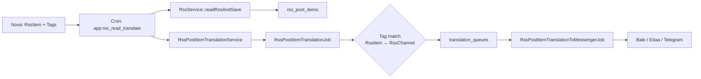

# پلن: ثبت فید ویرگول + ربات ادمین RSS (حداقل تغییر)

## وضعیت فعلی (چیزهایی که از قبل دارید)

**خبر خوب:** نیازی به ساخت pipeline جدید نیست. این مسیر از قبل پیاده شده:



| بخش | وضعیت | فایل کلیدی |
|-----|--------|------------|
| ثبت فید در ادمین | **موجود** | [app/Nova/RssItem.php](app/Nova/RssItem.php) — فیلد `Tags` دارد |
| خواندن RSS ویرگول | **کار می‌کند** | [app/Services/RssService.php](app/Services/RssService.php) — RSS 2.0 استاندارد |
| فید نمونه ویرگول | **seed شده، غیرفعال** | [database/seeders/RssItemsTableSeeder.php](database/seeders/RssItemsTableSeeder.php) id=4، `is_active=0`، **بدون تگ** |
| ارسال خودکار | **موجود** | cron هر ۱۵ دقیقه + `queue:work` ([README.md](README.md) بخش Cron Jobs) |
| ربات `/api/webhook-rss` | **ناقص** | فقط دستور `/publish:rocket:...` — [RssPostItemTranslationController.php](app/Http/Controllers/RssPostItemTranslationController.php) |
| Bot Mother | **دست نمی‌زنیم** | wizard فعلی بدون تغییر می‌ماند |
| مسیر جداگانه Chrome Extension | **جدا از RSS** | [SocialTools::virgool()](app/Helpers/SocialTools.php) — به جدول `rss_items` وصل نیست |

**نتیجه:** برای ویرگول، کار اصلی **تگ + کانال + فعال‌سازی فید** است. ربات فقط یک shortcut برای همان کاری است که الان در [Nova RSS Items](http://bots.pardisania.ir/nova/resources/rss-items/new) انجام می‌دهید.

---

## فاز ۰ — موجودی ربات‌ها (بدون کد)

### کجا در Nova ببینید

| صفحه | URL | چه چیزی می‌بینید |
|------|-----|------------------|
| **Bots** | `/nova/resources/bots` | توکن‌ها، `endpoint_id`، وضعیت webhook |
| **Webhook Endpoints** | `/nova/resources/webhook-endpoints` | هر فیچر به کدام route وصل است |
| **RSS Items** | `/nova/resources/rss-items` | فیدها + Tags |
| **RSS Channels** | `/nova/resources/rss-channels` | کانال‌های مقصد + Tags |

### تشخیص «ربات خالی» vs «متصل»

- **متصل به فیچر:** `endpoint_id` پر است (مثلاً `webhook-list-bot`, `webhook-prayer-bot`)
- **بدون فیچر / legacy:** `endpoint_id` = NULL
- **اشغال بودن endpoint:** در Nova → Bots → فیلتر روی `endpoint_id` مورد نظر

**برای ربات ادمین RSS:** یک توکن **جدید از BotFather/بله** بگیرید (یا یکی با `endpoint_id` خالی) — **از Bot Mother ثبت نکنید** تا wizard به هم نریزد.

---

## فاز ۱ — آماده‌سازی Nova (قبل از ربات)

### ۱. تگ `virgool`

در seeder فعلی تگ `virgool` نیست ([TagsTableSeeder.php](database/seeders/TagsTableSeeder.php)). در production:

- از Nova یا مستقیم DB تگ `virgool` بسازید (locale: `fa`)
- یا از تگ موجود `blog` استفاده کنید — **مهم این است که RssItem و RssChannel همان تگ را داشته باشند**

### ۲. کانال مقصد

[RssPostItemTranslationJob](app/Jobs/RssPostItemTranslationJob.php) فقط وقتی ارسال می‌کند که **تگ فید ∩ تگ کانال** مشترک باشد:

```php
$rssTags = $rssItem->tags()->pluck('id')->toArray();
$rssChannels = RssChannel::whereHas('tags', ...)->get();
```

**اقدام:** در `/nova/resources/rss-channels` روی کانال هدف (مثلاً Bale/Eitaa) تگ `virgool` را بزنید.

### ۳. فید ویرگول (دستی — همان کاری که الان کردید)

در [rss-items/new](http://bots.pardisania.ir/nova/resources/rss-items/new):

| فیلد | مقدار پیشنهادی |
|------|----------------|
| `url` | `https://virgool.io/feed/@samiusblythe` |
| `unique_xml_tag` | `link` |
| `locale` / `target_locale` | `fa` |
| `is_active` | ✅ true |
| `interval_minutes` | `60` (یا کمتر برای تست) |
| `Tags` | `virgool` |

**فرمت URL:** هر سه حالت باید به همین URL نرمال شوند:
- `https://virgool.io/feed/@samiusblythe` (کامل)
- `@samiusblythe` یا `samiusblythe` (فقط یوزرنیم)
- `https://virgool.io/@samiusblythe` (پروفایل → تبدیل به feed)

---

## فاز ۲ — ربات ادمین RSS (تغییر کوچک، ایزوله)

### چرا endpoint جدا؟

- [routes/api.php](routes/api.php) خط ۶۶ و ۹۶ هر دو `/webhook-rss` دارند — فقط `RssPostItemTranslationController` فعال است
- دست زدن به همان controller برای `/publish:rocket:...` **ریسک باگ** دارد
- **پیشنهاد:** endpoint جدید `webhook-rss-admin` — Bot Mother و webhook-rss فعلی دست‌نخورده

### رفتار ربات (الگو از List Bot + AdminHelper)

```
/start
  └─ دکمه شیشه‌ای: [📰 ثبت فید RSS] [📋 لیست فیدها]
       └─ ثبت فید → inline buttons: تگ‌ها (virgool, blog, ...)
            └─ انتخاب تگ → «لینک یا @username بفرستید»
                 └─ نرمال‌سازی URL → HTTP validate RSS → RssItem::create + attachTag
                      └─ پیام تأیید + اختیاری: fetch فوری
```

**دسترسی:** فقط [AdminHelper::isAdmin()](app/Helpers/AdminHelper.php) — chat_idهای env شما

### فایل‌های جدید (حداقل)

| فایل | نقش |
|------|-----|
| `app/Http/Controllers/RssAdminBotController.php` | webhook handler (~150 خط) |
| `app/Services/RssFeedRegistrationService.php` | normalize URL + validate + create RssItem |
| `database/seeders/RssAdminBotWebhookEndpointSeeder.php` | ثبت endpoint در DB |
| `routes/api.php` | یک خط: `POST /api/webhook-rss-admin` |
| `lang/*/bot.php` | کلیدهای `rss_admin.*` (۱۵ زبان) |

**عمداً نمی‌سازیم:** Repository/ServiceImpl سنگین، تغییر BotMotherController، migration جدید

### ثبت webhook (بدون Bot Mother)

```bash
curl "https://tapi.bale.ai/bot{TOKEN}/setWebhook?url=https://bots.pardisania.ir/api/webhook-rss-admin?origin=bale&token={TOKEN}"
```

سپس در Nova → Bots یک رکورد با `endpoint_id=webhook-rss-admin` و همان توکن.

### آینده (اختیاری، همان ربات)

منوی `/start` می‌تواند بعداً فیچرهای دیگر را اضافه کند (مثل admin-bots) — **فعلاً فقط RSS** تا scope کوچک بماند.

---

## فاز ۳ — تست قدم‌به‌قدم

### A) تست Nova-only (همین الان، بدون کد)

1. Nova → RSS Channels → کانال Bale/Eitaa → تگ `virgool` بزنید
2. Nova → RSS Items → فید `@samiusblythe` → `is_active=1` + تگ `virgool`
3. SSH سرور:
   ```bash
   cd /home/pardisa2/bots
   php artisan app:rss_read_translate
   php artisan queue:work --once
   ```
4. Nova → `rss-post-items` — رکورد جدید با `link` ویرگول
5. Nova → `rss-post-item-translations` و `rss-post-item-translation-queues` — صف ساخته شده؟
6. پیام در کانال Bale/Eitaa دریافت شد؟

**نکته throughput:** cron هر ۱۵ دقیقه **یک** پست جدید translate می‌کند ([RssPostItemTranslationToMessengerService](app/Services/RssPostItemTranslationToMessengerService.php)) — برای تست سریع، artisan دستی بالا را بزنید.

### B) تست ربات (بعد از پیاده‌سازی فاز ۲)

1. توکن جدید → setWebhook → Nova Bot record
2. از chat_id ادمین: `/start`
3. «ثبت فید RSS» → تگ `virgool` → `@samiusblythe`
4. پیام «ثبت شد» + id فید
5. Nova → rss-items — رکورد جدید
6. `php artisan app:rss_read_translate` → پست در کانال

### C) تست URLهای مختلف

| ورودی | انتظار |
|-------|--------|
| `https://virgool.io/feed/@samiusblythe` | ثبت |
| `@samiusblythe` | نرمال → feed URL |
| `https://virgool.io/@samiusblythe` | نرمال → feed URL |
| `https://google.com` | خطا: RSS معتبر نیست |
| فید تکراری (همان link) | پیام: از قبل موجود |

---

## چیزهایی که عمداً انجام نمی‌دهیم

- تغییر [BotMotherController.php](app/Http/Controllers/BotMotherController.php) یا wizard ربات مادر
- merge کردن منطق جدید در [RssPostItemTranslationController.php](app/Http/Controllers/RssPostItemTranslationController.php) (ریسک `/publish`)
- FK جدید در migration
- بازنویسی [RssService.php](app/Services/RssService.php) — فقط reuse می‌کنیم

---

## خلاصه تصمیم

| کار | راه | کد جدید |
|-----|-----|---------|
| دیدن ربات‌ها/توکن‌ها | Nova `/nova/resources/bots` | ❌ |
| ثبت فید ویرگول | Nova rss-items/new (شما الان این کار را کردید) | ❌ |
| تگ + کانال | Nova rss-channels + Tags | ❌ |
| ثبت سریع از پیام‌رسان | ربات `webhook-rss-admin` | ✅ کوچک |
| fetch + publish | cron موجود | ❌ |

**شروع برنامه‌نویسی:** اگر فقط می‌خواهید **همین الان** کار کند → فاز ۱ Nova کافی است. اگر می‌خواهید **از بیرون با ربات** → فاز ۲ (~۳ فایل PHP + seeder + ترجمه).
