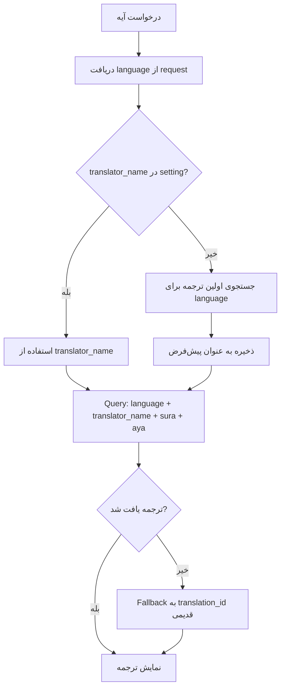

# استفاده از ترجمه‌های جدید در ربات قرآن

## هدف

تغییر منطق ربات قرآن برای:

1. استفاده از ترجمه‌های جدید در جدول `quran_translations` بر اساس `language` و `translator_name`
2. اگر برای یک زبان چند ترجمه وجود دارد، اولی را نمایش بدهیم
3. کاربر بتواند ترجمه پیش‌فرض خود را تغییر دهد
4. با یک دستور بتوانیم ترجمه پیش‌فرض کاربرانی که تغییر نداده‌اند را عوض کنیم

## ساختار فعلی

### استفاده فعلی از ترجمه:

- در `QuranHelper::getSureAye()` از `translation_id` استفاده می‌شود
- Query: `QuranTranslation::whereTranslationId($translationId)->whereSura($sure)->whereAya($aye)->first()`
- Setting کاربر: `translation_id` در `BotUsers.settings`

### ساختار جدید:

- استفاده از `language` و `translator_name` به جای `translation_id`
- Setting کاربر: `quran_translation_language` و `quran_translation_translator`
- اگر setting وجود نداشت، از زبان ربات استفاده کنیم

## تغییرات مورد نیاز

### 1. تغییر `QuranHelper::getSureAye()`

**مسیر:** `app/Helpers/QuranHelper.php`

**تغییرات:**

- دریافت `language` از request یا از setting کاربر
- دریافت `translator_name` از setting کاربر
- اگر `translator_name` وجود نداشت، اولین ترجمه موجود برای آن زبان را استفاده کنیم
- Query جدید: `QuranTranslation::where('language', $language)->where('translator_name', $translator)->whereSura($sure)->whereAya($aye)->first()`

### 2. دستور تغییر ترجمه پیش‌فرض کاربر

**مسیر:** `app/Http/Controllers/QuranWordController.php`

**دستور:** `/translation` یا `/translation_list`

- نمایش لیست ترجمه‌های موجود برای زبان کاربر
- امکان انتخاب ترجمه با دکمه‌های inline
- ذخیره در `BotUsers.settings`: `quran_translation_language` و `quran_translation_translator`

### 3. دستور Artisan برای تغییر ترجمه پیش‌فرض همه کاربران

**مسیر:** `app/Console/Commands/SetDefaultQuranTranslation.php`

**قابلیت‌ها:**

- تغییر ترجمه پیش‌فرض برای کاربرانی که setting ندارند
- فیلتر بر اساس زبان
- فیلتر بر اساس bot_mother_id

**پارامترها:**

- `--language`: زبان مورد نظر
- `--translator`: نام مترجم
- `--bot-mother-id`: شناسه ربات مادر (اختیاری)
- `--force`: بازنویسی setting های موجود

### 4. Helper Method برای دریافت ترجمه

**مسیر:** `app/Helpers/QuranHelper.php`

**متد جدید:** `getQuranTranslation($language, $translator, $sura, $aya, $userSettings = null)`

- دریافت ترجمه از `quran_translations`
- اگر `translator` null بود، اولین ترجمه موجود را برگرداند
- Fallback به `translation_id` برای سازگاری با داده‌های قدیمی

## فرآیند کار



## مثال استفاده

### دستور کاربر:

```
/translation_list
```

**خروجی:**

```
📖 ترجمه‌های موجود برای زبان شما (fa):

1. ✅ ansarian (پیش‌فرض فعلی)
2. ayati
3. ...

برای تغییر ترجمه، روی شماره مورد نظر کلیک کنید.
```

### دستور Artisan:

```bash
# تغییر ترجمه پیش‌فرض برای همه کاربران فارسی
php artisan quran-translation:set-default --language=fa --translator=ansarian

# تغییر برای یک ربات مادر خاص
php artisan quran-translation:set-default --language=en --translator=yusufali --bot-mother-id=1

# بازنویسی setting های موجود
php artisan quran-translation:set-default --language=ar --translator=jalalayn --force
```

## Migration و سازگاری

### Migration برای BotUsers:

- نیازی به migration نیست (از JSON settings استفاده می‌شود)
- فقط باید setting های جدید را اضافه کنیم

### سازگاری با داده‌های قدیمی:

- اگر `quran_translation_language` و `quran_translation_translator` وجود نداشت، از `translation_id` استفاده کنیم
- Mapping: `translation_id = 1` → `language = 'am', translator = 'sadiq'`
- Mapping: `translation_id = 2` → `language = 'fa', translator = 'ansarian'`

## فایل‌های مورد نیاز

1. **تغییر `QuranHelper::getSureAye()`** - استفاده از language و translator_name
2. **تغییر `QuranWordController`** - اضافه کردن دستور `/translation_list`
3. **دستور Artisan `SetDefaultQuranTranslation`** - تغییر ترجمه پیش‌فرض
4. **Helper Method `getQuranTranslation()`** - دریافت ترجمه با fallback

## تست

1. تست نمایش ترجمه با language و translator_name
2. تست fallback به translation_id
3. تست دستور `/translation_list`
4. تست تغییر ترجمه پیش‌فرض کاربر
5. تست دستور Artisan برای تغییر پیش‌فرض همه کاربران