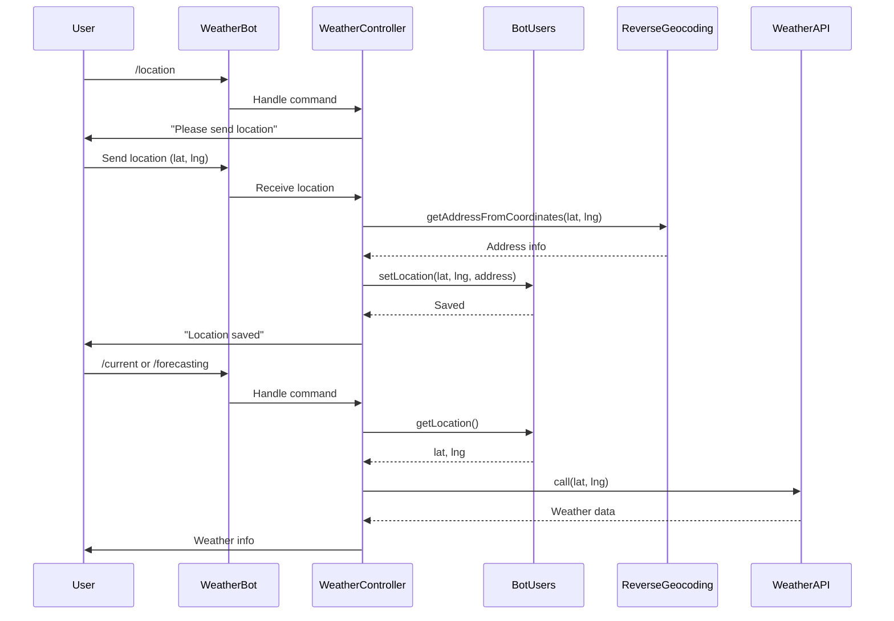

# پلن: افزودن مدیریت Location به ربات هواشناسی و پشتیبانی چندزبانه

## اهداف

1. امکان تعیین location از طریق ارسال نقطه در ربات هواشناسی
2. ذخیره location برای هر کاربر در دیتابیس
3. استفاده از reverse geocoding برای دریافت اطلاعات شهر
4. استفاده از location ذخیره شده در API calls
5. اضافه کردن دستور `/location` به لیست دستورات
6. اضافه کردن زبان انگلیسی به ربات مادر

## تغییرات مورد نیاز

### 1. Migration: اضافه کردن فیلدهای location به bot_users

**فایل:** `database/migrations/YYYY_MM_DD_HHMMSS_add_location_to_bot_users_table.php`

- اضافه کردن `latitude` (decimal 10,8)
- اضافه کردن `longitude` (decimal 11,8)
- اضافه کردن `location_address` (text, nullable) - برای ذخیره آدرس از reverse geocoding
- اضافه کردن index روی (chat_id, bot_id) برای جستجوی سریع

### 2. Model: به‌روزرسانی BotUsers

**فایل:** `app/Models/BotUsers.php`

- اضافه کردن فیلدهای جدید به `$fillable` یا استفاده از `$guarded = []`
- متد helper برای دریافت location: `getLocation()`
- متد helper برای ذخیره location: `setLocation($lat, $lng, $address = null)`

### 3. Service: Reverse Geocoding Service

**فایل جدید:** `app/Services/ReverseGeocodingService.php`

- استفاده از OpenStreetMap Nominatim API (رایگان)
- متد `getAddressFromCoordinates($lat, $lng)`
- Cache کردن نتایج برای کاهش API calls
- Error handling مناسب

**Interface:** `app/Interfaces/Services/ReverseGeocodingService.php`

### 4. Repository: به‌روزرسانی Weather Repositories

**فایل:** `app/Repositories/WeatherTomorrowApiRepositoryImpl.php`

- تغییر متد `call()` برای دریافت `$latitude` و `$longitude` به عنوان پارامتر
- استفاده از location کاربر به جای hardcode

**فایل:** `app/Repositories/WeatherOpenWeatherApiRepositoryImpl.php`

- تغییر متد `call()` برای دریافت `$latitude` و `$longitude`
- استفاده از reverse geocoding برای تبدیل coordinates به city name

**Interface:** `app/Interfaces/Repositories/WeatherTomorrowApiRepository.php`

- تغییر signature متد `call()` به `call($latitude, $longitude)`

**Interface:** `app/Interfaces/Repositories/WeatherOpenWeatherApiRepository.php`

- تغییر signature متد `call()` به `call($latitude, $longitude)`

### 5. Service: به‌روزرسانی Weather Services

**فایل:** `app/Services/WeatherTomorrowApiServiceImpl.php`

- تغییر متد `getMessage()` برای دریافت `$chatId` و `$botId`
- دریافت location از دیتابیس
- استفاده از location در Repository call

**فایل:** `app/Services/WeatherOpenWeatherMapApiServiceImpl.php`

- تغییر متد `getMessage()` برای دریافت `$chatId` و `$botId`
- دریافت location از دیتابیس
- استفاده از location در Repository call

**Interface:** `app/Interfaces/Services/WeatherTomorrowApiService.php`

**Interface:** `app/Interfaces/Services/WeatherOpenWeatherMapApiService.php`

### 6. Controller: به‌روزرسانی WeatherController

**فایل:** `app/Http/Controllers/WeatherController.php`

- تشخیص location message از request
- دستور `/location` یا `/setlocation`:
  - درخواست ارسال location از کاربر
  - دریافت location از message
  - فراخوانی reverse geocoding
  - ذخیره location در دیتابیس
  - ارسال پیام تایید
- استفاده از location ذخیره شده در دستورات دیگر
- دریافت `chat_id` و `bot_id` از request
- استفاده از `BotUsers::firstOrNew()` برای ایجاد/یافتن کاربر

### 7. Helper: به‌روزرسانی StringHelper

**فایل:** `app/Helpers/StringHelper.php`

- اضافه کردن دستور `/location` به لیست دستورات در `getWeatherBotCommandsAsPostfixForMessages()`

### 8. ربات مادر: اضافه کردن زبان انگلیسی

**فایل:** `app/Http/Controllers/BotMotherController.php`

- بررسی اینکه آیا زبان انگلیسی در `getSupportedLanguages()` وجود دارد (به نظر می‌رسد وجود دارد)
- اگر نیست، اضافه کردن

### 9. ترجمه‌ها

**فایل‌ها:** `lang/en/bot.php`, `lang/fa/bot.php`

- اضافه کردن ترجمه‌های مربوط به location:
  - `location.request`: "Please send your location"
  - `location.saved`: "Location saved successfully"
  - `location.error`: "Error saving location"
  - `location.not_set`: "Location not set. Please use /location command"

### 10. Provider: ثبت Service

**فایل:** `app/Providers/AppServiceProvider.php`

- ثبت `ReverseGeocodingService` در container

## Flow Diagram

## نکات مهم

1. **Location Message Detection**: در تلگرام/بله، location در `message.location` قرار دارد
2. **Default Location**: اگر کاربر location تنظیم نکرده، از location پیش‌فرض (قم) استفاده شود
3. **Error Handling**: اگر reverse geocoding fail شد، فقط coordinates را ذخیره کنیم
4. **Cache**: نتایج reverse geocoding را cache کنیم (مثلاً 24 ساعت)
5. **Validation**: بررسی معتبر بودن coordinates (latitude: -90 تا 90, longitude: -180 تا 180)

## فایل‌های جدید

1. `database/migrations/YYYY_MM_DD_HHMMSS_add_location_to_bot_users_table.php`
2. `app/Services/ReverseGeocodingService.php`
3. `app/Services/ReverseGeocodingServiceImpl.php`
4. `app/Interfaces/Services/ReverseGeocodingService.php`

## فایل‌های تغییر یافته

1. `app/Models/BotUsers.php`
2. `app/Repositories/WeatherTomorrowApiRepositoryImpl.php`
3. `app/Repositories/WeatherOpenWeatherApiRepositoryImpl.php`
4. `app/Interfaces/Repositories/WeatherTomorrowApiRepository.php`
5. `app/Interfaces/Repositories/WeatherOpenWeatherApiRepository.php`
6. `app/Services/WeatherTomorrowApiServiceImpl.php`
7. `app/Services/WeatherOpenWeatherMapApiServiceImpl.php`
8. `app/Interfaces/Services/WeatherTomorrowApiService.php`
9. `app/Interfaces/Services/WeatherOpenWeatherMapApiService.php`
10. `app/Http/Controllers/WeatherController.php`
11. `app/Helpers/StringHelper.php`
12. `app/Providers/AppServiceProvider.php`
13. `lang/en/bot.php`
14. `lang/fa/bot.php`