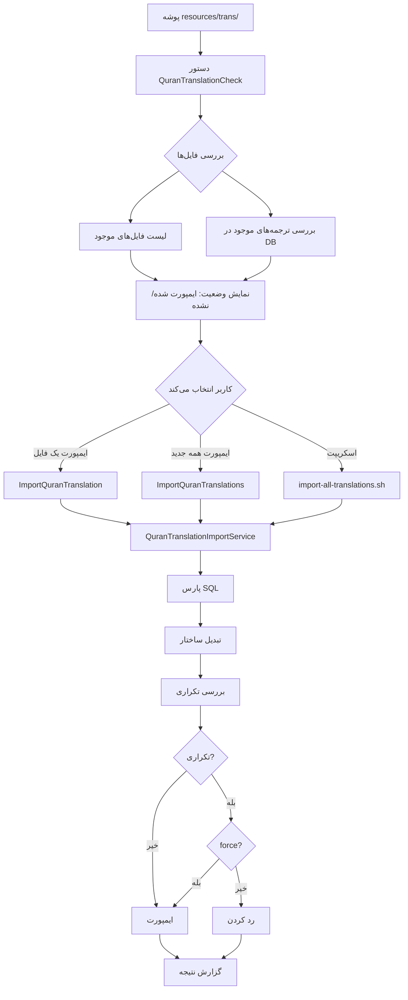

# نقشه ایمپورت ترجمه‌های قرآن از SQL Dump (به‌روزرسانی)

## هدف

ایجاد یک سیستم کامل برای:

1. بررسی فایل‌های SQL موجود در `resources/trans/`
2. تشخیص ترجمه‌های قبلاً ایمپورت شده
3. ایمپورت فقط ترجمه‌های جدید
4. ایمپورت دستی یک فایل خاص
5. ایجاد اسکریپت برای ایمپورت همه فایل‌ها

## ساختار فایل‌ها

### فایل‌های موجود در `resources/trans/`:

- `zh.jian.sql` → `zh_jian` → language: `zh`, translator: `jian`
- `es.garcia.sql` → `es_garcia` → language: `es`, translator: `garcia`
- `tr.bulac.sql` → `tr_bulac` → language: `tr`, translator: `bulac`
- و غیره...

### ساختار ورودی (SQL Dump):

```sql
# Name: Ma Jian
# Translator: Ma Jian
# Language: Chinese
# ID: zh.jian

CREATE TABLE `zh_jian` (
  `index` int(4) NOT NULL,
  `sura` int(3) NOT NULL,
  `aya` int(3) NOT NULL,
  `text` text NOT NULL
);

INSERT INTO `zh_jian` (`index`, `sura`, `aya`, `text`) VALUES
(1, 1, 1, '...'),
(2, 1, 2, '...');
```

### ساختار خروجی (quran_translations):

- `id` (auto increment)
- `translation_id` (اختیاری - از جدول translations)
- `language` (از نام فایل یا کامنت SQL)
- `translator_name` (از نام فایل یا کامنت SQL)
- `translate_full_name` (مثلاً "zh.jian")
- `index` (از فایل SQL)
- `sura` (از فایل SQL)
- `aya` (از فایل SQL)
- `text` (از فایل SQL)

## فایل‌های مورد نیاز

### 1. دستور Artisan: `QuranTranslationCheck`

**مسیر:** `app/Console/Commands/QuranTranslationCheck.php`

**قابلیت‌ها:**

- اسکن پوشه `resources/trans/` برای فایل‌های `.sql`
- استخراج `language` و `translator` از نام فایل (مثلاً `zh.jian.sql`)
- بررسی وجود ترجمه در `quran_translations` (بر اساس `language` + `translator_name`)
- نمایش لیست فایل‌های موجود و وضعیت ایمپورت
- نمایش تعداد آیات هر ترجمه موجود

**خروجی:**

```
📁 فایل‌های موجود در resources/trans/:
✅ zh.jian.sql - ایمپورت شده (6236 آیات)
❌ es.garcia.sql - ایمپورت نشده
✅ tr.bulac.sql - ایمپورت شده (6236 آیات)
...
```

### 2. دستور Artisan: `ImportQuranTranslation`

**مسیر:** `app/Console/Commands/ImportQuranTranslation.php`

**قابلیت‌ها:**

- ایمپورت یک فایل SQL خاص
- بررسی تکراری بودن قبل از ایمپورت
- نمایش پیشرفت (progress bar)
- گزارش کامل (تعداد آیات، خطاها، زمان)

**پارامترها:**

- `file`: مسیر فایل SQL (مثلاً `resources/trans/zh.jian.sql`)
- `--force`: بازنویسی ترجمه موجود
- `--skip-check`: رد کردن بررسی تکراری بودن

**مثال:**

```bash
php artisan quran-translation:import resources/trans/zh.jian.sql
php artisan quran-translation:import resources/trans/es.garcia.sql --force
```

### 3. دستور Artisan: `ImportQuranTranslations`

**مسیر:** `app/Console/Commands/ImportQuranTranslations.php`

**قابلیت‌ها:**

- ایمپورت همه فایل‌های جدید (که قبلاً ایمپورت نشده‌اند)
- ایمپورت با ترتیب (برای جلوگیری از خطا)
- گزارش کامل از همه فایل‌ها

**پارامترها:**

- `--path`: مسیر پوشه (پیش‌فرض: `resources/trans`)
- `--force`: ایمپورت همه فایل‌ها حتی اگر قبلاً ایمپورت شده‌اند
- `--dry-run`: فقط نمایش فایل‌هایی که ایمپورت می‌شوند (بدون ایمپورت واقعی)

**مثال:**

```bash
php artisan quran-translations:import-all
php artisan quran-translations:import-all --force
php artisan quran-translations:import-all --dry-run
```

### 4. سرویس: `QuranTranslationImportService`

**مسیر:** `app/Services/QuranTranslationImportService.php`

**مسئولیت‌ها:**

- پارس کردن فایل SQL
- استخراج metadata از کامنت‌های SQL یا نام فایل
- استخراج INSERT statements
- تبدیل ساختار داده
- مدیریت batch insert (1000 رکورد در هر batch)
- بررسی صحت داده‌ها
- بررسی تکراری بودن

**متدها:**

- `parseSqlFile(string $filePath): array` - پارس فایل SQL
- `extractMetadata(string $content, string $fileName): array` - استخراج metadata
- `transformData(array $sqlData, array $metadata): array` - تبدیل ساختار
- `checkIfExists(string $language, string $translator): bool` - بررسی وجود
- `import(array $data, bool $force = false): array` - ایمپورت به دیتابیس

### 5. اسکریپت Bash: `import-all-translations.sh`

**مسیر:** `scripts/import-all-translations.sh`

**قابلیت‌ها:**

- اسکن پوشه `resources/trans/`
- ایمپورت همه فایل‌های `.sql`
- لاگ کردن نتایج
- نمایش گزارش نهایی

**محتوا:**

```bash
#!/bin/bash
# ایمپورت همه ترجمه‌های قرآن از پوشه resources/trans/

cd "$(dirname "$0")/.."
php artisan quran-translations:import-all --path=resources/trans
```

### 6. مستندات: `docs/features/QURAN_TRANSLATION_IMPORT.md`

**مسیر:** `docs/features/QURAN_TRANSLATION_IMPORT.md`

## فرآیند کار



## الگوریتم استخراج اطلاعات

### از نام فایل (مثلاً `zh.jian.sql`):

1. حذف پسوند `.sql` → `zh.jian`
2. تقسیم بر اساس `.` → `['zh', 'jian']`
3. `language` = اولین بخش
4. `translator_name` = بخش‌های بعدی (join با `.`)
5. `translate_full_name` = `{language}.{translator_name}`

### از کامنت‌های SQL:

```sql
# Name: Ma Jian
# Translator: Ma Jian
# Language: Chinese
# ID: zh.jian
```

### از نام جدول در SQL (مثلاً `zh_jian`):

1. تقسیم بر اساس `_` → `['zh', 'jian']`
2. `language` = اولین بخش
3. `translator_name` = بخش‌های بعدی (join با `_`)

## مثال‌های استفاده

### گام 1: بررسی فایل‌های موجود

```bash
php artisan quran-translations:check
```

### گام 2: ایمپورت یک فایل (تست)

```bash
php artisan quran-translation:import resources/trans/zh.jian.sql
```

### گام 3: ایمپورت همه فایل‌های جدید

```bash
php artisan quran-translations:import-all
```

### گام 4: اجرای اسکریپت (بعد از تست موفق)

```bash
chmod +x scripts/import-all-translations.sh
./scripts/import-all-translations.sh
```

## بررسی‌های امنیتی

1. بررسی وجود فایل
2. بررسی فرمت SQL
3. بررسی صحت داده‌ها (sura بین 1-114، aya > 0)
4. بررسی تکراری بودن قبل از insert
5. استفاده از transaction برای rollback در صورت خطا
6. بررسی encoding (UTF-8)

## بهینه‌سازی

1. استفاده از batch insert (1000 رکورد در هر batch)
2. استفاده از `DB::transaction()` برای کارایی بهتر
3. نمایش progress bar برای فایل‌های بزرگ
4. استفاده از chunk برای پردازش فایل‌های بزرگ
5. Cache کردن لیست ترجمه‌های موجود برای بررسی سریع‌تر

## تست

1. تست با یک فایل کوچک (مثلاً 10 آیات)
2. تست با یک فایل کامل (6236 آیات)
3. تست با ترجمه تکراری
4. تست با داده‌های نامعتبر
5. تست rollback در صورت خطا
6. تست ایمپورت همه فایل‌ها