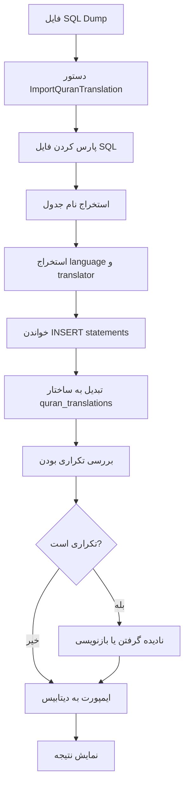

# نقشه ایمپورت ترجمه‌های قرآن از SQL Dump

## هدف

ایجاد یک سیستم برای ایمپورت ترجمه‌های قرآن از فایل‌های SQL dump (مثل `zh_jian.sql`) به جدول `quran_translations` با تبدیل ساختار داده.

## ساختار داده‌ها

### ساختار ورودی (SQL Dump):

```sql
CREATE TABLE `zh_jian` (
  `index` int(4) NOT NULL,
  `sura` int(3) NOT NULL,
  `aya` int(3) NOT NULL,
  `text` text NOT NULL
);
```

### ساختار خروجی (quran_translations):

- `id` (auto increment)
- `translation_id` (باید از جدول translations یا خودکار تولید شود)
- `language` (مثلاً "zh" از "zh_jian")
- `translator_name` (مثلاً "jian" از "zh_jian")
- `translate_full_name` (مثلاً "zh.jian")
- `index` (از فایل SQL)
- `sura` (از فایل SQL)
- `aya` (از فایل SQL)
- `text` (از فایل SQL)

## فایل‌های مورد نیاز

### 1. دستور Artisan: `ImportQuranTranslation`

**مسیر:** `app/Console/Commands/ImportQuranTranslation.php`

**قابلیت‌ها:**

- خواندن فایل SQL dump
- استخراج نام جدول از SQL (مثلاً `zh_jian`)
- استخراج اطلاعات مترجم از کامنت‌های SQL یا نام جدول
- تبدیل ساختار داده
- ایمپورت به `quran_translations`
- بررسی تکراری بودن (بر اساس language + translator_name + sura + aya)
- نمایش پیشرفت (progress bar)
- لاگ خطاها

**پارامترها:**

- `--file`: مسیر فایل SQL
- `--language`: کد زبان (اختیاری - از نام جدول استخراج می‌شود)
- `--translator`: نام مترجم (اختیاری - از نام جدول استخراج می‌شود)
- `--translation-id`: شناسه ترجمه (اختیاری - خودکار تولید می‌شود)
- `--force`: بازنویسی ترجمه‌های موجود

### 2. سرویس: `QuranTranslationImportService`

**مسیر:** `app/Services/QuranTranslationImportService.php`

**مسئولیت‌ها:**

- پارس کردن فایل SQL
- استخراج INSERT statements
- تبدیل ساختار داده
- مدیریت batch insert برای کارایی بهتر
- بررسی صحت داده‌ها

### 3. راهنمای استفاده: `docs/features/QURAN_TRANSLATION_IMPORT.md`

**مسیر:** `docs/features/QURAN_TRANSLATION_IMPORT.md`

**محتوای راهنما:**

- توضیح فرآیند ایمپورت
- مثال‌های استفاده
- ساختار فایل SQL مورد نیاز
- نحوه استخراج اطلاعات از نام جدول
- عیب‌یابی مشکلات رایج

## فرآیند ایمپورت



## الگوریتم استخراج اطلاعات

### از نام جدول (مثلاً `zh_jian`):

1. تقسیم بر اساس `_` → `['zh', 'jian']`
2. `language` = اولین بخش (2 حرف اول)
3. `translator_name` = بخش‌های بعدی (join با `_`)
4. `translate_full_name` = `{language}.{translator_name}`

### از کامنت‌های SQL:

```sql
# Name: Ma Jian
# Translator: Ma Jian
# Language: Chinese
# ID: zh.jian
```

## مثال استفاده

```bash
# ایمپورت از فایل SQL
php artisan quran-translation:import --file=storage/translations/zh_jian.sql

# با مشخص کردن اطلاعات دستی
php artisan quran-translation:import \
  --file=storage/translations/zh_jian.sql \
  --language=zh \
  --translator=jian \
  --translation-id=3

# با بازنویسی ترجمه موجود
php artisan quran-translation:import \
  --file=storage/translations/zh_jian.sql \
  --force
```

## بررسی‌های امنیتی

1. بررسی وجود فایل
2. بررسی فرمت SQL
3. بررسی صحت داده‌ها (sura بین 1-114، aya > 0)
4. بررسی تکراری بودن قبل از insert
5. استفاده از transaction برای rollback در صورت خطا

## بهینه‌سازی

1. استفاده از batch insert (مثلاً 1000 رکورد در هر batch)
2. استفاده از `DB::transaction()` برای کارایی بهتر
3. نمایش progress bar برای فایل‌های بزرگ
4. استفاده از queue برای فایل‌های خیلی بزرگ (اختیاری)

## تست

1. تست با فایل SQL کوچک (مثلاً 10 آیات)
2. تست با فایل کامل (6236 آیات)
3. تست با ترجمه تکراری
4. تست با داده‌های نامعتبر
5. تست rollback در صورت خطا