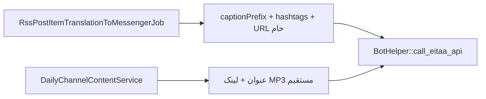
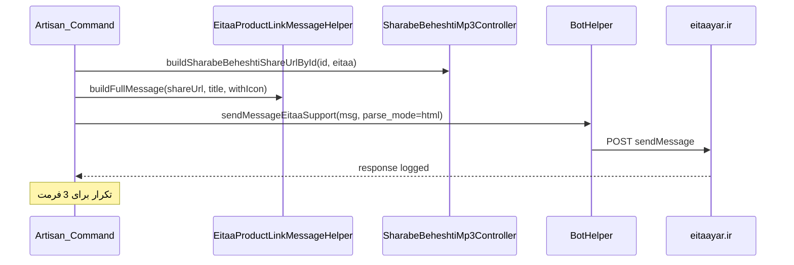

# تست خروجی لینک محصول شراب بهشتی در ایتا

## وضعیت فعلی

خروجی شراب بهشتی برای ایتا از این مسیرها می‌آید:



**مشکلات فعلی برای هدف شما:**
- لینک صفحه محصول (`sharabebeheshti.ir/shb...?utm_medium=eitaa`) فقط به‌صورت URL خام در کپشن است
- متن SEO (صلوات، ورود به صفحه، ۵ دقیقه ماندن، گوش دادن به صوت) وجود ندارد
- [`BotHelper::call_eitaa_api`](app/Helpers/BotHelper.php) فقط `text` می‌فرستد و **`parse_mode` ندارد** — HTML ممکن است رندر نشود
- کلاس `xf xf-eitaa` (Persian Font Icon) در پروژه استفاده نشده؛ مستند شما `xf-bale` نشان می‌دهد که احتمالاً اشتباه تایپی است — کلاس صحیح: **`xf xf-eitaa`**

**کانال تست موجود:** `RssChannel` با `id=2`، `origin_id=5` (slug: `eitaa`)، توکن از `BOT_EITAA_TOKEN_SABER` — همان مسیری که [`testSendchannels`](app/Console/Commands/testSendchannels.php) و [`TestSendPhotoMessageToEitaa`](app/Console/Commands/TestSendPhotoMessageToEitaa.php) استفاده می‌کنند.

---

## پیش‌فرض‌ها (چون سوالات پاسخ داده نشد)

| موضوع | پیش‌فرض |
|--------|---------|
| محدوده | **فقط کامند تست** — بدون تغییر RSS/کانال روزانه تا تأیید بصری |
| فرمت | **هر دو نسخه** (HTML با آیکون + HTML ساده) در یک اجرای تست |
| پلتفرم | **فقط ایتا** |

---

## قالب پیام پیشنهادی

متن SEO (فارسی):

```
🔗 به صفحه محصول در سایت شراب بهشتی لینک می‌دهیم.
با ورود از این لینک می‌توانید به صفحه سر بزنید و با یک صلوات، ماندن ۵ دقیقه در صفحه و گوش دادن به فایل‌های صوتی، به بهبود رتبه سایت کمک کنید.
```

**نسخه A — HTML با آیکون (طبق مستند Persian Font Icon):**
```html
<a title="صفحه محصول شراب بهشتی" href="{shareUrl}" target="_blank" rel="noopener">
    <i class="xf xf-eitaa fs-3"></i>
    مشاهده صفحه محصول
</a>
```

**نسخه B — HTML ساده (fallback):**
```html
<a href="{shareUrl}">مشاهده صفحه محصول در سایت</a>
```

`{shareUrl}` از متد موجود [`SharabeBeheshtiMp3Controller::buildSharabeBeheshtiShareUrlById($id, 'eitaa')`](app/Http/Controllers/SharabeBeheshtiMp3Controller.php) ساخته می‌شود.

---

## تغییرات کد

### 1. Helper جدید برای قالب پیام ایتا

فایل جدید: [`app/Helpers/EitaaProductLinkMessageHelper.php`](app/Helpers/EitaaProductLinkMessageHelper.php)

مسئولیت‌ها:
- `buildSeoIntroText(): string` — متن SEO بالا
- `buildHtmlLink(string $url, string $label, bool $withIcon): string` — لینک HTML
- `buildFullMessage(string $shareUrl, string $title, bool $withIcon): string` — ترکیب intro + لینک + عنوان MP3

### 2. پشتیبانی اختیاری `parse_mode` در API ایتا

در [`BotHelper::call_eitaa_api`](app/Helpers/BotHelper.php):
- پارامتر اختیاری `$parseMode = null`
- اگر `html` باشد، به `POSTFIELDS` اضافه شود
- امضای `sendMessageEitaaSupport` و `sendAnyFileMessageEitaa` بدون شکستن backward compatibility

> اگر API ایتا `parse_mode` را نشناسد، در تست plain URL هم ارسال می‌شود.

### 3. کامند تست اختصاصی

فایل جدید: [`app/Console/Commands/TestEitaaSharabeBeheshtiProductLink.php`](app/Console/Commands/TestEitaaSharabeBeheshtiProductLink.php)

```bash
php artisan app:test-eitaa-sharabe-beheshti-product-link {--id=63} {--dry-run}
```

**رفتار کامند:**
1. یک `SharabeBeheshtiMp3` با `--id` (پیش‌فرض 63) بخواند
2. `shareUrl` با `utm_medium=eitaa` بسازد
3. **سه پیام** به کانال ایتا (`RssChannel::find(2)`) بفرستد:
   - پیام ۱: متن SEO + لینک HTML با آیکون (`parse_mode=html`)
   - پیام ۲: متن SEO + لینک HTML ساده (`parse_mode=html`)
   - پیام ۳: متن SEO + URL خام (بدون HTML — کنترل)
4. پاسخ API و `curl` response را در console و `Log::info` چاپ کند
5. با `--dry-run` فقط متن‌ها را نمایش دهد بدون ارسال

**اختیاری (مرحله دوم تست):** ارسال audio + caption شبیه production با [`BotBuilder::sendAudio()`](app/Builders/BotBuilder.php) و کپشن جدید — چون جریان واقعی RSS همین است.

---

## جریان تست



---

## چک‌لیست تأیید بصری (دستی)

پس از اجرای کامند، در کانال ایتا (`eitaalogpardisania`) بررسی کنید:

- [ ] پیام ۱: آیا `<a>` کلیک‌پذیر است؟ آیا آیکون `xf-eitaa` نمایش داده می‌شود؟
- [ ] پیام ۲: لینک ساده HTML کار می‌کند؟
- [ ] پیام ۳: URL خام قابل کلیک است؟
- [ ] کلیک روی لینک → صفحه `sharabebeheshti.ir/shb{N}?utm_medium=eitaa` باز می‌شود
- [ ] کدام فرمت برای استفاده در production مناسب‌تر است؟

---

## مرحله بعد (خارج از این PR — پس از تأیید شما)

اگر یکی از فرمت‌ها موفق بود، در [`RssPostItemTranslationToMessengerJob`](app/Jobs/RssPostItemTranslationToMessengerJob.php) فقط وقتی `$rssChannelOrigin->slug === 'eitaa'`:

```php
// جایگزینی $captionPrefix + URL خام
$caption = EitaaProductLinkMessageHelper::buildFullMessage($effectiveUrl, $title, $chosenFormat);
```

همچنین می‌توان [`DailyChannelContentService::getRandomSharabeBeheshtiText()`](app/Services/DailyChannelContentService.php) را برای ایتا جدا کرد — فعلاً خارج از scope.

---

## فایل‌های کلیدی

| فایل | نقش |
|------|-----|
| [`app/Helpers/BotHelper.php`](app/Helpers/BotHelper.php) | API ایتا + parse_mode |
| [`app/Http/Controllers/SharabeBeheshtiMp3Controller.php`](app/Http/Controllers/SharabeBeheshtiMp3Controller.php) | ساخت URL محصول |
| [`app/Console/Commands/testSendchannels.php`](app/Console/Commands/testSendchannels.php) | الگوی تست موجود |
| [`database/seeders/RssChannelsTableSeeder.php`](database/seeders/RssChannelsTableSeeder.php) | کانال ایتا id=2 |
