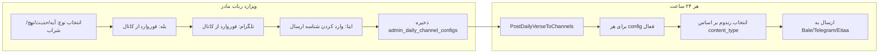

# پلن: ربات تک‌آیه ادمین کانال + پیشنهاد روزانه قرآن برای ادمین‌ها

## بخش ۱: پیشنهاد روزانه برای ادمین‌های ربات قرآن

### منبع داده

- **وضعیت فعلی:** در ربات جستجوی آیات ([BotQuranAyatController](app/Http/Controllers/BotQuranAyatController.php)) فقط `LogHelper::log` انجام می‌شود و در [QuranHelper::findResultThenSend](app/Helpers/QuranHelper.php) نتیجه جستجو (تعداد نتایج یا کلیک روی آیه) ذخیره نمی‌شود.
- **نیاز:** جستجوهایی که (الف) در گذشته انجام شده و (ب) **تک‌نتیجه** بوده‌اند **یا** بعداً روی یکی از نتایج **کلیک** شده (دستور `/sureXayahY` در ربات قرآن کلمه/آیه).

### طراحی

- **جدول جدید:** `quran_search_suggestions` (یا گسترش `bot_logs` با ستون‌های اضافه). ترجیح: جدول جدا برای شفافیت و کوئری‌های سبک.
  - فیلدها: `id`, `search_phrase` (عبارت جستجو نرمال‌شده), `result_count`, `sura` (nullable), `aya` (nullable), `chat_id`, `type` (bale/telegram), `source` (single_result | clicked), `created_at`.
- **ثبت در جستجوی آیات:** در [BotQuranAyatController::index](app/Http/Controllers/BotQuranAyatController.php) بعد از `findResultThenSend` (یا داخل آن در QuranHelper): با نتیجهٔ جستجو تعداد نتایج را بگیر؛ اگر `result_count === 1` یک رکورد با `source=single_result` و `sura`/`aya` از همان نتیجه ذخیره کن. در ربات قرآن کلمه ([QuranWordController](app/Http/Controllers/QuranWordController.php)) وقتی کاربر دستور `/sureXayahY` را زد (مسیر فعلی که به آیه می‌رسد)، یک رکورد با `source=clicked` و `sura`/`aya` ذخیره کن (و در صورت دسترسی به آخرین جستجو همان چت، می‌توان `search_phrase` را هم پر کرد).
- **ارسال روزانه به ادمین‌ها:** یک **Artisan Command** (مثلاً `SendDailyQuranSuggestionToAdmins`) که هر ۲۴ ساعت اجرا شود:
  - از `quran_search_suggestions` (مثلاً ۳۰ روز اخیر) آیتم‌هایی که `result_count === 1` یا `source === 'clicked'` هستند را با درنظرگرفتن تنوع (یک بار عبارت، یک بار sura+aya) به لیست قابل انتخاب تبدیل کند.
  - **یک** مورد به‌صورت **رندوم** انتخاب کند.
  - متن پیشنهاد را بسازد (مثلاً همان عبارت جستجو یا دستور آیه `/sureXayahY` تا ادمین با /// یا //// به همه بفرستد).
  - با [AdminHelper::getAdmins()](app/Helpers/AdminHelper.php) و ارسال با توکن ربات قرآن بله/تلگرام (مثلاً `QURAN_HEFZ_BOT_TOKEN_BALE` / `QURAN_HEFZ_BOT_TOKEN_TELEGRAM`) به هر ادمین یک پیام بفرستد (مثلاً در بله؛ یا هر دو پلتفرم اگر ترجیح داده شود).
- **استفاده ادمین:** ادمین همان مکانیزم فعلی را با دستور **۳ اسلش (///)** یا **۴ اسلش (////)** در ربات قرآن استفاده می‌کند تا این پیشنهاد را برای همه (یا برای ادمین‌ها) broadcast کند ([QuranWordController](app/Http/Controllers/QuranWordController.php) حدود خط ۲۳۳۷–۲۳۹۴).
- **Schedule:** در [Kernel.php](app/Console/Kernel.php) یک بار در روز (مثلاً ساعت ثابت) این Command را زمان‌بندی کن و در [README.md](README.md) بخش Cron Jobs و جدول دستورات `schedule:run` را به‌روز کن.

---

## بخش ۲: ربات ادمین کانال «تک‌آیه / حدیث / نهج / شراب بهشتی» روزانه

### مفهوم

- یک «ربات» که در واقع سرویس ارسال روزانه است: هر ۲۴ ساعت **یک** محتوا (یک آیه **یا** یک حدیث **یا** یک نهج **یا** یک شراب بهشتی) به کانال/گروه‌های از پیش تعریف‌شده ارسال می‌شود.
- نام پیشنهادی برای این سرویس: **«ربات تک‌آیه»** (یا «ربات ادمین کانال روزانه»).

### منبع محتوا

- **آیه:** [QuranAyat](app/Models/QuranAyat.php) — انتخاب رندوم (یا «پرمراجع» اگر معیار داشته باشیم؛ در غیر این صورت فقط رندوم).
- **حدیث:** [BotHadithItem](app/Models/BotHadithItem.php) — رندوم روزانه؛ در صورت وجود کش حدیث، از همان استفاده شود.
- **نهج البلاغه:** [Nahj](app/Models/Nahj.php) و [NahjServiceImpl](app/Services/NahjServiceImpl.php) — یک آیتم رندوم (مثلاً از `NahjRepository::list` با عبارت خالی یا متد جدید برای یک رندوم).
- **شراب بهشتی:** منبع فعلی (مثلاً [SharabeBeheshtiMp3Controller](app/Http/Controllers/SharabeBeheshtiMp3Controller.php) / جدول یا سرویس مرتبط) — یک آیتم رندوم (مثلاً لینک/عنوان روزانه).

### ذخیره تنظیمات کانال‌ها

- **جدول پیشنهادی:** `admin_daily_channel_configs` (یا `daily_verse_channel_configs`).
  - فیلدها: `id`, `admin_chat_id` (ادمینی که در ربات مادر تنظیم کرده), `content_type` (enum: `verse` | `hadith` | `nahj` | `sharabe_beheshti`), `bale_channel_chat_id`, `telegram_channel_chat_id`, `eitaa_channel_chat_id` (شناسه ارسال در ایتا)، `is_active`, `created_at`, `updated_at`.
- برای **بله و تلگرام** باید رباتی که در کانال ادمین است بتواند پیام بفرستد؛ دو حالت:
  - **الف)** استفاده از یک توکن مشترک (مثلاً ربات قرآن یا ربات جدا برای «تک‌آیه») که در env تعریف شود و ادمین آن را در کانال خود ادمین کند؛ در این حالت فقط `*_channel_chat_id` در config ذخیره می‌شود.
  - **ب)** استفاده از توکن رباتی که کاربر از Bot Mother ساخته و فقط برای این endpoint استفاده می‌شود؛ در آن صورت می‌توان `bale_bot_token` و `telegram_bot_token` را در همین جدول یا در `bots` نگه داشت.
- برای **ایتا:** طبق گفته شما با **همان توکن ربات ایتا** (مثلاً از env) کار می‌کنیم و فقط **شناسه ارسال به کانال/گروه** را از کاربر می‌گیریم (چون در ایتا شناسه گروه/کانال مثل بله/تلگرام از طریق forward در دسترس نیست و کاربر دستی آن را می‌فرستد). پس در config فقط `eitaa_channel_chat_id` (یا نام فیلد واضح مثل `eitaa_send_target_id`) ذخیره می‌شود.

### ارسال روزانه

- **Artisan Command:** مثلاً `PostDailyVerseToChannels` (یا `PostDailyContentToAdminChannels`).
  - هر بار اجرا: برای هر رکورد فعال در `admin_daily_channel_configs` با توجه به `content_type` یک محتوای رندوم انتخاب شود (آیه / حدیث / نهج / شراب بهشتی).
  - متن (و در صورت نیاز لینک/مدیا) ساخته شود.
  - ارسال به هر کانال که مقدار داشته باشد:
    - بله: [BotHelper::sendMessageByChatId](app/Helpers/BotHelper.php) یا مشابه با توکن انتخاب‌شده.
    - تلگرام: همان با توکن تلگرام.
    - ایتا: [BotHelper::sendMessageEitaaSupport](app/Helpers/BotHelper.php) با `eitaa_bot_token` از env و `eitaa_channel_chat_id` از config.
  - در صورت خطا برای یک کانال، log و ادامه برای بقیه.
- **Schedule:** این Command هم یک بار در روز در [Kernel.php](app/Console/Kernel.php) و در README ثبت شود.

---

## بخش ۳: نوع جدید در ربات مادر — «ربات ادمین ایتا / ربات ادمین کانال»

### هدف

- در ربات مادر وقتی کاربر نوع ربات را انتخاب می‌کند، گزینه‌های جدیدی داشته باشد: **ربات آیه‌گذار روزانه**، **ربات حدیث‌گذار روزانه**، **ربات نهج روزانه**، **ربات شراب بهشتی روزانه** (همان «ربات ادمین کانال» که هر ۲۴ ساعت یک پست می‌گذارد).

### طراحی جریان (مشابه Content Submission)

- **Endpoint جدید در [webhook_endpoints](database/seeders/BotDetailsSeeder.php) / [ImportWebhookEndpointsDefault](app/Console/Commands/ImportWebhookEndpointsDefault.php):** مثلاً `admin-daily-channel` با نام «ربات ادمین کانال (تک‌آیه/حدیث/نهج/شراب بهشتی)».
- این endpoint مانند [content-submission](app/Http/Controllers/BotMotherController.php) به یک **ویزارد جدا** در BotMotherController هدایت شود (نه ساخت ربات با توکن جدید برای بله/تلگرام به‌صورت معمول، مگر اینکه تصمیم بگیرید برای بله/تلگرام هم ربات جدا صادر شود).
- **مراحل ویزارد:**
  1. انتخاب **نوع محتوا:** آیه / حدیث / نهج البلاغه / شراب بهشتی.
  2. **بله:** «ربات را در کانال ادمین کن و یک پیام از کانال فوروارد کن» → استخراج `bale_channel_chat_id` از `forward_from_chat.id` (مشابه [Content Submission](app/Http/Controllers/BotMotherController.php) حدود ۱۹۲۰–۱۹۴۵). ذخیره در `admin_daily_channel_configs`. توکن: یا از env (ربات مشترک تک‌آیه) یا در آینده از ربات ساخته‌شده توسط کاربر.
  3. **تلگرام:** همان منطق فوروارد از کانال و ذخیره `telegram_channel_chat_id`.
  4. **ایتا:** چون شناسه کانال/گروه از API فوروارد در دسترس نیست، فقط از کاربر بخواهیم: **«شناسه ارسال به کانال یا گروه ایتا را وارد کن»** (یک عدد/رشته) و آن را در `eitaa_channel_chat_id` (یا `eitaa_send_target_id`) ذخیره کنیم. ارسال با همان توکن ایتای موجود در env.
- **Stateها:** در [BotMotherStateHelper](app/Helpers/BotMotherStateHelper.php) ثابت‌های جدید برای این ویزارد (مثلاً `STATE_WAITING_DAILY_CHANNEL_CONTENT_TYPE`, `STATE_WAITING_DAILY_CHANNEL_BALE_FORWARD`, `STATE_WAITING_DAILY_CHANNEL_TELEGRAM_FORWARD`, `STATE_WAITING_DAILY_CHANNEL_EITAA_ID`).
- پس از تکمیل ویزارد یک رکورد در `admin_daily_channel_configs` با `content_type` و شناسه‌های کانال پر شود و پیام تأیید به کاربر ارسال شود.

### نکته ایتا

- در ربات مادر فقط **شناسه ارسال** (ID مقصد در ایتا) از کاربر گرفته می‌شود و با ربات ایتای موجود در env به آن ID ارسال می‌شود؛ نیازی به توکن جدا یا ربات جدا برای ایتا در این ویزارد نیست.

---

## بخش ۴: حدیث با کش

- شما اشاره کردید «ربات حدیث با کش که درست کردیم … انجام بدییم». در کد فعلی [HadithSearchController](app/Http/Controllers/HadithSearchController.php) از [BotHadithItem](app/Models/BotHadithItem.php) مستقیم استفاده می‌شود و در [StringHelper](app/Helpers/StringHelper.php) یک `firstOrCreate` برای حدیث وجود دارد.
- در پلن: برای ربات حدیث‌گذار روزانه از همان منبع BotHadithItem استفاده شود. اگر کش جدا (مثلاً Redis/Cache) برای حدیث در نظر دارید، در همان سرویس/جایی که حدیث رندوم روزانه انتخاب می‌شود، اول از کش بخوانید و در صورت نبود از BotHadithItem و سپس پر کردن کش استفاده شود تا ربات حدیث روزانه هم از همان کش بهره ببرد.

---

## بخش ۵: نهج البلاغه به‌عنوان نوع ربات ادمین کانال

- جدول و سرویس [Nahj](app/Models/Nahj.php) و [NahjServiceImpl](app/Services/NahjServiceImpl.php) موجود است.
- در نوع «ربات ادمین کانال» گزینه **نهج البلاغه** به‌عنوان یکی از `content_type`ها در کنار قرآن (آیه) و حدیث و شراب بهشتی اضافه شود و در Command ارسال روزانه برای `content_type === 'nahj'` یک آیتم رندوم از Nahj انتخاب و متن آن (مثلاً با متد/فرمت موجود در NahjServiceImpl) ساخته و به کانال‌ها ارسال شود.

---

## خلاصه فایل‌ها و تغییرات

| موضوع                      | فایل/اقدام                                                                                                                                                                                                          |
| -------------------------- | ------------------------------------------------------------------------------------------------------------------------------------------------------------------------------------------------------------------- |
| جدول پیشنهاد قرآن          | Migration جدید: `quran_search_suggestions` (یا معادل).                                                                                                                                                              |
| ثبت جستجو/کلیک             | [BotQuranAyatController](app/Http/Controllers/BotQuranAyatController.php), [QuranHelper](app/Helpers/QuranHelper.php), [QuranWordController](app/Http/Controllers/QuranWordController.php) (برای کلیک /sureXayahY). |
| ارسال روزانه به ادمین قرآن | Command: `SendDailyQuranSuggestionToAdmins`؛ Schedule در Kernel و README.                                                                                                                                           |
| جدول کانال‌های روزانه      | Migration: `admin_daily_channel_configs`.                                                                                                                                                                           |
| ارسال روزانه به کانال‌ها   | Command: `PostDailyVerseToChannels`؛ سرویس/هلپر برای ساخت متن آیه/حدیث/نهج/شراب بهشتی؛ Schedule و README.                                                                                                           |
| ربات مادر                  | Endpoint جدید؛ stateها در BotMotherStateHelper؛ ویزارد در BotMotherController برای انتخاب نوع محتوا + بله (فوروارد) + تلگرام (فوروارد) + ایتا (ورود شناسه).                                                         |
| حدیث                       | استفاده از BotHadithItem در Command روزانه؛ در صورت وجود کش حدیث، یک لایه خواندن/نوشتن کش در همان مسیر.                                                                                                             |
| نهج                        | استفاده از Nahj در Command برای `content_type === 'nahj'`.                                                                                                                                                          |

---

## نمودار جریان (ادمین کانال روزانه)

---

## وابستگی‌ها و ترتیب پیشنهادی

1. Migrationهای جداول (پیشنهاد قرآن + کانال روزانه).
2. ثبت جستجو/کلیک قرآن و Command پیشنهاد روزانه برای ادمین‌ها.
3. سرویس/هلپر انتخاب و فرمت محتوا (آیه، حدیث، نهج، شراب بهشتی).
4. Command ارسال روزانه به کانال‌ها و ثبت در Schedule و README.
5. Endpoint و ویزارد در ربات مادر برای «ربات ادمین کانال» با سه پلتفرم و نوع محتوا.

در نهایت ادمین‌های ربات قرآن هر ۲۴ ساعت یک پیشنهاد (عبارت یا آیه) دریافت می‌کنند و با /// یا //// آن را برای کاربران broadcast می‌کنند؛ و ربات ادمین کانال هر ۲۴ ساعت یک آیه/حدیث/نهج/شراب بهشتی به کانال‌های تنظیم‌شده در بله، تلگرام و ایتا ارسال می‌کند.