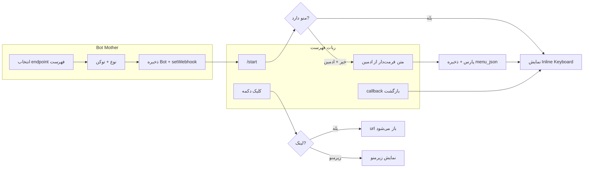

# ربات فهرست با دکمه شیشه‌ای (Glass Menu / List Bot)

## خلاصه نیازمندی‌ها

- **ساخت از ربات مادر:** انتخاب endpoint «فهرست با دکمه شیشه‌ای» → نوع (تلگرام/بله) → ارسال توکن → ربات ساخته می‌شود و webhook ست می‌شود.
- **ادمین/نفر اول:** فقط کسی که ربات را از ربات مادر ساخته (و در دیتابیس به عنوان `telegram_owner_chat_id` / `bale_owner_chat_id` ذخیره شده) مجاز است **متن منو** را بفرستد.
- **فرمت متن منو:** خطوط با پیشوند `-` / `--` / `---` (سطح) و بعد «عنوان» و اختیاری «: لینک».
- **تبدیل به دکمه:** متن پارس شده به درخت منو ذخیره و به صورت Inline Keyboard (دکمه شیشه‌ای) نمایش داده می‌شود؛ هر آیتم با لینک = دکمه با `url`؛ آیتم‌های دارای فرزند = دکمه با `callback_data` برای نمایش زیرمنو.
- **لینک‌ها:** URL، لینک ربات (t.me/... یا @bot)، کانال بله/تلگرام، گروه ایتا، سایت — همه به صورت یک لینک نرمال (مثلاً https) برای دکمه استفاده می‌شوند.
- **کاربر عادی:** هیچ‌کس به ربات متن نمی‌فرستد؛ همه فقط دکمه و دکمه شیشه‌ای می‌بینند (و در صورت ارسال متن: نادیده یا پیام «فقط از دکمه‌ها استفاده کنید»).
- **بازگشت و استارت:** دکمه «بازگشت به فهرست اصلی» و دستور `/start` همیشه منوی اصلی (سطح اول) را نشان می‌دهند.

---

## معماری

- **ادمین:** `chat_id === (bale_owner_chat_id || telegram_owner_chat_id)` با توجه به `origin`.
- **منو:** درخت در `menu_json`؛ هر نود: `title`, `link?`, `children?`. سطح از تعداد `-` در ابتدای خط به دست می‌آید.

---

## تغییرات پیشنهادی

### 1. دیتابیس

- **جدول `list_bot_configs`** (یا `glass_menu_bot_configs`):
  - `id`, `bot_id` (FK → bots), `menu_json` (JSON درخت منو), `raw_content` (text اختیاری برای نمایش به ادمین).
  - یک رکورد به ازای هر ربات فهرست؛ بعد از اولین پارس موفق از متن ادمین پر می‌شود.
- **رکورد در `webhook_endpoints`:**
  - `endpoint_id`: مثلاً `webhook-list-bot`
  - `name`: «فهرست با دکمه شیشه‌ای»
  - `route`: `/api/webhook-list-bot`
  - `requires_token`: true, `requires_bot_mother_id`: true, `requires_language`: false

(می‌توان با migration جدول و seeder/migration برای endpoint انجام داد.)

### 2. ربات مادر ([app/Http/Controllers/BotMotherController.php](app/Http/Controllers/BotMotherController.php))

- در **handleTokenInput** بعد از `save()` ربات، اگر `endpointId === 'webhook-list-bot'`:
  - همان مسیر معمول (بدون ویزارد محتوا مثل پرزنتر): ساخت URL وب‌هوک، `setWebhook`، آپدیت وضعیت وب‌هوک، ارسال پیام موفقیت.
  - در پیام موفقیت به کاربر توضیح داده شود: «به ربات برو، /start بزن؛ اگر سازنده هستی یک بار متن منو را به فرمت زیر بفرست تا دکمه‌ها ساخته شوند» + نمونه فرمت (مثل همان مثال شما با - و -- و --- و : لینک).

نیازی به state جدید برای «ورود محتوای منو» در ربات مادر نیست؛ تعریف/به‌روزرسانی منو فقط داخل خود ربات فهرست با ارسال متن توسط ادمین انجام می‌شود.

### 3. کنترلر ربات فهرست (جدید)

- **فایل جدید:** مثلاً `app/Http/Controllers/ListBotController.php` (یا `GlassMenuBotController`).
- **ورودی وب‌هوک:** مثل [PresenterBotController](app/Http/Controllers/PresenterBotController.php): دریافت `origin`, `token`, `bot_id` از request؛ ساخت `Telegram` با token؛ پیدا کردن `Bot` با همان token و `endpoint_id = 'webhook-list-bot'`.

**منطق:**

- **تعیین ادمین:**  
`$type === 'bale' ? $botItem->bale_owner_chat_id : $botItem->telegram_owner_chat_id` با `$bot->ChatID()` مقایسه شود.
- **وقتی پیام متنی است:**
  - اگر کاربر ادمین نیست → نادیده یا یک خط «فقط از دکمه‌ها استفاده کنید» و بدون تغییر منو.
  - اگر ادمین است و متن با الگوی منو شروع می‌شود (مثلاً خط اول با `-`):
    - پارس متن (سطرها → سطح از تعداد `-`، عنوان و لینک از الگوی `title` یا `title: link`).
    - نرمال‌سازی لینک: اگر با `@` شروع شد → `https://t.me/...`؛ اگر `t.me/...` بدون https → اضافه کردن https؛ لینک بله/ایتا/سایت بدون تغییر منطقی (در حد مجاز API همان url).
    - ساخت درخت منو و ذخیره در `list_bot_configs` (updateOrCreate با `bot_id`).
    - پاسخ به ادمین: «منو به‌روز شد» + ارسال همان پیام با Inline Keyboard بر اساس `menu_json`.
- **وقتی `/start` است:**
  - لود یا ساخت `ListBotConfig` برای این `bot_id`.
  - اگر `menu_json` خالی است:
    - برای ادمین: پیام راهنما + نمونه فرمت و درخواست ارسال متن منو.
    - برای غیرادمین: پیام «منو در حال آماده‌سازی است» (بدون دکمه یا فقط یک دکمه اختیاری).
  - اگر منو وجود دارد:
    - متن پیام: مثلاً عنوان ریشه (اولین خط سطح ۱ بدون لینک) یا یک جمله ثابت مثل «فهرست».
    - ساخت Inline Keyboard از سطح اول درخت: آیتمهای با `link` → دکمه با `url`؛ آیتمهای با `children` → دکمه با `callback_data` (مثلاً `list_bot_node_{index}`).
    - در انتهای کیبورد یک ردیف: «بازگشت به فهرست اصلی» با `callback_data: list_bot_back_main` (برای یکپارچگی؛ در استارت لازم نیست ولی در زیرمنوها استفاده می‌شود).
- **وقتی callback_query است:**
  - اگر `list_bot_back_main` → ارسال (یا edit) همان پیام منوی اصلی (سطح اول) برای همان چت.
  - اگر `list_bot_node_{index}` → نمایش زیرمنو: ردیف‌های دکمه برای `children[index]` به همان شکل (لینک = url، فرزند = callback برای سطح بعد یا همان الگو) + دکمه «بازگشت به فهرست اصلی».
  - محدودیت طول `callback_data` (مثلاً 64 بایت در تلگرام) را رعایت کنید؛ با index یا شناسه کوتاه کار کنید.
- **سایر پیام‌های متنی:** برای غیرادمین نادیده یا یک خط راهنما؛ برای ادمین اگر با `-` شروع نشد می‌توان همان راهنما یا «برای به‌روز کردن منو متن را به فرمت مشخص بفرست» را برگرداند.

### 4. پارسر متن منو

- **ورودی:** رشته چندخطی از ادمین.
- **قوانین:**
  - هر خط: `(N عدد -) + فاصله + عنوان + [اختیاری: ':' + فاصله + لینک]` یا `عنوان + فاصله + لینک` (اگر لینک با http/https/t.me/@ شروع شود می‌توان تشخیص داد).
  - سطح = تعداد `-` در ابتدای خط (۱ = ریشه، ۲ = سطح دوم، ۳ = سوم).
  - ساخت درخت: سطح ۲ بچه ریشه، سطح ۳ بچه آخرین سطح ۲، و غیره.
- **خروجی:** ساختار درخت برای `menu_json`، مثلاً:
  - `{ "title": "عنوان مادر", "children": [ { "title": "...", "link": "https://..." }, { "title": "...", "children": [ ... ] } ] }`
- این پارسر را می‌توان در یک کلاس جدا (مثلاً `App\Services\ListBotMenuParser` یا داخل همان کنترلر) پیاده‌سازی کرد تا تست و نگهداری راحت‌تر باشد.

### 5. روت و ثبت Endpoint

- در [routes/api.php](routes/api.php):  
`Route::post('/webhook-list-bot', [ListBotController::class, 'index']);`  
(اگر route در endpoint به صورت `/api/webhook-list-bot` است، پیشوند `/api` از طرف Laravel اضافه می‌شود طبق config.)
- اضافه کردن رکورد endpoint به جدول `webhook_endpoints` (migration یا seeder مشابه [ImportWebhookEndpointsDefault](app/Console/Commands/ImportWebhookEndpointsDefault.php)).

### 6. ارسال پیام با کیبورد (بله/تلگرام)

- استفاده از [BotHelper::sendTelegramInlineMessageWithButtons](app/Helpers/BotHelper.php) یا معادل بله برای ارسال/ویرایش پیام با آرایه دکمه‌ها؛ هر دکمه یا `url` دارد یا `callback_data`. برای ویرایش پیام بعد از callback از متد editMessageReplyMarkup / editMessageText مطابق کتابخانه Telegram/Bale استفاده شود.

---

## نکات امنیتی و فنی

- فقط `owner_chat_id` مجاز به ارسال متن منو است تا هر کاربری نتواند منو را عوض کند.
- لینک‌ها را قبل از قرار دادن در دکمه اعتبارسنجی کنید (فقط http/https و در صورت تمایل whitelist دامنه برای بله/ایتا) تا از جاوااسکریپت یا داده‌های خطرناک جلوگیری شود.
- طول متن دکمه‌ها و تعداد ردیف/دکمه را با محدودیت‌های API تلگرام/بله هماهنگ کنید.

---

## ترتیب پیشنهادی پیاده‌سازی

1. Migration جدول `list_bot_configs` + ثبت endpoint در `webhook_endpoints`.
2. سرویس/کلاس پارسر منو (ورودی متن، خروجی درخت JSON).
3. `ListBotController`: وب‌هوک، تشخیص ادمین، `/start`، متن ادمین (پارس + ذخیره + پاسخ با کیبورد)، callback (بازگشت به اصلی + نمایش زیرمنو).
4. در `BotMotherController`: شرط `webhook-list-bot` در handleTokenInput و پیام موفقیت راهنما.
5. تست دستی: ساخت ربات از مادر، استارت، ارسال متن فرمت‌دار توسط ادمین، بررسی دکمه‌ها و بازگشت به فهرست اصلی.

اگر بخواهید می‌توان در پلان بعدی جزئیات پارسر (regex/نمونه کد) یا ساختار دقیق `menu_json` را هم اضافه کرد.