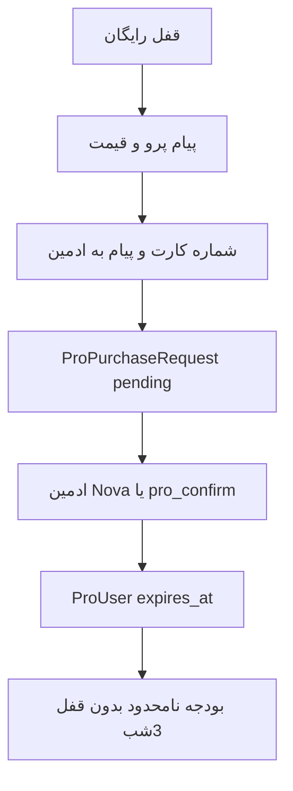

# رشدیار: حضور وب، متن دعوت، نسخهٔ پرو پر-کاربر

کاتالوگ فنی (`webhook-growth-companion`) و مستندات README از قبل هست. روی سایت زنده اگر ردیف `webhook_endpoints` نباشد دیده نمی‌شود؛ صفحهٔ جزئیات هم بدون `BotDetailsSeeder` خالی است. پرو هنوز وجود ندارد.



## ۱) حضور در bots.pardisania.ir و صفحهٔ ساخت

لیست `/` و `/bots` و ربات مادر از جدول `webhook_endpoints` خوانده می‌شود ([WelcomeController](app/Http/Controllers/WelcomeController.php)، [IntroController](app/Modules/BotOwner/Http/Controllers/IntroController.php)، [WebhookEndpointHelper](app/Helpers/WebhookEndpointHelper.php)).

- اگر روی سرور ردیف نیست: `php artisan db:seed --class=GrowthCompanionWebhookEndpointSeeder` یا `webhook-endpoints:import-default` (ایمپورتر ردیف موجود را دست نمی‌زند).
- ورود غنی صفحهٔ `/bot/webhook-growth-companion`: کلید `webhook-growth-companion` در [database/seeders/BotDetailsSeeder.php](database/seeders/BotDetailsSeeder.php) و [database/seeders/BotDetailsCompleteSeeder.php](database/seeders/BotDetailsCompleteSeeder.php) — `detailed_description`، `features`، `usage_instructions`، related (مثلاً روانشناسی / کتابخانه).
- چک‌لیست ساخت ربات جدید در [docs/BOT_CREATION_GUIDE.md](docs/BOT_CREATION_GUIDE.md) و `.cursorrules`: سیدر endpoint + جزئیات وب + کاتالوگ README. ویوی عمومی را برای هر نوع جداگانه عوض نمی‌کنیم.

روی سرور بعد از دیپلوی (بدون test):

```bash
php artisan db:seed --class=GrowthCompanionWebhookEndpointSeeder
php artisan db:seed --class=BotDetailsSeeder
php artisan db:seed --class=BotDetailsCompleteSeeder
php artisan cache:clear && php artisan route:clear && php artisan config:clear
```

بعد چک: `https://bots.pardisania.ir/` و `/bots` و `/bot/webhook-growth-companion` و `/start` ربات مادر.

## ۲) متن دعوت کانال

کلیدهای `invite_channel` / `invite_short` در [lang/fa/growth_companion.php](lang/fa/growth_companion.php) (+ ۱۴ زبان دیگر با نسخهٔ انگلیسی). پیش‌نویس فارسی برای ارسال در کانال:

```
رشدیار؛ همراه آرام تأمل روزانه

هر روز یک سؤال کوتاه از حوزه‌ای که خودت انتخاب می‌کنی: سلامت، کار، خانواده، مطالعه، معنویت یا هدف شخصی.
کارت امروز، ثبت حال با چند ضربه، مرور هفته بدون تشخیص پزشکی.

نسخهٔ رایگان برای شروع کافی است. اگر می‌خواهی همهٔ موضوعات را در یک روز پیش ببری و قفل نیمه‌شب نداشته باشی، رشدیار پرو ماهانه است.

ساختن ربات: https://bots.pardisania.ir/bots
معرفی: https://bots.pardisania.ir/bot/webhook-growth-companion
```

همین متن در [docs/features/GROWTH_COMPANION.md](docs/features/GROWTH_COMPANION.md) بخش «متن کانال» ذخیره می‌شود تا برای ارسال دستی آماده باشد. لینک نمونهٔ تلگرام/بله را اگر ربات عمومی دارید در سیدر جزئیات می‌گذاریم؛ وگرنه خالی می‌ماند.

## ۳) پرو پر-کاربر (قفل رایگان می‌ماند)

الگو: قفل کتابخانه ([BookLibraryController](app/Http/Controllers/BookLibraryController.php) + منوی پلن) + جداول آب‌وهوا (`pro_users` / `pro_purchase_requests`) + انقضای ماهانه مثل [BotUsers::isPro](app/Models/BotUsers.php) روی `expires_at`. جدول جدید رشد نمی‌سازیم. FK به `bots` اضافه نمی‌کنیم.

**قیمت** در [config/growth.php](config/growth.php):

- ماهانه: ۹۹٬۰۰۰ تومان، با تخفیف ۴۹٬۰۰۰ (همان مبلغ واریزی پیش‌فرض ماهانه)
- سالانه: ۳۰۰٬۰۰۰ تومان (کمتر از هزار تومان در روز)
- شماره کارت از `GROWTH_PRO_CARD` (env)؛ در گیت هاردکد نمی‌شود. تماس ادمین: `ADMIN_CONTACT_USERNAME` موجود.

**قفل رایگان (همه سر جایشان):** بودجهٔ روزانه ۱ یا ۲ موضوع، ریست ۳ صبح، حالت پیشرفته و جملهٔ AI. با برخورد به قفل: پیام پرو + دو دکمهٔ ماهانه/سالانه + کارت + «بعد از واریز به ادمین پیام بده». درخواست `pending`؛ ادمین با Nova یا `/pro_confirm {id}` تأیید می‌کند.

**پرو فعال:** `canOpenTopic` بودجه و `done_today` را رد می‌کند (بدون انتظار ۳ صبح)، advanced/AI آزاد. مرز هفته اگر کاربر خودش cadence هفتگی گذاشته بماند. بعد از انقضا دوباره قفل.

`confirmPurchase` در [ProServiceImpl](app/Services/ProServiceImpl.php) اگر `payment_info.months` باشد `expires_at` را ست می‌کند؛ درخواست آب‌وهوا بدون months مثل قبل بدون انقضا می‌ماند.

نقاط گیت در [GrowthCompanionController](app/Http/Controllers/GrowthCompanionController.php): بودجه (`gc:b` / `gc:q` / `gc:int:act` اگر از سقف رایگان رد شود)، `gc:adv`، `gc:ai`. دکمهٔ پرو در «بیشتر».

ترجمهٔ ۱۵ زبان. تست SQLite در [UsesGrowthCompanionSqlite](tests/UsesGrowthCompanionSqlite.php): برخورد به بودجه → متن پرو؛ با `ProUser` فعال و `expires_at` آینده → موضوع دوم همان روز باز است. `php artisan test` روی production اجرا نمی‌شود.

## ۴) کار ادمین بعد از واریز

مثل کتابخانه: نوتیف درخواست + لینک Nova + `/pro_confirm {id}`. پیام به کاربر: «پرو تا :date فعال شد». تمدید همان مسیر (درخواست جدید، انقضا از now).
