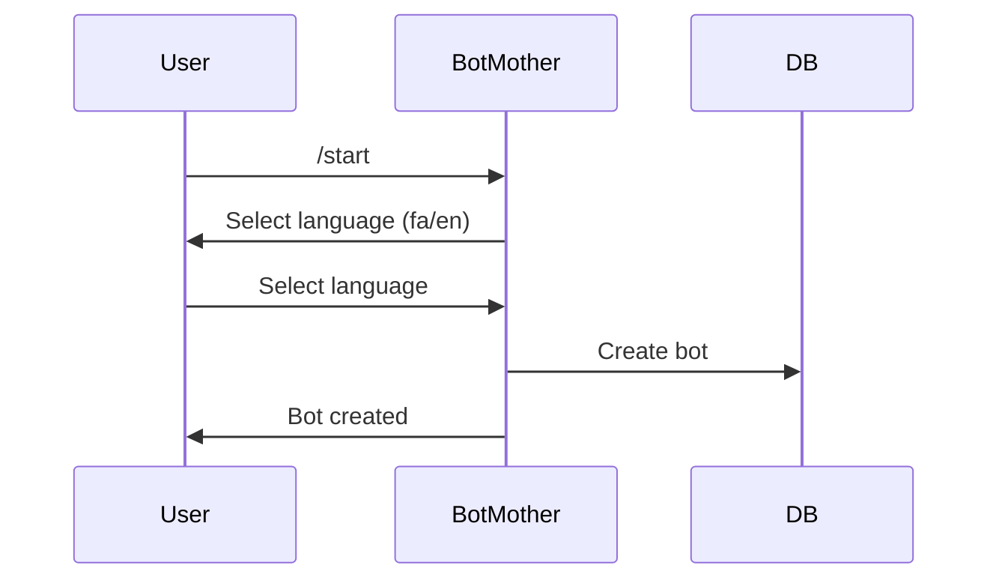
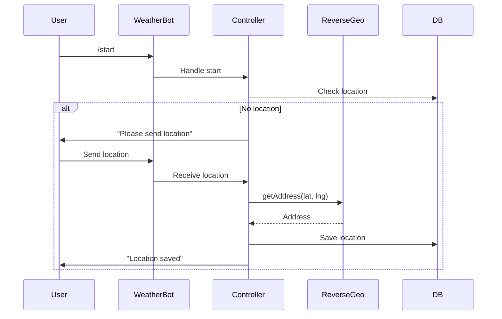
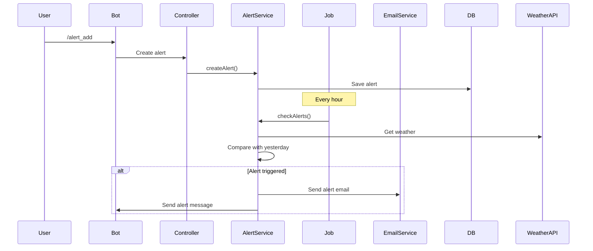
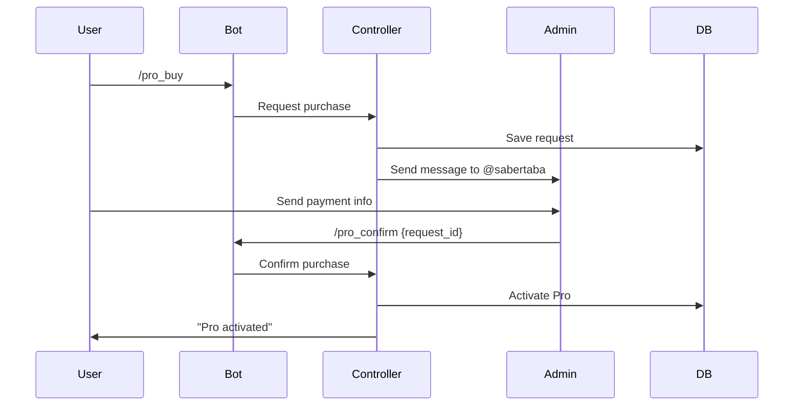

# پلن: سیستم کامل ربات هواشناسی با Location، Alert، Email و Pro

## اهداف کلی

1. **ساخت ربات**: فقط انتخاب زبان (فارسی/انگلیسی)
2. **استارت اول**: درخواست location اگر تنظیم نشده
3. **سیستم Location**: دریافت و ذخیره location از طریق ارسال نقطه
4. **سیستم Alert**: انواع هشدارهای آب و هوا با تنظیمات
5. **Job Scheduling**: چک کردن alerts هر یک ساعت
6. **سیستم Email**: احراز هویت و ارسال گزارش (مثل ربات نماز قضا)
7. **صفحه وب**: گزارش پیش‌بینی با تنظیمات کاربر
8. **محدودیت**: 3 alert برای کاربران عادی
9. **سیستم Pro**: ماژول عمومی برای همه ربات‌ها
10. **سیستم خرید Pro**: ثبت درخواست و تایید توسط مدیر

---

## بخش 1: ساخت ربات - فقط زبان

### تغییرات در BotMotherController

**فایل:** `app/Http/Controllers/BotMotherController.php`

- برای ربات هواشناسی (`weather-bot`)، فقط زبان را بپرسیم (فارسی/انگلیسی)
- حذف مراحل اضافی برای ربات هواشناسی

---

## بخش 2: Migration ها

### 2.1. Location در bot_users

**فایل:** `database/migrations/YYYY_MM_DD_HHMMSS_add_location_to_bot_users_table.php`

```php
- latitude (decimal 10,8, nullable)
- longitude (decimal 11,8, nullable)
- location_address (text, nullable)
- location_set_at (timestamp, nullable)
```

### 2.2. Weather Alerts

**فایل:** `database/migrations/YYYY_MM_DD_HHMMSS_create_weather_alerts_table.php`

```php
- id
- bot_user_id (foreign key)
- alert_type (enum: temperature, precipitation, wind, snow)
- comparison_type (enum: increase, decrease, absolute)
- threshold_value (decimal) - مثلاً 5 درجه یا 10 میلی‌متر
- time_hour (integer, nullable) - ساعت خاص (0-23)
- is_active (boolean, default true)
- last_triggered_at (timestamp, nullable)
- created_at, updated_at
```

### 2.3. Pro Users

**فایل:** `database/migrations/YYYY_MM_DD_HHMMSS_create_pro_users_table.php`

```php
- id
- bot_user_id (foreign key)
- bot_id (foreign key) - ربات مربوطه
- status (enum: pending, active, expired)
- purchase_requested_at (timestamp)
- purchase_confirmed_at (timestamp, nullable)
- confirmed_by_admin_id (integer, nullable)
- expires_at (timestamp, nullable)
- payment_info (json, nullable) - اطلاعات پرداخت
- created_at, updated_at
- unique(bot_user_id, bot_id)
```

### 2.4. Pro Purchase Requests

**فایل:** `database/migrations/YYYY_MM_DD_HHMMSS_create_pro_purchase_requests_table.php`

```php
- id
- bot_user_id (foreign key)
- bot_id (foreign key)
- user_identifier (string) - شناسه کاربر در پیام‌رسان
- payment_method (enum: card, crypto, other)
- payment_info (text, nullable)
- status (enum: pending, confirmed, rejected)
- admin_notes (text, nullable)
- created_at, updated_at
```

---

## بخش 3: Models

### 3.1. BotUsers

**فایل:** `app/Models/BotUsers.php`

- متد `getLocation()` - دریافت location
- متد `setLocation($lat, $lng, $address)` - ذخیره location
- متد `hasLocation()` - بررسی وجود location
- Relationship: `weatherAlerts()`
- Relationship: `proSubscriptions()`
- متد `isPro($botId)` - بررسی Pro بودن برای یک ربات
- متد `getActiveAlertsCount($botId)` - تعداد alerts فعال

### 3.2. WeatherAlert

**فایل جدید:** `app/Models/WeatherAlert.php`

- Relationship: `botUser()`
- متد `checkAndTrigger()` - چک کردن و trigger کردن alert
- Scope: `active()`

### 3.3. ProUser

**فایل جدید:** `app/Models/ProUser.php`

- Relationship: `botUser()`
- Relationship: `bot()`
- Scope: `active()`
- Scope: `forBot($botId)`

### 3.4. ProPurchaseRequest

**فایل جدید:** `app/Models/ProPurchaseRequest.php`

- Relationship: `botUser()`
- Relationship: `bot()`
- Scope: `pending()`

---

## بخش 4: Services

### 4.1. ReverseGeocodingService

**فایل جدید:** `app/Services/ReverseGeocodingServiceImpl.php`

- استفاده از OpenStreetMap Nominatim API
- متد `getAddressFromCoordinates($lat, $lng)`
- Cache کردن نتایج

**Interface:** `app/Interfaces/Services/ReverseGeocodingService.php`

### 4.2. WeatherAlertService

**فایل جدید:** `app/Services/WeatherAlertServiceImpl.php`

- متد `createAlert($botUserId, $alertData)` - ایجاد alert
- متد `checkAlerts()` - چک کردن همه alerts
- متد `triggerAlert($alert, $weatherData)` - trigger کردن alert
- متد `compareWeather($current, $previous, $alert)` - مقایسه آب و هوا
- محدودیت 3 alert برای کاربران عادی

**Interface:** `app/Interfaces/Services/WeatherAlertService.php`

### 4.3. ProService (ماژول عمومی)

**فایل جدید:** `app/Services/ProServiceImpl.php`

- متد `isPro($botUserId, $botId)` - بررسی Pro بودن
- متد `canUseFeature($botUserId, $botId, $feature)` - بررسی دسترسی به فیچر
- متد `requestPurchase($botUserId, $botId, $userIdentifier)` - ثبت درخواست خرید
- متد `confirmPurchase($requestId, $adminId)` - تایید خرید توسط مدیر
- متد `getProFeatures($botId)` - لیست فیچرهای Pro برای یک ربات

**Interface:** `app/Interfaces/Services/ProService.php`

### 4.4. EmailService (استفاده از کد موجود)

**فایل:** `app/Services/MailtrapEmailService.php` (موجود)

- استفاده از کد موجود ربات نماز قضا
- متد `sendWeatherAlertEmail($user, $alert, $weatherData)`
- متد `sendWeatherReportEmail($user, $reportData)`

### 4.5. WeatherComparisonService

**فایل جدید:** `app/Services/WeatherComparisonServiceImpl.php`

- متد `compareWithYesterday($currentWeather, $location)` - مقایسه با دیروز
- متد `getTemperatureChange($current, $previous)` - تغییر دما
- متد `getPrecipitationChange($current, $previous)` - تغییر بارش
- متد `getWindChange($current, $previous)` - تغییر باد

**Interface:** `app/Interfaces/Services/WeatherComparisonService.php`

---

## بخش 5: Jobs

### 5.1. CheckWeatherAlertsJob

**فایل جدید:** `app/Jobs/CheckWeatherAlertsJob.php`

- اجرا هر یک ساعت
- دریافت همه alerts فعال
- دریافت weather data برای هر location
- مقایسه با داده‌های قبلی
- Trigger کردن alerts در صورت تطابق
- ارسال ایمیل/پیام

### 5.2. Schedule در Kernel

**فایل:** `app/Console/Kernel.php`

```php
$schedule->job(new CheckWeatherAlertsJob)->hourly();
```

---

## بخش 6: Controllers

### 6.1. WeatherController

**فایل:** `app/Http/Controllers/WeatherController.php`

#### دستورات:

1. **`/start`**:

   - اگر location نداریم، درخواست location
   - نمایش پیام خوش‌آمدگویی

2. **`/location`**:

   - درخواست ارسال location
   - دریافت location از message
   - Reverse geocoding
   - ذخیره location

3. **`/current`**:

   - استفاده از location ذخیره شده
   - دریافت weather data
   - نمایش اطلاعات

4. **`/forecasting`**:

   - استفاده از location ذخیره شده
   - دریافت forecast data

5. **`/alert`**:

   - نمایش لیست alerts
   - دکمه "افزودن Alert"
   - محدودیت 3 alert (Pro: نامحدود)

6. **`/alert_add`**:

   - انتخاب نوع alert (دما، بارش، باد، برف)
   - تنظیم threshold
   - تنظیم ساعت (اختیاری)
   - ذخیره alert

7. **`/alert_delete`**:

   - حذف alert

8. **`/email`**:

   - اگر ایمیل دارد، نمایش تنظیمات
   - اگر ندارد، درخواست ایمیل
   - احراز هویت (مثل ربات نماز قضا)

9. **`/pro`**:

   - نمایش وضعیت Pro
   - اگر Pro نیست، دکمه خرید
   - اگر Pro است، نمایش تاریخ انقضا

10. **`/pro_buy`**:

    - ثبت شناسه کاربر
    - ارسال پیام به @sabertaba
    - نمایش اطلاعات پرداخت

### 6.2. WeatherAlertController (Admin)

**فایل جدید:** `app/Http/Controllers/Admin/WeatherAlertController.php`

- تایید/رد درخواست‌های خرید Pro
- مشاهده لیست کاربران Pro
- مدیریت alerts

### 6.3. WeatherWebController

**فایل جدید:** `app/Http/Controllers/WeatherWebController.php`

- صفحه گزارش وب: `/weather/report/{token}`
- نمایش پیش‌بینی با تنظیمات کاربر
- نمایش alerts فعال
- نمودار تغییرات

---

## بخش 7: Repositories

### 7.1. Weather Repositories

**فایل:** `app/Repositories/WeatherTomorrowApiRepositoryImpl.php`

**فایل:** `app/Repositories/WeatherOpenWeatherApiRepositoryImpl.php`

- تغییر signature برای دریافت `$latitude, $longitude`
- استفاده از location کاربر

### 7.2. WeatherHistoryRepository

**فایل جدید:** `app/Repositories/WeatherHistoryRepositoryImpl.php`

- ذخیره تاریخچه weather data برای مقایسه
- متد `getYesterdayWeather($lat, $lng)`
- متد `saveWeatherData($lat, $lng, $data)`

---

## بخش 8: Views

### 8.1. Email Templates

**فایل:** `resources/views/emails/weather-alert.blade.php`

- قالب ایمیل alert (فارسی و انگلیسی)

**فایل:** `resources/views/emails/weather-report.blade.php`

- قالب ایمیل گزارش (فارسی و انگلیسی)

### 8.2. Web Report Page

**فایل:** `resources/views/weather/report.blade.php`

- صفحه گزارش وب با نمودارها
- نمایش alerts
- نمایش پیش‌بینی

---

## بخش 9: ترجمه‌ها

**فایل‌ها:** `lang/fa/bot.php`, `lang/en/bot.php`

### ترجمه‌های جدید:

```php
// Location
'location_request' => '...',
'location_saved' => '...',
'location_not_set' => '...',

// Alerts
'alert_add' => '...',
'alert_list' => '...',
'alert_limit_reached' => '...',
'alert_triggered' => '...',

// Pro
'pro_status' => '...',
'pro_buy' => '...',
'pro_features' => '...',
'pro_purchase_requested' => '...',
```

---

## بخش 10: Helper Classes

### 10.1. ProHelper (ماژول عمومی)

**فایل جدید:** `app/Helpers/ProHelper.php`

- متد `checkProAccess($botUserId, $botId, $feature)` - بررسی دسترسی
- متد `requirePro($botUserId, $botId, $feature)` - الزام Pro
- متد `getProMessage($feature)` - پیام نیاز به Pro

### 10.2. StringHelper

**فایل:** `app/Helpers/StringHelper.php`

- اضافه کردن دستورات جدید به `getWeatherBotCommandsAsPostfixForMessages()`

---

## بخش 11: Config

### 11.1. Pro Features Config

**فایل جدید:** `config/pro_features.php`

```php
return [
    'weather-bot' => [
        'unlimited_alerts' => true,
        'advanced_reports' => true,
    ],
    'prayer-bot' => [
        'email_after_year' => true,
    ],
];
```

### 11.2. Admin Contact

**فایل:** `.env`

```env
PRO_ADMIN_CONTACT=@sabertaba
```

---

## Flow Diagrams

### Flow: ساخت ربات



### Flow: استارت اول و Location



### Flow: Alert System



### Flow: Pro Purchase



---

## نکات مهم

1. **Location**: فقط از طریق ارسال نقطه، بدون وارد کردن نام شهر
2. **Alerts**: مقایسه با روز قبل (24 ساعت گذشته)
3. **Email**: استفاده از سیستم موجود ربات نماز قضا
4. **Pro**: ماژول عمومی که در همه ربات‌ها قابل استفاده است
5. **Job**: هر یک ساعت چک کردن alerts
6. **محدودیت**: 3 alert برای کاربران عادی، نامحدود برای Pro
7. **صفحه وب**: با token یکتا برای هر کاربر
8. **Admin Contact**: از env خوانده شود

---

## فایل‌های جدید

### Migrations

1. `add_location_to_bot_users_table.php`
2. `create_weather_alerts_table.php`
3. `create_pro_users_table.php`
4. `create_pro_purchase_requests_table.php`
5. `create_weather_history_table.php`

### Models

1. `WeatherAlert.php`
2. `ProUser.php`
3. `ProPurchaseRequest.php`
4. `WeatherHistory.php`

### Services

1. `ReverseGeocodingServiceImpl.php`
2. `WeatherAlertServiceImpl.php`
3. `ProServiceImpl.php`
4. `WeatherComparisonServiceImpl.php`

### Repositories

1. `WeatherHistoryRepositoryImpl.php`

### Controllers

1. `Admin/WeatherAlertController.php`
2. `WeatherWebController.php`

### Jobs

1. `CheckWeatherAlertsJob.php`

### Helpers

1. `ProHelper.php`

### Config

1. `config/pro_features.php`

### Views

1. `emails/weather-alert.blade.php`
2. `emails/weather-report.blade.php`
3. `weather/report.blade.php`

---

## فایل‌های تغییر یافته

1. `app/Models/BotUsers.php`
2. `app/Repositories/WeatherTomorrowApiRepositoryImpl.php`
3. `app/Repositories/WeatherOpenWeatherApiRepositoryImpl.php`
4. `app/Services/WeatherTomorrowApiServiceImpl.php`
5. `app/Services/WeatherOpenWeatherMapApiServiceImpl.php`
6. `app/Http/Controllers/WeatherController.php`
7. `app/Http/Controllers/BotMotherController.php`
8. `app/Helpers/StringHelper.php`
9. `app/Console/Kernel.php`
10. `app/Providers/AppServiceProvider.php`
11. `lang/fa/bot.php`
12. `lang/en/bot.php`
13. `.env.example`