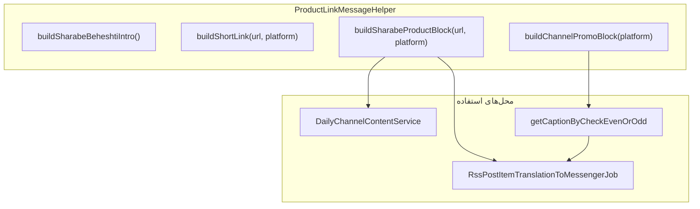

# اعمال لینک کوتاه محصول شراب بهشتی در production

## نتیجه تست شما

| فرمت | نتیجه |
|------|--------|
| HTML + آیکون `xf-eitaa` | رد — تگ `<i>` خام دیده می‌شود |
| **HTML ساده: `مشاهده صفحه محصول`** | **تأیید — پیام ۲ و ۵** |
| URL خام بلند | رد |

فرمت برنده در API ایتا: `<a href="...">مشاهده صفحه محصول</a>` با `parse_mode=html`.

---

## معماری پیشنهادی



توسعه [`EitaaProductLinkMessageHelper`](app/Helpers/EitaaProductLinkMessageHelper.php) به **`ProductLinkMessageHelper`** (یا همان فایل با متدهای جدید) با فرمت **وابسته به پلتفرم**:

| پلتفرم | فرمت لینک کوتاه | parse_mode |
|--------|-----------------|------------|
| `eitaa` | `<a href="url">مشاهده صفحه محصول</a>` | `html` |
| `telegram` | `<a href="url">مشاهده صفحه محصول</a>` | `html` |
| `bale` | `[مشاهده صفحه محصول](url)` | `html` یا markdown بسته به API بله |
| `splus` / سایر | `مشاهده صفحه محصول: url` (fallback متنی) | — |

متن انگیزشی زمینه‌ای شراب بهشتی (طبق خواسته شما):

```
به سایت شراب بهشتی سر بزنید؛ صفحه محصول را ببینید، فایل‌های بیشتری بشنوید و با یک صلوات و ماندن چند دقیقه در صفحه به رتبه سایت کمک کنید.
```

متد کلیدی:

```php
ProductLinkMessageHelper::buildSharabeProductBlock(string $shareUrl, string $platformSlug): string
// = intro + shortLink (بدون آیکون)
```

---

## ۱. کانفیگ متمرکز لینک کانال‌ها

فایل جدید: [`config/sharabe_beheshti.php`](config/sharabe_beheshti.php)

```php
'channels' => [
    'eitaa'    => ['url' => 'https://eitaa.com/sharabebeheshti',    'label' => 'کانال ایتا'],
    'bale'     => ['url' => 'https://ble.ir/sharabebeheshti',       'label' => 'کانال بله'],
    'telegram' => ['url' => 'https://t.me/sharabebeheshti_ir',      'label' => 'کانال تلگرام'],
    'splus'    => ['url' => env('SHARABE_BEHESHTI_SPLUS_URL', ''),  'label' => 'کانال سروش'],
],
'product_link_label' => 'مشاهده صفحه محصول',
```

لینک سروش فعلاً از env — بعداً پر می‌شود؛ اگر خالی بود در بلوک کانال نمایش داده نمی‌شود.

---

## ۲. بلوک لینک کانال زیر پست‌ها

بازنویسی [`SharabeBeheshtiMp3Controller::getCaptionByCheckEvenOrOdd`](app/Http/Controllers/SharabeBeheshtiMp3Controller.php):

- امضای جدید: `getCaptionByCheckEvenOrOdd(int $number, ?string $platformSlug = null)`
- **زوج:** `ProductLinkMessageHelper::buildChannelPromoBlock($platformSlug)` — لینک کوتاه هر پیام‌رسان (نه URL خام)
- **فرد:** همان `"انتشار حداکثری"`
- backward compatible: اگر `$platformSlug` null باشد، همه کانال‌ها با فرمت کوتاه (رفتار فعلی even-id ولی خواناتر)

نمونه خروجی ایتا:

```
کانال ایتا | کانال بله | کانال تلگرام
(هر کدام لینک کوتاه کلیک‌پذیر)
```

---

## ۳. جریان اصلی RSS — [`RssPostItemTranslationToMessengerJob`](app/Jobs/RssPostItemTranslationToMessengerJob.php)

### بلوک شراب بهشتی (خطوط ۱۵۶–۱۹۶)

**قبل:**
```php
$captionSharabMedia = $hashtags . ' ' . $rssItemHashtags . "\n" . $effectiveUrl . "\n - #" . $slug;
$caption = $captionPrefix . "\n" . $captionSharabMedia;
```

**بعد:**
```php
$productBlock = ProductLinkMessageHelper::buildSharabeProductBlock($effectiveUrl, $mediumSlug);
$captionSharabMedia = $hashtags . ' ' . $rssItemHashtags . "\n" . $productBlock . "\n - #" . $slug;
$captionPrefix = SharabeBeheshtiMp3Controller::getCaptionByCheckEvenOrOdd($id, $mediumSlug);
```

### parse_mode برای ایتا/تلگرام

[`BotHelper::sendAnyFileMessageEitaa`](app/Helpers/BotHelper.php) — افزودن `$parseMode` (مشابه `sendMessageEitaaSupport` که قبلاً اضافه شده).

[`BotBuilder`](app/Builders/BotBuilder.php) — `setParseMode(?string)` و پاس‌دادن به `sendAnyFileMessageEitaa` وقتی `BotType() == 'eitaa'`.

در Job قبل از `sendAudio()`:
```php
if (ProductLinkMessageHelper::needsParseMode($mediumSlug)) {
    $botBuilder->setParseMode('html');
}
```

### پیام متنی اولیه RSS (خط ۶۱)

برای پست‌های `sharabebeheshti.ir`، جایگزینی `post->link` خام در [`RssHelper::createMessage`](app/Helpers/RssHelper.php) یا post-process در Job:

```php
// اگر لینک شراب بهشتی است → productBlock به‌جای URL خام
```

---

## ۴. کانال روزانه — [`DailyChannelContentService`](app/Services/DailyChannelContentService.php)

متد جدید: `getRandomSharabeBeheshtiTextForPlatform(string $platformSlug)`

- به‌جای لینک MP3 مستقیم (`$item->link`)، `buildSharabeBeheshtiShareUrlById($item->id, $platformSlug)` + `buildSharabeProductBlock`
- متد فعلی `getRandomSharabeBeheshtiText()` برای بله/تلگرام بدون تغییر یا delegate به نسخه platform-aware

[`PostDailyVerseToChannels`](app/Console/Commands/PostDailyVerseToChannels.php) — هنگام ارسال ایتا:
```php
BotHelper::sendMessageEitaaSupport($text, $token, $chatId, 'eitaa', 'html');
```

---

## ۵. کامند تست — به‌روزرسانی جزئی

[`TestEitaaSharabeBeheshtiProductLink`](app/Console/Commands/TestEitaaSharabeBeheshtiProductLink.php):

- پیش‌فرض ارسال فقط **variant 2** (HTML ساده)
- variantهای ۱ و ۳ اختیاری با `--all-variants` برای مقایسه

---

## ۶. خارج از scope این PR

- آیکون `xf-eitaa` (رد شده در تست)
- تغییر `rss_channels.target_id=8419225` (چت خصوصی — جداگانه در DB اصلاح شود)
- محصولات غیر شراب بهشتی (ساختار helper طوری باشد که بعداً قابل گسترش باشد)

---

## ترتیب پیاده‌سازی

1. `config/sharabe_beheshti.php` + گسترش Helper
2. `getCaptionByCheckEvenOrOdd` با لینک کانال کوتاه + سروش
3. `BotHelper` / `BotBuilder` — parse_mode در sendFile
4. `RssPostItemTranslationToMessengerJob` — product block + channel promo
5. `DailyChannelContentService` + `PostDailyVerseToChannels`
6. به‌روزرسانی کامند تست
7. تست روی سرور: `php artisan app:test-eitaa-sharabe-beheshti-product-link --variant=2 --chat-id=CHANNEL_ID`

---

## فایل‌های اصلی

| فایل | تغییر |
|------|--------|
| [`app/Helpers/EitaaProductLinkMessageHelper.php`](app/Helpers/EitaaProductLinkMessageHelper.php) | گسترش به ProductLinkMessageHelper |
| [`config/sharabe_beheshti.php`](config/sharabe_beheshti.php) | جدید |
| [`app/Http/Controllers/SharabeBeheshtiMp3Controller.php`](app/Http/Controllers/SharabeBeheshtiMp3Controller.php) | caption + platform |
| [`app/Jobs/RssPostItemTranslationToMessengerJob.php`](app/Jobs/RssPostItemTranslationToMessengerJob.php) | جایگزینی URL |
| [`app/Helpers/BotHelper.php`](app/Helpers/BotHelper.php) | parse_mode در sendFile |
| [`app/Builders/BotBuilder.php`](app/Builders/BotBuilder.php) | setParseMode |
| [`app/Services/DailyChannelContentService.php`](app/Services/DailyChannelContentService.php) | لینک محصول |
| [`app/Console/Commands/PostDailyVerseToChannels.php`](app/Console/Commands/PostDailyVerseToChannels.php) | parse_mode ایتا |
