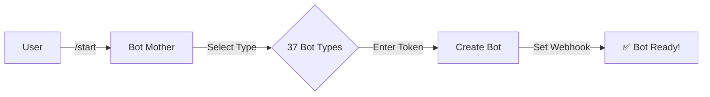
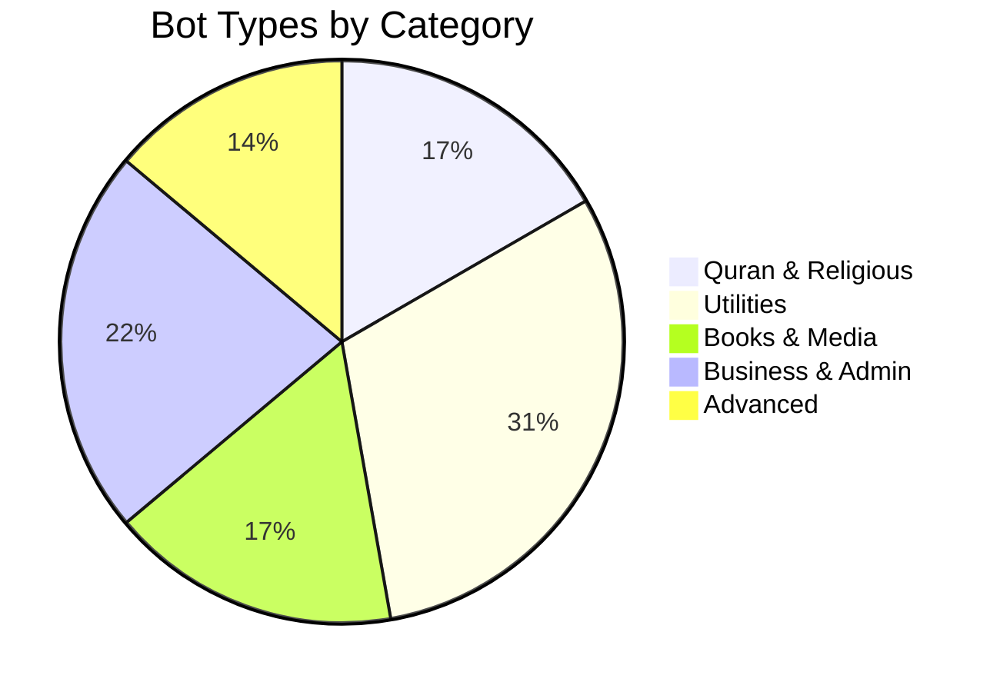

# 🤖 Bot Generator - پلتفرم ربات‌ساز چندمنظوره

<p align="center">
  
</p>

<p align="center">
  <a href="https://github.com/saber13812002/bot-generator-bale-telegram-laravel-10/stargazers">
    
  </a>
  <a href="https://github.com/saber13812002/bot-generator-bale-telegram-laravel-10/network">
    
  </a>
  <a href="https://github.com/saber13812002/bot-generator-bale-telegram-laravel-10/issues">
    
  </a>
  <a href="https://hamibash.com/quran_hefz_bale_telegram_bot">
    
  </a>
</p>

<p align="center">
  <a href="https://bots.pardisania.ir">🌐 Live Demo</a>
  ·
  <a href="https://saber-tabatabaee.medium.com">📝 Medium Blog</a>
  ·
  <a href="https://vrgl.ir/hp4xr">📖 Virgool Blog</a>
</p>

---

## 🌟 The Vision | چشمانداز

> **"One Codebase, Every Messenger, Infinite Possibilities"**
> 
> **"یک سورس کد، همه پیام‌رسان‌ها، امکانات نامحدود"**

This project isn't just another bot framework. It's a **complete bot-generation ecosystem** that allows anyone — from a student in Tehran to a developer in Berlin — to create, deploy, and scale messenger bots without writing a single line of code.

این پروژه فقط یک فریمورک ربات نیست. یک **اکوسیستم کامل ربات‌ساز** است که به هر کسی اجازه می‌دهد بدون نوشتن حتی یک خط کد، ربات‌های پیام‌رسان بسازد، راه‌اندازی کند و مقیاس‌پذیر کند.

### 🎯 What Makes This Special? | چه چیزی این را ویژه می‌کند؟

| 🇮🇷 فارسی | 🇬🇧 English |
|-----------|-------------|
| 🤖 **ربات مادر هوشمند** - رباتی که خودش ربات می‌سازد! | 🤖 **Intelligent Mother Bot** - A bot that builds bots! |
| 🌐 **چهار پیام‌رسان** - تلگرام، بله، گپ، ایتا با یک کد | 🌐 **Four Messengers** - Telegram, Bale, Gap, Eitaa in one codebase |
| 🎨 **۳۷ نوع ربات** - از قرآن تا هواشناسی، ارسال به کانال و رشدیار | 🎨 **37 Bot Types** - From Quran to Weather, Channel Poster and Growth Companion |
| 🔐 **احراز هویت OTP** - امنیت با کد یکبارمصرف بله | 🔐 **OTP Authentication** - Secure Bale OTP verification |
| 🌍 **۱۸ زبان زنده** - پشتیبانی از ۱۸ زبان دنیا | 🌍 **18 Languages** - Multi-language support |
| 🆓 **Pro System** - رایگان با قابلیت ارتقا | 🆓 **Pro System** - Free with upgrade options |
| 📊 **Nova Admin Panel** - مدیریت حرفه‌ای با Laravel Nova | 📊 **Nova Admin Panel** - Professional management |
| 🚀 **یک دستور کلیک** - مستقرسازی در چند ثانیه | 🚀 **One-Click Deploy** - Deploy in seconds |

---

## 💝 Support The Vision | حمایت از چشمانداز

<p align="center">
  <a href="https://hamibash.com/quran_hefz_bale_telegram_bot">
    
  </a>
</p>

Your donation helps keep this platform free and open-source for everyone.  
حمایت شما به ادامه‌ی این پروژه به صورت رایگان و متن‌باز برای همه کمک می‌کند.

---

## 🤖 Bot Mother | ربات مادر

The heart of this platform is **Bot Mother** — a bot that creates, configures, and deploys new bots automatically. Just provide a token from BotFather and choose your bot type!

قلب این پلتفرم **ربات مادر** است - رباتی که ربات‌های جدید را به صورت خودکار می‌سازد، تنظیم می‌کند و مستقر می‌کند. فقط کافیست توکن خود را از BotFather دریافت کنید و نوع ربات خود را انتخاب کنید!



### Two Ways to Create | دو روش ساخت

1. **🤖 Via Bot Mother** (Telegram/Bale) - Interactive wizard in chat
2. **🌐 Via Web Panel** ([bots.pardisania.ir/bots](https://bots.pardisania.ir/bots)) - Web interface with Pro features

---

## 📋 Complete Bot Catalog | کاتالوگ کامل ربات‌ها

### 📖 Quran & Religious | قرآن و مذهبی

| # | Bot Name | 🇬🇧 Description | 🇮🇷 توضیحات |
|---|----------|-----------------|------------|
| 1 | **📖 Quran Bot** | Read, memorize & search the Holy Quran in 18 languages | مطالعه، حفظ و جستجو در قرآن با ۱۸ زبان |
| 2 | **📜 Hadith Bot** | Advanced search in Shia Hadith books | جستجوی پیشرفته در کتب حدیث شیعه |
| 3 | **📚 Nahj al-Balagha Bot** | Explore sermons, letters & wisdom of Imam Ali (AS) | خطبه‌ها، نامه‌ها و حکمت‌های نهج البلاغه |
| 4 | **🕌 Prayer Qadha Bot** | Track missed prayers with smart detection | ثبت و پیگیری هوشمند نماز قضا |
| 5 | **🍷 Sharabe Beheshti** | Daily audio content: Quran, Dua, Nahj | پخش روزانه محتوای صوتی مذهبی |
| 6 | **🕋 Mawkib Finder** | Find Arbaeen processions with OTP auth | یافتن موکب‌های اربعین با احراز هویت |

### 🌤️ Utilities | ابزارهای کاربردی

| # | Bot Name | 🇬🇧 Description | 🇮🇷 توضیحات |
|---|----------|-----------------|------------|
| 7 | **🌤️ Weather Bot** | 16-hour forecast with customizable alerts | پیش‌بینی ۱۶ ساعته با هشدار قابل تنظیم |
| 8 | **🎤 Presenter Bot** | Sequential content delivery for courses | ارائه محتوای ترتیبی برای دوره‌های آموزشی |
| 9 | **⭐ Rating Bot** | Collect 1-5 ratings from users | نظر سنجی با امتیاز ۱ تا ۵ |
| 10 | **🧠 Psychology Test Bot** | Create & take psychology tests | تست روانشناسی با سوالات ۵ گزینه‌ای |
| 11 | **📋 List Bot** | Tree menu with inline buttons | منوی درختی با دکمه‌های شیشه‌ای |
| 12 | **📝 Content Submission** | Submit content → approve → publish | دریافت محتوا، تایید گروهی، انتشار در کانال |
| 13 | **📰 RSS Feed Bot** | Auto-publish RSS feeds with translation | انتشار خودکار فیدهای RSS با ترجمه |
| 14 | **📖 Blog Bot** | Connect CMS to messenger | اتصال سیستم مدیریت محتوا به پیام‌رسان |
| 15 | **📖 Get Chat ID** | Show chat/channel/group IDs | نمایش شناسه چت، کانال و گروه |
| 16 | **🏛️ MP Contact** | Tickets and polls for an MP office | ارتباط مردمی با نماینده مجلس |
| 17 | **📤 Channel Poster** | Post text/photo/audio/video from Bale private chat to a channel | ارسال مطلب از خصوصی بله به کانال |

### 📚 Books & Media | کتاب و رسانه

| # | Bot Name | 🇬🇧 Description | 🇮🇷 توضیحات |
|---|----------|-----------------|------------|
| 18 | **📚 Smart Book Library** | AI Book Coach, audio summaries, plans | کتابخانه هوشمند با خلاصه صوتی |
| 19 | **📖 Book Library Reader** | Dedicated reader bot for book delivery | ربات کتابخوان اختصاصی |
| 20 | **📖 Book Pixel** | Share book pages one by one | اشتراک‌گذاری صفحه به صفحه کتاب |
| 21 | **📖 Poem Bot** | Poetry & music management | مدیریت شعر و موسیقی |
| 22 | **📖 Audio Book Bot** | Audio book management | مدیریت کتاب‌های صوتی |
| 23 | **🎵 Song Sara Bot** | Music & playlist management | مدیریت موسیقی و پلی‌لیست |

### 👔 Business & Admin | کسب و کار و مدیریت

| # | Bot Name | 🇬🇧 Description | 🇮🇷 توضیحات |
|---|----------|-----------------|------------|
| 24 | **👔 Personnel Registration** | Register personnel via bot | ثبت‌نام پرسنل از طریق ربات |
| 25 | **👨‍💼 Personnel Admin** | View & manage registrations | مدیریت ثبت‌نام پرسنل |
| 26 | **🎯 Mission Bot** | Task & mission management | مدیریت ماموریت‌ها و وظایف |
| 27 | **🎬 Mission Media** | Educational media upload | آپلود مدیاهای آموزشی |
| 28 | **✅ Task Approval** | Approve/reject tasks | تایید و رد وظایف |
| 29 | **🤖 Admin Bots** | Personal bot management | مدیریت ربات‌های شخصی |
| 30 | **📢 Admin Daily Channel** | Auto-post verse/hadith/nahj daily | ارسال خودکار محتوای دینی روزانه |
| 31 | **📺 Admin Channel Media Queue** | Dynamic media queue scheduling | صف رسانه پویا |

### 🛠️ Advanced | پیشرفته

| # | Bot Name | 🇬🇧 Description | 🇮🇷 توضیحات |
|---|----------|-----------------|------------|
| 32 | **🌐 Social Bot** | Cross-platform social media posting | انتشار در شبکه‌های اجتماعی |
| 33 | **🤖 Bot Kids** | Child bot management | مدیریت ربات‌های فرزند |
| 34 | **📢 Admin Bot** | Multi-messenger admin panel | پنل مدیریت چندپیام‌رسانه |
| 35 | **✅ RSS Admin Bot** | RSS feed management for admins | مدیریت فید RSS ادمین |
| 36 | **📱 Social Publish** | Chrome Extension integration | یکپارچه‌سازی با افزونه کروم |
| 37 | **🌱 Growth Companion** | Daily topic board with checkboxes, intensity budget, weekly review | رشدیار: تختهٔ روزانه با چک‌باکس، بودجهٔ شدت سؤال، مرور هفته |

---

## 🏗️ Architecture | معماری

```
┌─────────────────────────────────────────────────────┐
│                   Messenger Layer                    │
│  ┌─────────┐  ┌──────┐  ┌─────┐  ┌───────┐        │
│  │ Telegram│  │ Bale │  │ Gap │  │ Eitaa │        │
│  └────┬────┘  └──┬───┘  └──┬──┘  └───┬───┘        │
└───────┼──────────┼─────────┼──────────┼────────────┘
        │          │         │          │
┌───────┴──────────┴─────────┴──────────┴────────────┐
│                 Bot Mother (Core)                    │
│  ┌──────────────────────────────────────────────┐   │
│  │         BotCreationWorkflowService             │   │
│  │  ┌─────────┐  ┌──────────┐  ┌─────────────┐  │   │
│  │  │Chat     │  │Web       │  │Field        │  │   │
│  │  │Renderer │  │Renderer  │  │Registry     │  │   │
│  │  └─────────┘  └──────────┘  └─────────────┘  │   │
│  └──────────────────────────────────────────────┘   │
└─────────────────────────────────────────────────────┘
        │
┌───────┴────────────────────────────────────────────┐
│              30+ Bot Controllers                     │
│  Quran │ Weather │ Prayer │ Hadith │ ...            │
└─────────────────────────────────────────────────────┘
```

### Tech Stack | تکنولوژی‌ها

| لایه | تکنولوژی |
|------|----------|
| **Backend** | Laravel 10 + PHP 8.1+ |
| **Database** | MySQL + Fulltext Search |
| **Admin Panel** | Laravel Nova |
| **Messengers** | Telegram Bot API, Bale Bot API |
| **OTP Service** | Bale OTP (Safir) |
| **Translation** | OneAPI Translation Service |
| **Weather APIs** | OpenWeatherMap, Tomorrow.io |
| **Search** | Laravel Fulltext + MySQL FULLTEXT |

---

## 🚀 Quick Start | شروع سریع

```bash
# Clone
git clone https://github.com/saber13812002/bot-generator-bale-telegram-laravel-10.git
cd bot-generator-bale-telegram-laravel-10

# Install
composer install
cp .env.example .env
php artisan key:generate

# Database
php artisan migrate
php artisan db:seed

# Run
php artisan serve
```

---

## 📜 Legacy Version | نسخه قدیمی

Looking for the original README? [Click here](README_LEGACY.md)
نسخه قبلی README را می‌خواهید؟ [اینجا کلیک کنید](README_LEGACY.md)

---

## � Documentation | مستندات

| Document | Description |
|----------|-------------|
| [📖 Bot Creation Guide](docs/BOT_CREATION_GUIDE.md) | Step-by-step guide to create new bots |
| [📖 Bot Types Guide](docs/BOT_TYPES_GUIDE.md) | Complete list of bot endpoints |
| [📖 Complete Bot Guide](docs/BOTS_COMPLETE_GUIDE.md) | Detailed instructions for all 37 bots |
| [📖 Architecture](plans/BOT_GENERATOR_ARCHITECTURE.md) | System architecture documentation |
| [📖 Get Started](docs/GETTING-STARTED.md) | Development setup guide |
| [📖 API Docs](docs/API_README.md) | API documentation |
| [📖 Swagger](swagger.yaml) | API specification (OpenAPI) |

---

## 🤝 How to Contribute | مشارکت

1. Fork this repository
2. Create a new bot following [BOT_CREATION_GUIDE.md](docs/BOT_CREATION_GUIDE.md)
3. Submit a Pull Request

---

## 📊 Project Status | وضعیت پروژه



---

## 📞 Contact | ارتباط

- **Developer:** Saber Tabatabaee
- **Medium:** [@saber-tabatabaee](https://saber-tabatabaee.medium.com)
- **Platform:** [https://bots.pardisania.ir](https://bots.pardisania.ir)

---

## ⚖️ License | مجوز

This project is open-source under the MIT License.

---

<p align="center">
  <a href="https://hamibash.com/quran_hefz_bale_telegram_bot">
    
  </a>
</p>

<p align="center">
  <sub>Made with ❤️ for the open-source community | ساخته شده با عشق برای جامعه متن‌باز</sub>
</p>
