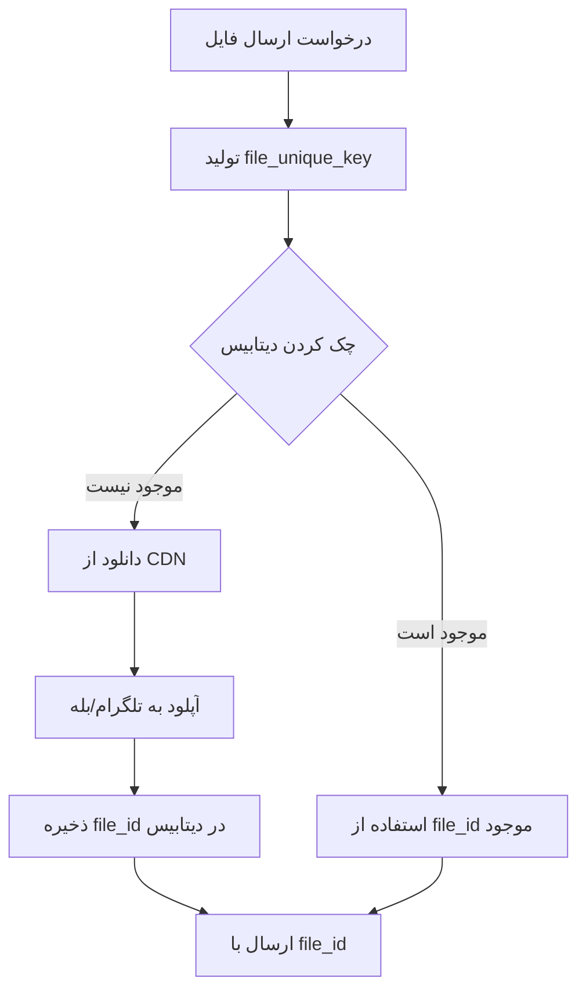
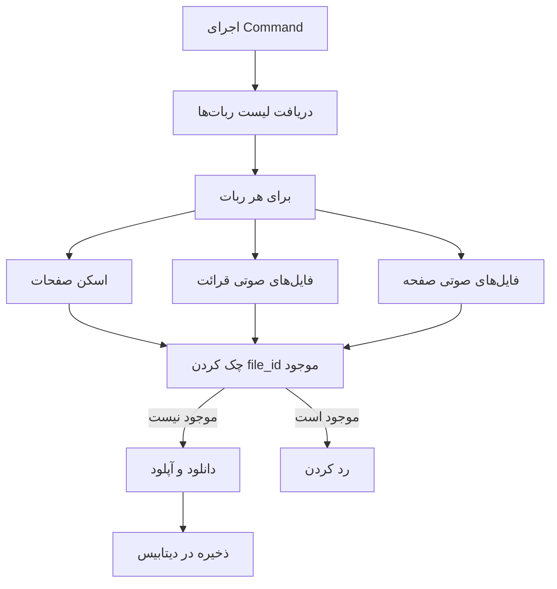

# سیستم مدیریت فایل‌های آپلود شده برای ربات‌ها

## 📝 توضیحات

این فیچر یک سیستم مدیریت فایل‌های آپلود شده برای ربات‌های تلگرام و بله است که از آپلود مجدد فایل‌های یکسان جلوگیری می‌کند. با استفاده از این سیستم، فایل‌های قرآن (اسکن صفحات، فایل‌های صوتی قرائت، ترجمه و...) فقط یک بار آپلود می‌شوند و file_id آن‌ها در دیتابیس ذخیره می‌شود تا در دفعات بعدی از همان file_id استفاده شود.

**تاریخ پیاده‌سازی:** 2026-01-22  
**وضعیت:** ✅ تکمیل شده

## 🎯 اهداف

1. **جلوگیری از آپلود مجدد:** فایل‌های یکسان فقط یک بار آپلود می‌شوند
2. **بهینه‌سازی سرعت:** استفاده از file_id موجود به جای آپلود مجدد
3. **کاهش مصرف پهنای باند:** کاهش قابل توجه در مصرف پهنای باند و زمان پاسخ
4. **مدیریت بهتر فایل‌ها:** نگهداری file_id برای هر ربات به صورت جداگانه
5. **پشتیبانی از پیش‌آپلود:** امکان پیش‌آپلود فایل‌ها با Background Job

## 🔑 ویژگی‌های کلیدی

- ✅ هر ربات file_id خودش را دارد (محدودیت تلگرام/بله)
- ✅ کلید یونیک برای هر فایل بر اساس نوع، پارامترها و bot_type
- ✅ پشتیبانی از انواع فایل: اسکن صفحات، فایل‌های صوتی قرائت، ترجمه، صفحه
- ✅ Background Job برای پیش‌آپلود فایل‌ها
- ✅ تست‌های کامل Unit و Feature

## 📂 مسیر فایل‌ها

### Migration
- `database/migrations/2026_01_22_174255_create_bot_uploaded_files_table.php`

### Models
- `app/Models/BotUploadedFile.php`

### Helpers
- `app/Helpers/FileUploadHelper.php` - Helper اصلی برای مدیریت فایل‌های آپلود شده

### Jobs
- `app/Jobs/PreUploadQuranFilesJob.php` - Job برای پیش‌آپلود فایل‌های قرآن

### Commands
- `app/Console/Commands/PreUploadQuranFilesCommand.php` - Command برای اجرای Job

### Tests
- `tests/Unit/FileUploadHelperTest.php` - تست‌های Unit
- `tests/Feature/BotFileUploadTest.php` - تست‌های Feature

### تغییرات در Helper های موجود
- `app/Helpers/QuranHelper.php` - استفاده از FileUploadHelper
- `app/Helpers/BotHelper.php` - پشتیبانی از file_id
- `app/Http/Controllers/QuranWordController.php` - استفاده از FileUploadHelper

## 📊 ساختار دیتابیس

### جدول `bot_uploaded_files`

```sql
- id (bigint, primary key)
- bot_id (bigint, foreign key -> bots.id)
- bot_type (enum: 'telegram', 'bale')
- file_unique_key (string, unique) - کلید یونیک برای شناسایی فایل
- file_type (enum: 'scan_page', 'audio_recitation', 'audio_translation', 'audio_page', 'photo', 'document', 'video', 'audio')
- file_id (string) - file_id برگشتی از تلگرام/بله
- file_unique_id (string, nullable) - file_unique_id از API
- file_size (integer, nullable)
- width (integer, nullable) - برای عکس
- height (integer, nullable) - برای عکس
- metadata (json, nullable) - اطلاعات اضافی (مثلاً sura, aya, page, hr, reciter, cdn)
- upload_response (json, nullable) - پاسخ کامل API آپلود
- created_at, updated_at
```

**Indexes:**
- `(bot_id, bot_type, file_unique_key)` - unique
- `(file_unique_key)` - index
- `(bot_id, bot_type, file_type)` - index

## 🔑 ساختار file_unique_key

کلید یونیک برای هر نوع فایل:

### اسکن صفحه قرآن
- **Format:** `scan_page_{hr}_{page}_{bot_type}`
- **Example:** `scan_page_1_1_telegram`, `scan_page_2_604_bale`

### فایل صوتی قرائت
- **Format:** `audio_recitation_{reciter}_{sura}_{aya}_{bot_type}`
- **Example:** `audio_recitation_parhizgar_1_1_telegram`

### فایل صوتی ترجمه
- **Format:** `audio_translation_{locale}_{sura}_{aya}_{bot_type}`
- **Example:** `audio_translation_fa.makarem_1_1_bale`

### فایل صوتی صفحه
- **Format:** `audio_page_{page}_{bot_type}`
- **Example:** `audio_page_1_telegram`

## 🔄 Flow کاری

### 1. ارسال فایل (با FileUploadHelper)



### 2. پیش‌آپلود فایل‌ها



## 🔧 نحوه استفاده

### 1. استفاده در Helper ها

```php
use App\Helpers\FileUploadHelper;

// تولید کلید یونیک
$fileUniqueKey = FileUploadHelper::generateFileUniqueKey('scan_page', [
    'hr' => 1,
    'page' => 1
], 'telegram');

// دریافت یا آپلود فایل
$fileInfo = FileUploadHelper::getOrUploadFile(
    $messenger,
    $fileUniqueKey,
    $photoUrl,
    'scan_page',
    [
        'hr' => 1,
        'page' => 1,
        'bot_type' => 'telegram'
    ]
);

// اگر file_id موجود است، از آن استفاده می‌کنیم
if ($fileInfo && isset($fileInfo['file_id']) && $fileInfo['is_cached']) {
    $content = [
        'chat_id' => $chat_id,
        'photo' => $fileInfo['file_id'],
        'caption' => $caption
    ];
    $messenger->sendPhoto($content);
}
```

### 2. پیش‌آپلود فایل‌ها

#### برای یک ربات خاص:
```bash
php artisan quran:pre-upload-files --bot-id=1 --type=telegram --limit=10
```

#### برای همه ربات‌ها:
```bash
php artisan quran:pre-upload-files
```

#### گزینه‌های Command:
- `--bot-id`: ID ربات (اختیاری - اگر مشخص نشود، برای همه ربات‌ها اجرا می‌شود)
- `--type`: نوع ربات (telegram یا bale) - اختیاری
- `--limit`: محدودیت تعداد فایل‌ها برای آپلود - اختیاری

### 3. دریافت file_id از دیتابیس

```php
$fileId = FileUploadHelper::getFileId($botId, $botType, $fileUniqueKey);
```

### 4. ذخیره فایل آپلود شده

```php
$uploadedFile = FileUploadHelper::saveUploadedFile(
    $botId,
    $botType,
    $fileUniqueKey,
    'scan_page',
    $response,
    [
        'hr' => 1,
        'page' => 1
    ]
);
```

## 📝 Logging

سیستم لاگینگ کامل برای تمام عملیات:

```php
// لاگ موفقیت
Log::info('✅ [FileUploadHelper] File found in database', [
    'file_unique_key' => $fileUniqueKey,
    'file_id' => $fileId,
    'bot_id' => $botId
]);

// لاگ آپلود
Log::info('📤 [FileUploadHelper] File not found, uploading...', [
    'file_unique_key' => $fileUniqueKey,
    'file_url' => $fileUrl
]);

// لاگ خطا
Log::error('❌ [FileUploadHelper] Failed to upload file', [
    'file_unique_key' => $fileUniqueKey,
    'error' => $e->getMessage()
]);
```

## 🧪 Testing

### Unit Tests

```bash
php artisan test tests/Unit/FileUploadHelperTest.php
```

**تست‌های موجود:**
- ✅ تست ساخت file_unique_key برای انواع مختلف فایل
- ✅ تست دریافت file_id از دیتابیس
- ✅ تست ذخیره فایل آپلود شده
- ✅ تست دریافت file_id که وجود ندارد

### Feature Tests

```bash
php artisan test tests/Feature/BotFileUploadTest.php
```

**تست‌های موجود:**
- ✅ تست ارسال اسکن صفحه با file_id موجود
- ✅ تست ارسال فایل صوتی با file_id موجود
- ✅ تست آپلود فایل جدید
- ✅ تست یونیک بودن file_unique_key برای هر ربات

## 🔍 مثال‌های استفاده

### مثال 1: ارسال اسکن صفحه

```php
// در QuranHelper::sendScanPageByUrl
$fileUniqueKey = FileUploadHelper::generateFileUniqueKey('scan_page', [
    'hr' => $hr,
    'page' => $pageNumber
], $botType);

$fileInfo = FileUploadHelper::getOrUploadFile(
    $messenger,
    $fileUniqueKey,
    $photoUrl,
    'scan_page',
    [
        'hr' => $hr,
        'page' => $pageNumber,
        'bot_type' => $botType
    ]
);

if ($fileInfo && isset($fileInfo['file_id']) && $fileInfo['is_cached']) {
    // استفاده از file_id موجود
    $content = [
        'chat_id' => $chat_id,
        'photo' => $fileInfo['file_id'],
        'caption' => $caption
    ];
    return $messenger->sendPhoto($content);
}
```

### مثال 2: ارسال فایل صوتی قرائت

```php
// در QuranHelper::sendAudio
$fileUniqueKey = FileUploadHelper::generateFileUniqueKey('audio_recitation', [
    'reciter' => $mp3Reciter,
    'sura' => $suraId,
    'aya' => $ayaId
], $botType);

$fileInfo = FileUploadHelper::getOrUploadFile(
    $messenger,
    $fileUniqueKey,
    $audio,
    'audio_recitation',
    [
        'reciter' => $mp3Reciter,
        'sura' => $suraId,
        'aya' => $ayaId,
        'title' => $title,
        'caption' => $caption
    ]
);
```

## ⚠️ نکات مهم

1. **یونیک بودن file_unique_key:** باید برای هر ربات و نوع فایل یونیک باشد
2. **مدیریت خطا:** در صورت خطا در آپلود، باید لاگ شود و ادامه دهد
3. **Rate Limiting:** برای جلوگیری از محدودیت API، delay بین آپلودها وجود دارد (0.5 ثانیه)
4. **پاک کردن فایل‌های موقت:** بعد از آپلود، فایل‌های دانلود شده پاک می‌شوند
5. **Fallback:** در صورت عدم وجود file_id در دیتابیس، فایل آپلود می‌شود
6. **Backward Compatibility:** جدول قدیمی `quran_scan_pages` برای سازگاری حفظ شده است

## 🐛 Known Issues

- در حال حاضر هیچ issue شناخته شده‌ای وجود ندارد

## 🔮 Future Improvements

- [ ] پشتیبانی از انواع دیگر فایل (video, document)
- [ ] اضافه کردن cache برای بهبود عملکرد
- [ ] پشتیبانی از CDN های بیشتر
- [ ] اضافه کردن retry mechanism برای آپلودهای ناموفق
- [ ] اضافه کردن monitoring و alerting

## 📚 مستندات مرتبط

- [README.md اصلی](../../README.md)
- [راهنمای ساخت ربات](./BOT_CREATION_GUIDE.md)
- [قوانین پروژه](../../.cursorrules)
- [راهنمای لاگینگ](../LOGGING-GUIDE.md)

## 👥 Contributors

- تیم توسعه Bot Generator

---

**آخرین بروزرسانی:** 2026-01-22
