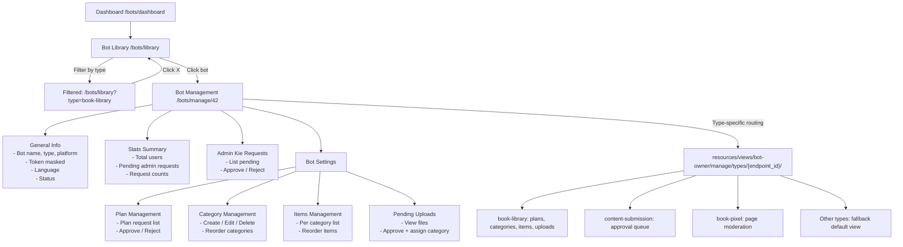

# Bot Admin Management Panel - Plan

## Overview

This plan outlines the implementation of a comprehensive bot management panel for bot owners. Currently, the Bot Owner dashboard (`/bots/dashboard`) only shows a simple list of bots. The goal is to create:

1. A **Bot Library** page with type-based filtering + pagination
2. A **Central Bot Management** page for each bot with general info/settings
3. **Bot-Specific Admin Settings** pages (e.g., plan approval, category management)
4. **Admin Kie Request** management for approving new admins per bot

## Current Architecture Context

- **Bot Owner** module: [`app/Modules/BotOwner/`](app/Modules/BotOwner/) with routes in [`routes/bot-owner.php`](routes/bot-owner.php)
- **Bot model**: [`app/Models/Bot.php`](app/Models/Bot.php) - has `endpoint_id`, `bot_owner_id`, `type`, `language_code`
- **BotAdminKieRequest**: [`app/Models/BotAdminKieRequest.php`](app/Models/BotAdminKieRequest.php) - pending admin requests per bot
- **Content tables**: `content_categories`, `content_items`, `content_assets`, `content_pending_uploads` - for file/category management
- **LibraryPlanRequest**: [`app/Models/LibraryPlanRequest.php`](app/Models/LibraryPlanRequest.php) - plan upgrade requests
- **Bot types**: 30+ endpoint types defined in [`database/seeders/BotDetailsCompleteSeeder.php`](database/seeders/BotDetailsCompleteSeeder.php)

## Routes Structure (New)

All under existing `bot-owner` prefix group, within the auth middleware group:

| Method | Route | Description |
|--------|-------|-------------|
| GET | `/bots/library?type=&page=` | Bot library with filtering & pagination |
| GET | `/bots/manage/{bot}` | Central bot management page |
| GET | `/bots/manage/{bot}/stats` | Bot statistics (inline or partial) |
| POST | `/bots/manage/{bot}/admin-kie/{request}/approve` | Approve admin request |
| POST | `/bots/manage/{bot}/admin-kie/{request}/reject` | Reject admin request |
| GET | `/bots/manage/{bot}/plans` | Plan requests management (bot-specific) |
| POST | `/bots/manage/{bot}/plans/{request}/approve` | Approve plan request |
| POST | `/bots/manage/{bot}/plans/{request}/reject` | Reject plan request |
| GET | `/bots/manage/{bot}/categories` | Category management (bot-specific) |
| POST | `/bots/manage/{bot}/categories` | Create category |
| PUT | `/bots/manage/{bot}/categories/{category}` | Update category |
| DELETE | `/bots/manage/{bot}/categories/{category}` | Delete category |
| POST | `/bots/manage/{bot}/categories/reorder` | Reorder categories |
| POST | `/bots/manage/{bot}/items/reorder` | Reorder content items in category |
| GET | `/bots/manage/{bot}/settings` | Bot-specific settings page |

## Bot Type-Specific Settings (Extensible)

Each bot type has its own settings page routed by convention:

| Bot Type (endpoint_id) | Settings Route | Features |
|------------------------|----------------|----------|
| `book-library` | `/bots/manage/{bot}/settings` | Plan management, category management, file ordering |
| `content-submission` | `/bots/manage/{bot}/settings` | Content approval, category management |
| `book-pixel` | `/bots/manage/{bot}/settings` | Page approval, moderation |
| `presenter-bot` | `/bots/manage/{bot}/settings` | Content management |
| ... other types | `/bots/manage/{bot}/settings` | Future extensibility |

## Implementation Steps

### Step 1: Create `BotLibraryController` + Service
- Controller in [`app/Modules/BotOwner/Http/Controllers/`](app/Modules/BotOwner/Http/Controllers/)
- Lists all bots for current owner, with:
  - Filter by `endpoint_id` (bot type)
  - Pagination (15 per page)
  - Filter persists across pagination
  - "Clear filter" button
- View: [`resources/views/bot-owner/library.blade.php`](resources/views/bot-owner/library.blade.php)

### Step 2: Create `BotManageController` + Service
- Central management page for a single bot
- Shows: bot name, type, platform, status, token (masked), language
- Stats: total users, pending admin requests, pending plan requests
- Links to: bot-specific settings, admin requests management
- View: [`resources/views/bot-owner/manage/index.blade.php`](resources/views/bot-owner/manage/index.blade.php)

### Step 3: Create `BotAdminKieController`
- List pending admin kie requests for the bot
- Approve/reject functionality
- View: [`resources/views/bot-owner/manage/admin-kie.blade.php`](resources/views/bot-owner/manage/admin-kie.blade.php)

### Step 4: Create Bot-Specific Management

#### 4a. Plan Management (for Book Library bot)
- List pending plan requests
- Approve/reject with notes
- View: [`resources/views/bot-owner/manage/plans.blade.php`](resources/views/bot-owner/manage/plans.blade.php)

#### 4b. Category Management (for Book Library / content-based bots)
- CRUD for categories
- Reorder categories (drag or up/down buttons)
- View: [`resources/views/bot-owner/manage/categories.blade.php`](resources/views/bot-owner/manage/categories.blade.php)

#### 4c. Content Items Management
- List items within a category
- Reorder items (up/down)
- View: [`resources/views/bot-owner/manage/items.blade.php`](resources/views/bot-owner/manage/items.blade.php)

#### 4d. Pending Uploads Management
- View pending uploaded files
- Approve and assign to category
- View: [`resources/views/bot-owner/manage/uploads.blade.php`](resources/views/bot-owner/manage/uploads.blade.php)

### Step 5: Create Bot-Specific Settings (Extensible Architecture)
- A dynamic settings page that loads components based on `bot->endpoint_id`
- For Book Library: plans, categories, items, uploads
- For Content Submission: content approval queue
- Pattern: `resources/views/bot-owner/manage/types/{endpoint_id}/` directory
- Default fallback view for unimplemented types

### Step 6: Translation Keys
- Add new keys to [`lang/en/bot-owner.php`](lang/en/bot-owner.php) and other language files
- Keys: library title, filter by type, clear filter, manage bot, plan management, etc.

### Step 7: Update Navigation
- Add "Bot Library" link to the dashboard header
- Add back navigation between pages

## Data Flow

```
Dashboard (/bots/dashboard)
    ↓
Bot Library (/bots/library?type=book-library&page=2)
    ↓  (click on a bot)
Bot Management (/bots/manage/42)
    ├── General Info (stats, token, language)
    ├── Admin Kie Requests → approve/reject
    └── Bot Settings → /bots/manage/42/settings
                          ├── Plans Management (plan requests list)
                          ├── Categories (CRUD + reorder)
                          ├── Items (per category, reorder)
                          └── Uploads (approve + categorize)
```

## Architecture Decision: Controller Placement

Since Bot Owner is already a Module, adding the new controllers to [`app/Modules/BotOwner/Http/Controllers/`](app/Modules/BotOwner/Http/Controllers/) follows the existing pattern. However, the management features are cross-cutting and relate to many bot types.

**Option A** (Recommended): Add to existing [`app/Modules/BotOwner/`](app/Modules/BotOwner/) module:
- `BotLibraryController` + `BotLibraryService`
- `BotManageController` + `BotManageService`
- `BotAdminKieManageController`
- `BotPlanManageController`
- `BotCategoryManageController`

**Option B**: Create a new `BotAdminPanel` module.
→ We'll go with **Option A** for consistency since we already have the auth middleware and service container wired up.

## Permission Model

- Only the **bot owner** (who created the bot) OR an **approved admin** can manage a bot
- Check: `$bot->bot_owner_id === $owner->id` (owner check in middleware/service)
- For admin kie: only the bot owner can approve/reject other admin requests
- For plans: only the bot owner can approve/reject plan upgrade requests

## Key Models to Work With

| Model | Table | Purpose |
|-------|-------|---------|
| [`Bot`](app/Models/Bot.php) | `bots` | Core bot record |
| [`WebhookEndpoint`](app/Models/WebhookEndpoint.php) | `webhook_endpoints` | Bot type definition |
| [`BotAdminKieRequest`](app/Models/BotAdminKieRequest.php) | `bot_admin_kie_requests` | Admin promotion requests |
| [`ContentCategory`](app/Models/ContentCategory.php) | `content_categories` | Category/genre management |
| [`ContentItem`](app/Models/ContentItem.php) | `content_items` | Content items in categories |
| [`ContentAsset`](app/Models/ContentAsset.php) | `content_assets` | Media files attached to items |
| [`ContentPendingUpload`](app/Models/ContentPendingUpload.php) | `content_pending_uploads` | Files awaiting approval |
| [`LibraryPlanRequest`](app/Models/LibraryPlanRequest.php) | `library_plan_requests` | Plan upgrade requests |
| [`BotUsers`](app/Models/BotUsers.php) | `bot_users` | End users of bots |

## Mermaid Diagram



## Todo Checklist

1. **Create Bot Library page** with type filtering + pagination
2. **Create Bot Management general page** with stats, info, links
3. **Create Admin Kie management** (approve/reject admins)
4. **Create Plan Request management** (approve/reject plans)
5. **Create Category management** (CRUD + reorder)
6. **Create Content Items management** (per category + reorder)
7. **Create Pending Uploads management** (approve + categorize)
8. **Create Bot-Specific Settings page** with type-based routing
9. **Add all necessary routes** to bot-owner.php
10. **Add translation keys** to language files
11. **Update dashboard navigation** to link to library
12. **Permission checks** (owner-only, owner-or-admin)
