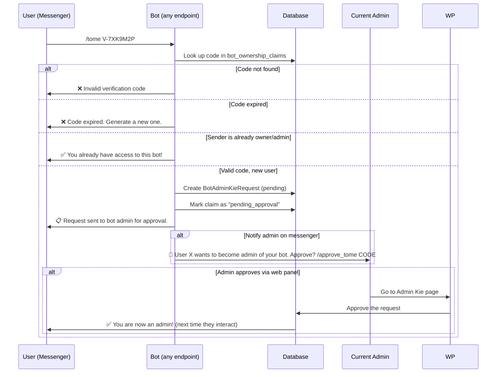

# `/tome` Bot Claim & Permission Approval System

## Problems with Current Flow

1. **Security hole**: Anyone who gets access to a verification code can claim a bot without the current admin's approval.
2. **No `/tome` command**: Codes are sent as plain text, confusing bots.
3. **Not universal**: Only BookLibrary bot handles verification.
4. **No "already admin" check**: If an existing admin sends a code, they should be told they're already admin.

## New Flow



## Step 1: `/tome` Command Handler (Universal)

Create a unified handler that EVERY bot controller can call:

```php
// BotHelper.php
public static function handleTomeCommand(Telegram $bot, string $text, string $chatId, string $origin, Bot $botModel = null): bool
{
    if (!str_starts_with(mb_strtolower(trim($text)), '/tome ')) {
        return false; // Not a /tome command
    }
    
    $code = trim(substr($text, 6));
    
    // Find claim
    $claim = BotOwnershipClaim::where('verification_code', $code)
        ->where('status', 'pending')
        ->first();
    
    if (!$claim) {
        self::sendMessage($bot, '❌ Invalid verification code.');
        return true;
    }
    
    if ($claim->isExpired()) {
        $claim->update(['status' => 'expired']);
        self::sendMessage($bot, '❌ Code expired.');
        return true;
    }
    
    $targetBot = $claim->bot;
    if (!$targetBot || $targetBot->id !== ($botModel?->id ?? $claim->bot_id)) {
        self::sendMessage($bot, '❌ This code is for a different bot.');
        return true;
    }
    
    // Check if sender is already owner/admin
    $isOwner = (string)$targetBot->bale_owner_chat_id === (string)$chatId 
            || (string)$targetBot->telegram_owner_chat_id === (string)$chatId;
    $isAdmin = BotAdminKieRequest::where('bot_id', $targetBot->id)
        ->where('chat_id', $chatId)
        ->where('status', 'approved')
        ->exists();
    $isPanelAdmin = false; // Check bot_admin_panel_users
    
    if ($isOwner || $isAdmin || $isPanelAdmin) {
        $claim->update(['status' => 'verified', 'verified_at' => now()]);
        self::sendMessage($bot, '✅ You already have access to this bot! Code verified.');
        return true;
    }
    
    // New user: create pending admin request
    $kieRequest = BotAdminKieRequest::create([
        'bot_id' => $targetBot->id,
        'chat_id' => $chatId,
        'origin' => $origin,
        'status' => 'pending',
        'notes' => 'Claim via /tome code: ' . $code,
    ]);
    
    $claim->update(['status' => 'pending_approval']);
    
    // Notify current owner on messenger (if their chat_id is known)
    $ownerChatId = $targetBot->bale_owner_chat_id ?? $targetBot->telegram_owner_chat_id;
    $ownerOrigin = $targetBot->bale_owner_chat_id ? 'bale' : 'telegram';
    if ($ownerChatId) {
        $ownerBot = self::createBotInstanceForOwnerNotification($targetBot, $ownerOrigin);
        if ($ownerBot) {
            self::sendMessage($ownerBot, "🔔 User $chatId wants to become admin of your bot {$targetBot->bale_bot_name}.\nApprove from web panel: " . route('bot-owner.manage.admin-kie', $targetBot->id));
        }
    }
    
    self::sendMessage($bot, '📋 Your request has been sent to the bot admin for approval.');
    return true;
}
```

## Step 2: Add to ALL Bot Controllers

Each bot controller's `handleTextMessage` (or equivalent) should call at the top:

```php
if (\App\Helpers\BotHelper::handleTomeCommand($bot, $text, (string) $chatId, $type, $botModel)) {
    return;
}
```

This needs to be added to:
- `BookLibraryController` ✅ (already done for plain code, update to `/tome`)
- `BookLibraryReaderController`
- `QuranWordController`
- `WeatherController`
- `HadithSearchController`
- `NahjController`
- And all other endpoint controllers...

## Step 3: Admin Approval

The admin approves from the **Web Panel**:
- Go to `/bots/manage/{bot}/admin-kie`
- See the pending request with note: "Claim via /tome code: V-XXX"
- Click **Approve** or **Reject**

## Step 4: Update BotOwnershipClaim Statuses

Add new status: `pending_approval`

| Status | Meaning |
|--------|---------|
| `pending` | Code generated, waiting for user to send `/tome` |
| `pending_approval` | User sent `/tome`, waiting for admin approval |
| `verified` | Approved by admin |
| `expired` | Code expired |

## Step 5: Already-Admin Check

When `/tome CODE` is sent:
1. Look up the code
2. Find the bot
3. Check if sender's `chat_id` matches owner or approved admin
4. If yes → "✅ You already have access! Code verified anyway."
5. If no → Create pending request for admin approval

## Migration

Add `pending_approval` to the enum in `bot_ownership_claims` table.

Since MySQL doesn't support ALTER ENUM easily, we should change the column to varchar:

```php
Schema::table('bot_ownership_claims', function (Blueprint $table) {
    $table->string('status', 30)->default('pending')->change();
});
```

## Summary

| Feature | Current | New |
|---------|---------|-----|
| Command | Plain code or `/claim` | `/tome CODE` only |
| Security | Anyone with code can claim | Requires current admin approval |
| Already admin check | ❌ | ✅ "You're already admin" |
| Universal handler | Only BookLibrary | All bots |
| Approval flow | Instant | Pending → Admin approves |

## Implementation Order

1. Create `handleTomeCommand()` in BotHelper
2. Update `tryHandleVerificationCode()` to also support `/tome`
3. Add `pending_approval` status to migration
4. Add call to handleTomeCommand in BookLibraryController
5. Add call to ALL other bot controllers
6. Update claim view to show `/tome CODE` instruction
7. Update admin-kie management page to show claim notes
