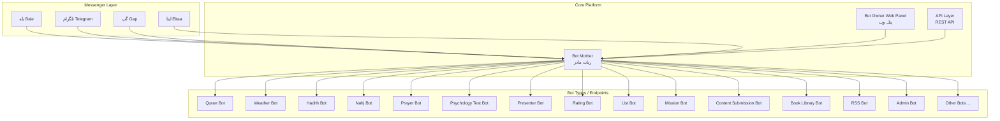
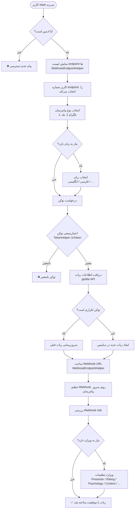
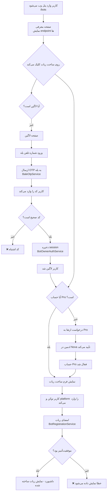

# معماری سیستم ربات‌ساز (Bot Generator Architecture)

## 🌐 نمای کلی سیستم

این پروژه یک **پلتفرم ربات‌ساز چندمنظوره** است که به کاربران امکان می‌دهد ربات‌های پیام‌رسان مختلف (تلگرام، بله، گپ، ایتا) را با قابلیت‌های متنوع ایجاد کنند. هسته اصلی سیستم **Bot Mother** (ربات مادر) است که فرآیند ساخت، ثبت و تنظیم webhook ربات‌های جدید را مدیریت می‌کند.

---

## 🏗️ معماری کلی



---

## 🔄 جریان کلی ساخت ربات



---

## 🧩 مسیر دوم: پنل وب مالک ربات (Bot Owner Web Panel)

کاربران عادی (غیر ادمین) از طریق پنل وب می‌توانند ربات بسازند. این مسیر شامل احراز هویت و ارتقا به پرو است:



---

## 🏛️ ساختار ماژول‌ها

### 1. ماژول Bot Mother (`app/Http/Controllers/BotMotherController.php`)

ربات مادر هسته مرکزی سیستم است که توسط ادمین‌ها استفاده می‌شود. این ربات:

- در دو پیام‌رسان بله و تلگرام فعال است
- تنها ادمین‌ها به آن دسترسی دارند
- لیست endpoint ها را از جدول `webhook_endpoints` می‌خواند
- فرآیند تعاملی ساخت ربات را با ویزارد مدیریت می‌کند
- توکن را اعتبارسنجی می‌کند و webhook تنظیم می‌کند

**State Machine ربات مادر:**

| State | توضیح |
|-------|-------|
| `STATE_WAITING_ENDPOINT_SELECTION` | انتخاب نوع ربات |
| `STATE_WAITING_TYPE` | انتخاب تلگرام یا بله |
| `STATE_WAITING_LANGUAGE` | انتخاب زبان |
| `STATE_WAITING_TOKEN` | دریافت توکن |
| `STATE_WAITING_PRESENTER_CONTENT` | دریافت محتوای ربات پرزنتر |
| `STATE_WAITING_RATING_CONTENT` | دریافت محتوای ربات امتیازدهی |
| `STATE_WAITING_PSYCHOLOGY_QUESTIONS` | دریافت سوالات تست روانشناسی |
| `STATE_WAITING_CONTENT_BOT_*` | ویزارد ربات محتوا |
| `STATE_WAITING_LIBRARY_*` | ویزارد کتابخانه |

### 2. ماژول Bot Owner (`app/Modules/BotOwner/`)

پنل وب برای کاربران عادی برای ساخت ربات:

- **احراز هویت:** لاگین با شماره تلفن بله از طریق OTP (ماژول BaleOtp)
- **سیستم Pro:** کاربران ابتدا باید حساب خود را به Pro ارتقا دهند
- **داشبورد:** نمایش ربات‌های ساخته شده توسط کاربر
- **ساخت ربات:** فرم وب برای دریافت توکن و ثبت ربات

**مدل‌ها:**
- [`BotOwner`](app/Modules/BotOwner/Models/BotOwner.php) - کاربر panel
- [`BotOwnerProRequest`](app/Modules/BotOwner/Models/BotOwnerProRequest.php) - درخواست ارتقا به Pro
- [`BotOwnerOtpSession`](app/Modules/BotOwner/Models/BotOwnerOtpSession.php) - نشست OTP

**Route ها:**

| مسیر | متد | توضیح |
|------|------|-------|
| `/bots` | GET | صفحه معرفی |
| `/bots/login` | GET | فرم لاگین |
| `/bots/otp/send` | POST | ارسال OTP |
| `/bots/otp/verify` | POST | تأیید OTP |
| `/bots/dashboard` | GET | داشبورد (نیاز به لاگین) |
| `/bots/pro/request` | POST | درخواست Pro |
| `/bots/create/{endpointId}` | GET/POST | ساخت ربات (نیاز به Pro) |

### 3. ماژول Bot Registration (`app/Modules/BotRegistration/`)

سرویس یکپارچه ثبت ربات که توسط BotMotherController و CreateBotController استفاده می‌شود:

- **`BotRegistrationService::registerBot()`** - متد اصلی ثبت ربات
- اعتبارسنجی توکن
- دریافت اطلاعات ربات از API پیام‌رسان
- تشخیص توکن تکراری و به‌روزرسانی
- ذخیره در دیتابیس با `bot_owner_id`
- ساخت webhook URL و تنظیم webhook

### 4. ماژول Bale OTP (`app/Modules/BaleOtp/`)

سرویس ارسال کد یکبارمصرف از طریق بله:

- **`BaleOtpSendService`** - ارسال OTP به شماره بله
- **`BaleOtpAuthService`** - تأیید OTP
- Rate limiting و محدودیت تلاش

---

## 📋 لیست کامل انواع ربات (Endpoints)

ربات‌ها از طریق جدول `webhook_endpoints` تعریف می‌شوند. هر endpoint شامل:

| فیلد | توضیح |
|------|-------|
| `endpoint_id` | شناسه یکتا (kebab-case) |
| `name` | نام نمایشی |
| `route` | مسیر API (بدون `/api/` در دیتابیس) |
| `description` | توضیحات |
| `requires_bot_mother_id` | نیاز به bot_mother_id |
| `requires_token` | نیاز به توکن (همیشه true) |
| `requires_language` | نیاز به انتخاب زبان |
| `supports_multiple_languages` | پشتیبانی از چند زبان |

**لیست endpoint های موجود:**

| # | endpoint_id | Controller | توضیح |
|---|-------------|-----------|-------|
| 1 | `quran-bot` | [`QuranWordController`](app/Http/Controllers/QuranWordController.php) | قرآن کریم |
| 2 | `weather-bot` | [`WeatherController`](app/Http/Controllers/WeatherController.php) | هواشناسی |
| 3 | `blog-bot` | [`BlogController`](app/Http/Controllers/BlogController.php) | وبلاگ |
| 4 | `hadith-bot` | [`HadithSearchController`](app/Http/Controllers/HadithSearchController.php) | حدیث |
| 5 | `nahj-bot` | [`NahjController`](app/Http/Controllers/NahjController.php) | نهج البلاغه |
| 6 | `personnel-registration` | [`PersonnelRegistrationController`](app/Http/Controllers/PersonnelRegistrationController.php) | ثبت‌نام پرسنل |
| 7 | `personnel-admin` | [`PersonnelAdminBotController`](app/Http/Controllers/PersonnelAdminBotController.php) | مدیریت پرسنل |
| 8 | `mission-bot` | [`MissionBotController`](app/Http/Controllers/MissionBotController.php) | مأموریت‌ها |
| 9 | `mission-media` | [`MissionMediaBotController`](app/Http/Controllers/MissionMediaBotController.php) | رسانه مأموریت |
| 10 | `task-approval` | [`TaskApprovalController`](app/Http/Controllers/TaskApprovalController.php) | تأیید وظایف |
| 11 | `presenter-bot` | [`PresenterBotController`](app/Http/Controllers/PresenterBotController.php) | ارائه محتوا |
| 12 | `psychology-test` | [`PsychologyTestBotController`](app/Http/Controllers/PsychologyTestBotController.php) | تست روانشناسی |
| 13 | `prayer-bot` | [`PrayerBotController`](app/Http/Controllers/PrayerBotController.php) | نماز قضا |
| 14 | `content-submission` | [`ContentSubmissionController`](app/Http/Controllers/ContentSubmissionController.php) | محتوای متنی |
| 15 | `book-library` | [`BookLibraryController`](app/Http/Controllers/BookLibraryController.php) | کتابخانه |
| 16 | `book-library-reader` | [`BookLibraryReaderController`](app/Http/Controllers/BookLibraryReaderController.php) | کتابخوان |
| 17 | `book-pixel` | [`BookPixelController`](app/Http/Controllers/BookPixelController.php) | بوک پیکسل |
| 18 | `poem-bot` | [`PoemBotController`](app/Http/Controllers/PoemBotController.php) | شعر |
| 19 | `mawkib-finder` | [`MawkibFinderController`](app/Http/Controllers/MawkibFinderController.php) | موکب یاب |
| 20 | `webhook-rating-bot` | [`RatingBotController`](app/Http/Controllers/RatingBotController.php) | امتیازدهی |
| 21 | `webhook-list-bot` | [`ListBotController`](app/Http/Controllers/ListBotController.php) | فهرست با دکمه |

---

## 🗄️ مدل دیتابیس ربات‌ها

### جدول `bots`

| فیلد | نوع | توضیح |
|------|-----|-------|
| `id` | bigint PK | شناسه ربات |
| `bot_mother_id` | int | شناسه ربات مادر |
| `bot_owner_id` | int (FK → BotOwner) | شناسه مالک (پنل وب) |
| `endpoint_id` | varchar | نوع endpoint |
| `type` | varchar | telegram / bale |
| `language_code` | varchar | زبان انتخاب شده |
| `bale_bot_token` | varchar | توکن بله |
| `bale_bot_name` | varchar | نام کاربری ربات بله |
| `bale_owner_chat_id` | varchar | chat_id مالک در بله |
| `bale_bot_status` | varchar | Active / Inactive |
| `bale_webhook_is_set` | boolean | webhook تنظیم شده؟ |
| `telegram_bot_token` | varchar | توکن تلگرام |
| `telegram_bot_name` | varchar | نام کاربری ربات تلگرام |
| `telegram_owner_chat_id` | varchar | chat_id مالک در تلگرام |
| `telegram_bot_status` | varchar | Active / Inactive |
| `telegram_webhook_is_set` | boolean | webhook تنظیم شده؟ |

### جدول `webhook_endpoints`

| فیلد | نوع | توضیح |
|------|-----|-------|
| `id` | bigint PK | شناسه |
| `endpoint_id` | varchar UNIQUE | شناسه یکتا |
| `name` | varchar | نام نمایشی |
| `route` | varchar | مسیر API |
| `description` | text | توضیحات |
| `requires_bot_mother_id` | boolean | نیاز به bot_mother_id |
| `requires_token` | boolean | نیاز به توکن |
| `requires_language` | boolean | نیاز به زبان |
| `supports_multiple_languages` | boolean | پشتیبانی از چند زبان |
| `is_active` | boolean | فعال/غیرفعال |

---

## 🔗 Webhook URL ساختار

الگوی URL webhook برای هر ربات:

```
{APP_URL}/api/webhook-{endpoint}?token={TOKEN}&bot_mother_id={ID}&origin={TELEGRAM|BALE}&language={LANG}&bot_id={BOT_ID}
```

مثال:
```
https://bots.pardisania.ir/api/webhook-quran-word?
  token=123456:ABC-DEF1234ghIkl-zyx57W2v1u123ew11&
  bot_mother_id=1&
  origin=bale&
  language=fa&
  bot_id=42
```

---

## 🛡️ جریان امنیتی

1. **دسترسی به Bot Mother:** فقط ادمین‌ها (چک با `AdminHelper::isAdmin`)
2. **اعتبارسنجی توکن:** با `TokenHelper::isToken()` بررسی می‌شود
3. **Webhook با توکن:** توکن در URL webhook قرار می‌گیرد و در Controller از دیتابیس یا query string خوانده می‌شود
4. **requires_token:** در همه endpoint ها true است
5. **احراز هویت پنل وب:** OTP از طریق بله + Session
6. **Pro gate:** برای ساخت ربات در پنل وب نیاز به حساب Pro است

---

## 💎 ویژگی‌های کلیدی

### 1. تشخیص توکن تکراری
اگر توکنی قبلاً در سیستم ثبت شده باشد، ربات قبلی به‌روزرسانی می‌شود (نه ایجاد جدید)

### 2. ویزاردهای تعاملی
بعضی ربات‌ها نیاز به تنظیمات اضافی دارند:
- **Presenter Bot:** دریافت محتوای متنی/تصویری
- **Rating Bot:** دریافت عبارات نظر سنجی
- **Psychology Test Bot:** دریافت سوالات تست
- **Content Submission Bot:** تنظیم کانال و گروه از طریق فوروارد
- **Book Library:** دریافت توکن ربات کتابخوان

### 3. پشتیبانی چندزبانه
ربات قرآن از ۱۸ زبان و سایر ربات‌ها از ۱۵ زبان پشتیبانی می‌کنند

### 4. Pro Features
کاربران Pro به قابلیت‌های ویژه دسترسی دارند:
- `unlimited_alerts` برای weather-bot
- `email_after_year` برای prayer-bot

---

## 📂 ساختار فایل‌های پروژه

```
app/
├── Http/Controllers/
│   ├── BotMotherController.php          # ربات مادر (هسته)
│   ├── BotKidController.php             # Resource Controller (کم‌استفاده)
│   └── [Other Bot Controllers...]       # کنترلرهای ربات‌های مختلف
├── Modules/
│   ├── BotOwner/                        # پنل وب مالک ربات
│   │   ├── Contracts/                   # Interface ها
│   │   ├── Http/Controllers/           # کنترلرهای وب
│   │   ├── Models/                      # BotOwner, BotOwnerProRequest
│   │   ├── Services/                    # Auth, Pro, Dashboard
│   │   └── Providers/
│   ├── BotRegistration/                 # سرویس ثبت ربات
│   ├── BaleOtp/                         # سرویس OTP بله
│   └── AdminBots/                       # ربات‌های ادمین
├── Helpers/
│   ├── WebhookEndpointHelper.php        # مدیریت endpoint ها
│   ├── BotMotherStateHelper.php         # State machine
│   ├── TokenHelper.php                  # اعتبارسنجی توکن
│   └── BotHelper.php                    # توابع کمکی ربات
├── Models/
│   ├── Bot.php                          # مدل اصلی ربات
│   └── WebhookEndpoint.php             # مدل endpoint
└── Services/
    └── WebhookEndpointCatalogService.php # کاتالوگ endpoint
routes/
├── api.php                              # مسیرهای API
├── bot-owner.php                        # مسیرهای پنل وب
└── web.php                              # مسیرهای وب (شامل تأیید Pro)
```

---

## 📝 نکات معماری

1. **جداسازی نگرانی‌ها:** Controller ها لاجیک تجاری را به Service ها و Repository ها واگذار می‌کنند
2. **State Machine:** فرآیند تعاملی Bot Mother با State Helper مدیریت می‌شود
3. **قابلیت توسعه:** برای افزودن ربات جدید فقط کافی است:
   - Controller + Service + Repository ایجاد شود
   - Route ثبت شود
   - Seeder برای webhook_endpoints ایجاد شود
   - ترجمه‌ها اضافه شود
4. **امنیت:** توکن‌ها در URL و دیتابیس ذخیره می‌شوند، webhook ها با توکن محافظت می‌شوند
5. **دو مسیر ساخت ربات:** ادمین‌ها از Bot Mother (تلگرام/بله) و کاربران عادی از پنل وب
