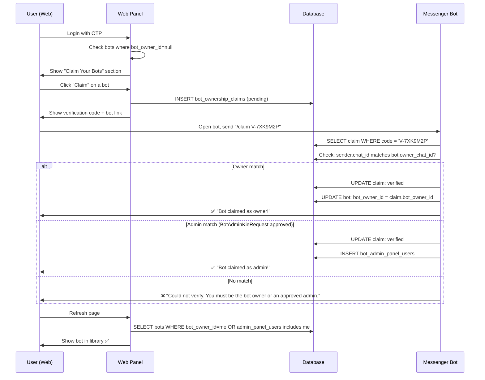

# Bot Ownership Claim & Verification System — Plan

## Problem

Currently, a bot gets `bot_owner_id` only when it's created via the **web panel** (`CreateBotController`). But many bots are:

1. Created via **Bot Mother** (Telegram/Bale admin bot) — these have `bale_owner_chat_id` / `telegram_owner_chat_id` set, but **no `bot_owner_id`**
2. Users are **approved admins** (via `BotAdminKieRequest`) of bots they didn't create — they need web panel access too

These users can log into the web panel via OTP, but they see **zero bots** because no `bot_owner_id` is set.

## Solution: Verification Code Claim Flow

The user proves ownership by sending a unique code to the bot on the messenger platform.

```
Web Panel                     Messenger (Bale/Telegram)           Database
    │                                │                              │
    │  1. Generate claim code        │                              │
    │  ──────────────────────────────┼─────────────────────────────►│
    │                                │  INSERT claim (pending)      │
    │                                │                              │
    │  2. Show code to user          │                              │
    │◄───────────────────────────────┘                              │
    │                                │                              │
    │  3. User sends code to bot     │                              │
    │                                │◄─── "VERIFY-ABC123" ────────│
    │                                │                              │
    │  4. Bot webhook checks code    │                              │
    │                                │ ────────────────────────────►│
    │                                │ SELECT claim WHERE code=X    │
    │                                │                              │
    │  5. Verify chat_id matches     │                              │
    │                                │ Check: chat_id ==            │
    │                                │   bot.bale_owner_chat_id OR  │
    │                                │   bot.telegram_owner_chat_id │
    │                                │   OR approved BotAdminKie    │
    │                                │                              │
    │  6. Claim verified!            │                              │
    │                                │ ────────────────────────────►│
    │                                │ UPDATE claim: verified       │
    │                                │ UPDATE bot: bot_owner_id=X   │
    │                                │   OR INSERT admin_panel_user │
```

## Database Changes

### New Table: `bot_ownership_claims`

```php
Schema::create('bot_ownership_claims', function (Blueprint $table) {
    $table->id();
    $table->unsignedBigInteger('bot_owner_id');       // The person claiming
    $table->unsignedBigInteger('bot_id');             // The bot being claimed
    $table->string('verification_code', 32)->unique(); // e.g. "V-7XK9M2P"
    $table->enum('claim_type', ['owner', 'admin']);   // Claim as owner or admin
    $table->enum('status', ['pending', 'verified', 'expired'])->default('pending');
    $table->timestamp('expires_at');
    $table->timestamp('verified_at')->nullable();
    $table->timestamps();

    $table->index('verification_code');
    $table->index(['bot_owner_id', 'status']);
});
```

## Verification Logic

When the bot receives the code, it must verify:

**Owner check:** `sender_chat_id === bot.bale_owner_chat_id` (for Bale) OR `sender_chat_id === bot.telegram_owner_chat_id` (for Telegram)

**Admin check:** `BotAdminKieRequest` exists with `chat_id = sender_chat_id` AND `bot_id = claimed_bot_id` AND `status = 'approved'`

If either matches → verification succeeds.

## Implementation Steps

### Step 1: Create `bot_ownership_claims` Migration + Model
- Migration with `unsignedBigInteger` columns (no FK constraints for MyISAM compat)
- Model: `BotOwnershipClaim` in `app/Models/`

### Step 2: Create "Claim Your Bots" UI
- New section on dashboard or a new page `/bots/claim`
- Shows a list of **unclaimed bots** (bots without `bot_owner_id` that the user might own)
- Actually better: let the user search for their bot by name/endpoint_id and claim it
- Generate verification code button
- Display: "Send this code to your bot on [Bale/Telegram]: `V-7XK9M2P`"
- Show a direct deep link to the bot (e.g., `https://ble.ir/bot_username` or `https://t.me/bot_username`)

### Step 3: Create `BotOwnershipClaimController` (Web)
- `index()` — Show claim page with form
- `store()` — Generate claim code for selected bot
- `checkStatus()` — AJAX endpoint to check if claim is verified

### Step 4: Add `/claim` Command to Admin Bots Bot
- In [`AdminBotsController`](app/Modules/AdminBots/Http/Controllers/AdminBotsController.php), add a new state/command handler for `/claim`
- Parse the verification code
- Look up `BotOwnershipClaim` by code with status `pending`
- Verify chat_id against owner or admin records
- If verified: update claim status, set `bot_owner_id` or create `BotAdminPanelUser`
- Send success message to user on messenger

### Step 5: Update Bot Library to Show All Accessible Bots
- Update [`BotLibraryService`](app/Modules/BotOwner/Services/BotLibraryService.php) to return:
  - Bots where `bot_owner_id = my_id` (directly owned)
  - Bots where I'm in `bot_admin_panel_users` (admin of)
- Add filter: `relation=owner` (direct), `relation=admin` (panel admin), `relation=all` (default)

### Step 6: Mark Owner vs Admin in Library + Management
- In library view, show badge: "مالک" (Owner) or "ادمین" (Admin)
- In manage page header, show who the original owner is
- Show who added the current user as admin (from `admin_panel_users.added_by_owner_id`)

### Step 7: Add Route + Translation Keys
- New web routes
- Translation keys in all languages

## Flow Diagram



## Testing Guide (Current Features)

### Test 1: Bot Library with Filtering
1. Login to `/bots/login` with your phone (OTP)
2. Go to `/bots/dashboard`
3. Click "Bot Library" link in header
4. See all your bots listed with pagination
5. Click a type filter pill (e.g., "book-library")
6. Verify only bots of that type show
7. Verify pagination still works with filter
8. Click the red "✕ Clear filter" button
9. Verify all bots show again

### Test 2: Bot Management Page
1. From library, click on any bot
2. See bot info (name, type, platform, token masked, language, status, created date)
3. See stats row (total users, pending admin requests, pending plans, pending uploads)
4. See management sections cards below

### Test 3: Admin Kie Approval
1. From management page, click "Admin Requests"
2. See list of pending admin requests (if any)
3. Click "Approve" to approve, or "Reject" to reject
4. Verify flash message and status change

### Test 4: Plan Approval
1. From management page of a book-library bot, click "Plan Requests"
2. See pending plan upgrade requests
3. Click "Approve" or "Reject"
4. Verify flash message

### Test 5: Category CRUD
1. From management page of a content-based bot, click "Categories"
2. Add a new category using the form at top
3. Edit category name inline
4. Toggle active/inactive status
5. Use ↑↓ buttons to reorder categories
6. Click "Reorder Items" button to save new order
7. Delete a category (confirm dialog)

### Test 6: Content Items Reorder
1. From management page, click "Content Items"
2. See items grouped by category
3. Use ↑↓ buttons per item to change order
4. Click "Reorder Items" to save

### Test 7: Uploads Approval
1. From management page, click "Pending Uploads"
2. See pending files with uploader info
3. Select a category from dropdown and click "Approve"
4. Or click "Reject" to delete the upload
5. Verify the file appears in Content Items afterward

### Test 8: Panel Admins (Owner Only)
1. From management page, click "Panel Admins"
2. As owner, use phone search to find and add another user
3. Verify the other user can now access the bot from their library
4. As the other user, verify they can see the bot but CANNOT add new panel admins
5. As owner, remove the panel admin

### Test 9: Bot-Specific Settings
1. From management page, click "Settings"
2. For `book-library`: see plans, categories, items, uploads links
3. For `content-submission`: see categories, uploads, items links
4. For `book-pixel`: see categories, uploads, items links
5. For `presenter-bot`: see categories, items, uploads links
6. For other types: see fallback "coming soon" message

### Test 10: Permission Enforcement
1. Log in as User A (who has no relation to a bot)
2. Try navigating to `/bots/manage/{bot_id}` directly
3. Verify 403 error page
4. Try navigating to any sub-page (admin-kie, plans, categories, etc.)
5. Verify 403 on all of them

## Future Implementation: Bot Ownership Claim

See steps 1-7 above. This will be implemented in the next phase.
