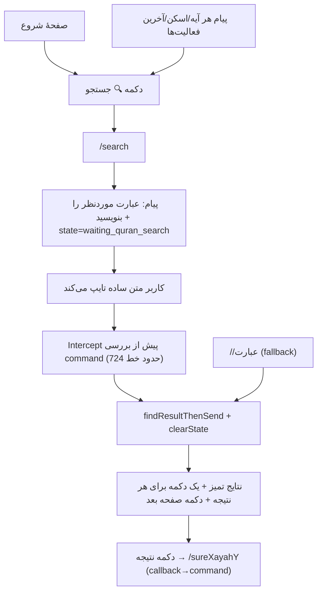

# برنامه بهبود ربات قرآن (Quran Bot Improvement Plan)

مکمل ۸ درخواست کاربر: قاری‌های بیشتر، ترجمه‌ها در تنظیمات، شماره آیه روی متن عربی، حذف تگ‌های زشت، لینک‌های خام در بله، دکمه جستجو در صفحه اول، و دسترسی همیشگی به جستجو.

---

## ۱) ثبت‌نام‌گاه قاری‌ها (Reciter Registry) — درخواست ۱

**مشکل فعلی:** قاری‌ها در ۵ نقطه hard-code شده‌اند:
- [`QuranHelper::getUrl()`](../app/Helpers/QuranHelper.php:253) — فقط parhizgar/alafasy
- [`QuranHelper::getAudioFileName()`](../app/Helpers/QuranHelper.php:1233) — فقط parhizgar/alafasy
- [`QuranHelper::generateArrayCommands()`](../app/Helpers/QuranHelper.php:1444) — دکمه‌ی toggle دو حالته
- [`QuranHelper::getSettingReciter()`](../app/Helpers/QuranHelper.php:223) — caption با دو قاری
- [`QuranWordController`](../app/Http/Controllers/QuranWordController.php:2358) — handler `/mp3reciter_{value}` بدون اعتبارسنجی

**راه‌حل:** فایل `config/quran_reciters.php` جدید:

```php
return [
    'default' => 'parhizgar',
    'reciters' => [
        'parhizgar' => [
            'name' => 'حافظ (پارحیزار)',
            'url' => 'https://tanzil.net/res/audio/parhizgar/',
            'file' => '{sura_3}{aya_3}.mp3',          // 085003.mp3
        ],
        'alafasy' => [
            'name' => 'مِشعاع الفاسی',
            'url' => 'https://cdn.islamic.network/quran/audio/128/ar.alafasy/',
            'file' => '{ayah_id}.mp3',                 // id جهانی آیه
        ],
        'hudhaify'  => [ /* هذیفه */ ],
        'sudais'    => [ /* سعید الدسّیس، key: ar.abdurrahmaansudais */ ],
        'shuraym'   => [ /* سعود الشریّم، key: ar.saoodshuraym */ ],
        'minshawi'  => [ /* المنشاوی */ ],
    ],
];
```

(قاری‌های islamic.network همگی از الگوی `{ayah_id}.mp3` استفاده می‌کنند؛ فقط `url` و `name` متفاوت است. افزودن قاری = یک خط در config.)

**رفاکتور:**
- `getUrl()` / `getAudioUrl()` / `getAudioFileName()` → خواندن از registry با جای‌گذاری `{sura_3}`, `{aya_3}`, `{ayah_id}`
- `generateArrayCommands()` → دکمه‌ی «🎧 قاری فعلی: X» که callback `settings_select_reciter` می‌دهد (دیگر toggle دو حالته نیست)
- handler `/mp3reciter_{key}` → اعتبارسنجی نسبت به registry؛ نام نمایشی از `name` در config؛ پیام تأیید تمیز

**UI انتخاب قاری:** الگوی آماده‌ی `translation_select_*` تکرار می‌شود:
- callback `settings_select_reciter` → گرید دکمه‌ی تمام قاری‌ها با ✅ روی قاری فعلی
- callback `settings_reciter_{key}` → ذخیره + پیام تأیید کوتاه + دکمه‌ی بازگشت

## ۲) پست آیه — شماره آیه روی عربی + تمیزکاری — درخواست ۳، ۴، ۵

**نمونه بعدی (پس از اصلاح):**

```
یَٰٓأَیُّهَا ٱلنَّاسُ ... ﴿۳﴾

ترجمه: ای انسانها… : (۸۵:۳)

[ 📄 صفحهٔ مخطوطه: ۵۹۰ ]  [ 🖼 تصویر آیه: خاموش ]
[ 🔍 جستجو ]              [ ❓ راهنما ]
```

تغییرات در [`getSureAye()`](../app/Helpers/QuranHelper.php:465):
1. اضافه‌کردن `﴿{aya}﴾` (اعداد عربی-هندی) به انتهای متن عربی — همان عدد آیه‌ای که در ترجمه هم هست
2. حذف **تمام** تگ‌های `[/cmd](send:/cmd)` و برچسب‌های `👇 👇 👇` از بدنه‌ی پیام (ریشه‌ی شکایت ۴ و ۵: بله سینتکس `send:` را رندر نمی‌کند و تگ‌ها به‌صورت خام دیده می‌شوند)
3. انتقال `/scanXXXhr1`، `/imagequran_true|false`، `/help` به **دکمه‌های inline واقعی** (callback_data = همان command؛ تبدیل callback→command در خط ~670-712 کنترلر همین کار را انجام می‌دهد)
4. حذف برچسب‌های `bot.help.to send scanned quran page` / `bot.help.help` که گاهی raw key نمایش داده می‌شدند

## ۳) سازنده‌ی کیبورد عمومی — زیرساخت

`makeBaleKeyboard4button` فقط ۴ دکمه (۲×۲) را ساپورت می‌کند. تابع جدید در [`BotHelper`](../app/Helpers/BotHelper.php:955):

```php
BotHelper::makeBaleKeyboardGrid(array $buttons, int $perRow = 2)  // N دکمه، ردیف‌بندی خودکار
```

و در `QuranHelper`: `sendWithInlineButtons($bot, $message, $type, $token, array $buttons)` که برای telegram/gap/bale فرمت مناسب بسازد (بازتعریف `sendMessageWithCommonButtons` هم بر همین پایه).

## ۴) منوی شروع + تنظیمات — درخواست ۲

**منوی شروع** ([`/start`](../app/Http/Controllers/QuranWordController.php:843)) — ۶ دکمه با کیبورد گرید:

| دکمه | callback |
|---|---|
| کلمه به کلمه | `/1` |
| آیه به آیه | `/sure2ayah2` |
| فهرست ۱۱۴ سوره | `/fehrest` |
| ۳۰ جزء | `/joz` |
| 🔍 جستجو | `/search` |
| ⚙️ تنظیمات | `/settings` |

متن caption شروع ساده‌تر می‌شود (دستورالعمل قاری/ترجمه به داخل تنظیمات می‌رود).

**منوی تنظیمات** (`/settings`، خط 1873) — ۴ دسته:
1. 🌐 زبان ترجمه (فلو موجود `settings_select_language`)
2. 📖 مترجم‌های این زبان (فلو موجود `translation_select_*` با ✅ روی انتخاب فعلی)
3. 🎧 قاری (فلو جدید)
4. 🔊 صوت آیه: روشن/خاموش (`/mp3_true` / `/mp3_false`)

## ۵) جستجوی با-state + دکمه‌ی جستجو — درخواست ۶، ۷، ۸



تغییرات:
1. `BotMotherStateHelper::STATE_WAITING_QURAN_SEARCH` (TTL 3600 ثانیه، همان الگوی موجود)
2. `/search` → پیام راهنما + set state
3. **Intercept** در [`QuranWordController::index`](../app/Http/Controllers/QuranWordController.php:78) — بلافاصله پس از ساخت `$userSettings` و پیش از برونش command: اگر state = waiting و متن command نباشد → جستجو. اگر متن با `/` شروع شود → state پاک + ادامهٔ برونش عادی
4. `//عبارت` و `//عبارتpageN` دقیقاً مثل قبل کار می‌کنند (fallback)
5. دکمه‌ی `🔍 جستجو` در [`getCommonActionButtons`](../app/Helpers/QuranHelper.php:1821) اضافه می‌شود → با هر پیامی که از `sendMessageWithCommonButtons` رد می‌شود (آیه، اسکن، آخرین فعالیت‌ها، نتایج)

**بازطراحی نتایج جستجو** ([`findResultThenSend`](../app/Helpers/QuranHelper.php:855)):
- سربرگ: «نتایج جستجوی «X» — N مورد» (بدون URL خام `quran.inoor.ir`)
- هر نتیجه: `{n}. {عربی نام سوره} ({id}) — آیه {aya}` + خلاصهٔ highlight — بدون خطوط `----------` و بدون «دیدن نتیجه ☝☝☝»
- **یک دکمه inline برای هر نتیجه**: `آیه {sura}:{aya}` با callback `/sure{X}ayah{Y}` (با کلیک، خود آیه با ترجمه و صوت فرستاده می‌شود)
- دکمه «صفحهٔ بعد ←» با callback `//{phrase}page{N+1}` فقط اگر صفحهٔ بعدی وجود داشته باشد
- ارسال با یک پیام + کیبورد inline (حداکثر 10 نتیجه در صفحه — با کیبورد گرید، ۱۱+۲ دکمه کاملاً در محدوده است)

## ۶) ممیزی زبان‌ها (Localizations)

- **اصلاح raw key در ربات عربی:** کلیدهای `bot.help.to send scanned quran page` و `bot.help.help` را در هر ۱۴ زیرپوشه‌ی `lang/` بررسی و تکمیل کنیم (با حذف برچسب‌ها در فاز ۲، این ریسک از مسیر اصلی خارج هم می‌شود)
- **خارج‌کردن string‌های فارسی hard-coded به `trans('bot.*')`:**
  - `getResultCountText` (تعداد یافت شد / هیچ موردی…)
  - `getResultItemMessage` (سوره شماره / آیه شماره)
  - `getSettingReciter` و پیام تأیید `/mp3reciter_*`
  - `getAyeDescription`، `addAyeIdAndBesmella`، پیام «این سوره و آیه پیدا نشد»
- کلیدهای جدید (search, settings, reciter, next page, type your phrase…) در ۱۴ لوکال اضافه می‌شوند

## ۷) پلن تست دستی (Bale + Telegram)

1. `/start` → همه ۶ دکمه رندر می‌شوند (بale grid 2×3)
2. کلیک «آیه به آیه» → پست آیه: `﴿n﴾` روی عربی، بدون تگ `send:`، دکمه‌های اسکن/تصویر/جستجو/راهنما
3. دکمه 🔍 → تایپ «محمد» → نتایج تمیز با ۴ دکمه + صفحه بعد → کلیک روی نتیجه → آیه کامل
4. `//محمد` (fallback) هم کار می‌کند
5. ⚙️ تنظیمات → قاری → انتخاب هذیفه → تأیید با نام فارسی → آیه بعدی با قاری جدید صوت دارد
6. ⚙️ تنظیمات → ترجمه → تغییر مترجم → آیه با ترجمه جدید
7. ربات‌های دیگر زبان (ar-IQ, en, ur) → بدون raw key فارسی/انگلیسی

## ترتیب اجرا

| # | کار | فایل‌ها |
|---|---|---|
| 1 | Reciter registry + رفاکتور URL/fileName | `config/quran_reciters.php`, `QuranHelper.php` |
| 2 | کیبورد گرید عمومی | `BotHelper.php`, `QuranHelper.php` |
| 3 | بازطراحی پست آیه | `QuranHelper::getSureAye` |
| 4 | منوی شروع + تنظیمات + منوی قاری | `QuranWordController.php`, `QuranHelper.php` |
| 5 | `/search` با-state + intercept | `BotMotherStateHelper.php`, `QuranWordController.php` |
| 6 | بازطراحی نتایج | `QuranHelper::findResultThenSend` + `getResultItemMessage` |
| 7 | ممیزی لوکال | `lang/*/bot.php` (14) |
| 8 | تست دستی | — |
