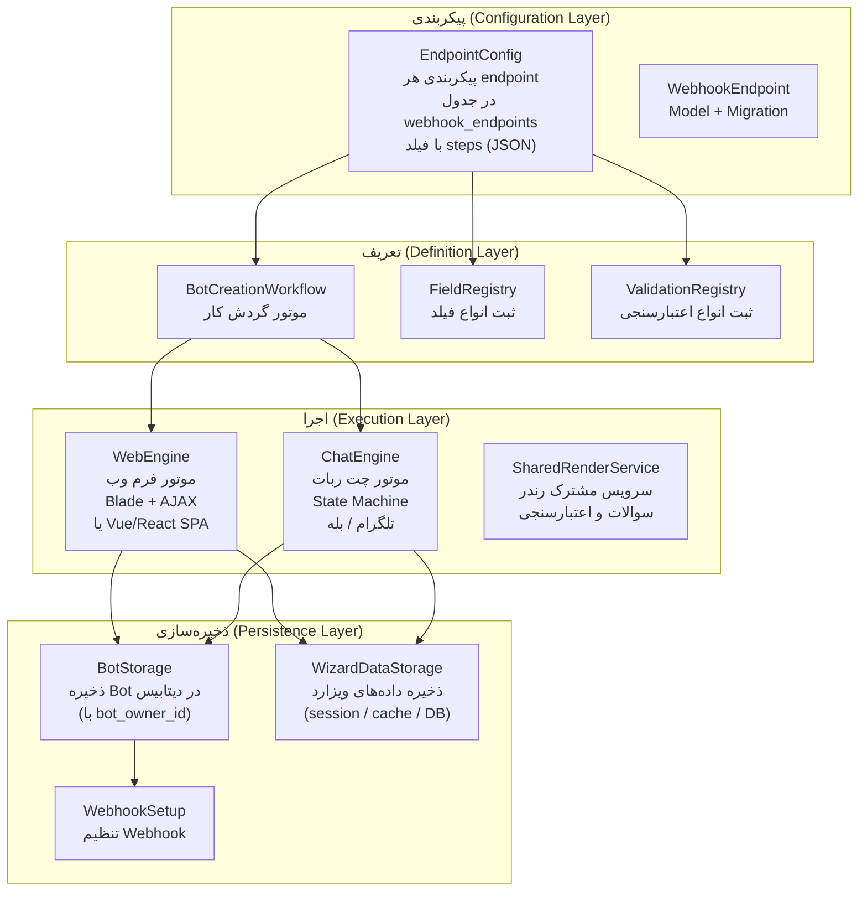
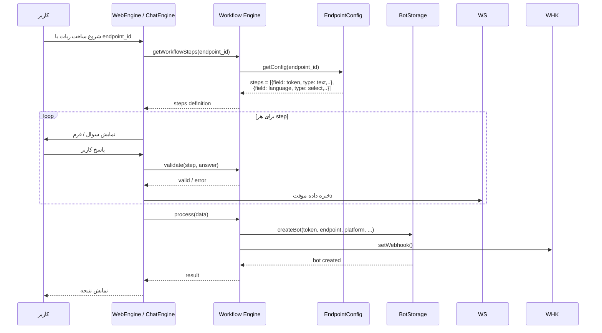
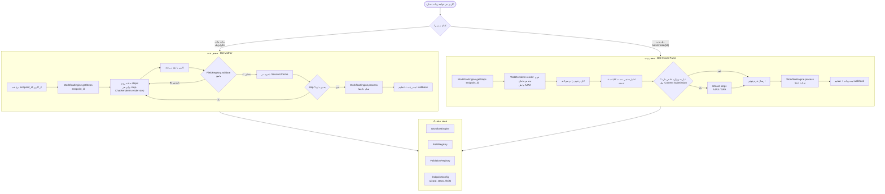

# طرح معماری یکپارچه‌سازی فرآیند ساخت ربات
## Unified Bot Creation Workflow Architecture

---

## 1. 🎯 مسئله (Problem Statement)

در معماری فعلی، دو مسیر مجزا برای ساخت ربات وجود دارد که **سوالات و ویزاردهای متفاوتی** می‌پرسند:

| مرحله | Bot Mother (مسیر ادمین) | Bot Owner Web Panel (مسیر کاربر) |
|-------|------------------------|----------------------------------|
| انتخاب endpoint | ✅ دارد | ✅ دارد (از قبل انتخاب شده) |
| انتخاب platform | ✅ دارد | ✅ دارد (dropdown ساده) |
| انتخاب زبان | ✅ دارد (ویزارد) | ✅ دارد (dropdown ساده) |
| دریافت توکن | ✅ دارد | ✅ دارد |
| Presenter Content | ✅ ویزارد ۳ مرحله‌ای | ❌ ندارد |
| Rating Content | ✅ ویزارد ۳ مرحله‌ای | ❌ ندارد |
| Psychology Questions | ✅ ویزارد پیچیده | ❌ ندارد |
| Content Submission | ✅ ویزارد ۵ مرحله‌ای | ❌ ندارد |
| Book Library Reader | ✅ ویزارد ۲ مرحله‌ای | ❌ ندارد |
| Admin Daily Channel | ✅ ویزارد ۶ مرحله‌ای | ❌ ندارد |
| Media Queue | ✅ ویزارد ۵ مرحله‌ای | ❌ ندارد |

این ناهماهنگی باعث می‌شود:
- کاربرانی که از پنل وب ربات می‌سازند، امکانات کمتری داشته باشند
- کد دوباره‌نویسی شود (duplication در BotMotherController و BotRegistrationService)
- افزودن endpoint جدید نیازمند تغییر در دو مکان مجزا باشد

---

## 2. 🏛️ معماری پیشنهادی (Proposed Architecture)

### هسته معماری: **BotCreationWorkflow Engine**



### جریان اجرا:



---

## 3. 📋 طراحی Data Model

### 3.1. جدول `webhook_endpoints` - اضافه کردن فیلد `wizard_steps`

```sql
ALTER TABLE webhook_endpoints
ADD COLUMN wizard_steps JSON NULL COMMENT 'مراحل ویزارد ساخت ربات' 
AFTER supports_multiple_languages;
```

مقدار `wizard_steps` یک JSON حاوی آرایه‌ای از مراحل است:

```json
[
  {
    "id": "platform",
    "type": "select",
    "label_fa": "نوع پیام‌رسان",
    "label_en": "Platform",
    "options": [
      {"value": "telegram", "label_fa": "تلگرام", "label_en": "Telegram"},
      {"value": "bale", "label_fa": "بله", "label_en": "Bale"}
    ],
    "required": true,
    "validation": "in:telegram,bale",
    "order": 1
  },
  {
    "id": "language",
    "type": "select",
    "label_fa": "زبان",
    "label_en": "Language",
    "options_provider": "language_list",
    "required": true,
    "validation": "string|max:10",
    "order": 2,
    "condition": {
      "field": "platform",
      "operator": "in",
      "value": ["telegram", "bale"]
    }
  },
  {
    "id": "token",
    "type": "text",
    "label_fa": "توکن ربات",
    "label_en": "Bot Token",
    "placeholder_fa": "توکن را از BotFather دریافت کنید",
    "placeholder_en": "Get token from BotFather",
    "required": true,
    "validation": "token",
    "order": 3,
    "help_fa": "توکن ربات خود را از BotFather در تلگرام یا ربات پدر در بله دریافت کنید",
    "help_en": "Get your bot token from BotFather on Telegram or GodFather on Bale",
    "async_validate": true,
    "on_validate": "validate_token"
  },
  {
    "id": "presenter_content",
    "type": "multi_line_text",
    "label_fa": "محتوای ربات",
    "label_en": "Bot Content",
    "required": false,
    "validation": "array",
    "order": 4,
    "condition": {
      "field": "endpoint_id",
      "operator": "=",
      "value": "presenter-bot"
    },
    "wizard_type": "multi_step",
    "wizard": {
      "steps": [
        {
          "id": "add_items",
          "type": "collection",
          "label_fa": "آیتم‌های محتوا را اضافه کنید",
          "label_en": "Add content items",
          "accepts": ["text", "photo", "video", "voice", "audio", "document"]
        },
        {
          "id": "finish",
          "type": "confirmation",
          "label_fa": "پایان و ثبت",
          "label_en": "Finish and save"
        }
      ]
    }
  },
  {
    "id": "psychology_questions",
    "type": "complex_wizard",
    "label_fa": "سوالات تست روانشناسی",
    "label_en": "Psychology Test Questions",
    "required": false,
    "condition": {
      "field": "endpoint_id",
      "operator": "=",
      "value": "psychology-test"
    },
    "wizard_type": "multi_step",
    "wizard": {
      "steps": [
        {
          "id": "questions",
          "type": "bulk_text",
          "label_fa": "سوالات را با فرمت وارد کنید",
          "label_en": "Enter questions with format",
          "format_hint_fa": "سوال [دسته, وزن, جهت]",
          "format_hint_en": "Question [Category, Weight, Direction]"
        },
        {
          "id": "category_descriptions",
          "type": "repeated_text",
          "label_fa": "توضیحات دسته‌ها",
          "label_en": "Category descriptions"
        }
      ]
    }
  },
  {
    "id": "content_submission_channel",
    "type": "forward_wizard",
    "label_fa": "تنظیم کانال انتشار",
    "label_en": "Channel Setup",
    "required": false,
    "condition": {
      "field": "endpoint_id",
      "operator": "=",
      "value": "content-submission"
    },
    "wizard_type": "multi_step",
    "wizard": {
      "steps": [
        {"id": "channel_confirm", "type": "confirm", "label_fa": "تأیید عضویت در کانال", "label_en": "Confirm channel membership"},
        {"id": "channel_forward", "type": "forward", "label_fa": "فوروارد از کانال", "label_en": "Forward from channel"},
        {"id": "need_approval", "type": "yes_no", "label_fa": "نیاز به تایید گروه", "label_en": "Need approval group"},
        {"id": "group_forward", "type": "forward", "label_fa": "فوروارد از گروه", "label_en": "Forward from group", "optional": true},
        {"id": "required_approvals", "type": "number", "label_fa": "تعداد تاییدکنندگان", "label_en": "Required approvals", "optional": true}
      ]
    }
  }
]
```

### 3.2. کلاس‌های جدید

```
app/
├── Modules/
│   └── BotCreation/
│       ├── Contracts/
│       │   ├── BotCreationWorkflowInterface.php
│       │   ├── FieldTypeInterface.php
│       │   └── WizardRendererInterface.php
│       ├── Models/
│       │   └── BotCreationSession.php           # ذخیره state ویزارد در دیتابیس
│       ├── Services/
│       │   ├── BotCreationWorkflowService.php    # موتور اصلی
│       │   ├── FieldRegistry.php                 # ثبت انواع فیلد
│       │   └── ValidationRegistry.php            # ثبت انواع اعتبارسنجی
│       ├── Fields/
│       │   ├── TextField.php
│       │   ├── SelectField.php
│       │   ├── MultiLineTextField.php
│       │   ├── CollectionField.php
│       │   ├── ConfirmField.php
│       │   ├── ForwardField.php
│       │   ├── YesNoField.php
│       │   ├── NumberField.php
│       │   └── BulkTextField.php
│       ├── Renderers/
│       │   ├── ChatRenderer.php                  # رندر برای ربات (تلگرام/بله)
│       │   └── WebRenderer.php                   # رندر برای پنل وب
│       ├── Http/
│       │   ├── Controllers/
│       │   │   └── WizardApiController.php       # API برای پنل وب (AJAX)
│       │   └── Requests/
│       │       └── WizardStepRequest.php
│       ├── Migrations/
│       │   └── 2026_07_03_create_bot_creation_sessions_table.php
│       └── Providers/
│           └── BotCreationServiceProvider.php
```

---

## 4. 🔄 دیاگرام جریان کامل یکپارچه



---

## 5. 📝 توضیح دقیق کامپوننت‌ها

### 5.1. `BotCreationWorkflowService.php` - موتور اصلی

```php
class BotCreationWorkflowService
{
    /**
     * دریافت مراحل ویزارد برای یک endpoint
     * @return array<FieldDefinition>
     */
    public function getSteps(string $endpointId, ?array $contextData = []): array;

    /**
     * اعتبارسنجی یک step
     * @return array{valid: bool, message: ?string}
     */
    public function validateStep(FieldDefinition $step, mixed $value): array;

    /**
     * پردازش نهایی تمام داده‌ها و ثبت ربات
     * @return array{success: bool, message: string, bot?: Bot}
     */
    public function process(array $collectedData, string $endpointId, ?int $botOwnerId = null): array;

    /**
     * اعتبارسنجی آسنکرون (برای توکن - getMe)
     * @return array{valid: bool, message: ?string, botInfo?: array}
     */
    public function asyncValidate(string $fieldId, mixed $value): array;
}
```

### 5.2. `FieldRegistry.php` - ثبت و مدیریت انواع فیلد

```php
class FieldRegistry
{
    /**
     * ثبت یک نوع فیلد جدید
     */
    public function register(string $type, FieldTypeInterface $handler): void;

    /**
     * دریافت handler برای یک نوع فیلد
     */
    public function get(string $type): FieldTypeInterface;

    /**
     * رندر یک فیلد (delegate به renderer)
     */
    public function render(FieldDefinition $field, string $rendererType): mixed;
}
```

### 5.3. `FieldTypeInterface.php`

```php
interface FieldTypeInterface
{
    /**
     * اعتبارسنجی مقدار فیلد
     */
    public function validate(mixed $value, FieldDefinition $definition): array;

    /**
     * رندر فیلد در چت
     */
    public function renderChat(FieldDefinition $field, array $context): string;

    /**
     * رندر فیلد در وب (Blade component)
     */
    public function renderWeb(FieldDefinition $field, array $context): string;

    /**
     * پردازش مقدار دریافتی قبل از ذخیره
     */
    public function processValue(mixed $value, FieldDefinition $definition): mixed;
}
```

### 5.4. `ChatRenderer.php` - رندر برای ربات

این کلاس مراحل ویزارد را به پیام‌های تعاملی ربات تبدیل می‌کند:

- **text**: پیام ساده + منتظر متن
- **select**: پیام + دکمه‌های شیشه‌ای (inline keyboard)
- **multi_line_text**: راهنما + منتظر چند خط متن + کلمه پایان
- **collection**: راهنما + منتظر آیتم‌ها (متن/عکس/فیلم) + /done
- **confirm**: پیام تأیید + دکمه بله/خیر
- **forward**: راهنما + منتظر فوروارد پیام
- **yes_no**: سوال + دکمه بله/خیر
- **bulk_text**: راهنما با فرمت + منتظر bulk متن
- **repeated_text**: برای هر آیتم، یک سوال بپرس
- **number**: منتظر عدد

### 5.5. `WebRenderer.php` - رندر برای پنل وب

این کلاس مراحل را به فرم وب تبدیل می‌کند:

- حالت **ساده**: همه فیلدها در یک فرم (برای endpoint های ساده)
- حالت **چندمرحله‌ای**: ویزارد with steps (برای endpoint های پیچیده) - می‌تواند با AJAX یا Vue/React پیاده شود
- حالت **هیبرید**: فیلدهای ساده در فرم اصلی + ویزاردهای خاص در modal/page جدا

---

## 6. 📋 پیکربندی پیش‌فرض برای هر endpoint

در این معماری، هر endpoint یک `wizard_steps` پیش‌فرض دارد. اگر endpointای `wizard_steps` تعریف نکرده باشد، از مقدار پیش‌فرض استفاده می‌کند:

### مقدار پیش‌فرض (برای همه endpointها):

```json
[
  {"id": "platform", "type": "select", "label_fa": "نوع پیام‌رسان", "label_en": "Platform", ...},
  {"id": "language", "type": "select", "label_fa": "زبان", "label_en": "Language", ...},
  {"id": "token", "type": "text", "label_fa": "توکن ربات", "label_en": "Bot Token", ...}
]
```

Endpointهای خاص می‌توانند steps اضافی داشته باشند:
- **presenter-bot**: steps اضافی برای دریافت محتوا
- **psychology-test**: steps اضافی برای سوالات و دسته‌بندی
- **content-submission**: steps اضافی برای تنظیم کانال/گروه
- **book-library**: steps اضافی برای reader token
- **admin-daily-channel**: steps اضافی برای تنظیم کانال
- **admin-channel-media-queue**: steps اضافی برای صف رسانه

---

## 7. 🧩 تغییرات مورد نیاز در کد فعلی

### 7.1. تغییرات در `BotMotherController.php`

- **جایگزینی state machine سخت کد شده** با استفاده از `BotCreationWorkflowService`
- به جای ۲۰+ متد مجزا (`handlePresenterContentInput`, `handlePsychologyQuestionsInput`, `handleContentBotWizard`, ...) یک متد عمومی:
  ```php
  private function handleWizardStep(Telegram $bot, string $text, array $stateData, string $type, int $botMotherId): void
  {
      $currentStep = $stateData['current_step'] ?? null;
      $workflow = app(BotCreationWorkflowService::class);
      $result = $workflow->processStep($stateData['endpoint_id'], $currentStep, $text, $stateData['collected_data'] ?? []);
      // ...
  }
  ```

### 7.2. تغییرات در `CreateBotController.php` (پنل وب)

- **جایگزینی فرم ساده** با رندر داینامیک بر اساس `wizard_steps`
- استفاده از `WebRenderer` برای رندر فرم
- متد `store` باید از `WorkflowService.process()` استفاده کند

### 7.3. تغییرات در `BotRegistrationService.php`

- این سرویس باید بخشی از `WorkflowService.process()` شود
- منطق ثبت ربات (getMe, save, setWebhook) در این سرویس باقی می‌ماند

### 7.4. تغییرات در view `create.blade.php`

- جایگزینی فرم ایستا با رندر داینامیک
- استفاده از کامپوننت‌های Blade و JavaScript برای ویزاردهای چندمرحله‌ای

---

## 8. ✅ مزایای این معماری

1. **Single Source of Truth**: تعریف مراحل ساخت هر ربات فقط در یک جا (`wizard_steps` در جدول `webhook_endpoints`)
2. **ثبات تجربه کاربری**: کاربر در هر دو مسیر سوالات یکسانی می‌بیند
3. **قابلیت توسعه**: افزودن endpoint جدید = فقط تعریف `wizard_steps` و Field handler
4. **کاهش کد تکراری**: حذف ده‌ها متد تکراری از BotMotherController
5. **تست‌پذیری**: WorkflowService قابل تست بدون نیاز به ربات یا وب
6. **انعطاف‌پذیری**: امکان تعریف انواع فیلد جدید بدون تغییر در هسته

---

## 9. 📅 مراحل پیاده‌سازی (Implementation Phases)

### فاز 1: هسته (Core)
1. ایجاد مایگریشن `wizard_steps` به `webhook_endpoints`
2. ایجاد مایگریشن `bot_creation_sessions`
3. پیاده‌سازی `FieldRegistry` و `ValidationRegistry`
4. پیاده‌سازی `BotCreationWorkflowService`

### فاز 2: فیلدهای پایه
5. پیاده‌سازی `TextField`, `SelectField`
6. پیاده‌سازی فیلدهای ویزاردی: `MultiLineTextField`, `CollectionField`, `ConfirmField`, `ForwardField`, `YesNoField`, `NumberField`, `BulkTextField`

### فاز 3: رندررها
7. پیاده‌سازی `ChatRenderer`
8. پیاده‌سازی `WebRenderer` به همراه کامپوننت‌های Blade

### فاز 4: یکپارچه‌سازی
9. بازنویسی `BotMotherController` برای استفاده از WorkflowService
10. بازنویسی `CreateBotController` و `create.blade.php`
11. بروزرسانی `BotRegistrationService`
12. تعریف `wizard_steps` برای تمام endpointهای موجود

### فاز 5: تست و تکمیل
13. تست یکپارچگی برای هر دو مسیر
14. حذف کدهای قدیمی
15. مستندسازی
