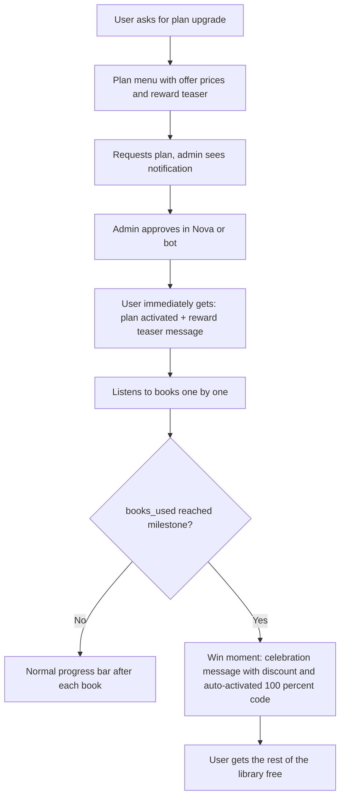
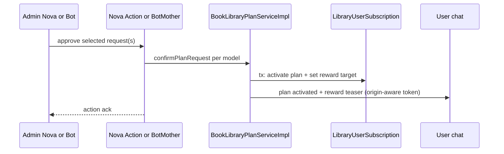
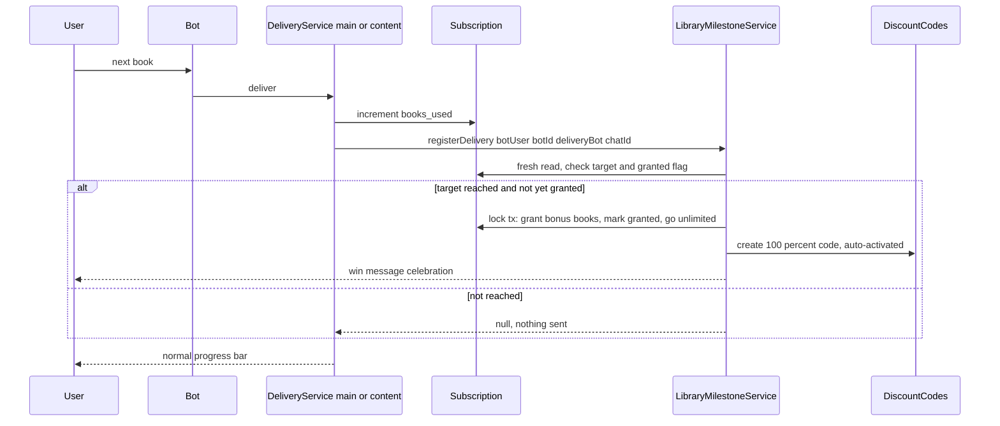

# Book Library — Plan Notification Fix, Demo Pricing & Listening-Milestone Rewards

> Status: APPROVED — all assumptions in Section 7 confirmed by owner on 2026-09-10
> Scope: Rبات کتابخانه صوتی (audio book library bot) — plan approval UX + engagement reward engine

---

## 1. Context & Current State

### 1.1 Current flow (as built)

| Piece | File | Behavior today |
|---|---|---|
| Plan config | [`config/book_library.php`](config/book_library.php) | `free(3)`, `plan_100` 990,000 T, `plan_300` 2,490,000 T, `plan_1000` 6,990,000 T, `unlimited` **0 T** |
| User requests plan | [`BookLibraryPlanServiceImpl::requestPlanUpgrade()`](app/Services/BookLibraryPlanServiceImpl.php) | Creates pending `LibraryPlanRequest`, emails admins |
| Admin approves in Nova | [`ApproveLibraryPlanRequest`](app/Nova/Actions/ApproveLibraryPlanRequest.php) | Iterates selected models → `confirmPlanRequest()`. **No user notification** ❌ (single three-dot and bulk both affected) |
| Admin approves in bot | [`BotMotherController::handleLibraryPlanConfirm()`](app/Http/Controllers/BotMotherController.php) | `confirmPlanRequest()` **then** notifies the user separately |
| `confirmPlanRequest()` | [`BookLibraryPlanServiceImpl`](app/Services/BookLibraryPlanServiceImpl.php) | Transaction: mark request `confirmed` + `updateOrCreate` subscription (plan, `books_limit`, active) |
| Delivery path 1 | [`BookLibraryDeliveryServiceImpl::deliverBook()`](app/Services/BookLibraryDeliveryServiceImpl.php) | Sends audio, then `increment('books_used')`, progress bar, quick actions |
| Delivery path 2 | [`ContentDeliveryServiceImpl::deliverNextInCategory()`](app/Services/ContentDeliveryServiceImpl.php) | Same pattern: `increment('books_used')`, progress bar |
| Plan menu | [`BookLibraryController::showPlanMenu()`](app/Http/Controllers/BookLibraryController.php) + [`BookLibraryReaderController::showPlanMenu()`](app/Http/Controllers/BookLibraryReaderController.php) | Button label: `label - price تومان` (plain text, no offer styling) |
| Subscription | [`LibraryUserSubscription`](app/Models/LibraryUserSubscription.php) | `plan`, `books_used`, `books_limit`, `status`, `expires_at` — unique `(bot_user_id, bot_id)` |
| Messages | [`BotHelper`](app/Helpers/BotHelper.php) | All sends use `parse_mode: html` → `<s>` strikethrough works in message **body** (not in inline-button labels) |

### 1.2 The three work items

- **A. Bug fix** — After approving a plan in Nova (bulk multi-select action **or** single-item three-dot action), the user receives **no message**. Fix so the user is always notified, from any approval channel (Nova bulk, Nova single, bot command).
- **B. Demo pricing** — Everything is a visual demo; no real money changes hands. Redesign price display: show a struck-through "list price" and a lower "offer price". Unlimited plan: `~~20,000,000~~ → 10,000,000` Toman (today it shows 0).
- **C. Milestone reward engine** — Engagement-based reward (the core product goal: make people listen to the podcast):
  1. On plan confirmation, set a **milestone** = the plan's book count N (e.g. 100).
  2. Bot tells the user the teaser: *"listen through N books → get 2N books free + a 5,000,000 Toman discount"*.
  3. "Listening" is **not verified**: when the user receives the Nth audio file (`books_used` reaches N), we assume they listened.
  4. On reaching the milestone: grant **2N free books**, show a **5,000,000 Toman discount applied**, and issue a **100% discount code that auto-activates** → the user gets the bot **free to the end** (effectively unlimited).

### 1.3 Non-goals

- No real payment / payment gateway integration.
- No actual listening verification (no playback telemetry).
- No changes to rejection flow, broadcast flow, or reader-bot linking.

---

## 2. Product & CX Design

### 2.1 User journey



### 2.2 CX principles applied

1. **Zero friction on approval** — the user must never wonder "did my approval go through". Notification is sent from the single `confirmPlanRequest()` core, so *every* approval channel (Nova bulk, Nova single, bot) notifies identically.
2. **The win moment must feel big** — one celebratory message right after the Nth book, before the routine progress bar: congratulations + concrete value (books added, 5,000,000 T discount, the code, "everything is now free").
3. **Honest demo framing** — copy never claims we verify listening. "با دریافت N کتاب" (upon receiving N books) is the neutral trigger wording.
4. **Visible value everywhere** — plan menu shows struck-through list price → offer price, and the reward teaser line under the plan list.
5. **Idempotency = trust** — the reward can fire exactly once; a double-grant would destroy the "premium" feel.

### 2.3 Message copy (Persian, final strings go to `lang`)

**Plan-activated + teaser** (sent on every approval):
```
✅ پلن شما فعال شد! اکنون می‌توانید کتاب‌های بیشتری دریافت کنید.

🎁 هدیه ویژه: با دریافت :target کتاب، :bonus کتاب رایگان + تخفیف ۵٬۰۰۰٬۰۰۰ تومانی می‌شود سهم شما و کد تخفیف ۱۰۰٪ به صورت خودکار فعال خواهد شد!
```

**Milestone win** (sent right after the Nth audio is delivered):
```
🎉 آفرین! به هدیه ویژه رسیدید!

✅ :target کتاب دریافت شد
📚 :bonus کتاب رایگان به پلن شما اضافه شد
💰 تخفیف ۵٬۰۰۰٬۰۰۰ تومانی شامل شما شد
🎫 کد تخفیف ۱۰۰٪: :code

کد به صورت خودکار فعال شد — از این لحظه همه کتاب‌ها برای شما رایگان است! 🚀
```

**Plan menu** (price block per plan that has a list price):
```
💎 پلن‌های قابل ارتقا:
🥇 نامحدود
🏷 20,000,000 تومان  →  10,000,000 تومان

🎁 هدیه هر پلن: با اتمام کتاب‌های پلن، ۲ برابر آن رایگان + کد تخفیف ۱۰۰٪ خودکار
```
HTML in message body: `<s>20,000,000 تومان</s> → 10,000,000 تومان`. Inline button labels stay plain: `🥇 Unlimited - 10,000,000 Toman` (Telegram/Bale button text cannot carry HTML).

---

## 3. Architecture Design

### 3.1 Approval → user notification (Work item A)

Key decision: **move the user notification into `confirmPlanRequest()`** so all channels share one code path. `BotMotherController::handleLibraryPlanConfirm()` currently duplicates the user-notification block — remove it there (keep only the admin-facing ack), otherwise bot-channel approvals would double-send.



Origin-aware send: `BotUsers.origin` (`bale` | `telegram`) selects `bot->bale_bot_token` or `bot->telegram_bot_token` (same pattern already used in [`BookLibraryDeliveryServiceImpl::createReaderBot()`](app/Services/BookLibraryDeliveryServiceImpl.php)). Notification failures are logged and never roll back the approval.

### 3.2 Milestone reward engine (Work item C)

Key decision: **one shared service** invoked by **both** delivery paths right after `increment('books_used')`. No model events (the model layer has no Telegram/Bot context), no per-path duplication.



### 3.3 Data model changes

New migration `2026_09_10_000001_add_milestone_rewards_to_library_tables.php`:

**`library_user_subscriptions`** — add:
- `reward_target` `unsignedInteger` nullable — the N to listen/receive (set at plan confirmation = `planConfig['limit']`)
- `reward_granted_at` `timestamp` nullable — idempotency flag
- `reward_bonus` `unsignedInteger` nullable — books granted at win (audit)

**New table `library_discount_codes`** (symbolic, demo):
- `id`, `bot_user_id`, `bot_id`, `code` (unique, e.g. `LIB100-12345`), `percent` int default 100, `display_amount` bigint (5,000,000 for messaging), `source` string (`milestone`), `auto_activated` bool default true, `activated_at` timestamp, `status` string default `active`, timestamps, index `(bot_user_id, bot_id)`

### 3.4 Idempotency & concurrency

- Unique "at most one milestone reward per subscription" enforced by `reward_granted_at IS NULL` check **inside** `DB::transaction` with `lockForUpdate()` on the subscription row.
- The `LibraryUserBook`/increment paths are already separate writes; the milestone check uses the **fresh** subscription after increment.
- If the delivery double-fires (user double-tap), the second `registerDelivery` sees `reward_granted_at` set → no-op.

### 3.5 Plan confirmation sets the milestone

In `confirmPlanRequest()`, inside the same transaction:
- `reward_target = (int) $planConfig['limit']` for paid plans;
- `reward_target = null` for `free` and for `unlimited` (already fully open — no point in a milestone);
- `reward_granted_at = null` (a freshly purchased plan re-arms the reward).

### 3.6 Pricing display (Work item B)

Config shape (backward compatible — `list_price` optional):

```php
'plans' => [
    'free'      => ['limit' => 3,      'price' => 0,          'label_key' => '...'],
    'plan_100'  => ['limit' => 100,    'price' => 990000,     'label_key' => '...'],
    'plan_300'  => ['limit' => 300,    'price' => 2490000,    'label_key' => '...'],
    'plan_1000' => ['limit' => 1000,   'price' => 6990000,    'label_key' => '...'],
    'unlimited' => ['limit' => 999999, 'price' => 10000000,   'list_price' => 20000000, 'label_key' => '...'],
],

'rewards' => [
    'enabled' => true,
    'plans' => ['plan_100', 'plan_300', 'plan_1000'],   // plans that arm a milestone
    'bonus_multiplier' => 2,          // listen N -> get 2N free
    'win_effect' => 'unlimited',      // 100 percent code effect: grant remaining library free
    'discount' => [
        'display_amount' => 5000000,  // shown in copy, purely symbolic (demo)
        'code_prefix' => 'LIB100',
    ],
],
```

Both `showPlanMenu()` implementations render, per paid plan: label; if `list_price` set → `<s>list</s> → offer`; append the reward-teaser line (from `lang`). Button labels use the offer `price` only.

### 3.7 Component/file map

| Action | File |
|---|---|
| Modify | [`config/book_library.php`](config/book_library.php) — `list_price`, `rewards` block |
| New migration | `database/migrations/2026_09_10_000001_add_milestone_rewards_to_library_tables.php` |
| Modify | [`app/Models/LibraryUserSubscription.php`](app/Models/LibraryUserSubscription.php) — fillable/casts + helpers `hasRewardTarget()`, `rewardDue()` |
| New | `app/Models/LibraryDiscountCode.php` |
| New | `app/Interfaces/Services/LibraryMilestoneService.php` + `app/Services/LibraryMilestoneServiceImpl.php` |
| Modify | [`app/Services/BookLibraryPlanServiceImpl.php`](app/Services/BookLibraryPlanServiceImpl.php) — set `reward_target` in confirm tx + notify user (teaser) |
| Modify | [`app/Http/Controllers/BotMotherController.php`](app/Http/Controllers/BotMotherController.php) — remove duplicate user notification |
| Modify | [`app/Services/BookLibraryDeliveryServiceImpl.php`](app/Services/BookLibraryDeliveryServiceImpl.php) — call `registerDelivery()` after increment |
| Modify | [`app/Services/ContentDeliveryServiceImpl.php`](app/Services/ContentDeliveryServiceImpl.php) — call `registerDelivery()` after increment |
| Modify | [`app/Http/Controllers/BookLibraryController.php`](app/Http/Controllers/BookLibraryController.php) — plan menu offer prices + teaser |
| Modify | [`app/Http/Controllers/BookLibraryReaderController.php`](app/Http/Controllers/BookLibraryReaderController.php) — plan menu offer prices + teaser |
| Modify | [`app/Nova/LibraryPlanRequest.php`](app/Nova/LibraryPlanRequest.php) — read-only `reward_granted_at` / code visibility (nice-to-have) |
| Modify | `lang/fa/book_library.php`, `lang/en/book_library.php` — new strings |

---

## 4. Testing Strategy

1. **Unit — milestone service**: target reached → grant + code + unlimited; below target → no-op; already granted → idempotent; `free`/`unlimited` → no arming; multiplier honored.
2. **Feature — approval channels**: Nova bulk action on N pending requests → N user notifications (Telegram/Bot faked); single action → 1 notification; BotMother command → exactly 1 user notification (no duplicate).
3. **Feature — delivery paths**: simulate `deliverNextInCategory` until milestone → win message sent once; second delivery after win → no second message.
4. **Unit — plan menu rendering**: unlimited shows `<s>20,000,000</s> → 10,000,000`; plans without `list_price` render unchanged; teaser line present.
5. **Manual QA checklist**: approve in Nova (bulk + three-dot) on a real staging bot; verify message arrives on both Bale and Telegram user origins; run through a 100-book plan milestone in a low-limit test config (set `limit: 2` in a test-only env).

---

## 5. Risks & Mitigations

| Risk | Mitigation |
|---|---|
| Double grant on concurrent deliveries | `lockForUpdate` + `reward_granted_at` flag in one transaction |
| Notification failure breaks approval | try/catch around sends; log only; approval tx already committed |
| Bot token missing for user's origin | Guard: skip send + `Log::warning`; user still gets plan active on next interaction (existing auto-sync in `getOrCreateSubscription`) |
| Double message after bot-channel approval | Remove duplicated block from `BotMotherController` (single source of truth) |
| Strikethrough not rendering | `BotHelper` already sends `parse_mode: html`; keep `<s>` only in message body, never in button labels |
| Plan upgrade mid-milestone (100 → 300) | Re-arm: new `reward_target` = new plan limit, reset granted flag — generous but simple and predictable |
| Copy claims false verification | Wording uses "دریافت" (receiving), not "گوش دادن کامل" |

---

## 6. Out-of-scope / future ideas (parking lot)

- Progress nudge at 90% of milestone ("فقط ۱۰ کتاب تا هدیه!").
- Stacked milestones for 300/1000 plans (e.g. half-way bonus).
- Referral-style share prompt after the win moment.
- Admin command to grant the milestone manually for support cases.

---

## 7. Assumptions to confirm

1. **Reward formula**: buy/listen N → reach the Nth file → **+2N books** (e.g. 10→20, 100→200), then the **100% code auto-activates → library free to the end** (subscription becomes unlimited). ✔ matches your 10→20, 20→40 example.
2. **Unlimited pricing**: offer `10,000,000` T, struck-through list `20,000,000` T; other plans keep current prices with **no** strikethrough (add `list_price` to them later if wanted).
3. **Discount display amount**: fixed `5,000,000` T in the win copy for all plans (configurable in one place).
4. **Milestone N** equals the plan's book count (100 / 300 / 1000); `unlimited` purchases get no milestone.
5. Note: `plan_1000` price in config is `6,990,000` T — plan keeps config values as the source of truth.
