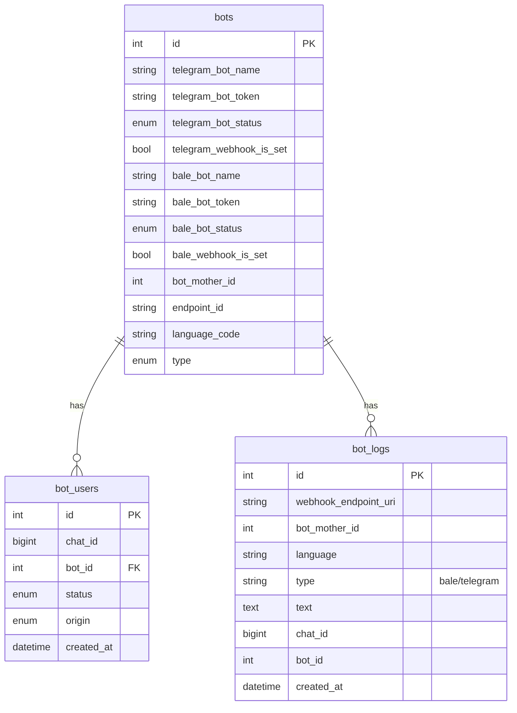
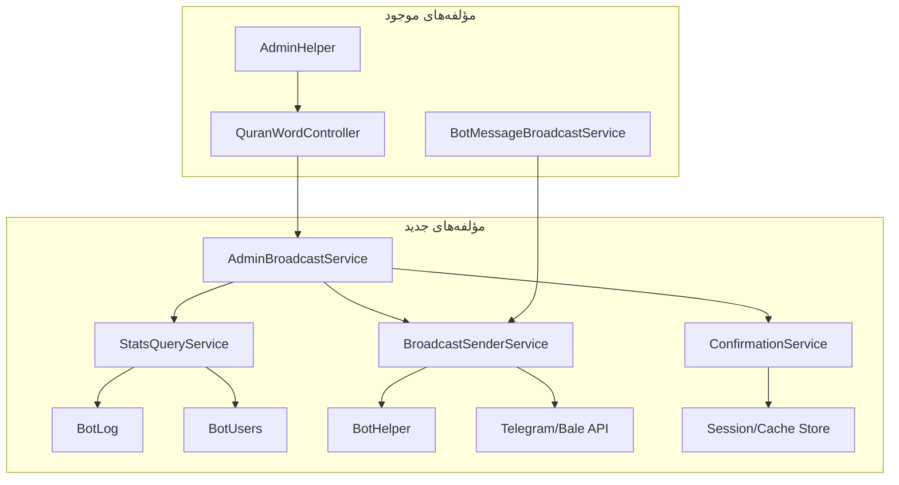
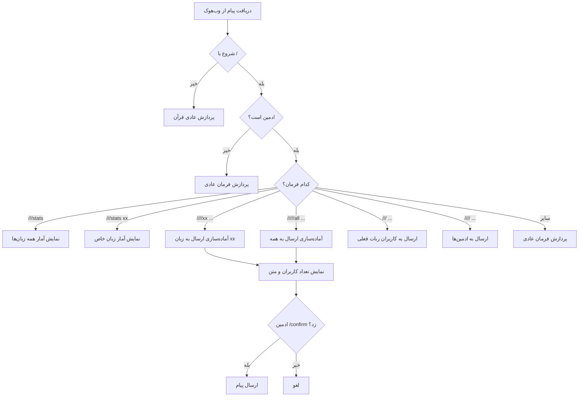
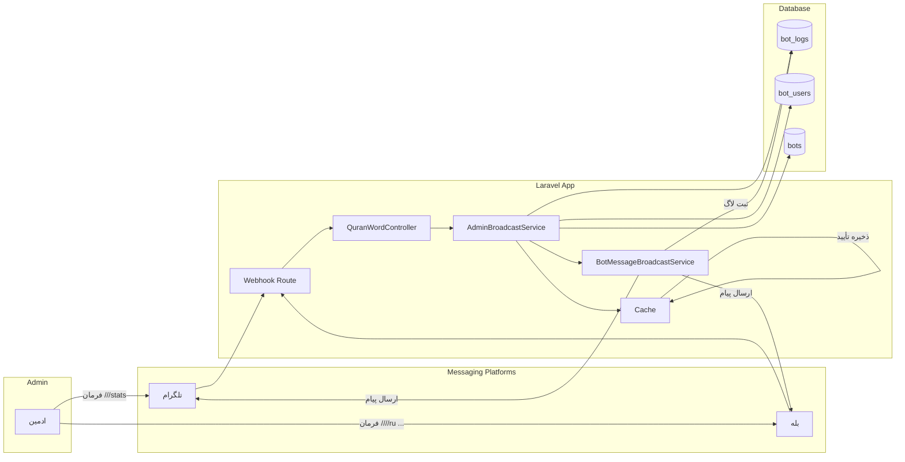

# 🏗️ معماری سیستم پیام‌رسانی ادمین برای ربات‌های قرآنی

> تاریخ: 2026-07-12  
> وضعیت: پیشنهاد معماری

---

## 1. بررسی وضعیت موجود (As-Is)

### 1.1. جریان فعلی پردازش فرمان‌ها

هر ربات قرآنی از طریق وب‌هوک به endpoint [`/api/webhook-quran-word`](routes/api.php:61) متصل است و کنترولر [`QuranWordController::index()`](app/Http/Controllers/QuranWordController.php:78) همه درخواست‌ها را پردازش می‌کند.

```
کاربر → پلتفرم (تلگرام/بله) → Webhook → QuranWordController::index()
                                          ↓
                                    تشخیص نوع فرمان:
                                    ├── /       → دستورات عادی (start, help, etc.)
                                    ├── //      → جستجو
                                    ├── ///     → ارسال به همه کاربران (فعلاً فقط فارسی)
                                    ├── ////    → ارسال به همه ادمین‌ها (فعلاً فقط فارسی)
                                    └── سایر    → پردازش آیات قرآن
```

### 1.2. مشکلات فعلی

1. **زبان ثابت (hardcoded):** در [`messageToAll()`](app/Http/Controllers/QuranWordController.php:2362-2365) فیلتر `->whereLanguage('fa')`硬 کد شده
2. **عدم تفکیک زبان:** هنگام ارسال پیام، زبان کاربران در نظر گرفته نمی‌شود
3. **بدون آمارگیری:** قبل از ارسال پیام، ادمین نمی‌داند چند کاربر در هر زبان وجود دارد
4. **عدم تأیید:** پیام بدون تأیید ادمین ارسال می‌شود
5. **عدم پشتیبانی چندزبانه:** اگر ادمین از ربات روسی پیام بفرستد، باز هم فقط به کاربران فارسی ارسال می‌کند

### 1.3. ساختار دیتابیس فعلی



---

## 2. معماری پیشنهادی (To-Be)

### 2.1. دستورات جدید

| دستور | کاربرد | مثال |
|-------|--------|------|
| `///stats` | آمار همه زبان‌ها | `///stats` |
| `///stats [lang]` | آمار یک زبان خاص | `///stats ru` |
| `////[lang] [message]` | ارسال پیام به یک زبان خاص | `////ru سلام به کاربران روسی` |
| `/////all [message]` | ارسال به همه زبان‌ها | `/////all اطلاعیه عمومی` |
| `/////confirm` | تأیید ارسال | بعد از نمایش آمار |

### 2.2. مؤلفه‌های جدید



### 2.3. فلو Diagram کامل

```mermaid
sequenceDiagram
    participant Admin as ادمین
    participant Bot as ربات قرآنی
    participant Controller as QuranWordController
    participant Service as AdminBroadcastService
    participant DB as دیتابیس

    Note over Admin,DB: سناریو 1: مشاهده آمار
    
    Admin->>Bot: ارسال ///stats
    Bot->>Controller: Webhook Request
    Controller->>Controller: تشخیص ///stats command
    Controller->>Controller: بررسی isAdmin()
    Controller->>Service: getStatsByPlatform(type)
    Service->>DB: QUERY: SELECT language, type, COUNT DISTINCT chat_id
    DB-->>Service: نتایج آمار
    Service-->>Controller: فرمت شده
    Controller-->>Bot: ارسال پیام آمار
    Bot-->>Admin: 📊 نمایش آمار همه زبان‌ها

    Note over Admin,DB: سناریو 2: مشاهده آمار یک زبان خاص
    
    Admin->>Bot: ارسال ///stats ru
    Bot->>Controller: Webhook Request
    Controller->>Service: getStatsByLanguage('ru', type)
    Service->>DB: QUERY: کاربران منحصر‌بفرد با زبان ru
    DB-->>Service: 45 کاربر
    Service-->>Controller: "🇷🇺 روسی: 45 کاربر"
    Controller-->>Bot: ارسال پاسخ
    Bot-->>Admin: 🇷🇺 روسی: 45 کاربر فعال در 30 روز

    Note over Admin,DB: سناریو 3: ارسال پیام به زبان خاص
    
    Admin->>Bot: ارسال ////ru سلام دوستان
    Bot->>Controller: Webhook Request
    Controller->>Controller: تشخیص //// prefix
    Controller->>Controller: استخراج زبان=ru, متن=سلام دوستان
    Controller->>Service: prepareBroadcast('ru', 'سلام دوستان', type, botMotherId)
    Service->>DB: QUERY: تعداد کاربران ru در bot_logs
    DB-->>Service: 45 کاربر
    Service-->>Controller: {
      language: 'ru',
      user_count: 45,
      message: 'سلام دوستان',
      platform: 'telegram'
    }
    Controller-->>Bot: ارسال پیام تأیید
    Bot-->>Admin: 📊 آمار: 45 کاربر روسی<br>📝 متن: سلام دوستان<br>✅ ارسال شود؟ /confirm را بزنید
    Admin->>Bot: ارسال /confirm
    Bot->>Controller: پردازش تأیید
    Controller->>Service: sendBroadcast('ru', 'سلام دوستان', type)
    Service->>DB: دریافت chat_id های کاربران روسی
    Service->>Service: ارسال پیام به هر کاربر
    Service-->>Controller: نتیجه: 45 موفق
    Controller-->>Bot: گزارش نهایی
    Bot-->>Admin: ✅ پیام به 45 کاربر روسی ارسال شد
```

### 2.4. فلو منطق تشخیص فرمان



---

## 3. طراحی فایل‌ها و کلاس‌ها

### 3.1. `app/Services/AdminBroadcastService.php` - (جدید)

```php
class AdminBroadcastService
{
    /**
     * دریافت آمار کاربران بر اساس زبان و پلتفرم
     */
    public function getStatsByPlatform(string $type, int $botMotherId = 1): array
    
    /**
     * دریافت آمار یک زبان خاص
     */
    public function getStatsByLanguage(string $language, string $type, int $botMotherId = 1): array
    
    /**
     * آماده‌سازی broadcast و ذخیره در cache/session برای تأیید
     */
    public function prepareBroadcast(string $language, string $message, string $type, int $botMotherId, string $adminChatId): array
    
    /**
     * ارسال broadcast پس از تأیید
     */
    public function confirmAndSendBroadcast(string $adminChatId): array
    
    /**
     * ارسال مستقیم broadcast (بدون تأیید)
     */
    public function sendBroadcast(string $language, string $message, string $type, int $botMotherId): array
    
    /**
     * ارسال به همه زبان‌ها
     */
    public function sendBroadcastToAll(string $message, string $type, int $botMotherId): array
}
```

### 3.2. `app/Helpers/AdminHelper.php` - (تغییرات)

```php
class AdminHelper
{
    // متدهای موجود:
    public static function isAdminCommand(mixed $Text): bool        // Starts with ///
    public static function isAdmin(mixed $chatId): bool             // Check .env admins
    public static function getAdmins(): array                       // List of admin chat_ids
    public static function getMessageAdmin(mixed $Text, $start = 3): string
    
    // متدهای جدید:
    public static function isStatsCommand(string $text): bool       // Exactly ///stats
    public static function isStatsLanguageCommand(string $text): bool // ///stats xx
    public static function isBroadcastLanguageCommand(string $text): bool // ////xx ...
    public static function isBroadcastAllCommand(string $text): bool // /////all ...
    public static function isConfirmCommand(string $text): bool    // /confirm
    public static function parseLanguageFromCommand(string $text): ?string
    public static function parseMessageFromBroadcast(string $text): ?string
    public static function getLanguageName(string $code): string   // ru → 🇷🇺 Русский
}
```

### 3.3. `app/Models/BotLog.php` - (متدهای جدید)

```php
class BotLog extends Model
{
    // متدهای جدید:
    public function scopeByWebhookUri($query, string $uri)
    public function scopeByLanguage($query, string $language)
    public function scopeRecent($query, int $days = 30)
    public static function getStatsByLanguage(string $uri, int $botMotherId, string $type, int $days = 30): array
    public static function getUniqueUsersByLanguage(string $uri, string $language, int $botMotherId, int $days = 30): int
}
```

### 3.4. `app/Http/Controllers/QuranWordController.php` - (تغییرات در index)

در بخش `index()`، بعد از تشخیص `///` فعلی، دستورات جدید اضافه می‌شوند:

```php
// دستورات جدید قبل از /// و //// فعلی
} elseif (AdminHelper::isStatsCommand($bot->Text())) {
    // ///stats - نمایش آمار همه زبان‌ها
    $this->handleStatsCommand($request, $bot, $type);
    
} elseif (AdminHelper::isStatsLanguageCommand($bot->Text())) {
    // ///stats ru - نمایش آمار یک زبان خاص
    $this->handleStatsLanguageCommand($request, $bot, $type);
    
} elseif (AdminHelper::isBroadcastLanguageCommand($bot->Text())) {
    // ////ru متن پیام - آماده‌سازی ارسال
    $this->handlePrepareBroadcastCommand($request, $bot, $type);
    
} elseif (AdminHelper::isBroadcastAllCommand($bot->Text())) {
    // /////all متن پیام - آماده‌سازی ارسال به همه
    $this->handlePrepareBroadcastAllCommand($request, $bot, $type);
    
} elseif (AdminHelper::isConfirmCommand($bot->Text())) {
    // /confirm - تأیید ارسال
    $this->handleConfirmBroadcast($request, $bot, $type);
    
}
// دستورات فعلی
elseif ((substr($bot->Text(), 0, 4)) == "////") {
    // ارسال به ادمین‌ها (موجود)
    ...
} elseif ((substr($bot->Text(), 0, 3)) == "///") {
    // ارسال به کاربران ربات فعلی (موجود - نیاز به رفع باگ)
    ...
}
```

---

## 4. فرمت خروجی آمار

### 4.1. خروجی `///stats`

```
📊 آمار کاربران ربات‌های قرآنی (30 روز اخیر)
─────────────────────────────
🇮🇷 فارسی (بله)    : 1,855 کاربر | 23,664 درخواست
🇬🇧 انگلیسی        :   832 کاربر | 18,245 درخواست
🇸🇦 عربی           :   605 کاربر | 15,396 درخواست
🇮🇷 فارسی (تلگرام)  :   247 کاربر |  8,070 درخواست
🇫🇷 فرانسوی        :   179 کاربر |  2,628 درخواست
🇹🇷 ترکی           :   151 کاربر |  2,920 درخواست
🇵🇰 اردو           :   150 کاربر |  3,923 درخواست
🇷🇺 روسی           :    45 کاربر |  1,661 درخواست
🇩🇪 آلمانی         :    30 کاربر |    543 درخواست
🇨🇳 چینی           :    22 کاربر |    703 درخواست
🇪🇸 اسپانیایی      :    19 کاربر |    599 درخواست
🇧🇷 پرتغالی برزیل   :    74 کاربر |  2,606 درخواست
🇮🇱 عبری           :    46 کاربر |    472 درخواست
─────────────────────────────
📌 مجموع کاربران: 3,876 کاربر
🕐 بروزرسانی: 2026-07-12 10:00

💡 برای ارسال پیام: ////[language_code] [messege]
   مثال: ////ru سلام به کاربران روسی
```

### 4.2. خروجی `///stats ru`

```
📊 آمار زبان 🇷🇺 روسی
────────────────
📱 تلگرام: 45 کاربر | 1,661 درخواست
🕐 آخرین فعالیت: 2026-07-12 06:13
📅 اولین فعالیت: 2023-11-02 03:56

💡 برای ارسال پیام:
   ////ru [messege you]
```

### 4.3. خروجی آماده‌سازی `////ru متن پیام`

```
📋 تأیید ارسال پیام همگانی
────────────────────────
🌍 زبان   : 🇷🇺 روسی
👥 تعداد  : 45 کاربر
📱 پلتفرم : تلگرام
📝 متن    : سلام به کاربران روسی

✅ برای تأیید: /confirm
❌ برای لغو : هر دستور دیگری
```

---

## 5. ملاحظات فنی

### 5.1. نرخ محدودیت (Rate Limiting)

- API تلگرام: ~30 پیام در ثانیه
- API بله: ~20 پیام در ثانیه
- در [`BotMessageBroadcastService`](app/Services/BotMessageBroadcastService.php:78) از `usleep(100000)` (100ms) استفاده شده که = 10 پیام/ثانیه

**توصیه:** افزایش به `usleep(50000)` (50ms) = 20 پیام/ثانیه، با قابلیت تنظیم

### 5.2. ذخیره‌سازی جلسه برای تأیید

از `cache()` با driver `file` استفاده شود:

```php
// ذخیره درخواست broadcast برای تأیید
Cache::put("broadcast_pending_{$adminChatId}", [
    'language' => 'ru',
    'message' => '...',
    'type' => 'telegram',
    'user_count' => 45,
    'chat_ids' => [...],  // یا می‌توان بعداً query زد
    'bot_mother_id' => 1,
    'expires_at' => now()->addMinutes(5),
], 300); // 5 دقیقه اعتبار
```

### 5.3. امنیت

1. فقط ادمین‌های تعریف شده در [`.env`](.env.example) می‌توانند از دستورات استفاده کنند
2. تأیید دو مرحله‌ای قبل از ارسال
3. انقضای درخواست پس از 5 دقیقه
4. محدودیت نرخ ارسال (Rate Limiting)

### 5.4. translation/پیام‌های چندزبانه

پیام‌های سیستمی (آمار، راهنما) باید به زبان رباتی که ادمین از آن استفاده می‌کند نمایش داده شود.  
برای این کار از `App::setLocale($lang)` استفاده می‌شود که در ابتدای `index()` تنظیم می‌شود.

---

## 6. مراحل پیاده‌سازی (Implementation Steps)

### گام 1: توسعه `AdminHelper` - متدهای کمکی
- افزودن متدهای تشخیص فرمان: `isStatsCommand()`, `isBroadcastLanguageCommand()`, `isConfirmCommand()`
- افزودن متد تجزیه: `parseLanguageFromCommand()`, `parseMessageFromBroadcast()`
- افزودن `getLanguageName()` برای نام‌های نمایشی زبان‌ها

### گام 2: ایجاد `AdminBroadcastService`
- پیاده‌سازی متد `getStatsByPlatform()`
- پیاده‌سازی متد `getStatsByLanguage()`
- پیاده‌سازی متد `prepareBroadcast()` با ذخیره در cache
- پیاده‌سازی متد `confirmAndSendBroadcast()`
- پیاده‌سازی متد `sendBroadcast()`

### گام 3: اصلاح `QuranWordController::index()`
- افزودن شاخه‌های جدید برای `///stats`, `///stats xx`, `////xx ...`, `/////all ...`
- افزودن هندلر `/confirm`
- فراخوانی `AdminBroadcastService`

### گام 4: اصلاح `QuranWordController::messageToAll()`
- رفع مشکل hardcoded language
- استفاده از زبان داینامیک از request یا bot

### گام 5: تست
- تست دستورات با کاربر ادمین
- تست با کاربر غیرادمین (عدم دسترسی)
- تست ارسال به زبان‌های مختلف
- تست تأیید دو مرحله‌ای

---

## 7. فلو Diagram کامل سیستم جدید



---

## 8. خلاصه تغییرات مورد نیاز

| فایل | وضعیت | توضیحات |
|------|-------|---------|
| `app/Helpers/AdminHelper.php` | ✏️ ویرایش | افزودن متدهای تشخیص فرمان و تجزیه |
| `app/Services/AdminBroadcastService.php` | 🆕 جدید | سرویس اصلی broadcast |
| `app/Http/Controllers/QuranWordController.php` | ✏️ ویرایش | افزودن شاخه‌های فرمان جدید |
| `app/Models/BotLog.php` | ✏️ ویرایش | افزودن scopeهای آماری |
| `app/Providers/AppServiceProvider.php` | ✏️ ویرایش | ثبت سرویس در کانتینر |
| `app/Services/BotMessageBroadcastService.php` | ✏️ ویرایش | بهبود rate limiting |
